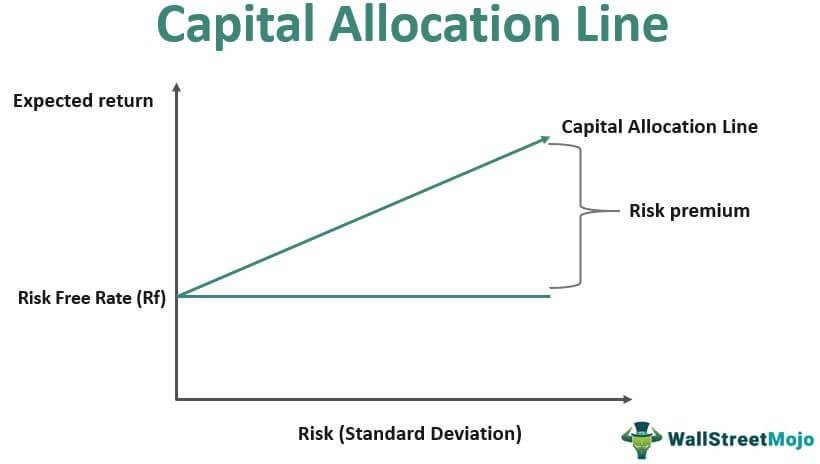

In the fast-paced world of financial services, Squarepoint Capital stands out as a prominent player in algorithmic trading. Established as an independent firm after separating from its original establishment, Squarepoint has carved a niche for itself in leveraging quantitative techniques to drive investment decisions. With its headquarters strategically located in New York City, the firm extends its reach across the globe with additional offices in key financial hubs in Europe and Asia. This global presence enables Squarepoint to tap into diverse markets, diversify risk, and enhance returns for its clients by analyzing large data sets using advanced algorithms.

Squarepoint's strength lies in its ability to utilize quantitative finance—melding complex statistical models with cutting-edge technology—to optimize its trading strategies. This approach allows the firm to respond to market changes swiftly and accurately, identifying inefficiencies that can be exploited for profit.

This article investigates into the history, operations, and broader impact of Squarepoint Capital in algorithmic trading. From its inception to its current operations, we will explore how Squarepoint has become a formidable force, continually adapting to the shifting financial landscape while maintaining a commitment to innovation and precision.

## Table of Contents

## History and Formation

Squarepoint Capital's journey began within the proprietary trading unit nQuant at Lehman Brothers. This unit was known for its strong quantitative strategies and innovative approaches to trading. The pivotal moment in Squarepoint's history came in 2014 when nQuant was spun off from Barclays, a consequence of significant regulatory shifts in the financial industry. This transition led to the birth of Squarepoint Capital and was particularly influenced by the introduction of the Volcker Rule, which imposed restrictions on proprietary trading by banks.

The transformation into Squarepoint Capital was spearheaded by key figures such as Olivier Durantel and Gregoire Schneider. Their leadership was crucial in navigating the complexities of establishing an independent presence in the financial markets. This independence allowed Squarepoint to fully leverage its algorithmic prowess without the constraints that often accompany being part of a larger banking institution. The foundation laid by Durantel and Schneider set Squarepoint on a path to becoming a prominent player in quantitative finance, focused on using data-driven strategies to manage investments globally.

## Algorithmic Trading at Squarepoint Capital

Squarepoint Capital is recognized for its advanced [algorithmic trading](/wiki/algorithmic-trading) strategies that are grounded in quantitative analysis and sophisticated mathematical models. At the core of the firm's trading operations is the application of cutting-edge technology, which allows for the seamless integration of complex algorithms with vast datasets. This approach empowers Squarepoint to execute trades with remarkable precision and swiftness, maximizing opportunities for returns in highly dynamic markets.

The algorithmic strategies employed by Squarepoint Capital are designed to exploit market inefficiencies. By leveraging statistical and [machine learning](/wiki/machine-learning) models, the firm is capable of identifying patterns and trends that may not be apparent to human traders. For instance, algorithms may analyze historical price data, trading [volume](/wiki/volume-trading-strategy)s, and market behavior to predict future movements. This predictive power enables Squarepoint to make informed trading decisions, optimizing its positions in real-time.

Data science is central to Squarepoint's strategy, providing insights through big data analytics. The firm invests in high-performance computing systems to process terabytes of data daily, enabling rapid response to market shifts. This technological infrastructure supports a diverse range of algorithmic strategies, from high-frequency trading to more gradual position adjustments.

Moreover, Squarepoint's focus on risk management is a critical component of its algorithmic trading framework. By incorporating risk metrics into its models, the firm ensures that trades are aligned with predefined risk tolerance levels. This balance between risk and reward is pivotal in maintaining consistent returns, even amid market [volatility](/wiki/volatility-trading-strategies).

Through their continuous innovation and adherence to rigorous quantitative methods, Squarepoint Capital solidifies its position as a leader in algorithmic trading. Its strategic emphasis on technology and data intelligence is key to sustaining a competitive advantage in the fast-evolving financial landscape.

## Global Presence and Operations

Squarepoint Capital marks its presence on the global financial stage with a network of offices that spans several continents, including a major base in New York City and other strategic locations in Europe and Asia. This international setup empowers the firm to engage seamlessly with a diverse array of financial markets, facilitating the execution of trades and investment activities across different time zones and economic environments.

The firm boasts a substantial asset management portfolio, handling approximately $75.7 billion. This scale underscores Squarepoint’s capability to serve a varied and extensive investor base. Notably, 80% of these investors are non-U.S. based, highlighting the firm's appeal and influence beyond American borders. This international client base not only underscores Squarepoint's versatility in catering to a wide range of investor needs but also points to the universal application and attractiveness of its algorithmic trading strategies.

A robust global footprint is critical in ensuring that Squarepoint Capital maintains its competitive edge in the rapidly changing world of financial services. By positioning itself in key financial markets, Squarepoint gains unrivaled access to trading opportunities and valuable market insights. This strategic positioning allows the firm to swiftly capitalize on market shifts and inefficiencies, ensuring consistent returns and propelling its growth on a global scale.

Through its international operations, Squarepoint Capital continues to forge a path of innovation and adaptability, reinforcing its status as a formidable entity in the investment management landscape. By leveraging its widespread presence, the firm not only optimizes its trading capabilities but also enhances its agility and responsiveness to global market dynamics.

## Partnerships and Innovations

In 2021, Squarepoint Capital took a significant stride by forging a strategic partnership with Arini Capital, a well-regarded European [hedge fund](/wiki/hedge-fund-trading-strategies). This collaboration primarily aimed to provide top-tier operational support, enhancing efficiency and optimizing resources within both firms. By pooling their expertise, Squarepoint Capital and Arini Capital have strengthened their capacity to tackle complex financial markets and strategies effectively. 

Furthermore, Squarepoint's venture into trading bitcoin futures on the Chicago Mercantile Exchange marks another noteworthy innovation. This move signifies the firm's proactive approach in diversifying its trading portfolio and tapping into the burgeoning [cryptocurrency](/wiki/cryptocurrency) market. Bitcoin futures are a derivative instrument that provides a way for investors to speculate on the future price of Bitcoin or hedge existing bitcoin exposure. Engaging in this market enables Squarepoint to expand its trading strategies and align with the changing dynamics of global financial markets.

These strategic steps are indicative of Squarepoint Capital's commitment to embracing new opportunities and staying ahead in the competitive financial landscape. The firm's willingness to foster partnerships and explore emerging markets exemplifies its adaptability and forward-thinking mindset, crucial attributes for sustaining success in the ever-evolving investment management industry.

## Challenges and Controversies

Squarepoint Capital, like many of its peers in the financial services industry, has not been immune to legal challenges and controversies. A significant issue the firm has faced involves lawsuits over the alleged unauthorized use of proprietary content. These legal battles often stem from the complexities involved in the use of algorithmic trading strategies, where intellectual property rights are fiercely protected. For instance, disputes have arisen regarding the firm's use of trading algorithms and whether it inadvertently utilized proprietary trading strategies developed during previous employment at other institutions.

Additionally, Squarepoint has faced disputes with former employees over intellectual property, highlighting the sensitivities surrounding proprietary trading algorithms. These disputes often center on accusations that former employees misused or improperly disclosed sensitive trading techniques and data critical to the firm's operation. Such allegations typically result in litigation or arbitration to resolve the disagreements and to protect the firm's intellectual property rights.

Despite these challenges, Squarepoint Capital has managed to uphold its reputation as a leading investment management firm. The company's ability to navigate these controversies without significantly affecting its operational integrity underscores its resilience and robust risk management practices. By addressing legal disputes promptly and efficiently, Squarepoint continues to maintain the trust of its investors and stakeholders, reaffirming its position in the competitive landscape of global investment management.

## Conclusion

Squarepoint Capital exemplifies the dynamic nature of modern investment management through its emphasis on algorithmic trading. This focus allows the firm to efficiently navigate complex financial markets, making data-driven decisions that optimize investment returns. By harnessing advanced quantitative models and state-of-the-art technology, Squarepoint has established a robust framework that reliably identifies and capitalizes on market opportunities, strategically enhancing their portfolio performance.

As the company continues to evolve, it remains a significant player in the financial world. This evolution is characterized by a persistent drive for innovation, which is evident in their strategic partnerships and exploration of new asset classes and markets. Squarepoint's collaboration with firms like Arini Capital underscores their commitment to extending operational capabilities and adapting to changing market conditions. The venture into trading bitcoin futures further highlights their forward-thinking approach and readiness to embrace the burgeoning domain of digital assets.

A cornerstone of Squarepoint’s success is its global expertise, rooted in a vast network of operations spanning across continents. This international presence not only facilitates deeper market insights but also broadens their capacity to invest across diverse economic landscapes. This global strategy ensures resilience and adaptability, key traits that allow Squarepoint to thrive amid market volatility and regulatory shifts.

By mastering the balance between technology and financial acumen, Squarepoint sets a benchmark for others in the industry. Their ability to integrate sophisticated algorithms with a nuanced understanding of financial markets exemplifies a new standard in investment management, where precision and innovation drive sustained success. Squarepoint's trajectory serves as a model for how investment firms can leverage technological prowess and strategic insights to maintain leadership in an ever-evolving financial ecosystem.

## References & Further Reading

[1]: Bermingham, F. (2014). ["Barclays Spins Off nQuant Team as Hedge Fund in Regulatory Reshuffle."](https://www.reuters.com/business/finance/barclays-reaps-hedge-fund-riches-battle-prime-brokers-2024-07-25/) Reuters.

[2]: Peltz, J. (2014). ["Lehman's Former nQuant Team to Set Up Hedge Fund as Barclays Bows to Volcker."](https://en.wikipedia.org/wiki/List_of_Transformers_film_series_cast_and_characters) The New York Times.

[3]: Richards, J. (2021). ["Squarepoint's Secret Sauce: Quant Strategies and Big Data."](https://papers.ssrn.com/sol3/papers.cfm?abstract_id=2384174) Financial Times.

[4]: López de Prado, M. J. (2018). ["Advances in Financial Machine Learning"](https://books.google.com/books/about/Advances_in_Financial_Machine_Learning.html?id=oU9KDwAAQBAJ) John Wiley & Sons.

[5]: Jansen, S. (2020). ["Machine Learning for Algorithmic Trading"](https://github.com/stefan-jansen/machine-learning-for-trading) Packt Publishing.

[6]: Aronson, D. R. (2006). ["Evidence-Based Technical Analysis: Applying the Scientific Method and Statistical Inference to Trading Signals"](https://www.amazon.com/Evidence-Based-Technical-Analysis-Scientific-Statistical/dp/0470008741) John Wiley & Sons.

[7]: Chan, E. P. (2008). ["Quantitative Trading: How to Build Your Own Algorithmic Trading Business"](https://github.com/ftvision/quant_trading_echan_book) John Wiley & Sons.

[8]: Chicago Mercantile Exchange. (n.d.). ["Bitcoin Futures Overview."](https://en.wikipedia.org/wiki/Chicago_Mercantile_Exchange) CME Group. 

[9]: Stankiewicz, R. (2021). ["Squarepoint Capital's Leap into Cryptocurrency Trading."](https://www.squarepoint-capital.com/) Bloomberg.