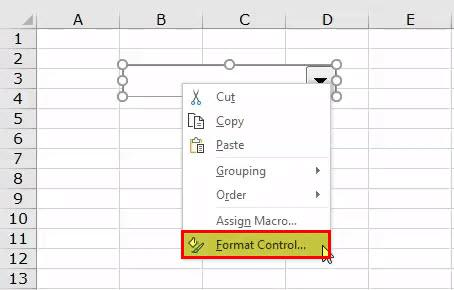

The landscape of financial trading has evolved significantly with technological advancements, reshaping how market participants communicate and execute trades. At the heart of this transformation is the squawk box, a communication tool that once held a central role on bustling trading floors of investment banks and brokerage firms. Initially, these devices functioned as direct audio intercoms, broadcasting crucial market updates, analyst insights, and trading signals in real-time to traders. The dynamic nature of trading floors, often characterized by rapid decision-making and high-stakes environments, necessitated the use of such tools for effective communication.

Today, the squawk box has transformed in both role and significance. This article explores the contemporary relevance of these systems within modern financial communication infrastructures, investigating their evolution alongside the rise of algorithmic trading. As digital transformation permeates trading operations, squawk boxes have transitioned from traditional audio devices to sophisticated digital platforms, facilitating instantaneous communication through text, digital alerts, and online broadcasts.



The shift towards digital communication systems has integrated squawk services within algorithmic trading frameworks, a field that relies on pre-set algorithms for executing trades with precision and speed. Such integration ensures that algorithms, which rely heavily on real-time and accurate data, are well-informed by the latest market developments. The synergy between squawk systems and algorithmic trading not only enhances decision-making processes but also improves trading efficiency and outcomes.

This article will address the functionalities, advantages, and challenges facing these communication systems in the context of today's trading environment. It will examine how modern trading systems capitalize on these advanced communication tools, identifying potential benefits such as increased accuracy in trade execution and minimized emotional decision-making. Furthermore, it will consider the challenges associated with integrating such systems, including data quality management, cybersecurity concerns, and regulatory considerations. By understanding and maximizing the potential of transformed squawk boxes within trading systems, market participants can secure competitive advantages and enhance performance in the dynamic field of financial trading.

## Table of Contents

## The Evolution of Squawk Boxes

Squawk boxes, once the primary communication tool on trading floors, have seen their roles transform with advancements in technology. Traditionally, these devices functioned as crude yet effective audio intercom systems linking traders on hectic trading floors of investment banks and brokerages. They were instrumental in delivering real-time market information, broker updates, and transaction details swiftly across a bustling trading environment.

Over the years, as technology evolved, the reliance on physical squawk boxes began to wane. Real-time messaging systems emerged, providing a more efficient and versatile method for disseminating market data. These systems leveraged the internet and digital communication protocols to transmit information instantaneously to traders across the globe. As the financial sector embraced digital transformation, the original squawk box concept adapted, morphing into sophisticated digital platforms. These platforms not only facilitate communication but also offer text-based and digital alerts, enhancing the speed and accuracy of information dissemination.

Today, although the original squawk box is largely obsolete, its essence survives in modern trading alerts. These advanced systems have inherited the primary function of squawk boxes: ensuring traders have instantaneous access to critical market data. Digital squawk platforms now provide a range of features including live news feeds, price alerts, and analyst reports, integrated directly into trading interfaces. This evolution represents a shift from simple auditory alerts to comprehensive, multifaceted communication systems that underpin decision-making processes in contemporary trading activities. By transforming traditional methodologies into cutting-edge digital solutions, squawk boxes have effectively retained their relevance and continue to play a pivotal role in global financial markets.

## Understanding Financial Trading Communication Systems

Financial trading communication systems have undergone significant advancements, integrating a variety of digital tools designed to enhance both efficiency and speed in trading operations. These systems serve as the backbone of trading activities, facilitating the rapid exchange of crucial financial data necessary for informed decision-making.

A modern squawk service, now hosted on digital platforms, offers a continuous stream of essential financial information. This includes updates on block trades, real-time market data, and analyst recommendations. By doing so, they allow traders to stay informed and make timely decisions based on the most current market conditions. Unlike traditional squawk boxes, which transmitted audio updates, these digital services provide alerts and updates in a text format, maximizing accessibility and clarity.

Such systems are pivotal in delivering real-time market updates, which are crucial for traders who need to react to market changes instantly. The capability to receive and process information promptly is critical, as even minor delays can lead to significant differences in trading outcomes. Analyst recommendations, often based on comprehensive market analysis and forecasts, are disseminated through these systems, providing traders with actionable insights that can impact trading strategies.

Moreover, trading communication systems ensure seamless connectivity among traders and analysts globally. This connectivity is not just limited to the immediate exchange of information but extends to collaborative decision-making and strategy formulation. As markets operate across different time zones, the ability to maintain a global communication network ensures that no opportunity is missed, thus enabling traders to capitalize on market movements as they occur.

In conclusion, modern financial trading communication systems are multifunctional platforms that have evolved from their traditional counterparts. By offering real-time data feeds and facilitating efficient communication lines among global trading communities, they play an indispensable role in today's fast-paced trading environment.

## Algorithmic Trading and Communication Systems

Algorithmic trading utilizes predefined criteria and computer algorithms to execute trades with precision and speed, fundamentally altering the landscape of financial trading. These algorithms are designed to exploit market inefficiencies across various asset classes, operating at speeds and frequencies impractical for human traders. The effectiveness of these trading systems is heavily dependent on real-time access to accurate data, making robust communication systems essential.

Modern financial markets are characterized by their complexity and speed, necessitating a constant stream of information for successful trading operations. Communication systems, traditionally represented by squawk boxes, have evolved into digital platforms that facilitate continuous feeds of vital market information. These platforms provide traders and algorithmic models with real-time updates on market movements, analyst recommendations, and critical financial developments. Such real-time data is imperative for algorithmic strategies, ensuring that they respond appropriately to the latest market conditions.

Integrating squawk services with [algorithmic trading](/wiki/algorithmic-trading) systems creates a potent synergy that enhances decision-making processes. This integration allows trading algorithms to access the latest market data, reducing latency and enabling faster reaction to market changes. By incorporating real-time information into algorithmic models, traders can optimize their strategies to improve execution quality and trading outcomes. This process involves the automation of data inputs into algorithmic frameworks, allowing for the instant execution of trades when predefined criteria are met.

For example, a Python script designed to execute trades based on real-time news alerts might look like this:

```python
import requests

def get_news():
    response = requests.get('https://api.financialnews.com/latest')
    return response.json()

def execute_trade(signal):
    if signal == 'buy':
        # Code to execute buy trade
        print("Executing Buy Order")
    elif signal == 'sell':
        # Code to execute sell trade
        print("Executing Sell Order")

news_data = get_news()

for item in news_data:
    if 'high-impact' in item['category']:
        execute_trade('buy' if item['sentiment'] == 'positive' else 'sell')
```

This script demonstrates the integration of real-time news processing into trading decisions. The synergy between algorithmic trading models and advanced communication systems significantly reduces decision-making timelines and optimizes trade execution, thus providing a competitive edge in the fast-paced trading environment. 

By continuously enhancing the quality of data and reducing latency issues, traders and institutions can leverage these advancements to achieve superior trading performance. The integration of communication systems with algorithmic trading underscores a strategic shift towards more informed, automated, and efficient trading methodologies.

## Benefits of Integrating Squawk Systems with Algo Trading

Integrating squawk systems with algorithmic trading presents significant advantages in enhancing the accuracy and efficiency of trade executions. This intersection allows traders to harness the immediacy of high-impact market news and structure their algorithms to respond with precision. By receiving and processing real-time data through squawk systems, algorithmic trading mechanisms can act on market events more swiftly than human traders, significantly reducing the latency between the arrival of information and the execution of trading decisions.

Moreover, this integration effectively eliminates emotional biases often present in human trading. Decisions driven by algorithms are inherently disciplined and data-oriented, providing a structured approach that focuses solely on market data and statistical analyses. Such objectivity ensures consistency in trading strategies, regardless of market [volatility](/wiki/volatility-trading-strategies) or psychological pressures experienced by human traders.

The competitive advantage gained from this synergy is evident in the immense speed and scope of automated trading strategies. In an environment where financial markets react to global events within milliseconds, having an automated system capable of instantaneously adapting to new information is crucial. Thus, traders employing integrated squawk and algorithmic systems find themselves better equipped to navigate the complex and rapidly changing landscape of financial markets.

Furthermore, automation facilitates the simultaneous monitoring and execution of trades across various markets and asset classes. This broadens the scope of actionable opportunities, streamlining portfolio management and enhancing market presence. The ability to undertake complex trades at high speeds without human intervention underscores the technological advancements in modern trading, offering a formidable edge in achieving optimal trade performance.

## Challenges and Considerations

Integrating communication systems with algorithmic trading offers substantial benefits but also presents several challenges that traders must navigate. Ensuring data quality is fundamental, as algorithmic models rely heavily on accurate and timely information to function effectively. Poor data quality can lead to erroneous trade signals, potentially resulting in significant financial losses. Therefore, maintaining high data integrity through rigorous validation processes and deploying advanced data analytics tools is crucial.

Managing latency is another critical concern. In high-frequency trading, even microsecond delays can impact trade execution and profitability. Minimizing latency involves optimizing network infrastructure, ensuring efficient data routing, and employing state-of-the-art technology to reduce transmission times. Firms often invest in colocating their trading servers adjacent to exchange servers to shave off milliseconds from their transmission latency.

Cybersecurity is pivotal, given the increasing sophistication of cyber threats targeting financial institutions. Robust cybersecurity measures are essential to protect sensitive trading data and communication channels from breaches and unauthorized access. Implementing advanced encryption protocols, conducting regular security audits, and investing in threat detection systems are necessary steps to safeguard information integrity and confidentiality.

Regulatory requirements pose yet another layer of complexity. Traders must remain compliant with various regulations that govern algorithmic trading and market activities. This necessitates understanding and adhering to a myriad of regulatory standards, such as the European Union’s MiFID II or the U.S. SEC’s Regulation NMS, which entail meticulous reporting and monitoring of trading activities to prevent market abuse and ensure transparency.

The risks associated with market impacts, such as price slippage and [liquidity](/wiki/liquidity-risk-premium) fluctuations, amplify the need for robust risk management frameworks. Traders need strategies to mitigate these risks, which might include setting predefined execution strategies, employing [machine learning](/wiki/machine-learning) models to predict market movements, and leveraging historical data for [backtesting](/wiki/backtesting) algorithms.

Finally, continuous monitoring and adjustment of trading strategies are essential to adapt to evolving market conditions. This flexibility allows traders to refine algorithms in response to real-time feedback and changing market dynamics, ensuring sustained performance. Regular strategy reviews, coupled with the integration of machine learning techniques, can aid in identifying patterns and adjusting strategies accordingly to maintain a competitive edge.

## Conclusion

Squawk box communication systems, though having undergone significant transformation from their original form, continue to play a crucial role in the trading industry. The integration of these systems with algorithmic trading platforms illustrates a merger of long-standing communication tools with advanced technological solutions. This convergence facilitates real-time information dissemination, critical for executing trades with precision and speed.

By addressing challenges such as data quality, latency management, and cybersecurity, traders can harness the full potential of this integration to optimize trading performance. Continuous adaptation and monitoring ensure that these systems keep pace with evolving market dynamics, thus providing traders with robust mechanisms to react to high-impact financial news and events.

Overall, a smart understanding and deployment of integrated squawk and algorithmic trading systems can lead to notable competitive advantages. These systems not only enhance decision-making capabilities but also enable traders to maintain an edge in the fast-paced, highly technical landscape of modern financial markets. Thus, traders equipped with these tools are better positioned to capitalize on market opportunities efficiently and effectively.

## References & Further Reading

[1]: Bergstra, J., Bardenet, R., Bengio, Y., & Kégl, B. (2011). ["Algorithms for Hyper-Parameter Optimization."](https://proceedings.neurips.cc/paper/2011/file/86e8f7ab32cfd12577bc2619bc635690-Paper.pdf) Advances in Neural Information Processing Systems 24.

[2]: ["Advances in Financial Machine Learning"](https://www.amazon.com/Advances-Financial-Machine-Learning-Marcos/dp/1119482089) by Marcos Lopez de Prado

[3]: ["Evidence-Based Technical Analysis: Applying the Scientific Method and Statistical Inference to Trading Signals"](https://www.amazon.com/Evidence-Based-Technical-Analysis-Scientific-Statistical/dp/0470008741) by David Aronson

[4]: ["Machine Learning for Algorithmic Trading"](https://www.oreilly.com/library/view/machine-learning-for/9781839217715/) by Stefan Jansen

[5]: ["Quantitative Trading: How to Build Your Own Algorithmic Trading Business"](https://books.google.com/books/about/Quantitative_Trading.html?id=j70yEAAAQBAJ) by Ernest P. Chan