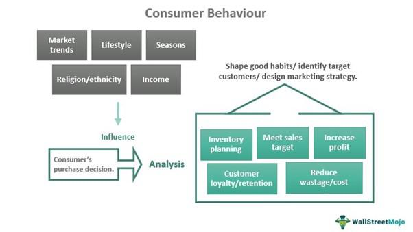

The Sri Lankan Rupee (LKR) is recognized as the official currency of the Democratic Socialist Republic of Sri Lanka, functioning as a crucial facet of the nation's economic framework. This article examines the historical trajectory of the LKR, its pivotal economic role, and its significance in the contemporary practice of algorithmic trading. The currency has undergone various transformations since its inception, and understanding these changes is vital for grasping its current market dynamics.

One key area of focus is the behavior of the LKR in the international financial markets. Historically, fluctuations in the global forex markets have influenced the LKR's value, presenting both challenges and opportunities for traders. Understandably, market participants are keenly interested in the factors driving these fluctuations, including economic indicators, political events, and global economic trends.



With the advent of technology, algorithmic trading has emerged as a powerful tool in the forex landscape. This method uses advanced algorithms to execute trades based on predetermined criteria, thereby optimizing trading efficiency and risk management. The role of such technology in trading the LKR is becoming increasingly significant, as it enables traders to respond swiftly to market changes and leverage data for strategic decision-making.

By examining these elements—the historical evolution of the LKR, its role in global markets, and the rise of algorithmic trading—this article aims to provide valuable insights for traders and investors interested in the LKR currency market. Understanding these aspects will help market participants make informed decisions and anticipate market trends more effectively.

## Table of Contents

## Historical Background of the Sri Lankan Rupee

The transition of Sri Lanka's currency history from the Ceylonese rixdollar to the British pound in 1825 marked a significant shift in the region's monetary system. This move aligned Ceylon's (now Sri Lanka) currency with British colonial policies, which sought to standardize and simplify currency systems across their territories. The adoption of the British pound was primarily due to the island's importance as a strategic trading post and its burgeoning plantation economy, which required a stable and internationally recognized currency for transactions with European markets. 

In 1869, another pivotal change occurred when the Indian Rupee was declared legal tender in Ceylon. This was largely influenced by Ceylon's geographical proximity and substantial trade relations with India. Joining the Indian currency area allowed for more cohesive economic interactions with the neighboring subcontinent, facilitating trade and investment.

Following its independence in 1948, Sri Lanka initiated the creation of its own monetary policy and established the Central Bank of Sri Lanka. This move was critical in asserting economic autonomy and addressing domestic fiscal needs, which were distinct from those of colonial interests. The central bank was tasked with the responsibility of issuing currency, managing the country's monetary policy, and maintaining economic stability.

By 1972, Sri Lanka introduced its own local currency, the Sri Lankan Rupee (LKR), to replace the Indian Rupee. This decision was part of a broader initiative to strengthen national identity and economic independence. Establishing the LKR allowed Sri Lanka greater control over its inflation rates, interest rates, and overall economic strategy. The introduction of the LKR provided a platform for decoupling from external monetary policies and tailoring fiscal measures to suit local economic conditions.

The historical transitions from the rixdollar to the pound, from the pound to the Indian Rupee, and finally to the Sri Lankan Rupee had significant impacts on Sri Lanka’s economy. Each phase of currency change was closely tied to the shifting economic landscapes and political control. The evolution of the currency is reflective of Sri Lanka's growth from a colonial economy to a more self-sufficient and autonomous nation. The introduction of the Central Bank and its own currency marked a pivotal step towards establishing a stable economic framework that facilitated subsequent economic development and integration into the global financial system.

## The Role of the Sri Lankan Central Bank

The Central Bank of Sri Lanka (CBSL) performs crucial functions to maintain economic stability and regulate the monetary policy of Sri Lanka. Established in 1950, following the country's independence, the CBSL was mandated to ensure the stability of the Sri Lankan Rupee (LKR) and manage the monetary policy to address inflation and stimulate economic growth. 

The primary responsibility of the Central Bank is to formulate and implement monetary policy aimed at achieving price stability. This is crucial since inflation directly affects the purchasing power of the currency and the overall economic vitality. The Bank employs various tools, such as [interest rate](/wiki/interest-rate-trading-strategies) adjustments and open market operations, to influence the money supply and inflation rate. A significant tool in this regard is the repurchase agreement, which helps manage [liquidity](/wiki/liquidity-risk-premium) in the financial system.

CBSL's intervention in the foreign exchange market is another pivotal aspect of its role. This includes managing the foreign currency reserves to stabilize the LKR against major global currencies. By engaging in foreign exchange operations, the Bank can smooth out excessive [volatility](/wiki/volatility-trading-strategies) in the exchange rates, thereby providing a stable environment for international trade and investment. The decisions regarding the currency's pegging or floating status are critical and can have ripple effects in the [forex](/wiki/forex-system) markets globally.

One of the challenges faced by the Central Bank is maintaining a balance between curbing inflation and fostering an environment conducive to economic growth. High inflation can erode consumer purchasing power, while overly aggressive tightening of monetary policy can stifle economic expansion. Therefore, the CBSL must carefully scrutinize economic indicators like GDP growth rates, employment figures, and consumer price index (CPI) to calibrate its policies appropriately.

In recent years, the CBSL has been under scrutiny for how its policy decisions have influenced the LKR in the global forex market. For instance, its strategies to manage the balance of payments crisis and responses to international financial disruptions have showcased its critical role. Exchange rate policies, such as adjustments in the currency band or strategic devaluation, are sometimes employed to address external shocks or competitiveness issues.

Global economic events, such as changes in US Federal Reserve policy, Brexit, or geopolitical tensions, can also impact the LKR's performance. Therefore, the Central Bank's ability to anticipate these changes and effectively communicate its policy stance to market participants is essential for ensuring confidence in the LKR.

In summary, the role of the Central Bank of Sri Lanka is integral to the country's economic health and the stability of its currency. By navigating complex monetary policies and economic challenges, the CBSL strives to maintain a stable currency, thereby influencing the LKR's position in the global forex market.

## Algorithmic Trading and its Impact on LKR

Algorithmic trading has significantly transformed the currency trading landscape, including the trading of the Sri Lankan Rupee (LKR) in the forex market. This technological advancement uses computer algorithms to execute trades based on pre-set criteria, offering numerous advantages such as increased speed, reduced transaction costs, and improved risk management.

The integration of advanced algorithms in trading the LKR allows traders to process vast amounts of data rapidly. These algorithms can analyze market trends, historical data, and other relevant factors in real-time, enabling traders to make informed decisions faster than human analysis could permit. The speed of execution is crucial in forex markets, where price discrepancies can occur in fractions of a second. This capability to swiftly act on market opportunities gives algorithmic traders a distinct advantage over traditional manual trading methods.

Risk management is another critical benefit of [algorithmic trading](/wiki/algorithmic-trading) for LKR. Through the automation of trading strategies, algorithms can be programmed to adhere strictly to predetermined risk parameters, such as stop-loss and take-profit levels. This reduces the emotional influence that often leads to irrational decision-making in manual trading. Algorithms can also diversify trades and hedge positions in real-time, thereby minimizing the potential for substantial losses.

Algorithmic trading platforms leverage data and predictive models to optimize the trading of LKR. By using historical price data, technical indicators, and macroeconomic variables, predictive models can forecast currency price movements with a certain degree of accuracy. For instance, [machine learning](/wiki/machine-learning) models such as Random Forests or Support Vector Machines might be employed to predict the direction of LKR movements based on patterns identified in the data. Here is a simple example using Python to illustrate how a machine learning model could be developed for such predictions:

```python
import pandas as pd
from sklearn.model_selection import train_test_split
from sklearn.ensemble import RandomForestClassifier
from sklearn.metrics import accuracy_score

# Load historical forex data for LKR
data = pd.read_csv('lkr_forex_data.csv')

# Feature selection and preparation
features = data[['previous_day_close', '3_day_avg', 'momentum', 'volatility']]
labels = data['price_movement']  # Binary: 1 for increase, 0 for decrease

# Split data into training and testing sets
X_train, X_test, y_train, y_test = train_test_split(features, labels, test_size=0.2, random_state=42)

# Train a Random Forest Classifier
model = RandomForestClassifier(n_estimators=100, random_state=42)
model.fit(X_train, y_train)

# Predict on the test set
predictions = model.predict(X_test)

# Calculate accuracy
accuracy = accuracy_score(y_test, predictions)
print(f"Model Accuracy: {accuracy:.2f}")
```

In this example, historical forex data related to the LKR is used to train a Random Forest Classifier, enabling predictions about future price movements. Such models allow traders to automate their decision-making processes, further enhancing trading efficiency and effectiveness.

As algorithmic trading continues to evolve, its impact on the Sri Lankan Rupee and similar currencies is likely to increase, making it an essential tool for modern forex traders.

## LKR in the Forex Market: Challenges and Opportunities

The Sri Lankan Rupee (LKR) has experienced significant volatility in the forex market, particularly against major currencies like the US Dollar (USD). This volatility creates both opportunities and challenges for traders. The LKR's exchange rate fluctuations can provide trading opportunities through speculative trading strategies, which exploit price movements. However, traders must also navigate challenges stemming from several intrinsic and extrinsic factors, primarily political instability and fluctuating inflation rates.

Historically, LKR has shown episodes of sharp depreciation followed by periods of recovery, influenced by domestic economic policies and external financial conditions. Political events in Sri Lanka have often triggered currency fluctuations, affecting investor confidence and causing sudden shifts in demand and supply. For instance, changes in government policies, geopolitical tensions, or economic reforms can result in immediate market reactions, thus impacting the currency’s value.

Inflation rates in Sri Lanka have consistently influenced the value of LKR. High inflation can erode purchasing power and lead to depreciation of the currency. The Central Bank’s strategies to control inflation, such as adjusting interest rates, can also influence LKR's stability in the forex market. Moreover, factors like trade balances, foreign reserves, and external debts are consistently monitored by traders to gauge currency performance.

In the algorithm-driven forex market, traders can utilize strategies that account for the LKR's volatility. Algorithmic trading platforms are designed to mitigate risks by executing trades based on predefined rules, minimizing market exposure during periods of instability. Two common strategies include:

1. **Mean Reversion:** This strategy assumes that the currency price will return to its historical average over time. Traders can design algorithms to identify and exploit deviations from this average, executing trades when prices are presumed to revert.

    ```python
    def mean_reversion_strategy(prices, window=10):
        rolling_mean = prices.rolling(window=window).mean()
        deviation = prices - rolling_mean
        signals = deviation.apply(lambda x: 'buy' if x < 0 else 'sell')
        return signals
    ```

2. **Momentum Trading:** Leveraging the existing market trends, momentum trading algorithms identify and trade based on the continuation of currency movements. This strategy involves buying LKR when upward momentum is strong and selling during downtrends.

    ```python
    def momentum_strategy(prices, period=14):
        momentum = prices.diff(period)
        signals = momentum.apply(lambda x: 'buy' if x > 0 else 'sell')
        return signals
    ```

Understanding the nuances of LKR's performance in the forex market allows traders to capitalize on both short-term and long-term opportunities. Despite the inherent risks associated with political instability and inflation, algorithmic trading facilitates enhanced risk management and swift execution, providing traders with an edge in navigating the dynamic landscape of the LKR forex market.

## Future Prospects of LKR in Algorithmic Trading

The potential future of Sri Lankan Rupee (LKR) trading in algorithmic trading is significantly influenced by both technological advancements and the economic reforms undertaken within Sri Lanka. As algorithmic trading, which employs advanced strategies and automated decision-making processes, becomes more prevalent, several trends and developments could shape the trading landscape for LKR.

One possible future trend in LKR trading is the integration of cryptocurrencies. As digital currencies gain wider acceptance, they provide a new avenue for diversification and risk management in forex strategies. Cryptocurrencies offer a decentralized trading approach, eliminating some traditional forex trading constraints. The ability to integrate LKR with leading cryptocurrencies can enhance market liquidity and offer added trading pairs, potentially attracting more global participants to the LKR market.

Additionally, advancements in [artificial intelligence](/wiki/ai-artificial-intelligence) (AI) are set to transform forex trading. AI algorithms can analyze vast amounts of market data in real-time, identify patterns, and predict currency movements with increasing accuracy. AI's machine learning capabilities enable adaptive trading strategies that can optimize performance based on historical data and evolving market conditions. For LKR, AI's predictive power can be particularly advantageous given the currency's historical volatility and sensitivity to economic reforms and political changes within Sri Lanka.

Building on AI's potential in trading, neural networks and [deep learning](/wiki/deep-learning) models can uncover complex relationships in forex data that might not be apparent through traditional analysis. Python libraries such as TensorFlow and PyTorch allow the development of sophisticated models that can be trained on historical LKR market data. A simple [neural network](/wiki/neural-network) example for predicting LKR price movements can be constructed as follows:

```python
import tensorflow as tf
from tensorflow.keras.models import Sequential
from tensorflow.keras.layers import Dense

# Define a simple neural network model
model = Sequential()
model.add(Dense(units=64, activation='relu', input_shape=(input_shape,)))
model.add(Dense(units=64, activation='relu'))
model.add(Dense(units=1))

# Compile the model
model.compile(optimizer='adam', loss='mean_squared_error')

# Train the model with historical LKR data (features and labels need to be defined)
# model.fit(features, labels, epochs=50, batch_size=32)
```

Furthermore, economic reforms in Sri Lanka aiming to stabilize the economy can positively impact LKR trading by enhancing investor confidence. Structural changes, such as improving governance, reducing debt burdens, and initiating fiscal policies to control inflation, can lead to a more stable LKR, thus attracting more algorithmic traders wary of excessive volatility.

Finally, the future of LKR trading will also be influenced by the ongoing development of trading platforms. Enhanced connectivity and faster data processing will allow traders to execute LKR trades with lower latency and greater accuracy. These technological advancements ensure that market participants can capitalize on even the smallest [arbitrage](/wiki/arbitrage) opportunities and react swiftly to market-moving news.

Overall, the interplay between technological progress, such as crypto integration and AI advancements, and economic reform is crucial for the future of algorithmic trading of the Sri Lankan Rupee. Insight into these trends aids traders and investors in formulating informed strategies for trading LKR in the evolving forex environment.

## Conclusion

The Sri Lankan Rupee (LKR) has undergone substantial transitions throughout its history, evolving from colonial currencies to becoming the official currency of Sri Lanka. This evolution underscores the Rupee's importance in the nation's economy, reflecting economic growth, policy shifts, and international economic interactions. Despite historical challenges, the LKR remains a crucial element in Sri Lanka's economic infrastructure, influencing trade, investment, and financial stability.

Algorithmic trading introduces both challenges and opportunities for trading the LKR on a global scale. This form of trading utilizes complex algorithms and computing power to execute trades with unparalleled speed and efficiency. The rapid processing capabilities of algorithmic trading can significantly mitigate risks and exploit currency market fluctuations, potentially benefiting those trading the LKR. However, the volatility of the LKR, influenced by domestic factors such as political shifts and inflation, requires sophisticated models and strategies to navigate.

An in-depth understanding of the historical and economic context of the LKR is essential for successful engagement in the forex market. Knowledge of the LKR’s historical evolution provides a foundation for anticipating future trends and market reactions. Additionally, recognizing the implications of algorithmic trading enables traders and investors to leverage technological advancements to their advantage. By combining historical insights with modern trading techniques, market participants can enhance their strategies, making informed decisions that align with the dynamic nature of currency markets.

## References & Further Reading

[1]: Bergstra, J., Bardenet, R., Bengio, Y., & Kégl, B. (2011). ["Algorithms for Hyper-Parameter Optimization."](https://papers.nips.cc/paper/4443-algorithms-for-hyper-parameter-optimization) Advances in Neural Information Processing Systems 24.

[2]: ["Advances in Financial Machine Learning"](https://www.amazon.com/Advances-Financial-Machine-Learning-Marcos/dp/1119482089) by Marcos Lopez de Prado

[3]: ["Evidence-Based Technical Analysis: Applying the Scientific Method and Statistical Inference to Trading Signals"](https://books.google.com/books/about/Evidence_Based_Technical_Analysis.html?id=MeoJAQAAMAAJ) by David Aronson

[4]: ["Machine Learning for Algorithmic Trading"](https://github.com/stefan-jansen/machine-learning-for-trading) by Stefan Jansen

[5]: ["Quantitative Trading: How to Build Your Own Algorithmic Trading Business"](https://www.amazon.com/Quantitative-Trading-Build-Algorithmic-Business/dp/1119800064) by Ernest P. Chan