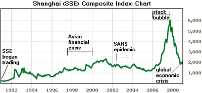

## Table of Contents

## What is the SSE Composite Index?

The SSE Composite Index is a stock market index that tracks the performance of all stocks listed on the Shanghai Stock Exchange (SSE) in China. It is one of the most important indicators of the overall health of the Chinese stock market. The index includes a wide range of companies, from large state-owned enterprises to smaller, private firms, giving investors a broad view of how the market is doing.

People often use the SSE Composite Index to see how the Chinese economy is doing. When the index goes up, it usually means that the economy is growing and investors are feeling good about the future. When it goes down, it can mean that people are worried about the economy. The index is watched by investors all over the world because China is a big part of the global economy.

## How is the SSE Composite Index calculated?

The SSE Composite Index is calculated using a method called market capitalization weighting. This means that the value of the index depends on the total value of all the companies in it. Each company's influence on the index is based on how much it is worth. So, if a big company's stock price goes up or down a lot, it will affect the index more than if a smaller company's stock price changes.

To find the index value, you start with a base value, which was set at 100 on July 15, 1991. Then, you add up the total market value of all the stocks in the index and divide it by a special number called the divisor. This divisor changes over time to keep the index fair when companies are added or removed, or when they do things like stock splits. The result is the current value of the SSE Composite Index, which shows how the overall market is doing.

## What types of companies are included in the SSE Composite Index?

The SSE Composite Index includes a wide variety of companies that are listed on the Shanghai Stock Exchange. These companies come from many different industries, like manufacturing, technology, finance, and more. Some of the companies are big state-owned enterprises, which means they are owned by the government. These big companies can have a lot of influence on the index because they are worth a lot of money.

There are also smaller, private companies in the index. These companies might not be as big or well-known, but they still play an important role in showing how the overall market is doing. By including both big and small companies from different industries, the SSE Composite Index gives a good picture of the health of the Chinese stock market.

## What is the significance of the SSE Composite Index in the global market?

The SSE Composite Index is very important in the global market because it shows how the Chinese stock market is doing. China is one of the biggest economies in the world, so what happens in its stock market can affect other countries too. When the SSE Composite Index goes up, it often means that investors are feeling good about China's economy, which can make them feel more confident about the global economy too. On the other hand, if the index goes down a lot, it can make investors worried and might cause them to be more careful with their investments around the world.

The index is also watched by people who want to understand how different industries in China are doing. Since the SSE Composite Index includes companies from many different sectors, like technology, finance, and manufacturing, it gives a broad view of the Chinese economy. This information is useful for investors from other countries who might want to invest in Chinese companies or who need to know how China's economy might affect their own investments. So, the SSE Composite Index is a key tool for understanding the health of the Chinese economy and its impact on the global market.

## How has the SSE Composite Index performed historically?

The SSE Composite Index has had many ups and downs since it started in 1991. In the early years, the index grew a lot as China's economy opened up and more people started investing in stocks. There were big jumps in the late 1990s and early 2000s, but also some big drops. For example, the index crashed in 2008 during the global financial crisis, losing a lot of its value. After that, it slowly climbed back up, but it has never reached the high levels it saw in 2007 again.

More recently, the SSE Composite Index has been pretty steady, but it still has its ups and downs. In 2015, there was another big drop that worried a lot of people around the world. Since then, the index has been growing slowly, but it hasn't been as exciting as in the past. Overall, the SSE Composite Index shows how China's economy has changed over time, with periods of fast growth and times of big trouble.

## What are some major events that have impacted the SSE Composite Index?

The SSE Composite Index has been affected by many big events over the years. One of the biggest events was the global financial crisis in 2008. This crisis started in the United States but quickly spread to other countries, including China. The SSE Composite Index lost a lot of its value during this time because people were scared and started selling their stocks. It took several years for the index to start recovering, and it never got back to the high levels it had before the crisis.

Another big event that affected the SSE Composite Index was the stock market crash in 2015. This was a time when a lot of people in China were buying stocks, hoping to make a lot of money quickly. But then, the prices of stocks started to fall, and many people panicked and started selling their stocks. This caused the index to drop a lot in a short time. The Chinese government tried to stop the fall by doing things like stopping some stocks from being traded and making it easier for people to borrow money to buy stocks, but it took a while for the index to start going up again.

These events show how the SSE Composite Index can be affected by both global and local happenings. When big things happen, like a financial crisis or a stock market crash, it can make the index go down a lot. But the index also shows how the Chinese economy can recover over time, even after big problems.

## How does the SSE Composite Index compare to other major stock indices?

The SSE Composite Index is one of several major stock indices around the world, each representing different markets. Compared to the Dow Jones Industrial Average in the United States, which tracks 30 large companies, the SSE Composite Index includes a much broader range of companies, giving a more comprehensive view of the Chinese market. While the Dow Jones might go up or down based on the performance of big companies like Apple or Boeing, the SSE Composite Index is influenced by both big and small companies across various industries in China. This difference makes the SSE Composite Index a better reflection of the overall health of the Chinese economy.

Another important index to compare with is the Nikkei 225 in Japan, which tracks 225 large companies listed on the Tokyo Stock Exchange. Like the Dow Jones, the Nikkei 225 is more focused on big companies, while the SSE Composite Index includes a wider variety of firms. This means that movements in the SSE Composite Index can sometimes be more gradual and less volatile than those in the Nikkei 225, which can be heavily influenced by big swings in major companies. Overall, the SSE Composite Index provides a unique perspective on the Chinese market, showing how diverse sectors and company sizes contribute to its performance.

## What are the key factors that influence the movements of the SSE Composite Index?

The SSE Composite Index goes up and down because of many things. One big thing is how well the Chinese economy is doing. If the economy is growing and people are buying more stuff, then companies make more money, and their stock prices go up. This makes the index go up too. But if the economy is not doing well, and people are not spending money, then companies don't make as much money, and their stock prices go down, which makes the index go down. Another thing that affects the index is what the government does. If the Chinese government makes new rules or changes old ones, it can make companies do better or worse, and that changes the index.

Another [factor](/wiki/factor-investing) that influences the SSE Composite Index is what's happening in the rest of the world. If there's a big problem in another country, like a financial crisis, it can make people worried about their money, and they might sell their stocks. This can make the index go down even if the Chinese economy is doing okay. Also, how much people want to invest in China can change the index. If more people from other countries want to buy Chinese stocks, it can make the index go up. But if they don't want to invest, then the index might go down. So, the SSE Composite Index is affected by a mix of things happening in China and around the world.

## How can investors use the SSE Composite Index to make investment decisions?

Investors can use the SSE Composite Index to get a good idea of how the Chinese stock market is doing overall. If the index is going up, it might mean that many companies in China are doing well, and it could be a good time to buy stocks. On the other hand, if the index is going down, it might be a sign that the market is not doing so well, and investors might want to be careful or sell some of their stocks. By looking at the SSE Composite Index, investors can see trends and decide if it's a good time to invest more or if they should wait.

Another way investors can use the SSE Composite Index is by comparing it to other stock indices around the world. If the SSE Composite Index is doing better than other indices, like the Dow Jones or the Nikkei 225, it might mean that China's economy is growing faster than other countries. This could make investors want to put more of their money into Chinese stocks. But if the SSE Composite Index is not doing as well as other indices, investors might decide to invest in other countries instead. So, the SSE Composite Index helps investors make choices by giving them a big picture of the Chinese market and how it compares to the rest of the world.

## What are the future prospects for the SSE Composite Index?

The future of the SSE Composite Index depends a lot on how well China's economy keeps growing. If China keeps building new things and making more stuff, the companies in the index might do well, and the index could go up. But there are also challenges. For example, if other countries start buying less from China, or if there are big problems like a financial crisis, the index could go down. Also, what the Chinese government does can affect the index a lot. If they make good rules that help companies grow, the index might go up. But if they make rules that make it harder for companies, the index could go down.

Another thing to think about is how the world is changing. More and more people are using technology and buying things online, so companies in these areas might do better in the future. If the SSE Composite Index has a lot of these kinds of companies, it might go up. But if it has more old-fashioned companies that aren't keeping up with new trends, it might not do as well. Overall, the SSE Composite Index has a good chance to grow if China's economy keeps doing well and if it can keep up with new changes in the world.

## How does the regulatory environment in China affect the SSE Composite Index?

The rules and laws made by the Chinese government can have a big impact on the SSE Composite Index. If the government makes rules that help companies do better, like giving them money to grow or making it easier to start new businesses, the index might go up. For example, if the government decides to help technology companies, then those companies might make more money, and their stock prices could go up. This would make the SSE Composite Index go up too because it includes a lot of different companies.

On the other hand, if the government makes rules that make it harder for companies, the index might go down. If they put a lot of restrictions on what companies can do, or if they make it harder for them to get money, then companies might not do as well. This can make their stock prices go down, which would make the SSE Composite Index go down too. So, the way the government handles rules and laws is very important for how the SSE Composite Index does.

## What advanced analytical tools can be used to predict movements in the SSE Composite Index?

To predict how the SSE Composite Index might move, people use fancy tools like [machine learning](/wiki/machine-learning) and big data analysis. Machine learning is when computers learn from past data to guess what might happen next. They look at things like how the economy is doing, what the government is doing, and even what people are saying on the internet. This helps them find patterns that might not be easy for people to see. Big data analysis is when you look at a lot of information all at once. This can include numbers from the stock market, news stories, and even social media posts. By putting all this information together, you can get a better idea of what might happen to the SSE Composite Index.

Another tool that can be helpful is something called technical analysis. This is when you look at charts and graphs of the SSE Composite Index to see if there are any patterns. For example, if the index has gone up and down in a certain way before, it might do the same thing again. People also use something called sentiment analysis, which is when you look at what people are saying and feeling about the market. If a lot of people are feeling good about the Chinese economy, the index might go up. But if a lot of people are worried, it might go down. By using these tools, investors can try to guess what the SSE Composite Index might do next and make better decisions about their money.

## What is the SSE Composite Index?

The SSE Composite Index is a pivotal stock market index monitoring the performance of A-shares and B-shares on the Shanghai Stock Exchange (SSE). Introduced in 1991, this index serves as an essential barometer for the Chinese economy, providing comprehensive insights into the overall direction of the Shanghai stock market. By including all listed stocks on the SSE, both A-shares, which are denominated in Chinese Renminbi and primarily accessible to domestic investors, and B-shares, traded in foreign currencies and available to international investors, the index offers a holistic view of the market's dynamics.

The performance of the SSE Composite Index is a direct reflection of China's economic activities and trends. This characteristic makes it crucial for global investors who seek to understand and predict economic shifts in one of the world's largest economies. As an aggregative measure of market movements, the index's fluctuations can indicate broader economic conditions, such as investor sentiment, regulatory impact, and macroeconomic factors affecting China.

In measuring the index, the market capitalization of each listed company is calculated by multiplying the share price by the total number of outstanding shares. The formula for a market-cap-weighted index like the SSE Composite can be expressed as:

$$
\text{Index Level} = \frac{\sum \left( \text{Price of Stock} \times \text{Number of Shares} \right)}{\text{Base Market Capitalization}} \times \text{Base Index Value}
$$

The base period of the SSE Composite Index established the initial value of the index at 100 points, allowing for consistent measurement of growth over time. This market-cap-weighted methodology makes the index particularly sensitive to price movements in larger companies, which can have significant effects on the index's overall direction.

The SSE Composite Index thus represents a comprehensive tool for investors worldwide, offering a reliable gauge of the health of China's stock market and, by extension, its economy.

## What is the History and Calculation of the SSE Composite Index?

The SSE Composite Index, established on July 15, 1991, serves as a comprehensive indicator of the progress within China's stock market. This index is pivotal in capturing the overall market sentiment and trends in the Shanghai Stock Exchange (SSE) by encompassing both A-shares and B-shares of all listed companies. The inception of the SSE Composite Index provided a structured framework for investors to assess the broad performance of Chinese equities.

The calculation of the SSE Composite Index employs a market-capitalization-weighted method. In this approach, the index is calculated with a base period, adopting a base value set at 100 points. The market capitalization of each stock is the product of its current market price and the total number of outstanding shares. The formula for calculating the index is as follows:

$$
\text{Index Value} = \frac{\sum (\text{Current Market Price} \times \text{Outstanding Shares})}{\sum (\text{Base Market Price} \times \text{Outstanding Shares at Base})} \times 100
$$

This method ensures that larger companies, with heavier market capitalizations, exert more influence on the index's movement compared to their smaller counterparts. Consequently, any substantial price shifts in these larger companies will have a pronounced impact on the overall index value.

Understanding the calculation process of the SSE Composite Index is crucial for investors, especially those utilizing [algorithmic trading](/wiki/algorithmic-trading) strategies. Algorithmic trading often relies on market-cap indices like the SSE Composite to identify and exploit short-term price movements. Given that the index is sensitive to fluctuations in large-cap stocks, algorithmic traders can develop models to predict and capitalize on these changes.

When implementing algorithmic trading on the SSE, it is imperative to account for the unique market dynamics driven by the index’s calculation. Real-time market data and analytical tools are necessary to track the shifts in index value accurately, enabling traders to make informed decisions swiftly. The calculation intricacies underscore the importance of comprehensive analytical frameworks in successful trading operations on the SSE.

## References & Further Reading

[1]: ["Shanghai Stock Exchange Composite Index (SHCOMP) Historical Prices."](https://www.investing.com/indices/shanghai-composite-historical-data) Investing.com

[2]: Steiner, G., & Wu, J. (2013). ["The Shanghai Stock Exchange and China's Capital Markets."](https://pmc.ncbi.nlm.nih.gov/articles/PMC3635106/) Chinese Economy.

[3]: Zhang, M. Y., Zhao, H., & Wang, Y. (2019). ["An empirical study on algorithmic trading."](https://www.sciencedirect.com/science/article/pii/S0360319924052996) Financial Innovation.

[4]: ["Algorithmic Trading and DMA: An introduction to direct access trading strategies"](https://www.amazon.com/Algorithmic-Trading-DMA-introduction-strategies/dp/0956399207) by Barry Johnson

[5]: Fama, E. F., & French, K. R. (2004). ["The Capital Asset Pricing Model: Theory and Evidence."](https://www.aeaweb.org/articles?id=10.1257/0895330042162430) Journal of Economic Perspectives.