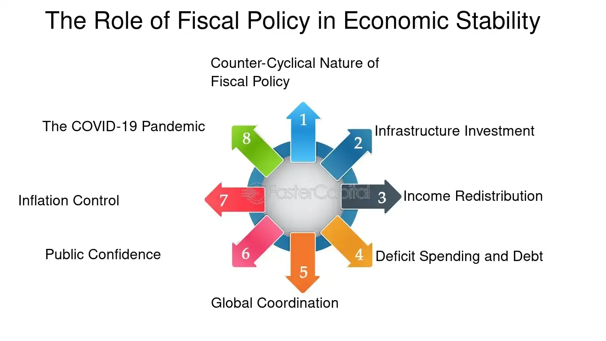

## Table of Contents

## What is stabilization policy in economics?

Stabilization policy in economics refers to the actions taken by the government or central bank to keep the economy stable. This means they try to control things like inflation, unemployment, and overall economic growth. The main goal is to avoid big swings in the economy, which can cause problems for people and businesses.

There are two main types of stabilization policies: fiscal policy and monetary policy. Fiscal policy involves the government changing its spending or taxes to influence the economy. For example, if the economy is slowing down, the government might spend more money on projects to create jobs. Monetary policy is managed by the central bank, which can change interest rates or the amount of money in circulation. If inflation is too high, the central bank might raise interest rates to cool down the economy.

Both types of policies are important tools for managing the economy. They help to smooth out the ups and downs that can happen naturally in a market system. By using these policies wisely, governments and central banks can help create a more stable environment for everyone.

## What are the main goals of stabilization policy?

The main goals of stabilization policy are to keep the economy steady and to avoid big ups and downs. When the economy is stable, people feel more secure about their jobs and money. This helps businesses plan better because they know what to expect. If the economy is too wild, it can be hard for people to make good choices about saving, spending, or investing.

Another goal is to control inflation. Inflation means prices are going up, and if it gets too high, it can make life harder for everyone. Stabilization policy tries to keep inflation at a level that's just right—not too high and not too low. This helps keep the value of money stable, so people can trust that their money will still be worth something in the future.

Lastly, stabilization policy aims to keep unemployment low. When people have jobs, they can earn money and support themselves and their families. High unemployment can lead to a lot of problems, like poverty and less spending in the economy. By using stabilization policies, governments and central banks try to create more jobs and keep the economy running smoothly.

## What are the different types of stabilization policies?

Stabilization policies are split into two main types: fiscal policy and monetary policy. Fiscal policy is all about how the government uses its spending and taxes to help the economy. If the economy is doing badly, the government might spend more money on things like roads or schools to create jobs and get people spending. Or, if they want people to have more money to spend, they might lower taxes. On the other hand, if the economy is growing too fast and causing inflation, the government might spend less or raise taxes to cool things down.

Monetary policy is handled by the central bank, which controls things like interest rates and the amount of money in the economy. If the economy needs a boost, the central bank might lower interest rates. This makes it cheaper for people and businesses to borrow money, which can lead to more spending and investment. If inflation is too high, the central bank might raise interest rates to make borrowing more expensive, which can slow down spending and help control prices. Both fiscal and monetary policies are important tools that help keep the economy stable and working well for everyone.

## How does fiscal policy contribute to economic stabilization?

Fiscal policy helps keep the economy steady by using government spending and taxes. When the economy is not doing well, the government can spend more money on things like building roads or schools. This creates jobs and gets people spending money, which can help the economy grow. The government might also lower taxes so people have more money to spend. This can make the economy stronger and help more people find jobs.

On the other hand, if the economy is growing too fast and prices are going up too much, the government can use fiscal policy to slow things down. They might spend less money on projects or raise taxes. When the government spends less, it means there's less money going around, which can help cool down the economy. Raising taxes means people have less money to spend, which can also help control inflation. By using these tools, the government can help keep the economy balanced and stable.

## How does monetary policy contribute to economic stabilization?

Monetary policy helps keep the economy stable by controlling the amount of money in circulation and setting interest rates. The central bank, which is in charge of monetary policy, can lower interest rates when the economy needs a boost. When interest rates are low, it's cheaper for people and businesses to borrow money. This can lead to more spending and investment, which helps the economy grow. If the economy is growing too fast and prices are going up too much, the central bank can raise interest rates. Higher interest rates make borrowing more expensive, which can slow down spending and help control inflation.

By adjusting interest rates and the money supply, the central bank can influence how much people and businesses spend and invest. This helps keep the economy from getting too hot or too cold. When the economy is stable, people feel more secure about their jobs and money, and businesses can plan better for the future. Overall, monetary policy is a key tool for making sure the economy runs smoothly and stays balanced.

## What are the tools used by governments and central banks in stabilization policies?

Governments use fiscal policy tools to help keep the economy stable. They do this by changing how much they spend and how much they tax people. If the economy is not doing well, the government might spend more money on things like building roads or schools. This creates jobs and gets people spending more, which can help the economy grow. The government might also lower taxes so people have more money in their pockets to spend. But if the economy is growing too fast and prices are going up a lot, the government might spend less or raise taxes. This can slow down the economy and help control inflation.

Central banks use monetary policy tools to keep the economy on track. They do this by changing interest rates and controlling the amount of money in the economy. If the economy needs a boost, the central bank might lower interest rates. This makes it cheaper for people and businesses to borrow money, which can lead to more spending and investment. But if prices are going up too fast, the central bank might raise interest rates. This makes borrowing more expensive, which can slow down spending and help control inflation. By using these tools, central banks can help keep the economy balanced and stable.

## Can you explain the Phillips Curve and its relevance to stabilization policy?

The Phillips Curve is an idea in economics that shows a link between unemployment and inflation. It says that when unemployment goes down, inflation tends to go up, and when unemployment goes up, inflation tends to go down. This happens because when more people have jobs, they have more money to spend, which can push prices higher. On the other hand, when fewer people have jobs, they spend less money, which can help keep prices from going up too much.

The Phillips Curve is important for stabilization policy because it helps policymakers understand the trade-offs they face. If they want to lower unemployment, they might have to accept higher inflation. But if they want to keep inflation low, they might have to accept higher unemployment. This means that when governments and central banks make decisions about fiscal and monetary policy, they need to think about how their actions will affect both unemployment and inflation. By understanding the Phillips Curve, they can try to find the right balance to keep the economy stable.

## What are the challenges and limitations of implementing stabilization policies?

Implementing stabilization policies can be tricky because it's hard to predict how the economy will react. Sometimes, the effects of a policy might take a long time to show up. For example, if the government decides to spend more money to create jobs, it might take months or even years for the economy to feel the full impact. This makes it hard for policymakers to know if they're doing the right thing at the right time. Also, the economy is affected by many things that are hard to control, like what's happening in other countries or unexpected events like natural disasters. These factors can make it even harder to get the results they want.

Another challenge is that stabilization policies can have unintended side effects. For example, if the central bank lowers interest rates to boost the economy, it might cause people to borrow too much money and create a bubble in the housing market. When that bubble bursts, it can lead to a financial crisis. Also, if the government spends a lot of money to help the economy, it might end up with a big debt. This debt can be a problem in the future because it means the government will have to pay more interest, which can limit its ability to help the economy later on. Balancing these risks and benefits is a big challenge for policymakers.

## How have historical economic crises influenced the development of stabilization policies?

Historical economic crises have played a big role in shaping how governments and central banks think about stabilization policies. One of the most famous examples is the Great Depression in the 1930s. During this time, the economy was in bad shape with lots of people out of work and businesses failing. This led to new ideas about how the government could help. Economists like John Maynard Keynes said that the government should spend more money during tough times to create jobs and get the economy moving again. This idea helped lead to the use of fiscal policy to stabilize the economy.

Another important crisis was the stagflation of the 1970s, where the economy had high inflation and high unemployment at the same time. This was a problem because the Phillips Curve, which said there was a trade-off between inflation and unemployment, didn't seem to work anymore. As a result, central banks started to focus more on controlling inflation through monetary policy. They began to use interest rates more actively to manage the economy. These crises showed that stabilization policies need to be flexible and adapt to new challenges, helping to shape the tools and strategies used today.

## What role does automatic stabilizers play in economic stabilization?

Automatic stabilizers are parts of the economy that help keep things stable without the government having to do anything new. They work on their own to make the economy smoother when it's going through ups and downs. For example, when the economy is doing badly and people are out of work, they might get unemployment benefits. These benefits help them keep spending money, which can help the economy recover. On the other hand, when the economy is doing well and people are [earning](/wiki/earning-announcement) more, they might pay more in taxes. This can slow down the economy a bit and keep it from growing too fast.

These stabilizers are important because they start working right away without the government having to pass new laws or make new decisions. This makes them faster and more reliable than other kinds of stabilization policies. By helping to balance out the ups and downs of the economy, automatic stabilizers make life more predictable for people and businesses. They can help prevent big swings in the economy, which makes it easier for everyone to plan for the future.

## How do international factors affect the effectiveness of national stabilization policies?

International factors can make it harder for a country to use its own stabilization policies effectively. For example, if a country wants to lower interest rates to help its economy grow, but other countries have higher interest rates, money might leave the country to go where it can earn more. This can make the country's currency weaker, which can lead to higher prices for things that are imported. Also, if the world economy is not doing well, it can affect a single country's economy, no matter what its government does. If other countries are buying less of what a country sells, it can hurt that country's businesses and lead to more unemployment.

Even though these international factors can make things tricky, countries still try to work together to make their stabilization policies more effective. They might join forces in groups like the G20 or the International Monetary Fund (IMF) to share information and coordinate their actions. For example, if many countries agree to lower interest rates at the same time, it can help make the world economy more stable. But it's not always easy to get everyone to agree, and sometimes what's good for one country might not be good for another. So, while international cooperation can help, it's still a challenge to make sure national stabilization policies work well in a global economy.

## What are the future outlooks and potential innovations in stabilization policy?

In the future, stabilization policies might become more advanced and use new technology to help keep the economy stable. One idea is using big data and [artificial intelligence](/wiki/ai-artificial-intelligence) to better predict what will happen in the economy. By looking at lots of information from around the world, governments and central banks could make better decisions about when to spend more money or change interest rates. This could help them react faster to problems and make the economy more stable. Another possibility is using digital currencies, like cryptocurrencies, to help control the money supply in new ways. If central banks can issue digital money directly to people, it might be easier to manage the economy and help people during tough times.

There could also be new ways to work together with other countries to make stabilization policies more effective. As the world becomes more connected, what happens in one country can affect others quickly. So, countries might need to share more information and coordinate their actions better. This could mean setting up new international groups or using existing ones like the G20 and the IMF more effectively. By working together, countries can help each other keep their economies stable and avoid big problems. But it will take time and effort to make this happen, and there will always be challenges because what's good for one country might not be good for another.

## References & Further Reading

[1]: Keynes, J. M. (1936). ["The General Theory of Employment, Interest, and Money."](https://www.files.ethz.ch/isn/125515/1366_KeynesTheoryofEmployment.pdf) Macmillan Cambridge University Press.

[2]: Bernanke, B. S. (2020). ["21st Century Monetary Policy: The Federal Reserve from the Great Inflation to COVID-19."](https://wwnorton.com/books/9781324020462) W. W. Norton & Company.

[3]: Lopez de Prado, M. (2018). ["Advances in Financial Machine Learning."](https://www.amazon.com/Advances-Financial-Machine-Learning-Marcos/dp/1119482089) Wiley.

[4]: Chan, E. P. (2008). ["Quantitative Trading: How to Build Your Own Algorithmic Trading Business."](https://github.com/ftvision/quant_trading_echan_book) Wiley.

[5]: Kirilenko, A. A., & Lo, A. W. (2013). ["Moore's Law versus Murphy's Law: Algorithmic Trading and Its Discontents."](https://www.aeaweb.org/articles?id=10.1257/jep.27.2.51) National Bureau of Economic Research.

[6]: Hull, J. C. (2015). ["Risk Management and Financial Institutions."](https://www.wiley.com/en-us/Risk+Management+and+Financial+Institutions%2C+6th+Edition-p-9781119932482) Wiley.