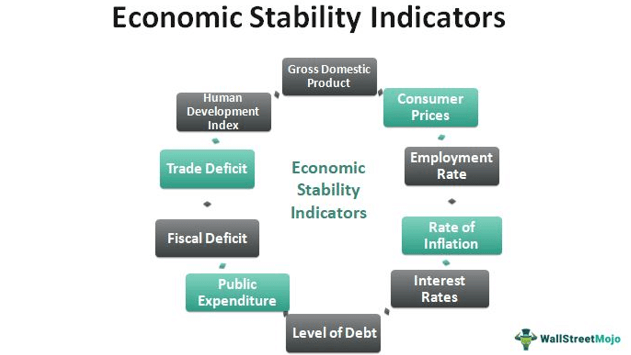

In the modern economic landscape, the coordination between stabilization policies and economic strategies is increasingly intricate and vital. As financial markets continue to evolve, the integration of algorithmic trading has fundamentally altered market dynamics, presenting both challenges and opportunities for economic policy-making. Stabilization policies are instrumental tools employed by governments and central banks to sustain economic growth and ensure price stability. Their implementation is pivotal in mitigating economic fluctuations, which have become more pronounced in today's volatile markets.

Algorithmic trading, characterized by the use of computer algorithms to execute trades at high speeds, has introduced complexities that challenge traditional economic policies. These automated systems can influence market liquidity and volatility, making it essential for policymakers to adapt stabilization policies accordingly. This article will examine the role of these policies in maintaining economic stability amidst the rise of algorithmic trading technologies.



By analyzing current trends and projecting future developments, this article aims to provide insights into how economic policies can be re-engineered to accommodate advancements in algorithmic trading. Understanding this intersection is critical for policymakers who must balance the traditional goals of economic stability with the innovative pressures introduced by technological advancements in financial markets.

## Table of Contents

## Understanding Stabilization Policy

Stabilization policy refers to a set of strategies employed by governments and central banks designed to reduce the volatility of economic cycles. These policies are essential for maintaining a stable economic environment, crucial for long-term growth and development. The central focus of stabilization policy encompasses three main objectives: steady GDP growth, inflation control, and low unemployment rates.

Monetary policy, primarily managed by central banks, plays a significant role in achieving these objectives. By adjusting interest rates and manipulating the money supply, central banks can influence economic activity. For instance, lowering interest rates generally stimulates investment and consumption by reducing the cost of borrowing. Conversely, increasing interest rates can help control inflation by making borrowing more expensive, thereby cooling off economic activity.

On the fiscal side, governments employ policies that involve varying levels of spending and taxation to influence aggregate demand. For example, during economic downturns, a government may increase public spending or reduce taxes to stimulate demand and bolster economic activity. Conversely, to cool down an overheating economy and control inflation, the government might decrease spending or increase taxes.

Over the years, stabilization policies have proven effective in smoothing out the more severe fluctuations of the economic cycle and in preventing recessions from becoming overly prolonged or deep. Historically, the Great Depression underscored the effectiveness of well-implemented stabilization policies, prompting the adoption of Keynesian economic strategies that advocate for active government intervention during economic downturns.

In contemporary practice, stabilization policy requires a careful balance and timely adjustments based on economic indicators and forecasts. Policymakers continually analyze data to determine the appropriate mix of monetary and fiscal tools needed to stabilize the economy while considering both short-term and long-term impacts.

## The Roots of Stabilization Policy

The concept of stabilization policy is deeply rooted in the economic theories of John Maynard Keynes, a prominent 20th-century economist whose ideas fundamentally changed economic thinking. Keynesian economics argues that government intervention is necessary to manage economic cycles, particularly during downturns. Keynes' revolutionary idea was that active fiscal and monetary measures could mitigate the severe consequences of economic recessions and strengthen recovery phases. 

Keynes' theories gained prominence during the Great Depression of the 1930s when traditional economic approaches failed to revive stagnant economies. In response, Keynes advocated for increased government expenditures and lower taxes to stimulate demand and pull the global economy out of the depression. This approach contrasted with classical economic theories that favored free markets and opposed government intervention.

The implementation of Keynesian stabilization policies has been significant during various economic crises. For instance, during the COVID-19 pandemic, governments worldwide adopted aggressive fiscal and monetary policies reminiscent of Keynesian strategies to counteract economic slowdowns. Policies included unprecedented levels of government spending, direct cash transfers, and monetary easing by central banks, aimed at buffering economies from severe downturns.

Historically, stabilization policies have adapted to address changing economic conditions and advancements in economic theories. As economies grew more complex, so did the tools for stabilization. Developments in economic modeling and forecasting have enhanced policymakers' ability to design efficient intervention strategies. For example, the introduction of automatic stabilizers like unemployment insurance and progressive tax systems has provided inherent economic buffers that automatically work to stabilize income and demand during economic fluctuations.

In summary, Keynesian principles laid the groundwork for modern stabilization policies by emphasizing proactive government intervention. History illustrates that these policies have evolved with each economic challenge, reflecting advancements in both economic thought and practical policy instruments.

## Algorithmic Trading and Economic Policy

Algorithmic trading employs complex computer algorithms to systematically and rapidly execute trades, transforming the operational landscape of financial markets. With the capability of processing vast datasets and executing market decisions in fractions of a second, [algorithmic trading](/wiki/algorithmic-trading) enhances market efficiency but also introduces unique challenges to economic policymakers.

One primary concern with the rise of algorithmic trading is its potential to amplify market [volatility](/wiki/volatility-trading-strategies). High-frequency trading, a subset of algorithmic trading, can exacerbate price swings by executing large volumes of trades in incredibly short time spans. This potential for increased volatility requires policymakers to reconsider existing regulatory frameworks to prevent systemic risks. For instance, during events like the 2010 Flash Crash, rapid algorithmic trades contributed to severe market disruptions, showcasing the urgent need for adaptive economic policies.

Furthermore, the presence of algorithmic trading influences [liquidity](/wiki/liquidity-risk-premium) in financial markets. Algorithms can both increase liquidity by rapidly matching buy and sell orders and decrease liquidity when algorithms simultaneously withdraw from the market during stressed conditions. Policymakers face the task of balancing these dynamics to ensure continuous and stable market operations.

To regulate algorithmic trading, policymakers employ various strategies such as implementing circuit breakers, establishing stricter risk controls, and requiring greater transparency in algorithmic processes. Circuit breakers, for example, are mechanisms that pause trading temporarily when extreme price movements are detected, allowing markets to stabilize and giving traders time to reassess their strategies.

Economic policy must evolve to harness the benefits of technological advancements in trading while mitigating associated risks. This involves integrating data analytics and technology-driven insights into the policy design process. For instance, algorithms can be used to analyze market data in real time, assisting in the creation of responsive and dynamic stabilization policies. By leveraging these tools, policymakers can develop more nuanced approaches to maintaining market health and economic stability.

In summary, the intersection of algorithmic trading and economic policy is a complex domain that demands innovative solutions and forward-thinking strategies. By embracing technology and adapting regulatory frameworks, economic policy can effectively manage the challenges and opportunities presented by advanced trading technologies.

## The Future of Stabilization Policy

As economies worldwide evolve, driven by globalization, technological advancements, and shifting demographic trends, the future of stabilization policy demands a more sophisticated approach. The complexity of modern economies necessitates policies that can adeptly navigate both traditional economic cycles and new-age challenges. 

Leveraging technology and data analytics will be a cornerstone in this endeavor. The vast troves of economic data available today enable more precise modeling and forecasting of economic phenomena. By utilizing advanced algorithms and [machine learning](/wiki/machine-learning) techniques, policymakers can better predict economic downturns and craft timely interventions. For instance, machine learning models, like deep neural networks, can analyze historical data to identify patterns indicative of impending recessions or inflationary pressures, thus allowing for preemptive policy measures.

Python code snippet for a simple predictive model using machine learning could be as follows:

```python
from sklearn.ensemble import RandomForestRegressor
from sklearn.model_selection import train_test_split
from sklearn.metrics import mean_squared_error
import pandas as pd

# Sample dataset containing economic indicators
data = pd.read_csv('economic_data.csv')

# Features and target variable
X = data[['indicator1', 'indicator2', 'indicator3']]
y = data['target']

# Split data into training and test sets
X_train, X_test, y_train, y_test = train_test_split(X, y, test_size=0.2, random_state=42)

# Initialize and train the model
model = RandomForestRegressor(n_estimators=100, random_state=42)
model.fit(X_train, y_train)

# Predict and evaluate the model
predictions = model.predict(X_test)
print(f'Mean Squared Error: {mean_squared_error(y_test, predictions)}')
```

Moreover, we anticipate central banks and governments will explore innovative monetary tools and fiscal strategies. This might include unconventional monetary policies such as negative interest rates or the use of digital currencies to enhance the transmission of monetary policy. On the fiscal side, novel approaches might involve targeted fiscal stimuli, such as direct cash transfers to individuals, enabled by the enhanced digital payment infrastructure.

To effectively address the nuanced challenges of tomorrow's economy, interdisciplinary approaches will be indispensable. Integrating insights from economics, data science, and technology can result in robust policy frameworks. This synergy can enhance the capability to fine-tune policy interventions, striking a balance between mitigating risks and fostering sustainable growth. For example, cross-disciplinary teams can build economic models that incorporate behavioral economics to better understand consumer responses to policy changes.

In summary, the future of stabilization policy will likely be shaped by technological integration, innovation in monetary and fiscal approaches, and collaboration across diverse fields. As we look ahead, the adaptability and foresight of policymakers in employing these strategies will determine their efficacy in steering economic stability.

## Conclusion

The integration of algorithmic trading into financial markets necessitates a comprehensive reevaluation of existing economic policies. Modern stabilization strategies must adapt to not only address longstanding economic issues but also the unique challenges presented by technological innovations like algorithmic trading. This evolution requires acknowledging the dual impact of algorithmic trading: while it offers efficiency and speed, it also increases market volatility, which can destabilize economic systems if not properly managed.

Understanding algorithmic trading's implications is crucial for policymakers concerned with preserving market stability and promoting economic growth. The rapid execution of trades, driven by algorithms, can lead to significant price fluctuations within short time frames, thus complicating traditional policy responses. As such, policymakers must strike a delicate balance between harnessing the benefits of these technologies and mitigating their potential risks.

Successful stabilization policy frameworks in the future will hinge on continual adaptation and interdisciplinary collaboration. By incorporating expertise from economics, computer science, and data analytics, policymakers can develop more robust systems capable of addressing both foreseeable and unforeseen economic disruptions. This collaborative approach toward policy innovation seeks not only to absorb shocks but also to create resilient financial ecosystems that can thrive amid constant technological advancements.

## FAQs

What are stabilization policies? Stabilization policies are strategic actions employed by governments and central banks designed to maintain economic equilibrium by managing growth, controlling inflation, and reducing unemployment. These policies encompass both monetary and fiscal measures. Monetary policies involve manipulation of interest rates and money supply by central banks to influence economic activity. Fiscal policies include government spending and taxation adjustments to affect overall demand in the economy. These measures aim to smooth out economic fluctuations, thus preventing severe economic downturns and ensuring consistent growth patterns.

How does algorithmic trading affect economic policy? Algorithmic trading employs sophisticated computer algorithms to execute trades at speeds and volumes that are impractical for human traders. This technological advancement greatly influences market dynamics by potentially increasing market volatility and affecting liquidity. Since algorithmic trading can lead to rapid price swings, it presents new challenges for economic policymakers. There is a heightened need for adaptable stabilization policies that can address the amplified market fluctuations brought about by such trading strategies. Policymakers must balance the need for market efficiency with the regulation necessary to prevent systemic risk.

What is the future outlook for stabilization policy? The future of stabilization policy is likely to be shaped by the integration of technology and interdisciplinary approaches. With the rapid advancements in data analytics and technology, policymakers have the tools to make more informed and nuanced decisions. The complex nature of modern economies requires innovative monetary and fiscal strategies that incorporate technological solutions. Central banks and governments are expected to explore new tools to navigate emerging economic challenges effectively. The evolution of stabilization policies will depend on continuous adaptation and the collaboration of economics with fields like data science and technology, facilitating an environment that encourages sustainable economic stability.

## References & Further Reading

[1]: Keynes, J. M. (1936). ["The General Theory of Employment, Interest, and Money."](https://www.files.ethz.ch/isn/125515/1366_KeynesTheoryofEmployment.pdf) Macmillan Cambridge University Press.

[2]: Bernanke, B. S. (2020). ["21st Century Monetary Policy: The Federal Reserve from the Great Inflation to COVID-19."](https://wwnorton.com/books/9781324020462) W. W. Norton & Company.

[3]: Lopez de Prado, M. (2018). ["Advances in Financial Machine Learning."](https://www.amazon.com/Advances-Financial-Machine-Learning-Marcos/dp/1119482089) Wiley.

[4]: Chan, E. P. (2008). ["Quantitative Trading: How to Build Your Own Algorithmic Trading Business."](https://github.com/ftvision/quant_trading_echan_book) Wiley.

[5]: Kirilenko, A. A., & Lo, A. W. (2013). ["Moore's Law versus Murphy's Law: Algorithmic Trading and Its Discontents."](https://www.aeaweb.org/articles?id=10.1257/jep.27.2.51) National Bureau of Economic Research.

[6]: Hull, J. C. (2015). ["Risk Management and Financial Institutions."](https://www.wiley.com/en-us/Risk+Management+and+Financial+Institutions%2C+6th+Edition-p-9781119932482) Wiley.