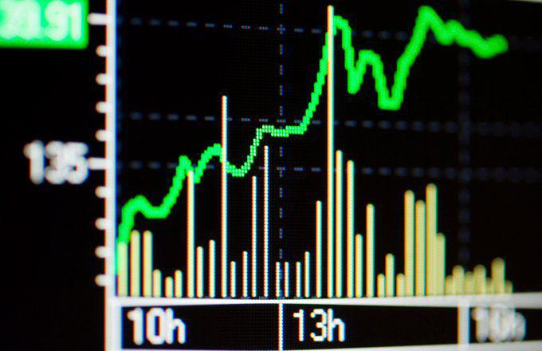

In today's complex financial landscape, investors are constantly seeking ways to balance risk and returns. As economic conditions and market dynamics evolve, maintaining capital preservation while achieving consistent returns has become more important than ever for both institutional and individual investors. Stable Value Funds have emerged as a popular investment vehicle for those interested in maintaining capital security while generating steady growth. These funds are specifically designed to offer a balance between security and modest returns, making them particularly attractive for conservative investors, especially those nearing retirement.

Stable Value Funds are an appealing alternative to traditional low-risk investments like money market funds or certificates of deposit, offering a unique combination of stability and yield. With a focus on high-quality, fixed-income instruments, these funds provide a layer of insurance to protect against capital losses, thus enabling investors to benefit from consistent interest payments. This feature makes them highly suitable for inclusion in long-term retirement plans such as 401(k)s. 



Additionally, as financial technology continues to revolutionize investment practices, algorithmic trading has become a critical tool in optimizing investment strategies. By leveraging intricate algorithms and computer programs, investors can automate trading decisions, enhancing the potential to adjust portfolio allocations in response to market changes swiftly. This article will explore how stable value funds can be effectively combined with algorithmic trading to maximize portfolio efficiency. Understanding the benefits and inherent risks of such funds, along with the application of advanced trading strategies, is essential for investors aiming to develop a robust, risk-adjusted investment portfolio.

## Table of Contents

## What is a Stable Value Fund?

Stable Value Funds are investment portfolios primarily composed of high-quality government and corporate bonds. These funds are structured to provide capital preservation and generate steady interest income, which makes them particularly attractive to risk-averse investors. The core characteristic of stable value funds is their insurance feature, which acts as a safeguard for investors. This insurance, often through contracts with third-party insurers, promises a guaranteed return of principal and consistent interest payments, even amid economic fluctuations.

These funds are predominantly available through retirement savings plans, such as 401(k)s and other defined contribution plans. Their appeal to retirement investors is their focus on stability rather than high returns. By including a diversified set of bonds, stable value funds aim to offer more predictable returns compared to typical equity investments, reducing exposure to the volatile swings often experienced in the stock market.

The insurance component of stable value funds is what sets them apart from other fixed-income investments. This feature ensures that irrespective of market turbulence, investors can expect steady cash flows. The structure and agreements involved ensure that the impact of rising or falling interest rates on the bond prices do not detract from the fund’s value, maintaining principal security. In some cases, crediting rates are adjusted periodically to reflect actual investment performance, while still offering income stability to the investor. 

In summary, stable value funds provide an appealing solution for investors prioritizing stability, ensuring that their capital remains protected while delivering a reliable, if modest, income stream.

## Benefits of Stable Value Fund Investments

Stable Value Funds present a compelling option for investors seeking to preserve capital while benefiting from steady returns. Key advantages include risk mitigation, potentially higher returns compared to money market accounts, and enhanced portfolio stability.

**Risk Mitigation:** Stable value funds are designed to protect capital through insurance against market losses. This feature provides a secure investment option particularly beneficial for individuals nearing retirement or those with a low-risk tolerance. Since these funds invest in high-quality government and corporate bonds backed by insurance, they offer a layer of security that typical bond funds lack. This enables investors to safeguard their principal investment while earning consistent returns.

**Higher Returns than Money Market Accounts:** Historically, stable value funds have outperformed money market funds, delivering slightly higher returns. This can be primarily attributed to the funds’ investment in diversified fixed-income securities and contracts with insurance providers that guarantee specific interest rates. For example, while money market accounts are constrained by lower yields due to their more liquid asset composition, stable value funds can leverage longer-duration fixed-income investments to achieve better returns. According to historical data, stable value funds have typically yielded around 2-3% annually, compared to the roughly 0.5-1% yields associated with money market accounts.

**Portfolio Stability:** Introducing stable value funds into an investment portfolio can buffer the impacts of market volatility. The stability offered by these funds is particularly appealing during economic downturns when equity markets experience significant fluctuations. By including stable value funds, investors can maintain a balanced risk profile, thus ensuring steady capital growth over time. The diversification provided reduces the overall portfolio risk, which is vital in preserving accumulated savings and achieving long-term financial objectives.

Overall, the integration of stable value funds into an investment strategy can provide a valuable combination of security and growth potential, suitable for those prioritizing capital preservation and consistent returns.

## Risks Associated with Stable Value Funds

Stable value funds present several risks that investors should carefully consider. One primary concern is the potential for lower yields when compared to other investment vehicles. The lower returns are often attributed to the management and insurance fees associated with these funds. These fees are necessary to maintain the insurance agreements that safeguard the investor's capital, yet they can reduce the overall yield.

Inflation risk is another critical [factor](/wiki/factor-investing). When a portfolio heavily relies on stable value funds, the returns might not keep pace with inflation over time. This risk can erode the purchasing power of the accumulated savings, particularly concerning for long-term investments like retirement funds. If the rate of inflation exceeds the yield of the stable value fund, the real value of the investment diminishes.

In addition to these overarching concerns, investors must also navigate specific risks, including credit risk, [interest rate](/wiki/interest-rate-trading-strategies) risk, and contract risk. Credit risk entails the possibility that bond issuers, whose obligations underlie the fund, may default on their commitments. This risk can impact the fund's stability and the reliability of the insurance component.

Interest rate risk is another consideration, as changes in interest rates can influence the value of the bonds within the fund's portfolio. Generally, when interest rates rise, the value of existing bonds falls, potentially impacting the fund's performance. This effect can be particularly pronounced during periods of rapid economic change.

Contract risk is unique to stable value funds, involving the agreements made with insurance companies or financial institutions to cover the invested capital. Should these institutions face financial difficulties or default, the protection layer offered by insurance might become ineffective, jeopardizing the security of the investment.

Given these risks, it is essential for investors to weigh the stability offered by stable value funds against potential yield limitations and vulnerabilities stemming from market conditions and the financial health of insurers. Understanding these factors can better prepare investors to make informed decisions about their portfolios.

## Understanding Algorithmic Trading

Algorithmic trading, often referred to as algo trading, involves the use of computer algorithms to automate trading decisions. It leverages complex mathematical models and formulas to execute trades at speeds and frequencies that are typically impossible for a human trader. By using historical data and statistical analysis, [algorithmic trading](/wiki/algorithmic-trading) can identify patterns and trends that inform buy or sell decisions, aiming to optimize investment portfolios and balance risks and returns efficiently.

Algorithms can be designed to make decisions based on a set of predefined rules derived from technical analysis or advanced statistical analysis. For instance, a simple moving average crossover strategy may buy a stock when its short-term moving average exceeds its long-term moving average and sell it when the opposite occurs. This rule-based approach allows for systematic trading strategies to be executed consistently and without emotional influence.

Python has emerged as a popular programming language for implementing algorithmic trading due to its rich ecosystem of libraries and frameworks. Libraries such as NumPy and Pandas assist with data manipulation and analysis, while Matplotlib and Seaborn support data visualization. Libraries like TA-Lib offer technical analysis tools, and platforms such as Zipline and PyAlgoTrade provide infrastructure for developing, [backtesting](/wiki/backtesting), and executing trading strategies.

Here is a basic example of an algorithmic trading strategy using Python:

```python
import pandas as pd
import numpy as np

# Load stock data
data = pd.read_csv('stock_data.csv')

# Calculate moving averages
short_window = 40
long_window = 100

data['Short_MA'] = data['Close'].rolling(window=short_window, min_periods=1).mean()
data['Long_MA'] = data['Close'].rolling(window=long_window, min_periods=1).mean()

# Generate signals
data['Signal'] = 0.0
data['Signal'][short_window:] = np.where(data['Short_MA'][short_window:] > data['Long_MA'][short_window:], 1.0, 0.0)

# Create trading orders
data['Position'] = data['Signal'].diff()

# Print resulting signals and positions
print(data[['Close', 'Short_MA', 'Long_MA', 'Signal', 'Position']])
```

This code calculates the short-term and long-term moving averages of a stock's closing price and generates buy (1) and sell (0) signals based on their crossover. The 'Position' column indicates a change in the trading position, i.e., whether to enter or [exit](/wiki/exit-strategy) a trade.

Algorithmic trading systems can significantly enhance the management of stable value fund investments. By integrating algorithmic trading, investors can continuously monitor market conditions and automatically adjust their portfolio allocations based on predefined criteria. This capability allows for the optimization of growth opportunities while hedging against potential risks, such as interest rate fluctuations.

Moreover, algorithmic trading helps to minimize human error and biases that may arise in manual trading. Automated systems execute trades based solely on the logic and parameters programmed, ensuring consistent application of the trading strategy without the influence of fear or greed. This automated process provides investors with precise execution, reduced transaction costs, and improved overall performance of their investment portfolios.

## Utilizing Algorithmic Trading with Stable Value Funds

Algorithmic trading presents an effective approach to integrating technology within investment strategies, particularly for stable value fund investors who are focused on preserving capital while managing risk. These algorithms are designed to monitor market conditions in real-time, allowing for timely adjustments to portfolio allocations. This is crucial for maintaining optimal exposure to the desired asset classes and shielding against potential risks such as interest rate fluctuations, which can have a significant impact on the value of bond-focused funds.

The core advantage of algorithmic trading lies in its ability to process large volumes of data and execute trades at speeds beyond human capability. Algorithms use historical and real-time data to identify patterns and trends that may predict future market movements. For stable value fund investors, this means that any threat to the value of their investments, such as unexpected interest rate hikes or credit downgrades, can be swiftly countered by adjusting the fund's asset allocation.

In practical terms, an algorithm can be designed to monitor key economic indicators and market signals. For instance, an uptick in inflation indicators might prompt the algorithm to shift some assets from long-term bonds to short-term securities, which are less sensitive to interest rate changes. Below is a basic example of a Python algorithm that could be used to adjust portfolio weights based on interest rate changes:

```python
def adjust_portfolio(weights, interest_rate, threshold):
    for bond, weight in weights.items():
        if interest_rate > threshold:
            weights[bond] -= weights[bond] * 0.1  # Decrease weight by 10%
        else:
            weights[bond] += weights[bond] * 0.1  # Increase weight by 10%
    return weights

current_weights = {'short_term_bonds': 0.3, 'long_term_bonds': 0.7}
new_interest_rate = 3.5
rate_threshold = 3.0

adjusted_weights = adjust_portfolio(current_weights, new_interest_rate, rate_threshold)
print(adjusted_weights)
```

This script provides a simplified mechanism to alter the allocation of short-term and long-term bonds based on changes in interest rates relative to a predefined threshold.

Additionally, automated trading systems can significantly reduce the influence of human errors and biases. Emotional biases, such as panic selling during a market downturn or excessive optimism in a bull market, can be mitigated by relying on systematic algorithms that execute based on preset criteria and data analysis. This objectivity is particularly beneficial in maintaining the disciplined investment approach required to preserve capital in stable value funds.

In summary, by leveraging algorithmic trading, stable value fund investors can maintain portfolio stability and optimize returns while minimizing potential risks associated with market [volatility](/wiki/volatility-trading-strategies) and human decision-making errors. This technological integration offers a more robust methodology for managing fund allocations and responding promptly to dynamic market conditions.

## Conclusion

Stable Value Funds are an essential option for investors seeking to preserve capital and stabilize their investment portfolios. These funds provide a level of security through insurance against capital loss, which can be particularly appealing for those nearing retirement or those with low risk tolerance. However, the importance of understanding the benefits and risks associated with Stable Value Funds cannot be overstated. Investors must weigh the potential for lower yields and higher fees against the assurance of stable returns and risk mitigation.

A comprehensive understanding of these dynamics enables informed investment decisions that align with individual financial goals and risk appetites. An additional layer of sophistication can be added by incorporating algorithmic trading into stable value fund investment strategies. Algorithmic trading leverages data-driven strategies to automate trading decisions, which can optimize returns while simultaneously managing potential risks. By allowing algorithms to monitor market conditions and adjust portfolio allocations in real-time, investors can maintain optimal exposure and hedge against potential risks, such as interest rate fluctuations.

Moreover, the automation of trading activities minimizes human errors and emotional biases, contributing to more systematic and rational investment processes. This integration of technology not only enhances the effectiveness of Stable Value Funds but also empowers investors to adapt to the ever-evolving financial landscape efficiently. Therefore, the collaboration of traditional investment vehicles with modern algorithmic methods provides a robust framework for achieving financial stability and growth.

## References & Further Reading

[1]: ["The Handbook of Stable Value Investments"](https://www.amazon.com/Handbook-Stable-Value-Investments/dp/1883249422) by Frank J. Fabozzi and David Mulvey

[2]: ["Advances in Financial Machine Learning"](https://www.amazon.com/Advances-Financial-Machine-Learning-Marcos/dp/1119482089) by Marcos Lopez de Prado

[3]: ["Evidence-Based Technical Analysis: Applying the Scientific Method and Statistical Inference to Trading Signals"](https://www.amazon.com/Evidence-Based-Technical-Analysis-Scientific-Statistical/dp/0470008741) by David Aronson

[4]: ["Stable Value: A Practitioner's Guide"](https://www.spglobal.com/spdji/en/documents/education/education-value-a-practitioners-guide.pdf) by Tom Garrett

[5]: ["Quantitative Trading: How to Build Your Own Algorithmic Trading Business"](https://www.amazon.com/Quantitative-Trading-Build-Algorithmic-Business/dp/1119800064) by Ernest P. Chan