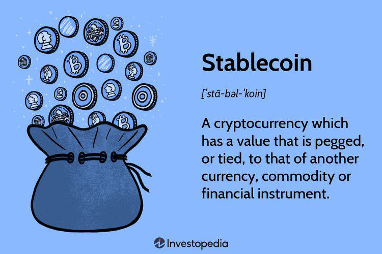

Stablecoins have emerged as a significant category in the cryptocurrency space, addressing some of the inherent challenges posed by traditional cryptocurrencies. These digital currencies are designed to maintain a stable value by pegging to stable assets such as fiat currencies, commodities, or utilizing other mechanisms to mitigate the volatility that characterizes many cryptocurrencies like Bitcoin (BTC) and Ethereum (ETH).

The primary advantage of stablecoins lies in their ability to offer the benefits of blockchain technology—such as decentralization, transparency, and low transaction costs—while minimizing price fluctuations. This stability is critical for building trust and facilitating everyday transactions within the digital economy. By providing a more predictable currency option, stablecoins enable users to transact with confidence and protect their investments from the extreme volatility often associated with cryptocurrencies.



In this article, we will explore the multifaceted role of stablecoins in digital currency, delve into their growing significance for cryptocurrency investors, and examine how they are increasingly being integrated into algorithmic trading strategies. Stablecoins are not only reshaping the landscape of digital finance but also acting as a bridge, enhancing the interaction between the burgeoning world of cryptocurrencies and the established financial systems.

## Table of Contents

## What Are Stablecoins?

Stablecoins are a category of cryptocurrencies designed to minimize the price volatility characteristic of traditional cryptocurrencies like Bitcoin and Ethereum. By being pegged to stable assets such as fiat currencies—like the US dollar—or commodities, stablecoins provide a stable exchange value.

The primary function of stablecoins is to offer a stable medium of exchange, combining the decentralized and secure nature of cryptocurrencies with the reliability and predictability of traditional financial assets. This dual advantage makes them particularly appealing for various financial activities such as remittances, lending, and even daily transactions in digital markets.

### Types of Stablecoins

Stablecoins can be classified based on how they maintain their peg to stable assets:

1. **Fiat-Collateralized Stablecoins**: These stablecoins are backed by reserves of fiat currency. For every stablecoin issued, a corresponding amount of fiat currency is held in reserve. For example, Tether (USDT) is a widely known fiat-collateralized stablecoin pegged to the US Dollar. This reserve backing typically ensures that the stablecoin's value stays tied closely to that of the fiat currency. The primary advantage of this model lies in its simplicity and perceived stability due to direct collateralization with government-backed currency. However, it requires trust in the centralized entity holding the reserves to maintain transparency and solvency.

2. **Crypto-Collateralized Stablecoins**: Unlike fiat-collateralized stablecoins, these are backed by other cryptocurrencies. Due to the inherent volatility of cryptocurrency markets, crypto-collateralized stablecoins are often overcollateralized. For instance, to issue $100 worth of a stablecoin, a user might need to deposit $150 worth of a volatile cryptocurrency like Ethereum. This overcollateralization acts as a cushion against price fluctuations. A popular example is DAI, a decentralized stablecoin managed by the MakerDAO system, which uses Ethereum as collateral. Smart contracts are typically employed to facilitate these mechanisms, ensuring transparency and reducing the need for trusted intermediaries.

3. **Algorithmic Stablecoins**: These do not rely on asset backing but instead use algorithms to control the stablecoin's supply and maintain price stability. The algorithm adjusts the supply based on market demand, working similarly to a central bank's action in controlling national currency supplies. When the price of the stablecoin exceeds its peg, the algorithm increases supply to push the price down, and vice versa. One example of an algorithmic stablecoin was Basis, although it ceased operations because of regulatory challenges. The promise of algorithmic stablecoins lies in their potential for scalability and decentralization; however, they face challenges in achieving consistent stability without collateral support.

Combining these attributes, stablecoins serve as a bridge between traditional finance and the innovative realm of cryptocurrencies, presenting solutions for [volatility](/wiki/volatility-trading-strategies) while promoting the adoption of digital assets. Due to these attributes, they continue to play an increasingly integral role in the digital economy.

## The Importance of Stablecoins in Cryptocurrency

Stablecoins have become essential tools in the [cryptocurrency](/wiki/cryptocurrency) ecosystem due to their ability to mitigate significant price fluctuations typically associated with digital currencies like Bitcoin and Ethereum. By pegging their value to more stable assets, such as fiat currencies or commodities, stablecoins offer a reliable medium of exchange that facilitates smooth transactions and financial operations.

One of the primary benefits stablecoins provide is their ability to minimize the volatility inherent in cryptocurrencies. The fluctuating prices of Bitcoin and Ethereum, for instance, pose a considerable risk for investors and traders. However, by using stablecoins, individuals can securely conduct transactions and preserve the value of their assets without being exposed to severe market swings.

Moreover, stablecoins act as intermediaries, effectively bridging the gap between cryptocurrencies and traditional financial markets. This role increases the utility of digital currencies within broader economic systems by enabling seamless integration with existing financial infrastructure. This integration is particularly crucial in areas like remittances and cross-border transactions, where stablecoins can offer reduced transaction costs and faster settlement times compared to traditional banking systems.

Stablecoins also provide a hedge against inflation for individuals in countries with unstable local currencies, offering a stable store of value and protection against currency devaluation. The stable nature of these digital assets makes them attractive for both individual users and businesses, serving as stable units of account and stores of value.

Overall, the importance of stablecoins in the cryptocurrency space lies in their capacity to combine the efficacy of digital currencies with the steadiness of traditional assets, thus fostering their use in digital markets and expanding the reach of crypto-based financial services.

## Types of Stablecoins

Stablecoins are a distinct class of cryptocurrencies designed to maintain a stable value by being pegged to assets that typically exhibit low volatility. There are three main types of stablecoins, categorized based on their underlying structure and mechanisms for maintaining price stability: fiat-collateralized, crypto-collateralized, and algorithmic.

**Fiat-Collateralized Stablecoins**

Fiat-collateralized stablecoins are backed by reserves of fiat currencies, such as the US dollar (USD), Euro (EUR), or other national currencies. The reserves are typically held in a bank account and are supposed to match or exceed the value of the stablecoins in circulation. This backing by a trusted and relatively stable fiat currency ensures the stablecoin's value remains stable as long as the reserves are transparently managed and auditable. Tether (USDT) and USD Coin (USDC) are prominent examples of fiat-collateralized stablecoins. The primary advantage of this type is the straightforward correspondence between the stablecoin and its underlying fiat reserve, making them easy to understand and adopt for individuals familiar with traditional currencies.

**Crypto-Collateralized Stablecoins**

Crypto-collateralized stablecoins, on the other hand, are secured by other cryptocurrencies instead of fiat money. Due to the inherent volatility of cryptocurrencies, these stablecoins are often overcollateralized. This means that the value of the collateral exceeds the value of the issued stablecoins to absorb potential price fluctuations of the reserve asset. For example, a crypto-collateralized stablecoin might require $150 worth of Ether (ETH) as collateral to issue $100 worth of stablecoins. MakerDAO's DAI is a well-known example in this category, and it operates overcollateralization through smart contracts on the Ethereum blockchain. The process allows users to lock their cryptocurrency in a contract and mint stablecoins against it, enabling the management of volatility risks through overcollateralization.

**Algorithmic Stablecoins**

Algorithmic stablecoins utilize complex algorithms and smart contracts to balance the supply and demand of the stablecoin to achieve price stability, without relying on collateral. These algorithms automatically adjust the supply of the stablecoin in response to market price changes. When the stablecoin's price falls below the target value (usually $1), the algorithm reduces the supply, typically by buying back stablecoins from the market or incentivizing holders to burn them. Conversely, if the price exceeds the target, the algorithm increases supply by minting additional stablecoins. Projects like Ampleforth (AMPL) and Terra (UST) have employed these mechanisms. While this model is innovative, it poses unique challenges, as the stability depends on the effectiveness of the underlying algorithm and can be susceptible to significant market fluctuations.

In conclusion, each type of stablecoin offers distinct mechanisms for stabilizing value, catering to different priorities and preferences within the cryptocurrency ecosystem. While fiat-collateralized stablecoins are straightforward but require trust in custodians, crypto-collateralized variants align with the ethos of decentralization, albeit with inherent volatility risks. Algorithmic stablecoins, though innovative, require robust mechanisms to maintain desired values, which can be more complex to achieve reliably.

## Algorithmic Trading and Stablecoins

Stablecoins are crucial in [algorithmic trading](/wiki/algorithmic-trading), offering both stability and [liquidity](/wiki/liquidity-risk-premium) essential for effective market operations. As digital assets exhibiting minimized volatility, stablecoins allow traders to hedge against the unpredictable price swings that characterize many cryptocurrencies. By pegging their value to stable assets like fiat currencies, stablecoins maintain a consistent price level, offering a reliable medium for conducting transactions swiftly and securely. 

In algorithmic trading, the stability of stablecoins serves two primary purposes: risk mitigation and efficiency enhancement. Traders employ these assets as a hedging tool to offset exposure to more volatile cryptocurrencies. The predictability of a stablecoin's value enables traders to execute algorithmic strategies without the added concern of significant value fluctuations that can skew results. This utility is vital in high-frequency trading ([HFT](/wiki/high-frequency-trading-strategies)), where speed and precision are paramount.

Furthermore, algorithmic trading strategies leverage stablecoins to facilitate rapid transaction and settlement. The liquidity provided by stablecoins ensures that traders can swiftly move in and out of positions without being hindered by slippage or insufficient market depth. For instance, a trading bot programmed in Python could utilize stablecoins to rapidly execute buy and sell orders based on predetermined algorithms, as demonstrated in the code below:

```python
import ccxt  # Crypto trading library

# Initialize exchange
exchange = ccxt.binance()

# Use a stablecoin pair, e.g., USDT/BTC
symbol = 'BTC/USDT'

# Example algorithmic strategy: Moving Average Crossover
def moving_average_crossover(symbol, short_window=40, long_window=100):
    # Fetch historical data
    ohlcv = exchange.fetch_ohlcv(symbol, '1d')

    # Extract closing prices
    closing_prices = [x[4] for x in ohlcv]

    # Calculate moving averages
    short_mavg = sum(closing_prices[-short_window:]) / short_window
    long_mavg = sum(closing_prices[-long_window:]) / long_window

    # Execute trade condition
    if short_mavg > long_mavg:
        exchange.create_market_buy_order(symbol, 0.1)  # Buy 0.1 BTC
    elif short_mavg < long_mavg:
        exchange.create_market_sell_order(symbol, 0.1)  # Sell 0.1 BTC

moving_average_crossover(symbol)
```

This example demonstrates a simple moving average crossover strategy using a stablecoin pair on the Binance exchange, highlighting how stablecoins can be integrated into algorithmic frameworks for real-time trading decisions.

Stablecoins' integration into algorithmic trading systems also enhances settlement processes. By providing a stable medium of exchange, stablecoins remove the delay often encountered in traditional banking systems, allow near-instantaneous fund transfers between platforms, and support the high-speed nature of automated trading environments. Thus, the role of stablecoins is indispensable in modern algorithmic trading, underpinning many of its foundational mechanisms by ensuring stability and liquidity.

## Regulatory Framework and Challenges

Stablecoins have captured the attention of regulators worldwide due to their potential implications on global financial stability. The primary concern revolves around ensuring that these digital assets do not disrupt existing monetary systems. As stablecoins are designed to minimize volatility, typically by linking their value to stable assets like fiat currencies, they are increasingly seen as a bridge between traditional finance and the burgeoning cryptocurrency ecosystem.

One of the key challenges in regulating stablecoins is ensuring transparency. Regulators demand that issuers maintain clear and open disclosure about their operational frameworks, including how they are managing reserves. This transparency is crucial for building public trust and ensuring that stablecoins can be reliably used as a medium of exchange. To achieve this, regulators are advocating for regular auditing of the collateral reserves that back stablecoins. These audits are intended to confirm the existence and adequacy of the reserves, thereby assuring users of the stablecoin's value stability.

The scrutiny extends to the regulatory frameworks surrounding stablecoin issuance and reserves. Recent proposals suggest stringent regulatory measures to ensure stablecoins remain stable and do not pose a risk to the financial system. These measures include requirements for stablecoin issuers to hold reserves in highly liquid assets and maintain a one-to-one backing with fiat currencies. Furthermore, regulators are considering the imposition of capital requirements similar to those applied to traditional financial institutions.

For instance, a proposal might require that a stablecoin issued at a value of $1 must be backed by $1 in financial assets, such as government bonds or central bank reserves. This ensures that stablecoins can be redeemed at face value without affecting financial stability. These proposed measures reflect a broader effort to integrate stablecoins into the financial system while mitigating risks associated with their use.

Overall, the regulatory landscape for stablecoins is rapidly evolving, with a focus on maintaining financial stability, protecting consumers, and fostering innovation in digital currencies. As regulatory frameworks continue to develop, stablecoin issuers will need to adapt to these changes to ensure compliance and maintain their role in the digital economy.

## The Future of Stablecoins in Digital Currency

Stablecoins are poised to have a transformative impact on the future of digital currencies, primarily by facilitating their integration into mainstream finance. One of the primary advantages of stablecoins is their potential to act as a bridge between decentralized finance (DeFi) and conventional financial systems. In the DeFi sector, stablecoins provide a stable medium of exchange, enabling users to engage in various financial activities, such as lending, borrowing, or investing, without the volatility risks associated with traditional cryptocurrencies. This stability makes them an ideal tool for DeFi applications, unlocking immense growth opportunities within the financial sector.

Cross-border transactions represent another significant area where stablecoins could drive growth. Traditional cross-border transactions are often hindered by high fees, slow processing times, and currency conversion issues. Stablecoins, offering lower transaction costs and faster settlement times, present a viable solution to these challenges. For instance, they could enable real-time remittances and international trade settlements, promoting broader financial inclusion, especially in regions with limited access to traditional banking services.

The evolution of regulatory frameworks is crucial in determining the future role of stablecoins in digital currency. As regulators worldwide become more involved in cryptocurrency oversight, the establishment of comprehensive regulations will provide a secure environment for stablecoin operations. This development will be significant in building trust among users and financial institutions, fostering greater adoption of stablecoins. Properly regulated stablecoins could thus bridge the gap between existing financial systems and the burgeoning digital asset ecosystem, facilitating seamless interaction between the two.

In conclusion, as stablecoins continue to integrate into various financial systems and regulatory measures become clearer, they are likely to play a pivotal role in the advancement and adoption of digital currencies within mainstream finance. Their stability, efficiency, and potential to bridge traditional and digital finance underscore their critical importance in the future of digital currency.

## Conclusion

Stablecoins represent a significant advancement in the world of digital currencies by offering the dual benefits of blockchain technology and financial stability. Their unique structure, which can be achieved through various mechanisms such as fiat-collateralization, crypto-collateralization, or algorithmic operations, allows them to maintain relatively stable values even amidst the volatility common in cryptocurrency markets. This stability is crucial for the broad adoption of digital currencies as it alleviates concerns over sudden value changes, making stablecoins ideal for regular transactions and as a medium of exchange.

Challenges remain, particularly concerning regulatory oversight as authorities strive to ensure that stablecoin issuers maintain transparency and adequate reserve backing. These regulatory challenges are significant as they impact trust and acceptance of stablecoins both by institutional investors and the general public.

Despite these obstacles, stablecoins are increasingly integral to cryptocurrency markets and algorithmic trading. Their ability to provide liquidity and mitigate risk in these fast-moving environments underscores their growing importance. Stablecoins facilitate efficient trading strategies by enabling quick settlement and reducing exposure to market volatility.

Looking ahead, stablecoins are poised to play a pivotal role in the future digital economy. As they gain regulatory clarity and acceptance, their potential to bridge traditional financial systems with digital assets could lead to more widespread use in mainstream financial applications, including decentralized finance (DeFi) and global remittances. Consequently, stablecoins not only enhance existing digital finance frameworks but also open new avenues for innovation and expansion, ultimately contributing to a more stable and reliable digital economy.

## References & Further Reading

[1]: Bullmann, D., Klemm, J., & Pinna, A. (2019). ["In search for stability in crypto-assets: Are stablecoins the solution?"](https://papers.ssrn.com/sol3/papers.cfm?abstract_id=3444847) European Central Bank Occasional Paper Series, No 230.

[2]: Moin, Z. (2020). ["The Risk and Stability of Stablecoins"](https://www.bis.org/publ/work905.htm) Proceedings of the First ACM International Conference on AI in Finance.

[3]: Amsden, R., & Arner, D. W. (2020). ["Central Bank Digital Currencies: Stability and Innovation"](https://papers.ssrn.com/sol3/papers.cfm?abstract_id=2676553) Bank for International Settlements, FSI Insights on policy implementation 27.

[4]: ["The Law of Stablecoins"](https://www.investopedia.com/terms/s/stablecoin.asp) by Gün Sirer, Emin, Gunther, & Jorge, Carnegie Mellon University Libraries, published as part of the Legal Aspects of Financial Services Reform Symposium materials.

[5]: Lyons, R. K., & Viswanath-Natraj, G. (2020). ["What Keeps Stablecoins Stable?"](https://www.nber.org/system/files/working_papers/w27136/w27136.pdf) Becker Friedman Institute for Economics Working Paper No. 2020-30.