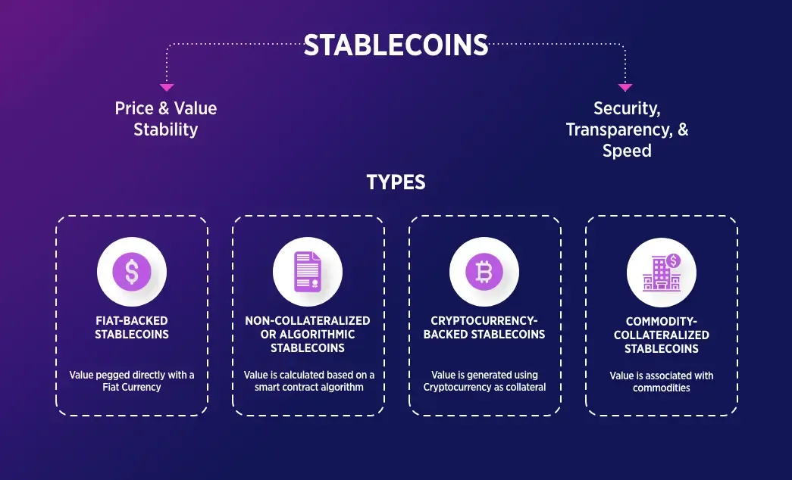

## Table of Contents

## What is a stablecoin?

A stablecoin is a type of cryptocurrency that is designed to keep a steady value. Unlike other cryptocurrencies like Bitcoin, which can have big price swings, stablecoins try to stay the same price. They do this by being tied to something else that is stable, like the US dollar or gold. This makes them useful for people who want to use cryptocurrency without worrying about losing money because of price changes.

Stablecoins work by holding reserves of the thing they are tied to. For example, if a stablecoin is tied to the US dollar, the people who made the stablecoin will keep actual US dollars in a bank. This way, they can promise that each stablecoin can be traded for a real US dollar. This makes people trust the stablecoin more because they know it has real value backing it up. Stablecoins are often used for buying things online, moving money between countries, or as a safe place to keep money in the world of cryptocurrencies.

## Why were stablecoins created?

Stablecoins were created to solve some of the big problems people had with other cryptocurrencies like Bitcoin. One big problem with cryptocurrencies is that their prices can go up and down a lot. This makes it hard for people to use them to buy things or save money because they might lose value quickly. Stablecoins were made to fix this by keeping a steady value, so people could use them without worrying about sudden price changes.

Another reason stablecoins were created is to make it easier to move money around the world. Traditional ways of sending money across countries can be slow and expensive. Stablecoins can be sent quickly and cheaply because they use the internet. By being tied to stable things like the US dollar, they also give people a way to keep their money safe in countries where the local money might lose value. This makes stablecoins useful for people who need to send money home or protect their savings.

## What are the main types of stablecoins?

There are three main types of stablecoins: fiat-collateralized, crypto-collateralized, and algorithmic stablecoins. Fiat-collateralized stablecoins are the most common type. They are backed by real money like the US dollar. For example, if you have a stablecoin that is backed by the US dollar, the people who made the stablecoin keep real US dollars in a bank. This way, they can promise that each stablecoin can be traded for a real US dollar.

Crypto-collateralized stablecoins are backed by other cryptocurrencies instead of real money. These stablecoins use other cryptocurrencies like Ethereum as their backing. Because cryptocurrencies can go up and down a lot in price, these stablecoins often need more crypto backing them to make sure they stay stable. The last type is algorithmic stablecoins. These stablecoins don't use any real money or other cryptocurrencies to back them up. Instead, they use special computer programs, or algorithms, to control the supply of the stablecoin and keep its price steady. This can be tricky and sometimes doesn't work as well as the other types.

## How do fiat-collateralized stablecoins work?

Fiat-collateralized stablecoins are a type of cryptocurrency that is backed by real money, like the US dollar. When people make these stablecoins, they keep real money in a bank to match the amount of stablecoins they create. For example, if they create 100 stablecoins, they keep $100 in a bank. This way, they can promise that each stablecoin can be traded for a real US dollar. This makes people trust the stablecoin because they know it has real value backing it up.

These stablecoins are useful for people who want to use cryptocurrency without worrying about big price changes. Because they are tied to real money, their value stays steady. This makes them good for buying things online, sending money to other countries, or keeping money safe in the world of cryptocurrencies. People can trade these stablecoins back and forth for real money easily, which makes them a handy tool for many different uses.

## What are the advantages of crypto-collateralized stablecoins?

Crypto-collateralized stablecoins have some good things about them. One big advantage is that they don't need real money like the US dollar to back them up. Instead, they use other cryptocurrencies, like Ethereum. This means the people who make these stablecoins don't have to deal with banks and all the rules that come with real money. It can be easier and faster to create and manage these stablecoins because they work completely on the internet.

Another advantage is that crypto-collateralized stablecoins can be more open and clear to everyone. Because they are based on blockchain technology, all the information about them is out there for anyone to see. This can make people trust them more because they can check everything themselves. Also, these stablecoins can be used in the world of decentralized finance, or DeFi, where people can lend, borrow, and do other financial things without banks. This opens up new ways for people to use their money and can be very helpful for those who don't have easy access to traditional banking.

## Can you explain how algorithmic stablecoins maintain their peg?

Algorithmic stablecoins try to keep their value steady by using special computer programs, or algorithms. These algorithms change how many stablecoins are out there to make sure the price stays the same. If the price of the stablecoin goes up too much, the algorithm might make more stablecoins to bring the price down. If the price goes down too much, the algorithm might take some stablecoins away to make the price go back up. This is different from other stablecoins that use real money or other cryptocurrencies to back them up.

This way of keeping the value steady can be tricky. Sometimes it works well, but other times it can fail if too many people try to trade their stablecoins at the same time. When that happens, the price can get out of control, and the stablecoin might not be stable anymore. But when it works right, algorithmic stablecoins can be a good choice because they don't need any real money or other cryptocurrencies to back them up. They just need the right computer program to do the job.

## What are some popular stablecoins and their underlying mechanisms?

Tether (USDT) is one of the most popular stablecoins out there. It's a fiat-collateralized stablecoin, which means it's backed by real money, like the US dollar. The people who made Tether say they keep real dollars in a bank to match the number of USDT they create. This way, they can promise that each USDT can be traded for a real dollar. People use Tether a lot because it's easy to trade and it helps them avoid the big price swings of other cryptocurrencies.

Another well-known stablecoin is DAI, which is a crypto-collateralized stablecoin. DAI uses other cryptocurrencies, like Ethereum, to back it up. To make sure DAI stays stable, the people who made it use something called a smart contract. This is a special computer program that keeps track of how much Ethereum is backing each DAI. If the price of DAI starts to change too much, the smart contract can make changes to keep it stable. DAI is popular in the world of decentralized finance, or DeFi, where people can do things like lend and borrow without using banks.

Lastly, there's TerraUSD (UST), which is an algorithmic stablecoin. UST doesn't use real money or other cryptocurrencies to back it up. Instead, it uses a special computer program to control how many UST are out there. If the price of UST goes up too much, the program makes more UST to bring the price down. If the price goes down too much, the program takes some UST away to make the price go back up. This way of keeping the price steady can be tricky, but when it works right, it's a cool way to have a stablecoin without needing any real money or other cryptocurrencies to back it up.

## What are the risks associated with stablecoins?

Stablecoins can be risky because they might not always stay stable. If a lot of people want to trade their stablecoins for real money at the same time, the people who made the stablecoin might not have enough real money to give everyone. This can make the price of the stablecoin go down a lot, and people can lose money. Also, if the stablecoin is backed by other cryptocurrencies, those cryptocurrencies can go up and down a lot in price. This can make it hard to keep the stablecoin's price steady.

Another risk is that the people who made the stablecoin might not be honest. They might say they have real money or other cryptocurrencies backing up the stablecoin, but they might not. If people find out, they might try to trade their stablecoins for real money all at once, which can cause big problems. Also, the rules about stablecoins can change, and this can make it hard for people to use them or trust them. So, even though stablecoins are meant to be safe, there are still things that can go wrong.

## How do stablecoins impact the broader cryptocurrency market?

Stablecoins have a big effect on the whole world of cryptocurrencies. They make it easier for people to use cryptocurrencies without worrying about big price changes. Because stablecoins are tied to things like the US dollar, they can be used to buy things online or send money to other countries without the risk of losing value quickly. This makes more people want to use cryptocurrencies, which can help the whole market grow. Also, stablecoins are often used in something called decentralized finance, or DeFi, where people can do things like lend and borrow money without using banks. This opens up new ways for people to use their money and can make the cryptocurrency market more exciting and useful.

But stablecoins can also bring some problems to the cryptocurrency market. If a lot of people try to trade their stablecoins for real money at the same time, it can cause big price changes and make people lose trust in cryptocurrencies. Also, if the people who made the stablecoin are not honest about what's backing it up, it can cause big problems for the whole market. So, while stablecoins can help the cryptocurrency market grow, they can also make it more risky. It's important for people to understand these risks and be careful when using stablecoins.

## What role do stablecoins play in decentralized finance (DeFi)?

Stablecoins are really important in the world of decentralized finance, or DeFi. DeFi is all about doing financial things like lending and borrowing without using banks. Stablecoins make this easier because they keep a steady value. This means people can use them to do things in DeFi without worrying about losing money because of big price changes. For example, if someone wants to lend money in DeFi, they can use stablecoins to do it safely. This makes more people want to use DeFi, which helps it grow and become more popular.

But stablecoins can also bring some problems to DeFi. If a lot of people try to trade their stablecoins for real money at the same time, it can cause big price changes. This can make people lose trust in DeFi and stop using it. Also, if the people who made the stablecoin are not honest about what's backing it up, it can cause big problems for the whole DeFi world. So, while stablecoins help DeFi grow, they can also make it more risky. It's important for people to understand these risks and be careful when using stablecoins in DeFi.

## How are stablecoins regulated around the world?

Stablecoins are treated differently in different countries because the rules about them are not the same everywhere. In the United States, stablecoins are watched closely by groups like the Securities and Exchange Commission (SEC) and the Commodity Futures Trading Commission (CFTC). These groups want to make sure that stablecoins are safe and that the people who make them are honest about what's backing them up. In Europe, the rules are still being worked out, but the European Union is trying to make new laws to keep stablecoins safe and fair for everyone.

In other parts of the world, the rules can be very different. Some countries, like China, have strict rules and might not let people use stablecoins at all. Other countries, like Singapore, are trying to make rules that help stablecoins grow safely. Because the rules are different everywhere, it can be hard for people to use stablecoins in the same way all over the world. This means that people need to be careful and understand the rules in their own country before they start using stablecoins.

## What future developments can we expect in the stablecoin space?

In the future, we might see more stablecoins that are backed by different things, not just the US dollar or other cryptocurrencies. People might start using stablecoins that are tied to things like gold or even baskets of different currencies. This could make stablecoins more useful for more people around the world. Also, the technology behind stablecoins might get better, making them even safer and easier to use. For example, new ways of keeping stablecoins stable might be invented, like better algorithms or new ways of using real money to back them up.

Another big change we might see is more rules about stablecoins. Governments and other groups might make new laws to make sure stablecoins are safe and fair for everyone. This could help more people trust stablecoins and use them more often. But it could also make it harder for new stablecoins to start up. Overall, the world of stablecoins is likely to keep growing and changing, with new ideas and rules coming all the time.

## References & Further Reading

[1]: Bullmann, D., Klemm, J., & Pinna, A. (2019). ["In search for stability in crypto-assets: Are stablecoins the solution?"](https://papers.ssrn.com/sol3/papers.cfm?abstract_id=3444847) European Central Bank Occasional Paper Series, No 230.

[2]: Moin, Z. (2020). ["The Risk and Stability of Stablecoins"](https://www.bis.org/publ/work905.htm) Proceedings of the First ACM International Conference on AI in Finance.

[3]: Amsden, R., & Arner, D. W. (2020). ["Central Bank Digital Currencies: Stability and Innovation"](https://papers.ssrn.com/sol3/papers.cfm?abstract_id=2676553) Bank for International Settlements, FSI Insights on policy implementation 27.

[4]: ["The Law of Stablecoins"](https://www.investopedia.com/terms/s/stablecoin.asp) by Gün Sirer, Emin, Gunther, & Jorge, Carnegie Mellon University Libraries, published as part of the Legal Aspects of Financial Services Reform Symposium materials.

[5]: Lyons, R. K., & Viswanath-Natraj, G. (2020). ["What Keeps Stablecoins Stable?"](https://www.nber.org/system/files/working_papers/w27136/w27136.pdf) Becker Friedman Institute for Economics Working Paper No. 2020-30.