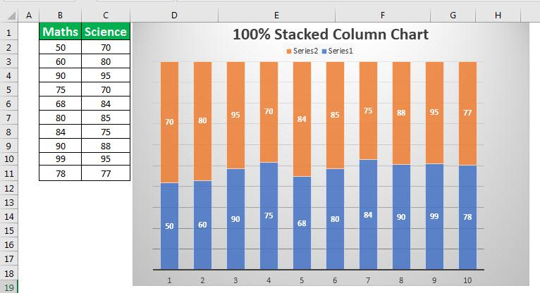

In the fast-paced world of algorithmic trading, the ability to effectively analyze and interpret market data is crucial. As financial markets evolve and become more complex, identifying key factors that influence trading decisions becomes essential for developing and maintaining competitive trading strategies. Feature importance analysis is central to this process, helping traders and data scientists determine which variables significantly impact a model’s predictions and therefore should be prioritized in strategy development.

Traditional feature importance methods, such as Mean Decrease Impurity (MDI) and Mean Decrease Accuracy (MDA), have long been used to rank features in models, offering insights into variable relevance. However, these methods sometimes fall short when faced with the noise and complexity of trading data. This is where stacked feature importance methods come into play, providing a more robust and nuanced approach to evaluating features.

Stacked feature importance methods enhance the analysis by aggregating information across multiple datasets or trading instruments, an approach that allows for a comprehensive evaluation of variable significance. This aggregation can shed light on universally important features, which may hold their importance across different market conditions and datasets, thereby offering a consistent edge in trading model development.

This article explores the concept of stacked feature importance, highlighting its advantages over traditional methods, the challenges involved in its implementation, and its practical applications in algorithmic trading. By providing a deeper understanding of feature interactions and market dynamics, stacked feature importance methods help traders improve prediction accuracy and resilience in trading strategies, ultimately leading to better risk management and performance in dynamic trading environments.

## Table of Contents

## Understanding Feature Importance

Feature importance is a critical metric in the evaluation of predictive models, reflecting the influence each feature has on the model's predictions. In essence, it helps to identify which variables are most impactful in determining the outcomes of a model. This information is essential for improving model performance and ensuring effective risk management in [algorithmic trading](/wiki/algorithmic-trading).

In algorithmic trading, feature importance serves a pivotal role by optimizing trading models and minimizing risk exposure. By understanding which features significantly affect model predictions, traders can refine their models to enhance decision-making and develop robust strategies. This capability is particularly crucial given the rapid and unpredictable nature of financial markets.

There are several common methods used to assess feature importance:

1. **Mean Decrease Impurity (MDI):** MDI is a technique applied primarily in decision tree-based models like Random Forests. It measures the importance of a feature by calculating the total reduction of the criterion brought by that feature. Features that lead to a larger decrease in node impurity are considered more important. MDI offers insights into feature relevance but can be biased towards features with more categories or higher cardinality.

2. **Mean Decrease Accuracy (MDA):** This approach evaluates feature importance by gauging the change in model accuracy when the values of a specific feature are permuted. When the feature values are shuffled, the drop in accuracy indicates the feature's importance. MDA is widely used for its intuitive understanding and applicability across various model types, although it can be computationally intensive.

3. **Single Feature Importance (SFI):** SFI assesses the predictive power of each feature individually by examining the model's performance when trained solely on that feature. While straightforward, this method may overlook interactions between features and potential multicollinearity issues, which are often present in complex trading models.

Overall, understanding feature importance is integral to the development and optimization of trading models. It allows traders to identify the most influential factors, guide strategy adjustments, and manage risks effectively.

## The Limitations of Traditional Feature Importance

Traditional feature importance methods, while fundamentally valuable, exhibit limitations when applied to algorithmic trading due to inherent market complexities such as noise and the risk of overfitting. These methods, such as Mean Decrease Impurity (MDI) and Mean Decrease Accuracy (MDA), often rely on the evaluation of individual assets, which may neglect the extensive interdependencies and dynamic shifts characteristic of financial markets.

1. **Noise Sensitivity and Overfitting**: Algorithmic trading models are typically trained on historical data, which can include significant amounts of noise—random fluctuations that do not correspond to genuine market trends. Traditional feature importance methods can misinterpret these noise elements as important features, leading to model decisions that are not robust under unseen market conditions. Overfitting occurs when a model learns to perform well on its training data but poorly on new, unseen data, largely because it has tuned itself to the noise rather than the signal. These issues can lead to unreliable trading decisions that fail to generalize over time or across different market scenarios.

2. **Limited Scope of Analysis**: Traditional methods often focus on single asset analysis, limiting their capability to account for broader market interactions or regime shifts. Markets can undergo structural changes—known as regime shifts—where relationships between assets and features change over time. An analysis constrained to a single asset might not readily capture these broader economic dynamics, potentially resulting in incomplete or misleading feature importance evaluations.

3. **Broad Analysis Scope with Stacked Feature Importance**: Stacked feature importance addresses some limitations by considering the aggregated impact of features across multiple datasets or trading instruments. This broader analysis helps identify features that consistently affect outcomes across different market conditions, enhancing the robustness of trading strategies. By shifting focus from isolated asset evaluation to comprehensive feature assessment, this method can mitigate risks associated with traditional analysis approaches while providing more reliable insights into feature significance.

Traditional methods often struggle with the complex, noisy, and dynamic nature of financial markets. Stacked feature importance provides a more encompassing framework, enabling deeper insights and more resilient trading strategies.

## Concept of Stacked Feature Importance

Stacked feature importance is a technique used to enhance the evaluation of feature contributions by aggregating feature importance scores from multiple datasets or trading instruments. This approach is particularly useful in contexts where trading systems are exposed to diverse and dynamic market environments. By synthesizing insights from various data sources, stacked feature importance aims to deliver a comprehensive understanding of how features influence predictive models across multiple scenarios.

The core idea behind stacked feature importance lies in its aggregation strategy. Instead of relying solely on feature importance scores derived from a single dataset, this method combines feature scores obtained from several datasets. This aggregated perspective helps in mitigating the idiosyncratic noise and biases inherent in any single dataset. Consequently, it enhances the robustness of the feature importance evaluation by considering a wider set of trading conditions.

Mathematically, given $D_1, D_2, \ldots, D_n$ as different datasets or trading instruments, the stacked feature importance for a feature $f$ can be expressed as an aggregation function $A$ over the individual feature importance scores $I(f, D_i)$ for each dataset $D_i$:

$$
S(f) = A(I(f, D_1), I(f, D_2), \ldots, I(f, D_n))
$$

Here, the aggregation function $A$ could be a simple average, a weighted average, or any other suitable method that captures the combined influence of the feature across all datasets.

One of the primary benefits of this approach is its capability to identify features that are consistently influential across different market conditions. By doing so, it provides a more holistic view of feature significance, enabling the identification of universally important features which can be critical for developing robust trading strategies.

Furthermore, stacking features from multiple datasets assists in reducing overfitting. In traditional models, focusing on a single dataset may lead to models that are too finely tuned to specific conditions, creating issues when faced with unseen data. Stacked feature importance, by spreading the evaluation across diverse datasets, helps in creating models that generalize better to new market conditions. This broader analysis scope reduces the likelihood that a model will pick up irrelevant patterns unique to a particular dataset.

In summary, stacked feature importance is a powerful scalable approach that enhances the feature evaluation process in trading. By integrating multiple datasets, it offers a panoramic view of feature relevance, aligns prediction models more closely with real-world market complexities, and supports the creation of more resilient and adaptive trading systems.

## Advantages of Stacked Feature Importance

Stacked feature importance methods significantly enhance the robustness of model analysis by mitigating the risk of overfitting that often accompanies isolated feature evaluation. Overfitting occurs when a model learns not only the underlying patterns but also the noise within a dataset, leading to poor generalization to new data. By integrating feature importance scores from multiple datasets or trading instruments, stacked feature importance offers a comprehensive assessment that generalizes more effectively across varied market conditions. This broader analytical scope reduces the likelihood of emphasizing features that are only incidentally significant within a specific dataset, rather than genuinely influential across a spectrum of trading environments.

The approach also promotes a better understanding of feature interactions across different trading environments. Markets are dynamic and influenced by an array of interacting factors, each of which may behave differently depending on context. By aggregating feature importance from diverse datasets, stacked feature importance helps to identify which variables consistently play pivotal roles, thus enabling traders to gain insights into the interconnected nature of market drivers. This holistic analysis is crucial for capturing the underlying economic relations and behavioral patterns in trading data.

Moreover, stacked feature importance facilitates the development of stronger predictive models by integrating diverse market data. Diverse datasets can capture various market states, regimes, and anomalies, providing a rich tapestry of information that strengthens the predictive power of trading algorithms. This integration not only enhances model accuracy but also improves resilience against unexpected market shifts by incorporating signals from a wide array of sources. The aggregation of these signals leads to improved decision-making processes and optimized trading strategies that are more adaptable to different market scenarios.

Through these enhancements, stacked feature importance is not only a tool for robust model optimization but also a strategic advantage in crafting reliable and effective trading strategies. Additionally, the technological advancements and increasing computational capacities will likely continue to propel the effectiveness of stacked feature importance in future financial applications.

## Challenges in Implementing Stacked Feature Importance

Implementing stacked feature importance in algorithmic trading presents several challenges that require careful consideration. One primary difficulty is the complexity involved in data integration from diverse sources and instruments. Financial markets operate with multiple asset classes, each producing different types of data, such as prices, volumes, and economic indicators. Synthesizing these disparate streams into a coherent analytical framework necessitates a comprehensive understanding of data structures and interdependencies. This task is further complicated by the need to align data temporally and normalize it across different scales and frequencies. 

The computational demands of stacked feature importance analyses can be substantial due to the sheer [volume](/wiki/volume-trading-strategy) of data involved. Trading datasets are often extensive, encompassing historical prices down to the millisecond and comprising numerous variables. When aggregating feature importance across various datasets, the computational load can increase exponentially. The complexity also rises with the need to handle large matrices and perform sophisticated [machine learning](/wiki/machine-learning) computations. Efficient processing strategies, such as parallel computing or leveraging cloud-based platforms, become essential to manage these demands.

Moreover, the implementation of stacked feature importance requires sophisticated tools and frameworks capable of handling complex data sets and performing advanced analyses. Traditional statistical tools may fall short when tasked with processing the high-dimensional data typical of financial markets. Thus, specialized software frameworks and programming libraries—such as TensorFlow, PyTorch, or scikit-learn in Python—become necessary to develop and deploy models effectively. These tools must be complemented by domain expertise to correctly interpret the results and make informed decisions based on the insights gained from stacked feature importance analyses.

In conclusion, while stacked feature importance offers significant advantages in understanding market dynamics and improving predictive models, its implementation is fraught with challenges. Overcoming these challenges requires a combination of technological prowess, domain knowledge, and strategic planning to ensure that the insights generated are both accurate and applicable.

## Application in Algorithmic Trading

In algorithmic trading, stacked feature importance serves as a critical tool in refining and optimizing the development of trading strategies. By leveraging aggregated feature scores from multiple datasets or trading instruments, this methodology significantly enhances the adaptability of trading strategies to evolving market conditions.

### Robust Trading Strategy Development

Stacked feature importance aids in crafting robust trading strategies by illuminating which features consistently hold predictive power across different market scenarios. For example, by identifying attributes that persist in importance over various market shifts, traders can develop strategies that are inherently more resilient to noise and temporal changes in market data. This resilience is vital in maintaining competitive advantage and achieving long-term trading success.

### Feature Re-engineering

The process of feature re-engineering is central to maintaining the efficacy of trading models. Stacked feature importance contributes by revealing features that may have degraded in performance over time. For instance, a feature deemed important in one market regime might become less relevant as market dynamics change. By consistently analyzing feature importance across varied datasets, traders can pinpoint outdated or ineffective features, prompting timely adjustments to the model inputs.

### Utilization of Ensemble Methods

Stacked feature importance also complements ensemble methods, which aggregate predictions from a set of models to enhance overall prediction accuracy and robustness. Ensemble techniques like Random Forest or Gradient Boosting benefit from feature importance insights by enabling a more informed combination of models. These methods, therefore, allow traders to diversify predictions and manage risk more effectively. The approach ensures that no singular model's bias or variance excessively influences the trading strategy.

Incorporating stacked feature importance within algorithmic trading frameworks can refine the systematic processes through which features are evaluated and strategies are devised. This applied knowledge directly translates to stronger, more adaptable trading models, enhancing both predictive accuracies and risk management capacities. As algorithmic trading continues to evolve, the strategic use of stacked feature importance is likely to yield even greater optimization and alignment with complex market dynamics.

## Conclusion

Stacked feature importance offers a strategic advantage in the automated trading field by providing a comprehensive analysis framework that enhances both prediction accuracy and strategy resilience. This methodology aggregates feature scores across diverse datasets or trading instruments, enabling traders to gain a nuanced understanding of how different features interact and influence market dynamics. By considering the holistic impact of features in various market conditions, stacked feature importance helps identify universally relevant features, aiding in the development of robust trading models.

The adoption of stacked feature importance allows traders to adapt to fluctuating market environments, reducing the risks associated with overfitting. This adaptability ensures that trading strategies remain effective even as market regimes shift. Moreover, the use of stacked feature importance can facilitate feature re-engineering, wherein outdated or less effective features are identified and replaced, maintaining the relevancy of predictive models.

Future advancements in stacked feature importance promise further integration and efficiency. Enhanced computational tools and frameworks are expected to manage the increased complexity and demands of integrating diverse datasets, making the process more accessible and computationally feasible. These advancements could lead to more sophisticated models that better capture the intricate interactions of market factors, ultimately supporting traders in making more informed decisions. As the trading landscape continues to evolve, the strategic implementation of stacked feature importance will likely become increasingly vital in achieving sustained trading success.

## References & Further Reading

[1]: Bergstra, J., Bardenet, R., Bengio, Y., & Kégl, B. (2011). ["Algorithms for Hyper-Parameter Optimization."](https://papers.nips.cc/paper/4443-algorithms-for-hyper-parameter-optimization) Advances in Neural Information Processing Systems 24.

[2]: ["Advances in Financial Machine Learning"](https://www.amazon.com/Advances-Financial-Machine-Learning-Marcos/dp/1119482089) by Marcos Lopez de Prado

[3]: ["Evidence-Based Technical Analysis: Applying the Scientific Method and Statistical Inference to Trading Signals"](https://www.amazon.com/Evidence-Based-Technical-Analysis-Scientific-Statistical/dp/0470008741) by David Aronson

[4]: ["Machine Learning for Algorithmic Trading"](https://github.com/PacktPublishing/Machine-Learning-for-Algorithmic-Trading-Second-Edition) by Stefan Jansen

[5]: ["Quantitative Trading: How to Build Your Own Algorithmic Trading Business"](https://books.google.com/books/about/Quantitative_Trading.html?id=j70yEAAAQBAJ) by Ernest P. Chan

[6]: Breiman, L. (2001). ["Random Forests"](https://link.springer.com/article/10.1023/A:1010933404324). Machine Learning, 45(1), 5-32.

[7]: Pedregosa, F., Varoquaux, G., Gramfort, A., et al. (2011). ["Scikit-learn: Machine Learning in Python."](https://arxiv.org/abs/1201.0490) Journal of Machine Learning Research, 12, 2825-2830.