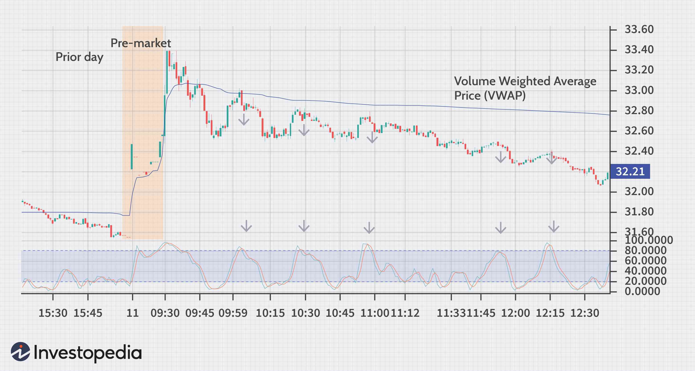

In today's rapidly evolving financial landscape, investment strategies are becoming more sophisticated and dynamic. Among these strategies, algorithmic trading has emerged as a significant player, particularly for short-term traders known as stags. Stag trading involves speculating on short-term market movements to make quick profits, a method increasingly bolstered by advanced technological systems. Algorithmic trading, which employs computer programs to execute trades based on predetermined criteria, has become a key component in optimizing these trading strategies. By leveraging the speed and efficiency of these algorithms, stags are able to make rapid decisions, often capitalizing on minute price fluctuations that might be missed by traditional traders.

Algorithmic systems use mathematical models and complex calculations to exploit these brief market inefficiencies. For instance, trend-following and breakout strategies are common among stags. The ability to process large data volumes quickly and identify profitable trading opportunities in real-time has revolutionized the trading landscape. As a result, algorithmic strategies are a pivotal element for investors seeking to enhance their trading tactics and capitalize on market opportunities effectively.



Understanding stag trading and its integration with algorithmic systems is crucial for investors who aim to navigate the swift and often unpredictable nature of financial markets. This fusion of traditional trading strategies with modern technology not only provides a competitive edge but also opens avenues for more consistent and profitable trading outcomes.

## Table of Contents

## Understanding Stag Trading in Financial Markets

Stag trading represents a specific methodology within financial markets, focused on the execution of trades to capitalize on short-term market fluctuations for quick profits. These traders, commonly known as day traders, are distinguished by their propensity to capitalize on small price changes by rapidly entering and exiting positions throughout the trading day.

Stag traders differ from the more traditional 'bulls' and 'bears', who typically hold longer-term perspectives based on rising or falling markets, respectively. Instead, stags are primarily concerned with the immediate and short-term direction of market prices. This focus requires a keen understanding of market psychology and the ability to quickly interpret data and market signals to make profitable trading decisions.

Stag trading demands a high level of discipline and knowledge of various financial instruments. Traders typically utilize technical analysis, relying on price charts, market volume, and other indicators to predict the next market move. Given the rapid buying and selling involved, stag trading usually incurs higher transaction costs, which traders must [factor](/wiki/factor-investing) into their profit calculations.

Characteristically, stag traders are adept at managing risk and are prepared for the high-stakes nature of their endeavors. They operate in diverse markets, including equities, [forex](/wiki/forex-system), and commodities, constantly monitoring news and economic reports that could influence market sentiment and lead to [volatility](/wiki/volatility-trading-strategies).

To illustrate, consider a Python implementation of a basic trading algorithm used by stags to spot short-term trends on stock prices:

```python
import numpy as np
import pandas as pd
import matplotlib.pyplot as plt

# Sample price data
data = {'Date': pd.date_range(start='1/1/2022', periods=100),
        'Price': np.random.rand(100).cumsum()}
df = pd.DataFrame(data)

# Calculate short-term moving average
df['Short_MA'] = df['Price'].rolling(window=5).mean()

# Identify points where the price crosses the moving average
df['Signal'] = np.where(df['Price'] > df['Short_MA'], 1, 0)
df['Position'] = df['Signal'].diff()

# Visualize the data
plt.figure(figsize=(12, 6))
plt.plot(df['Date'], df['Price'], label='Price')
plt.plot(df['Date'], df['Short_MA'], label='Short-term MA', alpha=0.7)
plt.scatter(df[df['Position'] == 1]['Date'], df[df['Position'] == 1]['Price'], marker='^', color='g', label='Buy Signal', alpha=1)
plt.scatter(df[df['Position'] == -1]['Date'], df[df['Position'] == -1]['Price'], marker='v', color='r', label='Sell Signal', alpha=1)
plt.legend()
plt.show()
```

This example demonstrates how a straightforward moving average crossover strategy could be utilized by stag traders to generate buy and sell signals. The strategy involves buying a stock when its price crosses above a moving average or selling when it crosses below, showcasing how stags thrive on immediate price movements.

Overall, the success of stag trading hinges on a trader's ability to adapt to rapidly changing market conditions, exercise discipline, and understand the intricate dynamics of short-term supply and demand.

## Algorithmic Trading: A Modern Approach for Stags

Algorithmic trading, commonly referred to as algo trading, utilizes computer algorithms to automate the execution of trades based on specific, pre-defined criteria. This approach has significantly transformed stag trading by offering remarkable speed and efficiency, as well as the capacity to process vast amounts of market data. For stags—traders who focus on short-term market movements—[algorithmic trading](/wiki/algorithmic-trading) is an invaluable tool that enhances their ability to swiftly capitalize on fleeting opportunities.

One of the primary advantages of algorithmic trading for stags is its ability to perform trades at speeds that are impossible for human traders. Automated systems swiftly analyze market conditions and execute trades at the best possible prices, minimizing the potential for human error and emotional decision-making. This precision is especially beneficial for short-term strategies which rely on capturing small price movements within brief time windows.

Moreover, algorithmic trading offers enhanced data processing capabilities. Modern financial markets generate an immense [volume](/wiki/volume-trading-strategy) of data every second, far beyond what a human could analyze efficiently. Algorithms, however, can sift through this data rapidly, identifying patterns, trends, and anomalies. For instance, trend-following strategies, which aim to capitalize on [momentum](/wiki/momentum) within the market, benefit greatly from algorithmic systems that can detect and react to trends in real time. Similarly, [breakout](/wiki/breakout-trading) strategies, which involve entering a position just as a security price breaks through a defined resistance or support level, are executed with precision through algorithms programmed to monitor these levels closely.

Python is often the language of choice for implementing algorithmic trading strategies due to its simplicity and rich ecosystem of financial libraries. Here's a simple example of how a basic trend-following algorithm might be implemented:

```python
import pandas as pd
import numpy as np

# Example of a simple moving average crossover strategy
def moving_average_crossover_strategy(data, short_window=40, long_window=100):
    signals = pd.DataFrame(index=data.index)
    signals['price'] = data['price']

    # Calculate the short and long moving averages
    signals['short_mavg'] = data['price'].rolling(window=short_window, min_periods=1).mean()
    signals['long_mavg'] = data['price'].rolling(window=long_window, min_periods=1).mean()

    # Create signals
    signals['signal'] = 0.0
    signals['signal'][short_window:] = np.where(signals['short_mavg'][short_window:] > signals['long_mavg'][short_window:], 1.0, 0.0)   

    # Generate trading orders
    signals['positions'] = signals['signal'].diff()

    return signals

# Assuming 'data' is a DataFrame with a datetime index and a 'price' column
```

The algorithm above uses a moving average crossover strategy, where a short-term moving average crossing above a long-term moving average generates a buy signal. This decision process, done manually, could be far slower, leading to less favorable trade execution.

Algorithmic trading also supports risk management, a crucial element in trading. By using algorithms, traders can enforce strict risk parameters, such as stop-loss or take-profit orders, which are crucial for limiting potential losses.

Overall, the integration of algorithmic trading into stag strategies allows for a systematic, disciplined approach to trading that enhances the probability of success by leveraging speed, precision, and data processing capabilities. This modern technological advancement equips stag traders with the tools necessary to thrive in the high-paced environment of contemporary financial markets.

## Strategies Employed by Stags Using Algo Trading

Stags employ various strategies to exploit short-term market movements, leveraging algorithmic trading to enhance the execution of these strategies. Three predominant strategies include [trend following](/wiki/trend-following), gap trading, and mean reversion. Each offers unique opportunities for generating profits, which are enhanced by the precision and speed of an algorithmic approach.

### Trend Following

Trend following is a technique whereby traders aim to capitalize on the momentum of a market by identifying and following prevailing price trends. Algorithms are particularly effective for this strategy as they can quickly process vast amounts of market data to detect subtle price patterns or trends. This method often involves using technical indicators such as moving averages or the Relative Strength Index (RSI) to automate decision-making. 

A basic moving average (MA) crossover strategy may involve an algorithm executing a buy order when a short-term moving average crosses above a long-term moving average, and a sell order when the reverse occurs. In Python, this can be implemented using:

```python
import pandas as pd

def moving_average_crossover(prices, short_window, long_window):
    signals = pd.DataFrame(index=prices.index)
    signals['short_mavg'] = prices.rolling(window=short_window, min_periods=1).mean()
    signals['long_mavg'] = prices.rolling(window=long_window, min_periods=1).mean()

    signals['signal'] = 0.0
    signals['signal'][short_window:] = np.where(signals['short_mavg'][short_window:] > signals['long_mavg'][short_window:], 1.0, 0.0)

    signals['positions'] = signals['signal'].diff()
    return signals
```

### Gap Trading

Gap trading involves capitalizing on abrupt price changes or 'gaps' in the market, often observed between a security's closing and opening price. Algorithms can execute trades at high speeds to exploit these gaps before they close. A gap might indicate that a significant event occurred outside market hours, which stags can leverage by setting predefined criteria to predict and react to these scenarios.

An example algorithm could involve setting entry points at a percentage gap threshold and employing stop-loss orders to manage risk.

### Mean Reversion

Mean reversion strategies are based on the assumption that asset prices will return to their average level over time. Stags use this approach to identify securities that have deviated significantly from their historical average price and bet on the correction. By automating these processes, algorithms can efficiently track numerous securities and compute deviations from moving averages.

This strategy might utilize z-scores to determine the extent of deviation. Using Python, mean reversion can be modeled as follows:

```python
def mean_reversion_strategy(prices, lookback_period, entry_threshold, exit_threshold):
    mean_price = prices.rolling(window=lookback_period).mean()
    std_price = prices.rolling(window=lookback_period).std()

    z_score = (prices - mean_price) / std_price

    signals = pd.DataFrame(index=prices.index)
    signals['signal'] = 0
    signals['signal'][z_score > entry_threshold] = -1
    signals['signal'][z_score < -entry_threshold] = 1
    signals['positions'] = signals['signal'].diff()

    return signals
```

### Execution and Automation

Algorithms streamline these strategies by ensuring consistent execution of trade signals, reducing human error, and enabling traders to react almost instantaneously to market changes. This automation not only saves time but also increases trading volumes and enhances [liquidity](/wiki/liquidity-risk-premium) in the market, further benefiting stag traders. The ability to backtest strategies and continuously adapt parameters based on historical data and current market conditions adds another layer of precision and optimization, crucial for successful short-term trading.

## Challenges and Considerations in Stag Algorithmic Trading

Algorithmic trading has revolutionized the financial markets by providing traders with the tools needed to execute trades with speed and precision. However, this technological advancement also brings a unique set of challenges, especially for stag traders who focus on short-term gains. One of the primary challenges is market volatility, a double-edged sword that can amplify both profits and losses swiftly. The rapid fluctuations in asset prices require stag traders to develop robust algorithms capable of reacting to these changes in milliseconds. Failure to do so can lead to significant financial setbacks.

Additionally, the capital requirement for effective algorithmic trading can be substantial. Algo trading systems often demand significant initial investments in technology and data acquisition. High-frequency trading costs, including co-location services for minimal latency and sophisticated software for real-time data analysis, can escalate quickly. Stags, therefore, need to ensure they have adequate capital to sustain their operations, particularly during periods of high volatility and low liquidity, which may cause slippage and increased transaction costs.

Risk management is another critical consideration. Stags must devise strategies to mitigate risks associated with technical failures, such as software bugs or hardware malfunctions, which could lead to unintended trades. Implementing stop-loss limits and stress-testing algorithms against historical market data can help in reducing unforeseen risks. Further, stags should be wary of overfitting their models to past data, which could result in poor performance when faced with new market conditions. An overfitted model typically performs well on historical data but poorly during live trading.

Python, a popular language for algorithmic trading, offers libraries like `pandas` for data manipulation and `numpy` for numerical computations. For instance, a simple moving average (SMA) strategy can be coded as follows:

```python
import pandas as pd

# Load market data
data = pd.read_csv('market_data.csv')

# Calculate SMA
data['SMA'] = data['Close'].rolling(window=20).mean()

# Generate trading signals
data['Signal'] = 0  # Default: 0 no position
data['Signal'][20:] = np.where(data['Close'][20:] > data['SMA'][20:], 1, -1)

# Calculate returns
data['Returns'] = data['Signal'].shift(1) * (data['Close'].pct_change())

# Evaluate strategy performance
total_return = data['Returns'].sum()
print(f"Total Return from the Strategy: {total_return:.2f}%")
```

Beyond technical considerations, stag traders must be aware of regulatory environments that govern algorithmic trading practices. Different jurisdictions have distinct regulations regarding market manipulation and algorithm testing, which require traders to remain informed and compliant to avoid legal repercussions.

Effectively addressing these challenges involves ongoing education, continuous testing and optimizing of algorithms, and staying informed about current market conditions and technological advancements. By taking these measures, stag traders can better manage the inherent risks of algorithmic trading and improve their chances of achieving sustained success in volatile markets.

## The Future of Stag Trading and Algorithmic Strategies

Algorithmic trading is poised for significant transformation as technological advancements continue to reshape financial markets. One of the pivotal drivers of this evolution is the integration of [artificial intelligence](/wiki/ai-artificial-intelligence) (AI) and [machine learning](/wiki/machine-learning) (ML) into trading strategies. These technologies bring the capability of processing vast quantities of market data in real-time, identifying patterns, and making predictions with a level of precision that goes beyond traditional statistical methods.

AI systems can autonomously learn from historical data and adapt to new information, providing stag traders with the tools to optimize their strategies continuously. For instance, machine learning algorithms can analyze and model complex non-linear relationships between various financial instruments, which can be particularly beneficial for identifying [arbitrage](/wiki/arbitrage) opportunities. Additionally, AI can help detect market anomalies that might be exploited for profit, thereby enhancing the decision-making processes of stag traders.

The application of AI in trading can be demonstrated through sentiment analysis, where natural language processing (NLP) techniques analyze news articles, social media, and other text sources to gauge market sentiment. This information can influence trading decisions by indicating potential market movements before they occur, giving algorithmic traders an edge over traditional methods.

Moreover, the growth of decentralized finance (DeFi) and blockchain technology presents new opportunities and challenges for algo trading. Smart contracts enable automatic and transparent trade execution, reducing the need for intermediaries and lowering transaction costs. As these technologies mature, they could lead to more efficient and liquid markets, further enhancing the profitability of stag trading strategies.

Quantum computing is another emerging technology with the potential to revolutionize algorithmic trading. Quantum computers can process and analyze data at unprecedented speeds, potentially leading to groundbreaking developments in strategy optimization and risk management. Although still in its nascent stages, ongoing research and development in this field suggest that quantum computing could eventually play a significant role in high-frequency trading strategies.

Looking forward, we can anticipate a growing convergence of various technologies, fostering more adaptable and resilient trading strategies. The continuous improvement and integration of AI, ML, blockchain, and quantum computing will enable more sophisticated models that can anticipate and react to market changes faster than ever before.

In conclusion, stag trading, augmented by these technological advancements, is likely to become even more dynamic and efficient. Traders who leverage these innovations early can capitalize on new opportunities and gain a competitive advantage in the market, setting the stage for a new era in algorithmic trading.

## Conclusion

Stag trading, when combined with algorithmic technology, represents a powerful approach to navigating financial markets. The integration of algorithms provides traders with increased efficiency and speed, characteristics that are particularly crucial in short-term trading strategies where every second counts. Algorithmic trading systems can process vast amounts of market data rapidly, enabling stag traders to execute trades based on real-time insights and exploit minute price movements. This capability not only enhances the potential for profit but also assists in mitigating risks associated with human error and emotional decision-making.

Despite these advantages, algorithmic trading is not without its challenges. The market environment is inherently volatile, and algorithms must be continuously monitored and updated to adapt to changing conditions. Stag traders must ensure their systems are robust enough to handle unexpected market shifts and have contingencies in place to manage unforeseen events. This requires a deep understanding of both the technology and the markets, as well as the ability to iterate quickly on algorithmic models.

For aspiring traders, staying informed and adaptive is key to maintaining a competitive edge. The financial markets are dynamic, and technological advancements occur rapidly. Traders who are willing to learn and incorporate new technologies are better positioned to capitalize on emerging opportunities. Developing a solid foundation in algorithmic principles and continuously refining trading strategies will be essential for those seeking to optimize their investment outcomes.

In conclusion, understanding the interplay between stag strategies and algorithmic trading is essential for effective investment management. As technology continues to evolve, those who can adeptly leverage these tools will likely see enhanced performance and improved trading success. The marriage of pattern recognition, algorithmic speed, and strategic trade execution paves the way for stag traders to thrive in the fast-paced world of financial markets.

## References & Further Reading

[1]: Bergstra, J., Bardenet, R., Bengio, Y., & Kégl, B. (2011). ["Algorithms for Hyper-Parameter Optimization."](https://dl.acm.org/doi/10.5555/2986459.2986743) Advances in Neural Information Processing Systems 24.

[2]: ["Advances in Financial Machine Learning"](https://www.amazon.com/Advances-Financial-Machine-Learning-Marcos/dp/1119482089) by Marcos Lopez de Prado

[3]: ["Evidence-Based Technical Analysis: Applying the Scientific Method and Statistical Inference to Trading Signals"](https://www.amazon.com/Evidence-Based-Technical-Analysis-Scientific-Statistical/dp/0470008741) by David Aronson

[4]: ["Machine Learning for Algorithmic Trading"](https://github.com/stefan-jansen/machine-learning-for-trading) by Stefan Jansen

[5]: ["Quantitative Trading: How to Build Your Own Algorithmic Trading Business"](https://www.amazon.com/Quantitative-Trading-Build-Algorithmic-Business/dp/1119800064) by Ernest P. Chan