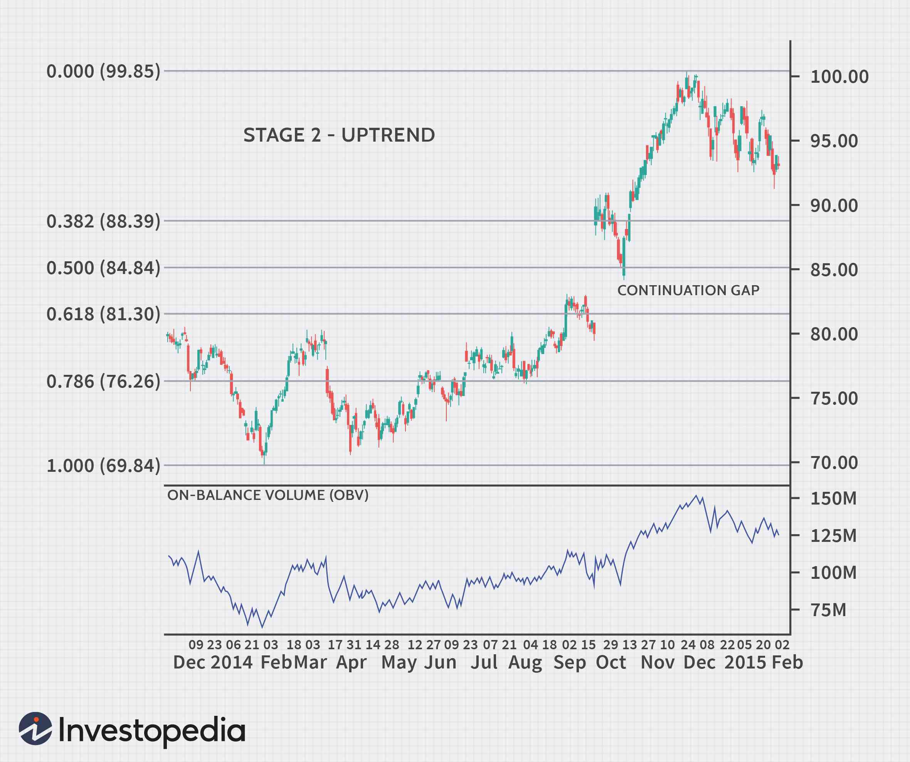

## Table of Contents

## What is stage analysis in trading?

Stage analysis in trading is a way to understand how a stock or market is behaving over time. It helps traders figure out if a stock is in a good time to buy, or if it's better to sell or wait. The idea is to break down the life cycle of a stock into different stages, like stages in a race. By knowing which stage a stock is in, traders can make smarter choices about when to get in or out of the market.

There are usually four main stages in this analysis. The first stage is when a stock is not doing well and its price is going down. The second stage is when the stock starts to get better and its price begins to go up. The third stage is when the stock is doing really well and its price is going up a lot. The fourth stage is when the stock starts to go down again after being high. By watching these stages, traders can try to buy low in the early stages and sell high in the later stages.

## How does stage analysis help in identifying market trends?

Stage analysis helps traders spot market trends by showing them where a stock or the whole market is in its life cycle. It's like looking at a map to see if you're at the start, middle, or end of a journey. When traders see that many stocks are in the first stage, where prices are low and going down, it might mean the market is in a downtrend. But if they see a lot of stocks moving into the second stage, where prices start to go up, it could signal that a new uptrend is starting.

By keeping an eye on these stages, traders can get a feel for the overall direction of the market. If most stocks are in the third stage, with prices going up a lot, it's a sign that the market is strong and in an uptrend. But when stocks start moving into the fourth stage, with prices starting to drop after being high, it might be a warning that the market is about to turn down. This way, stage analysis helps traders understand and predict where the market might be headed next.

## What are the four stages of a market cycle according to stage analysis?

The first stage of a market cycle is called the base-building stage. This is when a stock or the market is not doing well. Prices are low and they keep going down. It's a time when investors might feel worried because it seems like the market is stuck. But, it's also a time when smart traders start to look for good deals, hoping to buy low before things get better.

The second stage is the [breakout](/wiki/breakout-trading) stage. This is when the market starts to get better. Prices begin to go up and more people start to feel hopeful. It's like the market is waking up from a nap and starting to move again. This stage can be exciting because it feels like the beginning of something new and good.

The third stage is called the acceleration stage. This is when the market is doing really well. Prices are going up a lot and everyone seems to be making money. It's a time of high energy and excitement, but it can also make people a bit too confident. The fourth stage is the distribution stage. This is when the market starts to go down again after being high. Prices might still be going up a bit, but not as much, and some people start to sell their stocks. It's a sign that the market might be getting ready for another downturn.

## How can a beginner trader identify the transition between different stages?

A beginner trader can start by looking at the price chart of a stock or the market. When prices are low and going down, and it seems like nothing is changing, that's the first stage, the base-building stage. To see if the market is moving into the second stage, the breakout stage, watch for prices starting to go up. This might be a bit hard to spot at first, but you can look for more people buying the stock and the price starting to make higher highs and higher lows. This means the price is not just going up a little, but it's going up more than it was before.

As the market moves into the third stage, the acceleration stage, prices will go up a lot more. This is easier to see because the price chart will show big jumps up. More people will be talking about the stock, and it might seem like everyone is making money. But, to spot the transition to the fourth stage, the distribution stage, look for the price starting to go up less and less. It might still be going up, but not as much as before. Some people might start selling their stocks, and the price might start to make lower highs and lower lows. This means the market could be getting ready to go down again.

## What are the key indicators used in stage analysis?

In stage analysis, traders use a few key indicators to figure out which stage a stock or the market is in. One important indicator is the price chart. By looking at the chart, traders can see if the price is going up or down over time. If the price is making lower lows and lower highs, it might be in the first stage, the base-building stage. If the price starts making higher highs and higher lows, it could be moving into the second stage, the breakout stage.

Another key indicator is trading [volume](/wiki/volume-trading-strategy). This shows how many people are buying and selling the stock. In the first stage, the volume might be low because not many people are interested. But as the market moves into the second and third stages, the volume usually goes up because more people are buying. In the fourth stage, the volume might start to go down again as people start selling. By watching these indicators, traders can get a better idea of which stage the market is in and make smarter trading choices.

## How do volume and price action play a role in stage analysis?

Volume and price action are like the heartbeat and breathing of the market in stage analysis. Volume shows how many people are buying and selling a stock. When volume is low, it might mean not many people care about the stock, which often happens in the first stage, the base-building stage. But when volume starts to go up, it can mean more people are getting interested, which is a sign that the market might be moving into the second stage, the breakout stage. In the third stage, the acceleration stage, volume is usually high because lots of people are buying and selling, making the market very active. As the market moves into the fourth stage, the distribution stage, volume might start to drop again as some people begin to sell their stocks.

Price action is all about how the price of a stock moves over time. In the first stage, prices are low and going down, making lower lows and lower highs. When the market starts to move into the second stage, prices begin to go up, making higher highs and higher lows. This shows that the market is starting to get better. In the third stage, prices go up a lot, and the market is really strong. But in the fourth stage, prices start to go up less and less, and might even start to go down, making lower highs and lower lows. By watching both volume and price action, traders can figure out which stage the market is in and make better decisions about when to buy or sell.

## What are common mistakes traders make when applying stage analysis?

One common mistake traders make when using stage analysis is jumping into the market too early or too late. They might see prices start to go up and think it's the second stage, but it could just be a small bump in the first stage. Or they might wait too long to sell in the fourth stage, hoping the price will keep going up, but then it drops a lot. It's hard to know exactly when one stage ends and another begins, so traders need to be careful and patient.

Another mistake is not paying attention to volume. Volume is like a friend that helps you understand what's really happening with the price. If the price goes up but the volume is low, it might not be a real breakout. Traders might think they're in the second or third stage, but without enough people buying, the price might not keep going up. So, it's important to look at both price and volume to make better choices.

## How can stage analysis be integrated with other technical analysis tools?

Stage analysis can be used together with other technical analysis tools to help traders make better choices. One way to do this is by using moving averages. These are lines on a chart that show the average price of a stock over time. If a stock's price is above its moving average, it might be in the second or third stage, where prices are going up. But if the price is below the moving average, it could be in the first or fourth stage, where prices are going down. By watching both the stage and the moving average, traders can get a clearer picture of what's happening.

Another tool that works well with stage analysis is the Relative Strength Index (RSI). The RSI helps traders see if a stock is overbought or oversold. If the RSI is high, it might mean the stock is in the third stage and could be ready to go down soon. If the RSI is low, it might mean the stock is in the first stage and could be ready to go up. By looking at the stage and the RSI together, traders can find good times to buy or sell. Using stage analysis with other tools like moving averages and RSI can help traders understand the market better and make smarter trades.

## What are advanced techniques for refining stage analysis predictions?

One way to make stage analysis predictions better is by using trend lines. Trend lines are lines drawn on a price chart to show the direction of the price. If the price keeps going up and touching a trend line, it might be in the second or third stage. But if the price starts going down and breaks through the trend line, it could be moving into the fourth stage. By watching how the price moves around these lines, traders can get a better idea of when a stage might be ending or starting.

Another advanced technique is using support and resistance levels. These are price levels where the stock often stops going down or up. If a stock's price keeps bouncing off a support level, it might be in the first or second stage, getting ready to go up. But if the price breaks through a resistance level and keeps going up, it could be in the third stage. By keeping an eye on these levels, traders can see if the market is strong enough to move into a new stage or if it's getting weak and might be ready to change stages.

## How does stage analysis apply to different time frames in trading?

Stage analysis can be used on different time frames, like short-term, medium-term, and long-term charts. On a short-term chart, like a 5-minute or 1-hour chart, stage analysis can help traders see quick changes in the market. They might spot a stock moving from the first stage to the second stage in just a few hours. This can be useful for day traders who want to make quick trades and take advantage of small price movements. But, because things can change fast on short-term charts, it's important for traders to be careful and not jump into trades too quickly.

On a medium-term chart, like a daily or weekly chart, stage analysis can help traders see bigger trends that last for weeks or months. They might see a stock moving from the second stage to the third stage over a few weeks. This can be helpful for swing traders who want to hold onto stocks for a bit longer and make bigger profits. On a long-term chart, like a monthly chart, stage analysis can show even bigger trends that last for months or years. Traders might see a stock moving through all four stages over a few years. This can be useful for investors who want to hold onto stocks for a long time and make the most of big market movements. By using stage analysis on different time frames, traders can find the best times to buy and sell based on how long they want to hold onto their stocks.

## Can stage analysis be used effectively in different markets, such as stocks, forex, and commodities?

Yes, stage analysis can be used effectively in different markets like stocks, [forex](/wiki/forex-system), and commodities. The basic idea of stage analysis is to understand where a market is in its life cycle, and this idea works the same way no matter what you're trading. In the stock market, traders can use stage analysis to figure out if a stock is a good buy or if it's time to sell. For example, if a stock is in the first stage, with prices going down, it might be a good time to buy if the trader thinks the stock will start going up soon. In the forex market, stage analysis can help traders see if a currency pair is in a good time to buy or sell. If a currency pair is in the third stage, with prices going up a lot, it might be a good time to sell and take profits.

In the commodities market, stage analysis can help traders understand if a commodity like gold or oil is in a good time to buy or sell. For example, if the price of oil is in the second stage, starting to go up, it might be a good time to buy. The key is to look at the price and volume of whatever you're trading and use stage analysis to figure out where it is in its life cycle. By doing this, traders can make better choices about when to get in or out of the market, no matter if they're trading stocks, forex, or commodities.

## What are the limitations and criticisms of stage analysis in trading?

Stage analysis is a useful tool, but it's not perfect and has some problems. One big problem is that it's hard to know exactly when one stage ends and another begins. The market can be tricky, and prices can go up and down a lot. Sometimes, a trader might think a stock is moving into the second stage, but it could just be a small bump in the first stage. This can make traders buy or sell at the wrong time and lose money. Also, stage analysis doesn't work the same for every stock or market. What works for one stock might not work for another, so traders need to be careful and not just follow the stages without thinking.

Another criticism of stage analysis is that it can make traders focus too much on the past and not enough on what might happen in the future. The market can change quickly because of things like news or big events, and stage analysis might not catch these changes right away. Traders who only use stage analysis might miss out on important information that could affect their trades. So, while stage analysis can help traders understand the market better, it's important to use it with other tools and always keep an eye on what's happening around the world.

## What is Stage 2: Uptrend Phase?

The uptrend phase in financial markets is marked by an upward trajectory in asset prices complemented by increased trading volume. This stage provides traders with significant opportunities to capitalize on rising market conditions. Traders who identify the transition to an uptrend phase can adopt various strategies to optimize their returns.

One prevalent approach during an uptrend is the breakout strategy. This involves identifying key resistance levels where a price has historically struggled to move above. A breakout is confirmed when the asset price closes above this resistance level on increased volume, suggesting the potential for further upward movement. Traders will often enter long positions hoping to capture large price movements as the asset continues its upward trajectory.

To illustrate, if an asset consistently fails to surpass $100 but then breaks and closes above this level with strong volume, traders might view this as a breakout signal. The anticipation is that the previous resistance will now act as new support.

Python code to identify potential breakouts can look like this:

```python
import pandas as pd

def identify_breakouts(data, resistance_level):
    # Assuming data is a DataFrame with a column 'Close' for closing prices
    breakouts = data[data['Close'] > resistance_level]

    # Adding a condition for increased volume can refine the breakout detection
    # Assuming a column 'Volume' exists
    breakout_conditions = [breakouts['Close'] > resistance_level, 
                           breakouts['Volume'] > breakouts['Volume'].shift(1)]

    confirmed_breakouts = breakouts.loc[breakout_conditions]
    return confirmed_breakouts

# Example usage
# df = pd.read_csv('market_data.csv')  # Load your market data here
# breakout_points = identify_breakouts(df, 100)
# print(breakout_points)
```

Additionally, traders might employ trailing stops as a risk management technique to protect profits while allowing for potential gains as the market continues to rise. A trailing stop moves with the market price, allowing the trader to benefit from uptrend movements while automatically closing the position should the market reverse.

Mathematically, the trailing stop can be expressed as:

$$
\text{Trailing Stop Price} = \text{Maximum Price} - \Delta
$$

where $\Delta$ is the fixed distance (or percentage) the trader sets from the maximum price achieved since entering the position.

The uptrend phase, with its rising prices and increased activity, offers traders an environment ripe for profit. Recognizing and exploiting these conditions using strategies like breakouts and trailing stops can significantly enhance trade effectiveness and potential returns.

## References & Further Reading

[1]: Weinstein, S. (1988). ["Secrets for Profiting in Bull and Bear Markets."](https://www.amazon.com/Stan-Weinsteins-Secrets-Profiting-Markets/dp/1556236832) McGraw-Hill Education.

[2]: Mandelbrot, B. B., & Hudson, R. L. (2005). ["The (Mis)behavior of Markets: A Fractal View of Risk, Ruin, and Reward."](https://books.google.com/books/about/The_Mis_Behaviour_of_Markets.html?id=zg91TAIs6bgC) Basic Books.

[3]: Aronson, D. R. (2006). ["Evidence-Based Technical Analysis: Applying the Scientific Method and Statistical Inference to Trading Signals."](https://www.amazon.com/Evidence-Based-Technical-Analysis-Scientific-Statistical/dp/0470008741) Wiley.

[4]: Lopez de Prado, M. (2018). ["Advances in Financial Machine Learning."](https://www.amazon.com/Advances-Financial-Machine-Learning-Marcos/dp/1119482089) Wiley.

[5]: Chan, E. P. (2009). ["Quantitative Trading: How to Build Your Own Algorithmic Trading Business."](https://github.com/ftvision/quant_trading_echan_book) Wiley Trading.

[6]: Jansen, S. (2020). ["Machine Learning for Algorithmic Trading: Predictive models to extract signals from market and alternative data for systematic trading strategies with Python."](https://www.amazon.com/Machine-Learning-Algorithmic-Trading-alternative/dp/1839217715) Packt Publishing.

[7]: Chincarini, L. B., & Kim, D. (2006). ["Quantitative Equity Portfolio Management: An Active Approach to Portfolio Construction and Management."](https://archive.org/details/quantitativeequi0000chin_c9d6) McGraw-Hill.