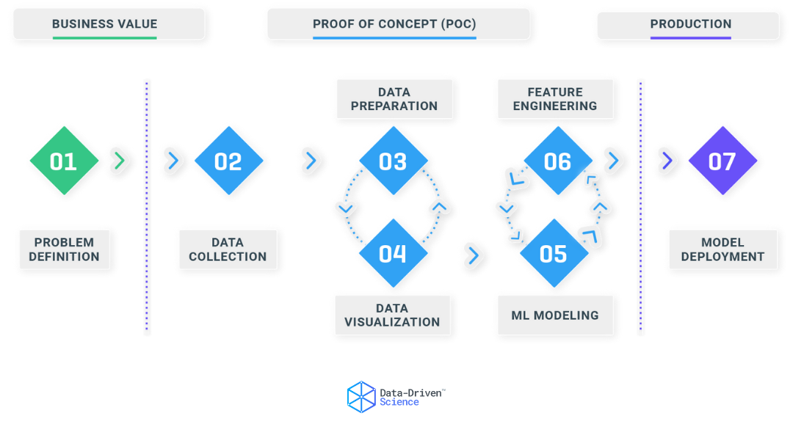

## Table of Contents

## What is staged training in machine learning?

Staged training in machine learning is a technique where a model is trained in multiple phases or stages, rather than all at once. This approach is useful when dealing with complex models or large datasets, as it allows for more manageable training processes. By breaking down the training into stages, it becomes easier to monitor the model's performance at each step and make necessary adjustments. This can lead to better overall performance and more efficient use of computational resources.

For example, in a neural network, staged training might involve first training the lower layers of the network on a simpler task, and then adding and training the higher layers on a more complex task. This helps the model to learn hierarchical features, starting from basic patterns and building up to more abstract concepts. By doing this, the model can gradually improve its understanding and performance, which can be particularly beneficial in tasks like image recognition or natural language processing.

## How does staged training differ from traditional training methods?

Staged training and traditional training methods differ mainly in how they approach the learning process. In traditional training, a model is trained all at once on the entire dataset. This means the model learns from all the data at the same time, trying to find the best way to fit the data in one go. This can work well for smaller, simpler models and datasets, but it can be challenging for more complex models or very large datasets because the model has to handle everything at once.

On the other hand, staged training breaks the learning process into smaller, more manageable parts. Instead of training the model on all the data at once, it is trained in stages. For example, a neural network might first be trained on a simpler task with just a few layers, and then more layers are added and trained on a more complex task. This allows the model to learn gradually, starting with basic patterns and building up to more complex concepts. By doing this, the model can improve step-by-step, which can be more effective for complex tasks and can also help in using computational resources more efficiently.

## What are the benefits of using staged training in machine learning models?

Staged training helps machine learning models learn better by breaking the training process into smaller steps. Instead of trying to learn everything at once, the model can focus on simpler tasks first and then move on to harder ones. This can make it easier for the model to understand complex patterns and relationships in the data. For example, in a neural network, the model might start by learning to recognize basic shapes in images, and then later learn to identify more complex objects. This gradual learning can lead to better overall performance because the model builds its knowledge step-by-step.

Another benefit of staged training is that it can save time and computational resources. When training a model all at once, it can take a lot of time and require a lot of computing power, especially with large datasets. But with staged training, the model only needs to focus on a part of the data at a time. This can make the training process faster and more efficient. It also allows you to check the model's performance at each stage and make adjustments if needed, which can help prevent the model from learning the wrong things or getting stuck.

## Can you explain the process of implementing staged training?

Implementing staged training involves breaking down the training process into smaller, sequential stages. For example, in a neural network, you might start by training the initial layers on a simpler task, like recognizing basic shapes in images. You would use a subset of your data and train these layers until they perform well on the task. Once satisfied with the performance of the initial layers, you would then add more layers to the network and train them on a more complex task, such as identifying specific objects within the images. This gradual approach allows the model to build its understanding step-by-step.

As you move through the stages, you need to keep an eye on how the model is doing. After each stage, you can test the model on a validation set to see if it's improving. If the model isn't performing well, you might need to go back and adjust the training of the earlier stages or change the way you're adding new layers. This process of monitoring and adjusting helps ensure that the model learns effectively and doesn't get stuck. By the end of all the stages, the model should be able to handle the full complexity of the task you're trying to solve.

## What types of machine learning models are best suited for staged training?

Staged training is particularly well-suited for deep learning models, such as neural networks, because these models often have many layers that can benefit from learning in stages. For example, in a convolutional neural network (CNN) used for image recognition, you can first train the initial layers to recognize basic features like edges and textures. Once these layers are trained, you can add more layers and train them to recognize more complex patterns, like shapes and objects. This step-by-step approach helps the model build a more robust understanding of the data, leading to better performance on complex tasks.

Another type of model that can benefit from staged training is recurrent neural networks (RNNs), which are often used for tasks involving sequential data, like natural language processing. You can start by training the RNN on simpler sequences to learn basic patterns in the data. Then, you can add more complexity to the model by increasing the depth or introducing more sophisticated architectures like Long Short-Term Memory (LSTM) units, and train it on more challenging sequences. This gradual learning process can help the model better capture long-term dependencies and improve its performance on tasks like text generation or speech recognition.

## How does staged training help in managing computational resources?

Staged training helps manage computational resources by breaking the training process into smaller parts. Instead of training a model on all the data at once, which can take a lot of time and computing power, you train it in stages. This means you only need to focus on a part of the data at a time. For example, you might start by training the first few layers of a neural network on a simpler task. This uses less computational power because you're not trying to handle the whole model and all the data at once.

As you move through the stages, you can keep an eye on how the model is doing and make adjustments if needed. This can help prevent the model from getting stuck or using too many resources on parts that aren't working well. By the end of all the stages, the model should be able to handle the full complexity of the task, but it will have done so in a way that's more efficient and easier on your computer. This approach can save time and make better use of the computational resources you have available.

## What are some common challenges faced when applying staged training?

One common challenge with staged training is deciding how to break down the training process into stages. It can be hard to know what parts of the model to train first and how to move from one stage to the next. If you don't set up the stages well, the model might not learn the right things at the right time. This can lead to poor performance because the model might get stuck on early stages or not be ready for the more complex tasks in later stages.

Another challenge is keeping track of the model's performance as it moves through the stages. You need to test the model at each stage to make sure it's improving, but this can take a lot of time and effort. If you don't monitor the model closely, you might miss problems that could be fixed by going back and adjusting earlier stages. This can make the training process longer and more complicated than if you were using traditional training methods.

## How can staged training be optimized for better performance?

To optimize staged training for better performance, it's important to carefully plan how to break down the training process into stages. Start by choosing simpler tasks for the early stages that help the model learn basic patterns. As you move to later stages, gradually increase the complexity of the tasks. This helps the model build its knowledge step-by-step, making it easier to learn more complex concepts. You can also use techniques like transfer learning, where you start with a model that's already been trained on a similar task, and then fine-tune it for your specific task. This can save time and make the training more efficient.

Another way to optimize staged training is by closely monitoring the model's performance at each stage. Use a validation set to test the model after each stage and see if it's improving. If the model isn't doing well, you might need to go back and adjust the training of the earlier stages or change how you're adding new layers. By keeping an eye on the model's performance and making adjustments as needed, you can prevent it from getting stuck or learning the wrong things. This careful monitoring and adjustment can lead to better overall performance and make the training process more efficient.

## What metrics should be used to evaluate the effectiveness of staged training?

To evaluate the effectiveness of staged training, you should look at how well the model is doing at each stage and overall. A key metric to use is the model's accuracy on a validation set. This means you test the model on data it hasn't seen before after each stage to see if it's getting better at the task. If the accuracy is going up as you move through the stages, that's a good sign that the staged training is working well. You can also look at other metrics like precision and recall, which tell you how well the model is at identifying the right things and not missing important stuff.

Another important thing to consider is how the model is using its computational resources. You can measure this by looking at how long each stage takes to train and how much memory or processing power it uses. If the staged training is helping the model learn faster or use less resources compared to traditional training, that's another sign that it's effective. By keeping an eye on these metrics, you can see if the staged training is helping the model improve and if it's worth the extra effort of breaking the training into stages.

## Can you provide examples of successful applications of staged training in real-world scenarios?

One successful application of staged training is in the field of image recognition, specifically with the use of convolutional neural networks (CNNs). For example, Google's Inception model used staged training to improve its performance on the ImageNet dataset. They started by training the initial layers of the network to recognize simple features like edges and textures. Once these layers were trained, they added more layers and trained them to recognize more complex patterns, like shapes and objects. This step-by-step approach helped the model achieve high accuracy in identifying thousands of different objects in images, demonstrating how staged training can lead to better performance on complex tasks.

Another example is in natural language processing (NLP), where staged training has been used to improve the performance of recurrent neural networks (RNNs) for tasks like text generation and speech recognition. Researchers at Stanford University used staged training to train an RNN for language translation. They began by training the model on simpler sequences to learn basic patterns in the data. Then, they added more complexity to the model by introducing LSTM units and trained it on more challenging sequences. This gradual learning process helped the model better capture long-term dependencies in the text, resulting in more accurate translations. These examples show how staged training can be effectively applied in real-world scenarios to enhance the performance of machine learning models.

## How does staged training integrate with other advanced machine learning techniques?

Staged training can work well with other advanced machine learning techniques like transfer learning and fine-tuning. In transfer learning, you start with a model that's already been trained on a similar task, and then you use staged training to teach it your specific task. For example, you might take a model trained on general image recognition and use staged training to make it better at recognizing specific types of objects. This can save time because the model already knows some basic stuff, so you just need to train it on the new, more specific task. By breaking the training into stages, you can focus on teaching the model the new stuff it needs to know without messing up what it already learned.

Staged training also fits nicely with techniques like ensemble learning, where you combine several models to make better predictions. You can train each model in the ensemble using staged training, starting with simpler tasks and moving to more complex ones. This can help each model in the ensemble learn better, and when you put them together, they can work even better than any single model. By using staged training with these other techniques, you can make your machine learning models more powerful and efficient, helping them handle tough tasks in areas like image recognition, natural language processing, and more.

## What future developments can we expect in the field of staged training in machine learning?

In the future, we can expect staged training to become even more important in machine learning. As models get bigger and more complex, breaking down the training into stages will help them learn better and faster. Researchers might come up with new ways to decide how to split the training into stages, making it easier to know what parts of the model to train first and how to move to the next stage. This could lead to better performance on tough tasks like understanding human speech or recognizing objects in videos. Also, staged training might be used more with other smart techniques like transfer learning, where you start with a model that already knows some stuff and then teach it new things in stages.

Another thing we might see is staged training being used more in real-time systems. Imagine a self-driving car that needs to learn new roads and traffic patterns quickly. Staged training could help the car's computer learn these new things in small steps without messing up what it already knows. This could make the car safer and smarter. As computers get faster and better at handling big data, staged training could become a common way to make machine learning models work well in many different situations, from helping doctors read medical images to making smart home devices understand what people want.