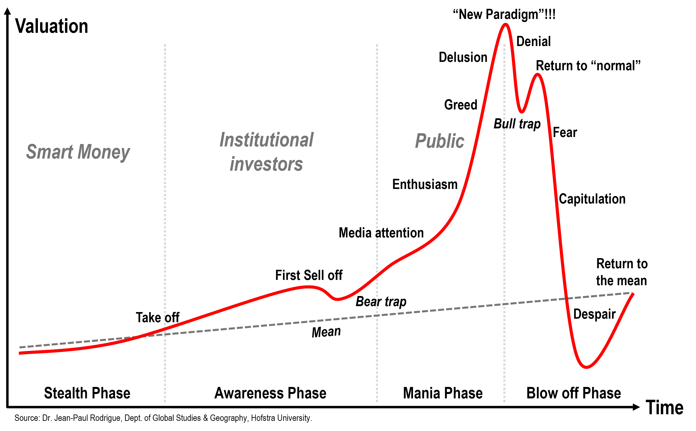

Understanding financial cycles is crucial for investors seeking to navigate the complexities of modern economics. Financial crises, economic bubbles, market cycles, and algorithmic trading are all interconnected elements that significantly impact global markets and investment strategies. Mastery of these concepts is essential, as they determine the movement of asset prices and influence investment decisions.

Financial crises often result in economic downturns, leading to a broader impact on the market. These crises can arise from various factors, including excessive speculation, asset overvaluation, or systemic failures within financial institutions. Economic bubbles, characterized by rapid escalation of asset prices followed by a sharp contraction, further complicate this landscape. Bubbles can be driven by irrational exuberance and significant market speculation, and when they burst, they often precipitate financial crises.

Market cycles, representing the recurring phases of asset price changes, are also vital to understand. These cycles can be broken down into phases such as accumulation, uptrend, distribution, and downtrend. Recognizing these patterns allows investors to optimize their strategies, timing market entries and exits to maximize returns while mitigating risks.

Algorithmic trading adds another layer of complexity. By utilizing automated strategies, algorithmic trading can enhance market liquidity and efficiency but may also amplify market movements in times of volatility. Its interaction with economic bubbles and market cycles can lead to unexpected volatility, affecting price stability.

This article aims to explore these intricate links, providing readers with insights needed to make informed investment decisions. By mastering the understanding of financial crises, economic bubbles, market cycles, and algorithmic trading, investors can better navigate global markets, ultimately avoiding the pitfalls of financial bubbles and crises. The goal is to equip readers with the knowledge necessary to manage risks effectively and seize opportunities in volatile markets.

## Table of Contents

## Understanding Financial Crises

Financial crises are characterized by significant distress in financial markets, often manifesting as a sudden loss of confidence, panic, and a dramatic decline in asset prices. These crises are multifaceted events with complex causes that can devastate economies and disrupt global markets. Understanding their origins and recognizing early warning signs are vital for investors seeking to protect their investments from potential downturns.

### Causes of Financial Crises

Financial crises often arise from a combination of economic bubbles, market cycles, regulatory failures, and external shocks. Economic bubbles, where asset prices inflate significantly beyond their intrinsic value, frequently precipitate financial crises. When these bubbles burst, they can lead to a sharp correction in asset prices, triggering widespread financial instability.

Market cycles, which consist of expansion, peak, contraction, and trough phases, also play a crucial role. During the expansion phase, excessive optimism can inflate asset prices, leading to bubbles. The subsequent contraction can trigger crises as investors hastily withdraw from declining markets, exacerbating the downturn.

Regulatory failures contribute to financial crises by allowing excessive risk-taking and creating an environment of complacency among market participants. These failures often result in inadequate oversight of financial institutions, culminating in vulnerabilities that can lead to systemic crises.

External shocks, such as geopolitical events or natural disasters, can also precipitate financial crises by causing sudden and unanticipated market disruptions.

### Historical Instances

The 2008 subprime mortgage crisis serves as a prominent example of a financial crisis triggered by a combination of these factors. The crisis originated in the United States housing market, where an over-inflated housing bubble, fueled by subprime mortgage lending and securitization, ultimately burst. This resulted in massive defaults, leading to a severe credit crunch and the bankruptcy of major financial institutions. The global economy experienced a recession, underscoring the interconnectedness of global financial systems.

Another historical instance is the 1929 Wall Street Crash, which marked the beginning of the Great Depression. The crash followed a period of speculative investment and over-leveraging, similar to the dynamics leading up to more recent crises.

### Lessons Learned

Past financial crises offer valuable lessons for investors and policymakers. One critical takeaway is the importance of recognizing early warning signs, such as rapidly increasing asset prices, excessive leverage, and significant increases in risk-taking behavior. Policymakers have learned the necessity of robust regulatory frameworks to prevent excessive risk accumulation within financial institutions and to enhance transparency in financial markets.

For investors, diversification and prudent risk management are essential strategies for mitigating the impact of financial crises. Being informed and vigilant can enable investors to react swiftly to emerging threats, preserving capital and maintaining stability during turbulent periods.

Recognizing the interconnected causes of financial crises and the ability to identify early signs are crucial to prepare and protect against potential market disruptions. By implementing effective risk management strategies and understanding the dynamic nature of markets, investors can navigate the complexities of financial crises with greater confidence.

## The Anatomy of Economic Bubbles

Economic bubbles present a fascinating yet perilous phenomenon within financial markets, characterized by asset prices inflating significantly beyond their intrinsic value. This overvaluation often results from speculative behavior, where investors propel prices upward with the expectation of future gains rather than underlying fundamentals.

### Stages of an Economic Bubble

The lifecycle of an economic bubble can be broken down into several distinct stages:

1. **Displacement**: This initial phase is triggered by a significant event or innovation that changes the market landscape, attracting investors who perceive new opportunities for profit. For example, the advent of the internet in the late 1990s sparked a wave of investment into technology-focused companies.

2. **Boom**: As more investors enter the market driven by optimism, demand increases, causing asset prices to escalate rapidly. During this phase, market sentiment is overwhelmingly positive, and media coverage often fuels the frenzy, enticing even more investors. Traditional metrics of valuation become increasingly ignored in favor of the "get-rich-quick" mentality.

3. **Euphoria**: At the height of the bubble, euphoria takes hold. Asset prices reach unsustainable levels, and speculative investment reaches its peak. In this stage, warning signs, such as rising debt levels and unsustainable price/earnings ratios, are often overlooked. Historical examples, including the Dutch Tulip Mania and the South Sea Bubble, illustrate how euphoria can cloud rational judgment.

4. **Crisis**: Eventually, reality sets in. A triggering event, such as bad financial news, a rise in interest rates, or a shift in investor sentiment, can lead to a rapid revaluation of assets. Panic ensues as investors rush to exit positions, leading to a sharp decline in prices.

5. **Revulsion**: The final stage witnesses widespread disillusionment as prices plunge, often dropping below their intrinsic value. Investors suffer significant losses, leading to a prolonged period of negative sentiment and an aversion to investing in the affected assets or sectors.

### Historical Example: The Dot-Com Bubble

The dot-com bubble of the late 1990s serves as a prominent illustration of these stages. Driven by the transformational potential of the internet, investors poured capital into technology companies, rapidly inflating stock prices. At its peak, the Nasdaq Composite Index quintupled in value from 1995 to 2000. However, as companies failed to deliver on the anticipated profits, the bubble burst in March 2000, resulting in a harrowing market crash and a loss of trillions of dollars in market value.

### Impact on Financial Markets and Economies

Economic bubbles disrupt financial markets and broader economies. They lead to misallocation of resources, as capital is diverted from more productive uses into speculative investments. The subsequent crash often precipitates a financial crisis, as seen in the aftermath of the housing bubble in the 2007-2008 financial crisis. The popping of bubbles tends to result in tighter credit conditions, loss of consumer and investor confidence, and downward pressure on economic growth.

In conclusion, understanding the anatomy of economic bubbles is crucial for market participants. Recognizing the signs and stages of a bubble can enable investors to make informed decisions, manage risk appropriately, and potentially avoid the significant losses associated with a sudden market correction.

## Market Cycles and Their Importance

Market cycles are fundamental patterns in financial markets, representing the stages of asset price movements that repeat over time. These phases include accumulation, uptrend, distribution, and downtrend, each characterized by distinct investor behavior and market conditions.

1. **Accumulation Phase**: This phase often follows a market downturn. Savvy investors perceive assets as undervalued based on fundamental analysis. During accumulation, market sentiment shifts from bearish to neutral, and trading volumes begin to stabilize. It's characterized by horizontal price movements as demand slowly increases relative to supply.

2. **Uptrend Phase**: Building on the accumulation phase, the uptrend marks a period of increasing prices. Optimism grows as more investors recognize potential gains, leading to higher volumes as prices ascend. Momentum indicators often reflect bullish sentiment, and the uptrend is typically supported by positive news or improving economic conditions.

3. **Distribution Phase**: In this phase, the early investors begin to sell, realizing profits. While prices may still rise, the pace slows. Volume increases as disagreement between bullish and bearish sentiments intensifies. The market may exhibit a sideways movement, forming chart patterns like tops or ranges.

4. **Downtrend Phase**: Eventually, selling pressure surpasses buying interest, entering the downtrend phase. Prices decline, often rapidly, as pessimism spreads. Trading volumes can spike due to panic selling. Key support levels break, leading to further declines and eventually setting the stage for a new accumulation phase.

Understanding these cycles is crucial for investors aiming to optimize their market strategies. Well-timed entry and [exit](/wiki/exit-strategy) points aligned with phases of the market cycle can enhance returns and manage risks effectively.

Investors use various tools and indicators to discern the current stage of the market cycle:

- **Moving Averages**: A moving average helps smooth out price data, capturing the trend direction. The simple moving average (SMA) and exponential moving average (EMA) are common types. When the price crosses above a moving average, it may signal the start of an uptrend, while crossing below could indicate a downtrend.

- **Oscillators**: Tools like the Relative Strength Index (RSI) and Moving Average Convergence Divergence (MACD) assess price momentum, oscillating between fixed points to identify overbought or oversold conditions. High RSI values suggest an overbought market which could lead to a downturn, while low values indicate the opposite.

These indicators, when used correctly, enable investors to make informed decisions, aligning their strategies with the natural ebb and flow of market cycles. By leveraging quantitative methods and historical patterns, investors can not only bolster their analytical approach but also potentially increase their profitability in the financial markets.

## The Role of Algorithmic Trading in Modern Markets

Algorithmic trading represents a paradigm shift in the way financial markets operate by employing computer algorithms to automate trading strategies. This technology leverages mathematical models and statistical analyses to execute trades at speeds and volumes beyond human capability. The primary goal is to increase the efficiency and [liquidity](/wiki/liquidity-risk-premium) of markets, thereby reducing transaction costs. According to the International Organization of Securities Commissions (IOSCO), [algorithmic trading](/wiki/algorithmic-trading) and high-frequency trading ([HFT](/wiki/high-frequency-trading-strategies)) accounted for over 60% of equity trading [volume](/wiki/volume-trading-strategy) in the United States as of recent years.

The increasing prevalence of algorithmic trading means that algorithms often interact with market cycles. During different phases of these cycles, particularly in periods of high [volatility](/wiki/volatility-trading-strategies) or economic bubbles, the presence of algorithmic trading can amplify market movements. This exacerbation occurs because of the speed and volume of trades executed by algorithms, which can propel market trends and contribute to inflated asset prices or rapid declines.

Understanding the benefits of algorithmic trading includes recognizing its ability to improve market efficiency by narrowing bid-ask spreads and enhancing liquidity. Algorithms can process vast amounts of information quickly, react to market changes faster than human traders, and execute trades at the milliseconds level. For instance, statistical [arbitrage](/wiki/arbitrage) strategies utilize algorithms to identify price discrepancies between correlated assets, ensuring they revert to their mean value.

However, the pitfalls of algorithmic trading are also significant. One of the primary concerns is the risk of flash crashes, where market indices plummet precipitously due to rapid selling triggered by algorithms. The infamous Flash Crash of May 6, 2010, saw the Dow Jones Industrial Average fall by about 1,000 points within minutes, primarily driven by algorithmic trading. Additionally, the complexity and opacity of some algorithms can make it difficult to predict their behavior during extreme market conditions, potentially leading to systemic risks.

To navigate the contemporary financial landscape effectively, market participants must grasp the intricacies of algorithmic trading. This involves understanding both the technical aspects, like algorithmic models and coding, and the broader market implications. By doing so, traders can position themselves to mitigate risks and leverage opportunities brought about by this transformative trading mechanism. Adopting sophisticated risk management techniques and continuously adapting to technological advancements are critical strategies for thriving amidst the complexities of algorithmic trading.

## Interconnections: Bubbles, Cycles, and Algo Trading

The interplay between economic bubbles, market cycles, and algorithmic trading is a multifaceted phenomenon that can significantly impact financial markets. Economic bubbles typically manifest when asset prices soar above their intrinsic value, often fueled by investor exuberance. As these bubbles expand, market cycles come into play, characterized by phases such as accumulation, uptrend, distribution, and downtrend. Algorithmic trading, or algo trading, introduces another layer of complexity, as it utilizes computer algorithms to execute trades at speeds and frequencies beyond human capability.

During an economic bubble, algorithmic trading can magnify existing market trends. High-frequency trading algorithms, designed to capitalize on small price movements, can lead to what's known as "[momentum](/wiki/momentum) ignition." This occurs when algos detect upward trends and execute buy orders en masse, thus exacerbating price increases. As the bubble peaks, any negative news can trigger a rapid reversion of these trends, with algo trading amplifying sell-offs, contributing to potential market crashes.

For example, consider a situation where the price of a tech stock doubles within a short period due to speculative buying. An algorithm designed to operate on momentum might detect this uptrend and initiate additional buy orders, further inflating the stock price. However, if unfavorable earnings reports surface, the same algorithms might suddenly shift to selling off their positions, accelerating a market correction.

To mitigate risks associated with this dynamic interaction, investors should employ comprehensive risk management strategies. Diversification is key, as it spreads investment exposure across various asset classes, reducing vulnerability to sector-specific bubbles. Risk management tools, such as stop-loss orders, can automatically trigger the sale of securities if prices fall below predetermined levels, preventing excessive losses.

Furthermore, investors should continuously monitor market indicators. For instance, the Price-to-Earnings (P/E) ratio can provide insight into whether assets are overvalued. Likewise, the Moving Average Convergence Divergence (MACD) indicator can help identify potential trend reversals, guiding entry and exit points in the market. 

In terms of algorithmic trading, understanding its influence on markets is crucial. Investors must recognize that while algos can offer liquidity and efficiency, they can also introduce volatility, particularly during disruptive market conditions. This necessitates a balanced approach, integrating traditional investment principles with modern algorithmic solutions to navigate the complexities of contemporary financial markets effectively. 

By equipping themselves with a blend of strategic foresight and adaptive tools, investors can better manage the risks inherent in the convergence of bubbles, cycles, and algorithmic influences, ultimately striving for a more stable and resilient portfolio amid financial uncertainty.

## Strategies for Navigating Financial Turmoil

Prudent risk management is crucial during periods of financial turmoil. Investors can achieve this by diversifying their portfolios, which helps mitigate risks associated with market volatility. Diversification involves spreading investments across various asset classes, sectors, and geographies to reduce exposure to any single risk [factor](/wiki/factor-investing). For instance, blending equities, bonds, and commodities can provide a buffer against market downturns, as these asset classes often react differently to economic events.

Staying informed is another essential strategy. Investors must constantly keep abreast of financial news, economic indicators, and market trends to make informed decisions. Ensuring an understanding of key economic indicators, such as GDP growth rates, unemployment figures, and inflation rates, can provide crucial insights into potential market movements. Additionally, investors should monitor market sentiment and news related to geopolitical events that may introduce volatility.

Adapting portfolios in response to market indicators is also fundamental. Indicators such as moving averages, relative strength index (RSI), and market momentum can signal when to adjust asset allocations. For instance, if the market is approaching a downturn, an investor might consider reallocating from equities to more stable investments such as bonds or money markets.

Balancing traditional investment strategies with modern tools enhances market participation. Algorithmic trading, for example, can be used to execute trades based on predefined criteria, reducing the emotional biases associated with trading decisions. Algorithms can swiftly process vast amounts of data and respond to market changes, providing a competitive edge. However, it is essential for investors to understand the underlying principles and risks of these algorithms to effectively integrate them into their broader investment strategy.

Incorporating these strategies enables investors to navigate the complexities of financial markets more effectively, enhancing their ability to withstand and benefit from periods of uncertainty and volatility.

## Conclusion

Navigating financial crises, economic bubbles, and market cycles requires informed strategies and an understanding of modern trading techniques. Investors who master these elements can mitigate risks and capitalize on opportunities presented by volatile markets. An essential aspect of this navigation lies in recognizing patterns and signals within market data. By staying informed about economic indicators and the implications of algorithmic trading, investors can anticipate shifts and prepare accordingly.

Adaptability is another critical factor for investment success, particularly in the face of financial turbulence. Investors should remain vigilant, continuously reassessing their strategies in response to changing market conditions. This involves not only understanding traditional market dynamics but also incorporating modern tools such as algorithmic solutions to enhance decision-making processes.

In conclusion, the ability to remain informed, vigilant, and adaptable forms the cornerstone of successful investment strategies. By analyzing past events and leveraging contemporary trading technologies, investors can maintain a competitive edge, thereby increasing their potential for long-term success in ever-changing financial landscapes.

## References & Further Reading

[1]: Kindleberger, C. P., & Aliber, R. Z. (2011). ["Manias, Panics, and Crashes: A History of Financial Crises."](https://link.springer.com/book/10.1057/9780230628045) Palgrave Macmillan.

[2]: Shiller, R. J. (2016). ["Irrational Exuberance."](https://www.amazon.com/Irrational-Exuberance-3rd-Robert-Shiller/dp/0691166269) Princeton University Press.

[3]: Thaler, R. H. (2005). ["Advances in Behavioral Finance."](https://press.princeton.edu/books/paperback/9780691121758/advances-in-behavioral-finance-volume-ii) Princeton University Press.

[4]: Reinhart, C. M., & Rogoff, K. S. (2009). ["This Time is Different: Eight Centuries of Financial Folly."](https://www.nber.org/system/files/working_papers/w13882/w13882.pdf) Princeton University Press.

[5]: ["The Intelligent Investor: The Definitive Book on Value Investing"](https://www.amazon.com/Intelligent-Investor-Third-Definitive-Investing/dp/0063423537) by Benjamin Graham.

[6]: Hyman, M. (2011). ["A Random Walk Down Wall Street: The Time-Tested Strategy for Successful Investing."](https://www.academia.edu/10850809/A_Random_Walk_Down_Wall_Street_The_Time_Tested_Strategy_for_Successful_Investing) W. W. Norton & Company.

[7]: Agrawal, J., & Narayanan, A. (2018). ["Bitcoin's Academic Pedigree."](https://dl.acm.org/doi/10.1145/3132259) ACM Queue, 15(4), 20-29.