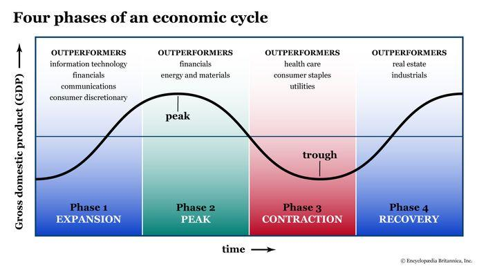

## Table of Contents

## What is an economic cycle?

An economic cycle, also known as a business cycle, is the natural rise and fall of economic activity over time. It's like a roller coaster for the economy, with periods of growth followed by periods of slowdown. These cycles can last for several years and affect things like jobs, spending, and how much stuff people buy.

During the growth part of the cycle, called expansion, businesses do well, people have jobs, and they spend more money. This can lead to more jobs and even more spending, making the economy grow even faster. But eventually, things can get too hot, and the economy might start to overheat, leading to inflation, where prices go up a lot.

After the expansion, the economy might enter a slowdown, called a contraction or recession. During this time, businesses might struggle, people might lose their jobs, and they spend less money. This can make the economy shrink. But after a while, things start to get better again, and the cycle begins anew. Understanding these cycles helps people and governments make better decisions about money and planning for the future.

## How many stages are typically recognized in an economic cycle?

An economic cycle usually has four stages: expansion, peak, contraction, and trough. During the expansion stage, the economy grows. Businesses do well, people have jobs, and they spend more money. This growth continues until the economy reaches its peak, which is the highest point of the cycle. At the peak, the economy is doing as well as it can, but it might start to overheat, causing problems like inflation.

After the peak comes the contraction stage, where the economy starts to slow down. Businesses might struggle, people might lose their jobs, and they spend less money. This slowdown continues until the economy reaches its lowest point, called the trough. At the trough, the economy is at its weakest, but it's also the point where it starts to recover. From the trough, the economy begins to expand again, and the cycle starts over.

Understanding these four stages helps people and governments plan better. They can prepare for good times and bad times, making decisions about saving, spending, and investing based on where the economy is in its cycle.

## What is the expansion phase of the economic cycle?

The expansion phase is when the economy starts to grow. It's like the economy is waking up and getting more active. During this time, businesses do better because people are buying more stuff. When businesses do well, they hire more people, so more folks have jobs. With jobs, people feel good and spend even more money, which helps the economy grow even more. It's a happy cycle where everyone benefits.

This phase can last for a while, sometimes several years. As the economy keeps growing, it can reach a point where it's growing too fast. This might cause prices to go up a lot, which is called inflation. When inflation happens, it can be a sign that the expansion phase is getting close to ending. But until that happens, the expansion phase is a time of growth and good feelings for the economy.

## What characterizes the peak phase of the economic cycle?

The peak phase is when the economy is doing its best. It's like the top of a mountain where everything looks good. Businesses are making a lot of money, people have jobs, and they're spending a lot. Everything feels great, but it can't last forever. At the peak, the economy might start to overheat, which means it's growing too fast. When things grow too fast, prices can go up a lot, and that's called inflation.

Inflation can make things hard for people because their money doesn't go as far. If prices keep going up, people might start to worry and spend less. When people spend less, businesses might not do as well, and they might have to let some workers go. This is when the peak phase starts to turn into the next phase, called the contraction. So, while the peak feels great, it's also a warning sign that things might start to slow down soon.

## What happens during the contraction or recession phase?

During the contraction or recession phase, the economy starts to slow down. Businesses don't do as well because people are buying less stuff. When businesses struggle, they might have to let some workers go, so more people lose their jobs. With fewer jobs, people have less money to spend, which makes the economy slow down even more. It's like a downward spiral where everything gets harder.

This phase can last for a while, sometimes a year or more. As the economy keeps slowing down, it can reach a point where it's at its weakest. This lowest point is called the trough. At the trough, things might feel really tough, but it's also the point where the economy starts to get better. From the trough, the economy begins to recover and starts the cycle all over again with the expansion phase.

## How is the trough phase identified in the economic cycle?

The trough phase is the lowest point in the economic cycle. It's when the economy is doing the worst it can. Businesses are struggling a lot, and many people are out of work. People aren't spending much money because they're worried about the future. This phase can last for a while, but it's important because it's the turning point where things start to get better.

After the trough, the economy begins to recover. Slowly, businesses start to do better, and they might start hiring again. As more people get jobs, they start spending more money, which helps the economy grow. This is the start of the expansion phase again. So, even though the trough feels bad, it's a sign that better times are coming.

## What economic indicators are used to track the stages of the economic cycle?

Economic indicators are like signs that help us know where the economy is in its cycle. Some important ones are Gross Domestic Product (GDP), which tells us how much stuff a country is making. If GDP is growing, it means we're in the expansion phase. If it's shrinking, we're probably in a contraction or recession. Another big one is unemployment. When more people have jobs, it's a sign of expansion, but if lots of people are out of work, it means we're in a contraction or trough.

Other indicators include inflation, which measures how fast prices are going up. High inflation can mean we're at the peak and the economy might be overheating. Interest rates set by the government or central bank also matter. Low rates can help the economy grow during expansion, while high rates might slow things down to control inflation. Lastly, consumer spending and business investments are key. When people and businesses spend more, it's a sign of expansion, but if they're holding back, it might mean we're in a contraction or trough.

These indicators help economists and policymakers understand the economy's health and make decisions. By watching these signs, they can try to keep the economy stable and help it grow in a healthy way.

## How do different economic theories explain the causes of economic cycles?

Different economic theories have different ideas about why economic cycles happen. One theory is called the Keynesian theory, named after the economist John Maynard Keynes. Keynesians believe that economic cycles are caused by changes in how much people spend. When people feel good and spend more, the economy grows, but if they get scared and spend less, the economy can shrink. Governments can help by spending more money or cutting taxes during bad times to get the economy going again.

Another theory is the monetarist theory, which focuses on money. Monetarists, like Milton Friedman, think that economic cycles are caused by changes in the amount of money in the economy. If there's too much money, it can lead to inflation and overheat the economy. If there's too little money, businesses and people might not be able to spend enough, causing a slowdown. Monetarists believe that central banks should control the money supply carefully to keep the economy stable.

A third theory is the real business cycle theory, which says that economic cycles are caused by changes in technology and other big events that affect how much stuff can be produced. For example, if a new technology makes businesses more efficient, the economy might grow quickly. But if there's a big shock, like a natural disaster, it can slow things down. This theory believes that the economy will fix itself over time without much help from the government.

## What are the impacts of government policies on the economic cycle?

Government policies can have a big impact on the economic cycle. During the expansion phase, when the economy is growing, the government might raise taxes or increase interest rates to cool things down and prevent the economy from overheating. This is because if the economy grows too fast, it can lead to inflation, where prices go up a lot. By raising taxes or interest rates, the government can make people and businesses spend less, which helps slow down the economy and keep it stable.

On the other hand, during a contraction or recession, when the economy is slowing down, the government might do the opposite. They could cut taxes or lower interest rates to encourage people and businesses to spend more money. This can help the economy start growing again. The government might also spend more of its own money on things like building roads or helping people who are out of work, which can also help the economy recover. By using these policies, the government tries to smooth out the ups and downs of the economic cycle and keep things stable.

## How do global economic events influence national economic cycles?

Global economic events can really shake things up for a country's economy. If there's a big problem in one part of the world, like a financial crisis or a war, it can affect other countries too. For example, if a big trading partner has a recession, they might buy less stuff from other countries, which can slow down those countries' economies. Or, if there's a global health crisis, like a pandemic, it can stop people from traveling and working, making the economy shrink everywhere.

But it's not all bad news. Good global events can help a country's economy grow. If a new technology is invented in one country, it can spread to others and make businesses more efficient, leading to growth. Or, if global trade agreements are made, it can open up new markets for countries to sell their stuff, which can boost their economies. So, what happens in the world can either help or hurt a country's economic cycle, depending on the event.

## What are the predictive models used for forecasting economic cycle stages?

Economists use different models to guess what will happen with the economy. One way is by looking at leading indicators, like how much people are spending on houses or how many new jobs are being created. These things can give clues about where the economy is headed. Another way is to use big math models, like econometric models, which use lots of past data to make predictions. These models try to find patterns in the numbers and use them to guess the future.

Another type of model is called a structural model. These models look at how different parts of the economy, like businesses, people, and the government, all work together. By understanding these relationships, economists can predict how changes in one part might affect the whole economy. There are also more recent models, like machine learning and artificial intelligence, which use computers to find patterns in huge amounts of data. These can sometimes be better at spotting small changes that might signal a shift in the economic cycle.

## How can businesses and investors strategically respond to different stages of the economic cycle?

During the expansion phase, businesses and investors should take advantage of the good times. Businesses can grow by hiring more people and investing in new projects or products. They might also want to borrow money because interest rates are often low during expansion. Investors can put their money into stocks, which usually do well when the economy is growing. It's a time to be bold and take some risks because the economy is strong.

When the economy reaches its peak, businesses and investors need to be careful. The economy might start to overheat, and prices could go up a lot. Businesses should think about saving some money and not taking on too much debt. Investors might want to move some of their money from stocks to safer places like bonds. It's a time to be cautious and prepare for possible slowdowns.

During the contraction or recession phase, businesses need to focus on staying strong. They might need to cut costs, which could mean letting some people go or putting big projects on hold. It's a time to be careful with money and maybe even save up for when things get better. Investors should be very careful too. They might want to keep their money in safe places like cash or bonds until the economy starts to recover. When the economy hits the trough and starts to grow again, businesses and investors can start to be more hopeful and plan for the next expansion.

## How can we measure economic cycles?

Measuring economic cycles involves tracking various key metrics that signal the phases of expansion and contraction. One of the primary indicators is the Gross Domestic Product (GDP) growth rate, which measures the overall economic output. An increase in GDP suggests economic expansion, whereas a decrease points towards contraction. The formula to calculate GDP growth rate over a period is:

$$

\text{GDP Growth Rate} = \left( \frac{\text{GDP}_{\text{current period}} - \text{GDP}_{\text{previous period}}}{\text{GDP}_{\text{previous period}}} \right) \times 100
$$

In conjunction with GDP, unemployment rates provide insights into labor market conditions. High unemployment rates typically occur during economic contractions, while low rates indicate healthy economic activity during expansions.

Inflation rates are also crucial, reflecting the general increase in prices and the cost of living. Controlled inflation often accompanies economic expansion, but hyperinflation or deflation can signal potential downturns. The Consumer Price Index (CPI) is commonly used to measure inflation. 

Interest rates, influenced by central banks like the Federal Reserve, serve as another vital metric. During expansionary periods, interest rates might rise to curb inflation, while during contractions, they could be lowered to stimulate economic activity.

In the United States, the National Bureau of Economic Research (NBER) plays a crucial role in officially dating the phases of economic cycles. By evaluating a range of economic data, the NBER determines the transition points between phases such as recessions and recoveries.

Understanding these indicators allows businesses and investors to make informed strategic decisions. For example, during a forecasted recession, companies might reduce investment or focus on cost-cutting measures, while investors could pivot their portfolios towards more stable, low-risk assets.

By closely monitoring these economic indicators, stakeholders can better anticipate economic conditions and adapt their strategies accordingly to minimize risks and capitalize on opportunities.

## References & Further Reading

[1]: Auerbach, A. J., & Gorodnichenko, Y. (2012). ["Measuring the Output Responses to Fiscal Policy."](https://www.aeaweb.org/articles?id=10.1257/pol.4.2.1) The Quarterly Journal of Economics, 127(1), 349-387.

[2]: Barro, R. J. (1990). ["The Stock Market and Investment."](https://www.jstor.org/stable/2961961) The Review of Financial Studies, 3(1), 115-131.

[3]: Friedman, M., & Schwartz, A. J. (1963). ["A Monetary History of the United States, 1867-1960."](https://www.jstor.org/stable/j.ctt7s1vp) University of Chicago Press.

[4]: Hayek, F. A. (1945). ["The Use of Knowledge in Society."](https://german.yale.edu/sites/default/files/hayek_-_the_use_of_knowledge_in_society.pdf) The American Economic Review, 35(4), 519-530.

[5]: Keynes, J. M. (1936). ["The General Theory of Employment, Interest, and Money."](http://keynes-general-theory.com/generaltheory.pdf) Macmillan.

[6]: Lopez de Prado, M. (2018). ["Advances in Financial Machine Learning."](https://www.amazon.com/Advances-Financial-Machine-Learning-Marcos/dp/1119482089) Wiley.

[7]: Stock, J. H., & Watson, M. W. (1999). ["Business Cycle Fluctuations in U.S. Macroeconomic Time Series."](https://www.nber.org/papers/w6528) Handbook of Macroeconomics, 1, 3-64.