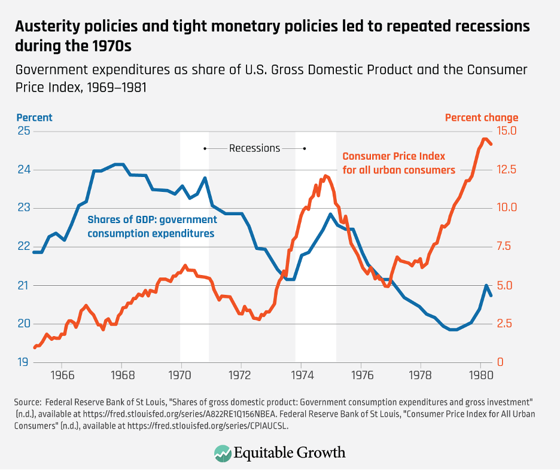

## Table of Contents

## What is stagflation?

Stagflation is when an economy has high inflation, high unemployment, and slow growth all at the same time. It's a tough situation because usually, when there's high inflation, unemployment is low, and the economy is growing. But with stagflation, everything seems to go wrong together.

This problem can be hard to fix. If the government tries to lower inflation by raising interest rates, it might make unemployment even worse. On the other hand, if they try to boost the economy and create jobs, it could make inflation even higher. Stagflation can make people feel stuck because no matter what is done, the economy doesn't seem to get better.

## What were the main causes of stagflation in the 1970s?

In the 1970s, stagflation was mainly caused by a big jump in oil prices. In 1973, some countries that produced oil decided to stop selling it to the United States and other countries. This made the price of oil go way up. Since oil is used for so many things, like making products and moving them around, the higher oil prices made everything more expensive. This led to high inflation because the cost of goods and services went up.

Another reason for stagflation in the 1970s was that the economy was already slowing down. Before the oil crisis, the U.S. economy was not growing as fast as it used to. When oil prices went up, it made things even worse. Companies had to pay more for energy, so they couldn't afford to hire as many people. This led to higher unemployment. At the same time, people had less money to spend, which made the economy grow even slower.

So, the combination of high oil prices and a slowing economy created a perfect storm for stagflation. High inflation from expensive oil, high unemployment from businesses cutting back, and slow economic growth all happened at the same time, making the 1970s a challenging period for the economy.

## How did the oil crisis contribute to stagflation in the 1970s?

The oil crisis in the 1970s played a big role in causing stagflation. In 1973, some countries that produced oil decided to stop selling it to the United States and other countries. This made the price of oil go way up. Since oil is used for so many things, like making products and moving them around, the higher oil prices made everything more expensive. When things get more expensive, that's called inflation. So, the oil crisis caused a lot of inflation because the cost of goods and services went up.

At the same time, the economy was already slowing down before the oil crisis hit. When oil prices went up, it made things even worse. Companies had to pay more for energy, so they couldn't afford to hire as many people. This led to higher unemployment. When people are out of work, they have less money to spend, which makes the economy grow even slower. So, the oil crisis made inflation go up while also making unemployment go up and slowing down the economy, which is what stagflation is all about.

## What were the economic impacts of stagflation on the U.S. economy during the 1970s?

During the 1970s, stagflation had a big impact on the U.S. economy. It made life harder for a lot of people. Prices for things like food and gas went up a lot because of high inflation. This meant that people's money didn't go as far as it used to. At the same time, a lot of people lost their jobs or couldn't find work because of high unemployment. This made it even harder for families to make ends meet. Businesses also had a tough time because they had to pay more for everything, and people weren't buying as much because they didn't have as much money to spend.

The slow growth of the economy during this time made things even worse. When the economy isn't growing, it's hard for businesses to expand and create new jobs. This kept unemployment high. The government tried different things to fix the problem, but it was hard to do. If they tried to lower inflation by raising interest rates, it might make unemployment even worse. If they tried to create jobs by spending more money, it could make inflation even higher. So, the 1970s were a challenging time for the U.S. economy because of stagflation, and it took a while for things to get better.

## How did stagflation affect unemployment rates in the 1970s?

Stagflation in the 1970s made unemployment rates go up a lot. When the price of oil went way up, companies had to pay more for energy. This meant they didn't have as much money to spend on hiring new workers. So, a lot of people lost their jobs, and it was hard for people to find new ones. By the middle of the 1970s, unemployment rates were higher than they had been in a long time.

The slow growth of the economy during this time made things even worse. When the economy isn't growing, businesses don't expand as much, and they don't create new jobs. This kept unemployment high for a long time. It was a tough time for a lot of people because they couldn't find work, and the jobs that were available often didn't pay enough to keep up with the rising prices caused by inflation.

## What were the inflation rates during the stagflation period of the 1970s?

During the stagflation period of the 1970s, inflation rates were really high. In 1973, inflation was around 6.2%, but by 1974, it had jumped to about 11%. This was a big increase and made things like food and gas a lot more expensive. People felt the pinch because their money didn't go as far as it used to.

The high inflation continued into the late 1970s. In 1979, inflation hit about 11.3%, and by 1980, it was even higher at around 13.5%. These high rates made it hard for people to keep up with the cost of living. It was a tough time because wages didn't go up as fast as prices, so people had less money to spend on things they needed.

## How did the government respond to stagflation in the 1970s?

The government tried different things to fight stagflation in the 1970s. At first, they tried to control prices and wages to stop inflation from going up so fast. They thought if they could keep prices from rising too much, it would help. But this didn't work well because it made it hard for businesses to make money, and it didn't really stop inflation.

Later, the government changed its approach. They started to focus more on fighting inflation by raising interest rates. This made it more expensive for people and businesses to borrow money. The idea was that if people spent less, it would slow down the economy and help bring down inflation. It was a tough choice because it made unemployment worse for a while, but it eventually helped to get inflation under control. By the early 1980s, the government's actions started to work, and the economy began to recover from stagflation.

## What were the monetary policies implemented to combat stagflation?

To fight stagflation in the 1970s, the government used different money policies. At first, they tried to control prices and wages. They thought that if they could stop prices from going up too fast, it would help with inflation. But this didn't work well. It made it hard for businesses to make money, and inflation kept going up anyway.

Later, the government changed what they were doing. They started to focus more on fighting inflation by raising interest rates. When interest rates go up, it costs more for people and businesses to borrow money. This makes people spend less, which can slow down the economy. The government hoped this would help bring down inflation. It was a hard choice because it made unemployment worse for a while, but by the early 1980s, it started to work. Inflation went down, and the economy began to get better.

## How did stagflation influence fiscal policy decisions in the 1970s?

Stagflation made it hard for the government to decide what to do about money. They wanted to help the economy grow and create jobs, but they also needed to stop prices from going up so fast. At first, the government tried to control prices and wages to fight inflation. They thought if they could keep prices from rising too much, it would help. But this didn't work well because it made it hard for businesses to make money, and inflation kept going up anyway.

Later, the government changed what they were doing. They started to focus more on fighting inflation by raising interest rates. When interest rates go up, it costs more for people and businesses to borrow money. This makes people spend less, which can slow down the economy. The government hoped this would help bring down inflation. It was a hard choice because it made unemployment worse for a while, but by the early 1980s, it started to work. Inflation went down, and the economy began to get better.

## What were the long-term effects of the 1970s stagflation on economic theory and policy?

The 1970s stagflation changed how people thought about the economy. Before, many believed that if inflation was high, unemployment would be low, and the economy would grow. But stagflation showed that this wasn't always true. It made economists rethink their ideas. They started to look at things like how oil prices and other big changes could affect the economy in new ways. This led to new theories about how to manage the economy better.

The experience of stagflation also changed how governments made policies. They learned that trying to control prices and wages didn't work well. Instead, they started to focus more on using interest rates to control inflation. This meant raising interest rates to slow down the economy and lower inflation, even if it made unemployment worse for a while. Over time, these new policies helped the economy recover and grow again. The lessons from the 1970s stagflation are still used today to help guide economic decisions.

## How did stagflation in the 1970s challenge the Phillips Curve?

Stagflation in the 1970s made people question the Phillips Curve. The Phillips Curve said that when inflation goes up, unemployment goes down, and when inflation goes down, unemployment goes up. But during stagflation, both inflation and unemployment were high at the same time. This didn't fit with what the Phillips Curve said should happen. Economists had to rethink their ideas because the real world was showing something different.

Because of stagflation, economists started to look at other things that could affect the economy. They realized that big changes like oil prices could cause both high inflation and high unemployment. This led to new ways of thinking about how to manage the economy. The Phillips Curve was still used, but people understood it better and knew it wasn't always right. The experience of stagflation changed how economists and policymakers made decisions, and these changes helped the economy get better over time.

## What lessons can be learned from the stagflation of the 1970s to prevent future occurrences?

The stagflation of the 1970s taught us that big changes like oil prices can mess up the economy in ways we didn't expect. It showed that high inflation and high unemployment can happen at the same time, which was different from what people thought before. Economists learned to look at more things that could affect the economy, not just the usual stuff like interest rates and jobs. They realized that trying to control prices and wages directly didn't work well. Instead, they found that using interest rates to slow down the economy could help bring down inflation, even if it made unemployment worse for a while.

From the 1970s, we also learned that it's important to be ready for big shocks to the economy. Governments and central banks now pay more attention to things like energy prices and global events that could cause problems. They use tools like interest rates more carefully to keep the economy stable. The lessons from stagflation help us today to make better plans and policies to keep the economy from getting into the same kind of trouble again.

## References & Further Reading

[1] Hamilton, James D. ["Historical Oil Shocks."](https://www.nber.org/papers/w16790) National Bureau of Economic Research, 2011.

[2] Friedman, Milton. ["Monetary Policy for the 1970s."](https://www.investopedia.com/terms/m/milton-friedman.asp) Journal of Money, Credit and Banking, vol. 6, no. 4, 1974, pp. 693-710.

[3] Blanchard, Olivier Jean. ["Macroeconomics."](https://www.pearsonhighered.com/assets/preface/0/1/3/4/0134897897.pdf) 8th ed., Pearson Education, 2021.

[4] Phillips, A. W. ["The Relation Between Unemployment and the Rate of Change of Money Wage Rates in the United Kingdom, 1861–1957."](https://onlinelibrary.wiley.com/doi/full/10.1111/j.1468-0335.1958.tb00003.x) The Economic Journal, vol. 68, no. 270, 1958, pp. 283-299.

[5] Schwert, G. William. ["Stock Volatility in the New Millennium: How Wacky is Nasdaq?"](https://papers.ssrn.com/sol3/papers.cfm?abstract_id=280289) Review of Financial Studies, vol. 4, no. 1, 2002, pp. 89-125.

[6] Fabozzi, Frank J., et al. ["The Theory and Practice of Investment Management: Asset Allocation, Valuation, Portfolio Construction, and Strategies."](https://onlinelibrary.wiley.com/doi/book/10.1002/9781118267028) 2nd ed., John Wiley & Sons, 2010.

[7] Mitchel, Ronald. ["Stagflation and Economic Theory."](https://legacy.economyleague.org/files/Resources/Documents/stagflation_a_radical_theory_of_unemployment_and_inflation.pdf) Routledge, 1979.