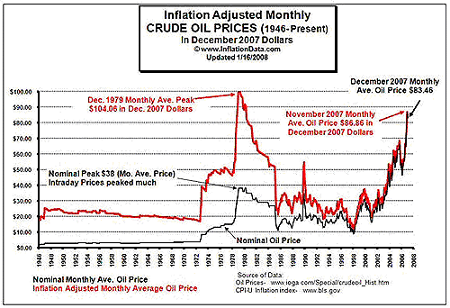

The 1970s was a pivotal decade in economic history, marked by profound challenges and transformations. One of the most defining aspects of this period was the emergence of stagflation, a term that combines stagnation and inflation, which dominated the economic landscape of this era. This unusual combination of high inflation, stagnant economic growth, and rising unemployment posed significant challenges to traditional economic theories and policies.

Stagflation defied the established economic understanding that inflation and unemployment were inversely related. It caused economists and policymakers to reconsider their approaches, leading to notable shifts in economic policy frameworks. During this time, the inadequacies of prevailing economic tools became evident, prompting a search for more effective strategies to manage such complex economic situations.



Understanding the economic dynamics of the 1970s provides valuable insights that resonate with modern economic policies and tools, particularly the advent of algorithmic trading in financial markets. The technological advancements made over the subsequent decades have transformed the global economic and financial environment, enabling data-driven approaches to mitigate economic risks akin to those experienced during the stagflation era.

This article seeks to explore the economic history of the 1970s, examine the phenomenon of stagflation, and trace the evolution of algorithmic trading from its origins to its current application in modern financial markets. By connecting these dots, we aim to offer a comprehensive view of their implications in today's economic environment, emphasizing the continued relevance of historical insights coupled with technological advancements.

## Table of Contents

## The Economic Landscape of the 1970s

The 1970s began with a sense of economic optimism, fueled by the post-war economic expansion. However, this optimism was soon overshadowed by a series of formidable economic challenges that altered the global economic landscape. Foremost among these challenges were the oil shocks, beginning with the 1973 oil crisis. The crisis was instigated by the Organization of the Petroleum Exporting Countries (OPEC) embargo, which led to a drastic increase in oil prices. This event severely disrupted global economies, precipitating widespread energy shortages and increased costs across various sectors [1].

The economic turmoil of the 1970s was marked by rising unemployment rates coupled with soaring inflation—a phenomenon that perplexed economists of the time. Traditional economic theories, which posited that inflation and unemployment were inversely related through the Phillips Curve, struggled to explain the concurrent rise in both metrics. This simultaneous occurrence of stagnation and inflation gave rise to the term "stagflation," encapsulating the dual challenges faced by economies globally.

Economists and policymakers grappled with these new realities, as the tools and theories previously employed seemed inadequate. The Keynesian economic model, which had advocated for increased government spending to combat unemployment, proved ineffective in an environment where inflation was equally pressing. This disconnect between existing economic theories and the evolving real-world scenario underscored the complex interplay of factors contributing to stagflation.

The stagflation era of the 1970s resulted from a confluence of factors, including supply-side constraints, particularly in the oil sector, and ineffective monetary policies that failed to curb inflationary pressures while promoting economic growth. These conditions heralded a period of economic instability and set the stage for significant shifts in economic policy approaches in the subsequent decades, as nations sought to navigate the novel challenges posed by stagflation.

The economic disruptions of the 1970s, underscored by the oil shocks and the emergence of stagflation, fundamentally altered the economic narrative of the time. By exposing the limitations of established economic theories and policies, this period prompted a reevaluation of economic strategies that has influenced both contemporaneous and modern economic thought.

[1] Hamilton, James D. "Historical Oil Shocks". National Bureau of Economic Research.

## Understanding Stagflation

Stagflation in the 1970s represented a puzzling economic anomaly where high inflation coincided with high unemployment, challenging the prevailing economic theory that these two variables were inversely correlated. The core idea defied the concepts embodied in the Phillips Curve, which proposed that inflation and unemployment shared a stable and inverse relationship. The persistence of stagflation during this period indicated that the Phillips Curve might not hold under certain conditions, thereby questioning its universality.

Several factors contributed to this unusual economic phenomenon. Firstly, the 1970s witnessed significant supply shocks, notably in the oil sector. The 1973 oil crisis, triggered by an embargo from the Organization of Arab Petroleum Exporting Countries (OAPEC), drastically increased oil prices globally, driving up production costs across various sectors. This led to an overall increase in price levels, igniting inflationary pressures that were not easily contained by conventional monetary policies.

Moreover, the monetary policies of the early 1970s were often deemed inadequate in addressing these concurrent issues of inflation and unemployment. Central banks, including the Federal Reserve, grappled with policy dilemmas as traditional tools, such as adjusting interest rates, seemed ineffective. Efforts to curb inflation through contractionary monetary policy risked exacerbating unemployment, while expansionary policies aimed at reducing unemployment threatened to fuel inflation further.

The challenge posed by stagflation highlighted the need for an expanded economic understanding beyond the traditional frameworks. Economists and policymakers began to scrutinize the complexities introduced by supply-side factors and the potential limits of demand management strategies. This reevaluation has had lasting implications on economic thought, particularly in appreciating the intricate interplay between external shocks and domestic economic policies.

Understanding the causes and effects of stagflation remains an essential endeavor, as it provides crucial insights into the limitations and adaptability of economic models. The phenomenon underscored the potential for real-world events to deviate from established theories, emphasizing the importance of developing resilient economic policies that can accommodate such anomalies. While the Phillips Curve continues to offer valuable insights, the stagflation of the 1970s serves as a reminder of the complexities inherent in economic systems and the need for continual reassessment of economic beliefs and tools.

## Impact of Stagflation on Economic Policy

The stagflation of the 1970s marked a significant shift in economic policy strategies worldwide, challenging governments and central banks to rethink conventional approaches. During this period, the primary objective became controlling inflation rates, even if it resulted in higher unemployment. The traditional Keynesian approach, which largely focused on stimulating demand to reduce unemployment, proved inadequate in addressing the simultaneous high inflation and stagnation. This realization led to the adoption of new economic paradigms, prominently monetarism and supply-side economics.

Monetarism, championed by economists like Milton Friedman, gained popularity for its emphasis on controlling the money supply as a means to tackle inflation. This approach posited that inflation was primarily a monetary phenomenon, and thus, maintaining a steady growth rate in the money supply was essential to achieving price stability. Central banks, particularly the Federal Reserve in the United States, began to adopt monetarist policies, shifting their focus from targeting employment levels to stabilizing inflation.

Supply-side economics also emerged as a response to stagflation, advocating for policies that increased production efficiency and encouraged investment. This included tax cuts, deregulation, and a reduction in government spending to stimulate economic growth. Proponents argued that by improving the overall economic environment, it would be possible to enhance productivity, leading to lower inflation without sacrificing employment.

The policy innovations of the stagflation era significantly influenced economic governance in subsequent decades, as policymakers sought ways to balance the dual mandates of price stability and full employment. For instance, the adoption of inflation targeting frameworks by many central banks globally is a reflection of lessons learned from the stagflation period. These frameworks prioritize the control of inflation, often setting explicit inflation targets to guide monetary policy decisions.

Understanding these shifts is crucial for comprehending how modern economic policies are formulated and implemented. The experience of the 1970s underscored the limitations of existing economic theories while highlighting the need for flexible policy tools capable of adapting to diverse economic challenges. The legacy of this period continues to inform current economic strategies, as central banks and governments strive to maintain a stable economic environment amidst ever-changing global conditions.

## The Evolution of Algorithmic Trading

Algorithmic trading has fundamentally transformed financial markets, leveraging technological advancements to increase efficiency, speed, and [volume](/wiki/volume-trading-strategy) of trading activities. The roots of [algorithmic trading](/wiki/algorithmic-trading) are deeply tied to the technological innovations that emerged from the late 20th century, particularly the development of powerful computing systems. Although algorithmic trading did not directly arise from the economic crises of the 1970s, understanding these historical challenges provides insight into the necessity for such advancements.

During the 1970s, financial markets suffered significant [volatility](/wiki/volatility-trading-strategies) due to economic conditions like stagflation, where traditional economic theories failed to adequately manage concurrent inflation and unemployment spikes. These challenges highlighted the need for more responsive and data-driven solutions within financial markets. Algorithmic trading, by utilizing complex mathematical models and executing trades at speeds far beyond human capacity, offers a way to manage such risk factors by processing vast amounts of historical and real-time data to forecast potential market trends and execute trades more reliably.

As computing technology developed, particularly during the latter part of the 20th century, it enabled the implementation of sophisticated trading algorithms. Key innovations such as the introduction of electronic communication networks (ECNs) and the automation of direct market access (DMA) trading significantly contributed to the rise of algorithmic trading. These technologies allowed traders to access financial markets directly and execute high-frequency trading strategies that capitalize on minute price discrepancies across different platforms in fractions of a second.

Modern algorithmic trading systems rely heavily on historical data analysis and real-time data processing to identify trading opportunities. These systems utilize statistical [arbitrage](/wiki/arbitrage), [trend following](/wiki/trend-following), and market-making algorithms, among other strategies, to optimize return on investment while managing downside risks. Python has become a popular language for developing such algorithms due to its rich ecosystem of libraries like NumPy for numerical operations, pandas for data manipulation, and scikit-learn for implementing [machine learning](/wiki/machine-learning) models.

The structure and logic of algorithmic trading can be demonstrated through Python code that calculates moving averages, a basic trading strategy:

```python
import pandas as pd

# Load historical market data
data = pd.read_csv('market_data.csv')
data['Date'] = pd.to_datetime(data['Date'])
data.set_index('Date', inplace=True)

# Calculate short and long-term moving averages
short_window = 40
long_window = 100
data['Short_MA'] = data['Close'].rolling(window=short_window, min_periods=1).mean()
data['Long_MA'] = data['Close'].rolling(window=long_window, min_periods=1).mean()

# Generate trading signals based on moving average crossover
data['Signal'] = 0
data['Signal'][short_window:] = np.where(data['Short_MA'][short_window:] > data['Long_MA'][short_window:], 1, 0)
data['Position'] = data['Signal'].diff()

# Display the data with signals
print(data.tail())
```

In this example, a simple moving average crossover strategy marks a buy signal when the short-term moving average surpasses the long-term moving average, and a sell signal when the opposite occurs. While rudimentary, this approach illustrates the core of algorithmic strategies—identifying systematic patterns based on historical data to guide trading decisions.

Algorithmic trading continues to shape modern financial markets, enabling the processing and analysis of millions of data points in real time. By providing a framework that allows for rapid adjustment to dynamic market conditions, it exemplifies a significant paradigm shift inspired by past economic challenges and the continuous evolution of technology.

## Connecting Past and Present: Lessons Learned

The economic upheavals of the 1970s, marked prominently by stagflation, have imparted significant insights with enduring relevance in today's financial world. Stagflation, which challenged the traditional view that inflation and unemployment are inversely related, underscored the inadequacy of conventional Keynesian economic policies. This period illustrated that simplistic economic models could fail under complex, real-world conditions, revealing an urgent need for adaptive and nuanced economic policy frameworks.

As a response to such economic challenges, modern financial systems have increasingly turned towards technological innovations such as algorithmic trading. This form of trading harnesses vast computational power and sophisticated algorithms to analyze market trends and execute trades, often with minimal human intervention. Algorithmic trading allows financial markets to process large volumes of data swiftly, offering a precision tool that can adapt to rapidly changing economic circumstances. By utilizing data-driven strategies, this approach mitigates risks that may arise during economic anomalies similar to those encountered in the 1970s.

Furthermore, the study of past economic events, like those of the 1970s, provides valuable insights that help traders and policymakers anticipate and respond to future uncertainties. For instance, understanding the structural causes and consequences of stagflation enables the development of more robust economic models and policies that can withstand similar scenarios today. Lessons learned during this era emphasize the necessity of flexibility in economic strategies, a principle that remains critical in contemporary economic governance.

The continuous integration of historical economic insights with technological advancements perpetuates a dynamic evolution of economic strategies. This synthesis ensures that strategies are not only grounded in proven historical lessons but are also enhanced by modern technological capabilities, providing a sophisticated arsenal to tackle present and future financial challenges. As financial systems continue to evolve, the interplay of historical understanding and technological innovation will remain a key driver in shaping resilient and adaptive economic policies.

## Conclusion: The Continued Relevance of the 1970s

The 1970s economy remains a cornerstone in understanding economic history and development, largely due to the unique challenges and subsequent transformations it ushered in. The unexpected emergence of stagflation during this decade fundamentally disrupted established economic theories, particularly those that posited an inverse relationship between inflation and unemployment, such as the Phillips Curve. This disruption necessitated a reevaluation of economic strategies, ultimately laying the groundwork for innovations in financial practices, including algorithmic trading.

Stagflation's defiance of traditional economic wisdom catalyzed a wave of introspection and adaptability within the economic community. Policymakers and economists were compelled to acknowledge the limitations of prevailing economic doctrines, fostering a climate conducive to the exploration of novel solutions. Algorithmic trading, although a product of technological advancements occurring later, can be viewed as a manifestation of the adaptive spirit prompted by the 1970s challenges. This approach provides a framework for processing vast datasets efficiently, enabling a more nuanced response to market volatilities reminiscent of those in the stagflation era.

Reflecting on the economic conditions of the 1970s underscores the enduring importance of adaptability and continuous learning in economics. The lessons from this period offer invaluable insights for addressing myriad economic challenges that modern economies face, such as volatile markets, globalization, and technological disruption. By integrating historical lessons with contemporary technological capabilities, economists and policymakers can develop more robust strategies for navigating future uncertainties.

The interplay between historical events and modern technology continues to shape economic landscapes. As technology evolves, it enables more sophisticated responses to economic phenomena, making the lessons from past disruptions all the more relevant. The adaptability demonstrated in the 1970s serves as a vital reminder of the need for continuous learning and innovation. This historical insight, coupled with technological advances, equips modern economies with the tools necessary to address future economic challenges effectively, ensuring that the learnings from the 1970s remain pertinent in the ongoing evolution of economic strategies.

## References & Further Reading

[1] Hamilton, James D. ["Historical Oil Shocks."](https://www.nber.org/papers/w16790) National Bureau of Economic Research, 2011.

[2] Friedman, Milton. ["Monetary Policy for the 1970s."](https://www.investopedia.com/terms/m/milton-friedman.asp) Journal of Money, Credit and Banking, vol. 6, no. 4, 1974, pp. 693-710.

[3] Blanchard, Olivier Jean. ["Macroeconomics."](https://www.pearsonhighered.com/assets/preface/0/1/3/4/0134897897.pdf) 8th ed., Pearson Education, 2021.

[4] Phillips, A. W. ["The Relation Between Unemployment and the Rate of Change of Money Wage Rates in the United Kingdom, 1861–1957."](https://onlinelibrary.wiley.com/doi/full/10.1111/j.1468-0335.1958.tb00003.x) The Economic Journal, vol. 68, no. 270, 1958, pp. 283-299.

[5] Schwert, G. William. ["Stock Volatility in the New Millennium: How Wacky is Nasdaq?"](https://papers.ssrn.com/sol3/papers.cfm?abstract_id=280289) Review of Financial Studies, vol. 4, no. 1, 2002, pp. 89-125.

[6] Fabozzi, Frank J., et al. ["The Theory and Practice of Investment Management: Asset Allocation, Valuation, Portfolio Construction, and Strategies."](https://onlinelibrary.wiley.com/doi/book/10.1002/9781118267028) 2nd ed., John Wiley & Sons, 2010.

[7] Mitchel, Ronald. ["Stagflation and Economic Theory."](https://legacy.economyleague.org/files/Resources/Documents/stagflation_a_radical_theory_of_unemployment_and_inflation.pdf) Routledge, 1979.