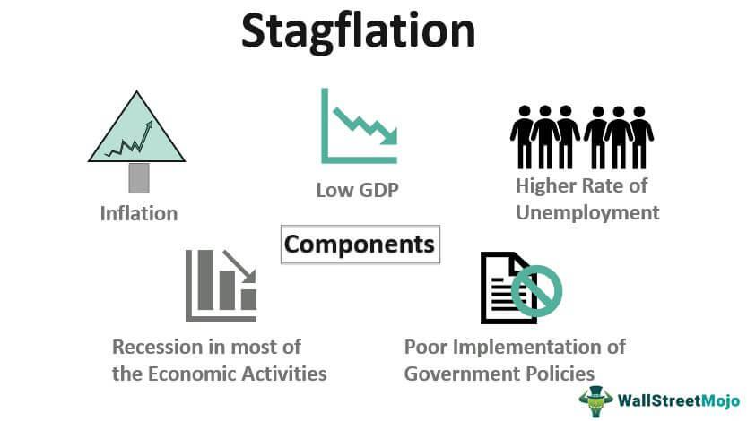

In recent years, the global economy has faced numerous challenges characterized by inflation, economic stagnation, and the emergence of automated trading systems. Among these challenges is stagflation, a perplexing situation where stagnation and inflation coexist, rendering traditional economic policies less effective. Stagflation, unlike typical economic phases, defies conventional theories such as the Phillips Curve, which suggests an inverse relationship between inflation and unemployment. This simultaneous occurrence of high inflation and unemployment complicates policy responses, making it a unique economic conundrum.

Amid these conditions, algorithmic trading offers potential avenues to not only understand these phenomena better but also to mitigate some of their adverse effects. Algorithmic trading—utilizing computer algorithms to execute trades based on pre-set criteria—introduces novel dynamics in financial markets. It combines speed, efficiency, and data analytics, enabling market participants to navigate through economic uncertainties. These automated systems could provide insights into market behavior during stagflation by observing patterns and trends that may not be evident through traditional analysis.



This article aims to provide a detailed exploration of key economic concepts, such as inflation and stagflation, discussing their underlying mechanics and impacts. Furthermore, we explore the role of algorithmic trading in addressing these economic challenges, examining its potential to stabilize financial markets in volatile times. Through this examination, we aim to highlight the intersections of these critical themes and their implications for the broader financial landscape. Understanding these intersections is paramount for economists, policymakers, and investors as they strive to develop robust strategies that can withstand and adapt to the evolving economic environment.

## Table of Contents

## Understanding Inflation and Economics

Inflation represents a sustained increase in the general price level of goods and services in an economy, leading to a reduction in purchasing power. When prices rise, each unit of currency buys fewer goods and services, thus eroding the value of money. The inflation rate is often measured using indices, such as the Consumer Price Index (CPI), which tracks the average change in prices over time for a basket of consumer goods and services.

Inflation can be categorized into several types, each arising from distinct causes. Cost-push inflation occurs when production costs, such as wages and raw materials, increase, prompting producers to raise prices to maintain profit margins. This type of inflation can be influenced by supply chain disruptions or increases in the prices of input commodities like oil. Demand-pull inflation arises when aggregate demand in an economy surpasses aggregate supply, leading to higher prices. It is often associated with economic booms when consumer spending and investment increase. Wage-push inflation takes place when wages increase independently of productivity, causing businesses to pass on the higher labor costs to consumers in the form of increased prices.

Economics, as a discipline, examines how societies allocate scarce resources to produce goods and services and distribute them among individuals. It encompasses the study of human behavior in response to constraints and incentives, aiming to understand decision-making processes and policy outcomes. Central to economics is the concept of equilibrium, where supply meets demand, leading to efficient resource allocation.

Balancing inflation within an economy is crucial for sustaining economic stability. Policymakers, such as central banks, strive to manage inflation through monetary policy tools like interest rates and open market operations. High inflation can result in uncertainty and reduced purchasing power, disrupting economic planning for both consumers and businesses. Conversely, deflation, or the reduction in prices, may lead to decreased consumer spending, as individuals anticipate further price drops. Finding an optimal inflation rate is vital for fostering economic growth, maintaining employment levels, and preserving the currency's value.

Understanding these principles enables effective policy formulation aimed at achieving steady economic growth and stability. By controlling inflation, governments and central banks can mitigate its adverse effects, such as diminished purchasing power and potential impediments to economic growth.

## What Is Stagflation?

Stagflation is a term used to describe an economic condition characterized by stagnant economic growth, high inflation, and significant unemployment. This phenomenon challenges conventional economic theories, particularly the Phillips Curve, which historically suggested an inverse relationship between inflation and unemployment. The notion of stagflation gained prominence during the 1970s, coinciding with the oil crisis that disrupted global economies.

The emergence of stagflation contradicts the expected trade-offs in economic policy, where actions to curb inflation generally lead to higher unemployment, and measures to reduce unemployment potentially encourage inflation. Instead, stagflation manifests when an economy experiences the undesirable combination of both high inflation and high unemployment.

Supply shocks and ineffective economic policies are two primary causes of stagflation. A supply shock, such as a sudden increase in the price of a key commodity like oil, can lead to increased production costs across multiple sectors, which, in turn, drives up prices and triggers inflation. The 1970s oil crises serve as a classic example of a supply shock inducing stagflation. During this period, global oil embargoes and production cuts by OPEC led to skyrocketing oil prices, which pushed inflation higher while also stifling economic growth due to increased production costs and reduced consumer spending power.

Poor economic policies can exacerbate the situation. Policies that excessively expand the money supply without corresponding increases in economic output can lead to inflation without reducing unemployment. For instance, if governments respond to economic slowdowns with aggressive fiscal policies that increase spending or reduce taxes without addressing structural economic issues, they may inadvertently fuel inflation while failing to achieve sustainable economic growth.

The complexity of stagflation presents significant challenges for policymakers. Traditional approaches, such as monetary tightening to combat inflation, might further suppress economic activity, while fiscal measures designed to boost growth could inflate prices further. Consequently, addressing stagflation requires innovative strategies that can simultaneously address these multifaceted economic pressures.

## Economic Impacts of Stagflation

Stagflation presents a multifaceted challenge to economies, primarily due to its unique combination of stagnant growth, high inflation, and elevated unemployment. Traditional monetary and fiscal policies are often ineffective against this phenomenon, as they typically target either inflation or stagnation, but not both simultaneously. Understanding the economic impacts of stagflation is essential for developing effective strategies to mitigate its adverse effects.

One of the primary consequences of stagflation is its impact on consumer spending. High inflation erodes the purchasing power of consumers, leading to a decline in real disposable income. As prices rise, consumers can afford fewer goods and services, which dampens overall demand in the economy. This reduction in consumption further exacerbates economic stagnation, as consumer spending is a significant component of gross domestic product (GDP).

In addition to affecting consumer spending, stagflation adversely influences business investment. High inflation increases uncertainty regarding future costs and revenues, making it difficult for firms to forecast profits accurately. This uncertainty often results in delayed or reduced capital investments, which are crucial for long-term economic growth. Moreover, higher interest rates, which are typically used to combat inflation, increase the cost of borrowing, further discouraging business investments.

Government fiscal positions are also strained during periods of stagflation. Inflation can lead to higher government expenditures, particularly if public sector wages and social benefits are indexed to inflation. At the same time, stagnant economic growth results in lower tax revenues, widening fiscal deficits. This fiscal imbalance can limit the government's ability to respond effectively to stagflation through traditional policy measures, such as increased public spending or tax cuts.

The economic impacts of stagflation necessitate a nuanced approach to policy-making. Policymakers must strike a balance between controlling inflation and stimulating growth, often requiring innovative strategies that go beyond conventional measures. Additionally, understanding the specific factors contributing to stagflation in a given economy can inform tailored policy responses that address the root causes rather than just the symptoms.

In summary, stagflation poses significant challenges to consumer spending, business investment, and government fiscal positions, rendering traditional economic policies less effective. A comprehensive understanding of these impacts is essential for developing adaptive strategies to navigate and mitigate the adverse effects of stagflation, ensuring economic resilience in challenging times.

## Role of Algorithmic Trading in Economic Challenges

Algorithmic trading, which utilizes complex mathematical models and algorithms to execute orders at high speeds, has significantly transformed the financial markets. This method leverages advanced technologies to provide precise and efficient trading solutions, often outpacing human capabilities. In times of economic uncertainty, such as stagflation, [algorithmic trading](/wiki/algorithmic-trading) plays a dual role, capable of both mitigating and amplifying market [volatility](/wiki/volatility-trading-strategies).

During periods of stagflation—where economic growth is slow alongside high inflation—markets can experience abrupt fluctuations. Traditional trading methods may struggle to navigate these turbulent conditions due to their slower reaction times and reliance on human decision-making. Algorithmic trading can offer a stabilizing effect by facilitating rapid transactions that enhance [liquidity](/wiki/liquidity-risk-premium). This increased liquidity is crucial, as it ensures that markets remain functional even under stress, reducing the likelihood of market freezes that could exacerbate economic downturns.

Moreover, algorithmic systems can be programmed to incorporate risk management strategies that adapt to evolving market conditions. By automatically adjusting trading parameters in response to real-time data, these systems can mitigate potential losses during volatile market periods. For instance, algorithms might employ stop-loss strategies to limit exposure or use statistical [arbitrage](/wiki/arbitrage) to exploit price discrepancies, providing a cushion against market instability.

However, the impact of algorithmic trading is not unilaterally positive. These systems can also contribute to market fluctuations, particularly when trading algorithms follow similar strategies across various platforms. This phenomenon, known as "herding," can lead to synchronized buying or selling, thus magnifying price movements and volatility. An infamous example is the "Flash Crash" of May 6, 2010, where the Dow Jones Industrial Average dropped about 1,000 points within minutes, partially attributed to erroneous trades executed by algorithmic systems.

To illustrate the dual role of algorithmic trading during economic challenges, consider the Python code snippet below, which demonstrates a basic example of implementing a moving average crossover strategy—a commonly used algorithmic trading strategy. This strategy involves buying a security when a short-term moving average crosses above a long-term moving average and selling when the opposite occurs.

```python
import numpy as np
import pandas as pd

# Simulated price data
np.random.seed(42)
price_data = np.random.normal(loc=100, scale=1, size=1000)
price_series = pd.Series(price_data)

# Calculating moving averages
short_window = 40
long_window = 100
signals = pd.DataFrame(index=price_series.index)
signals['price'] = price_series
signals['short_mavg'] = price_series.rolling(window=short_window, min_periods=1).mean()
signals['long_mavg'] = price_series.rolling(window=long_window, min_periods=1).mean()

# Generating buy/sell signals
signals['signal'] = 0.0
signals['signal'][short_window:] = np.where(signals['short_mavg'][short_window:] > signals['long_mavg'][short_window:], 1.0, 0.0)
signals['positions'] = signals['signal'].diff()

# Visualizing signals
import matplotlib.pyplot as plt
plt.figure(figsize=(14, 7))
plt.plot(signals['price'], label='Price')
plt.plot(signals['short_mavg'], label='40-Day Moving Average')
plt.plot(signals['long_mavg'], label='100-Day Moving Average')

# Plot buy signals
plt.plot(signals.loc[signals.positions == 1.0].index, 
         signals.short_mavg[signals.positions == 1.0],
         '^', markersize=10, color='g', label='Buy Signal')

# Plot sell signals
plt.plot(signals.loc[signals.positions == -1.0].index, 
         signals.short_mavg[signals.positions == -1.0],
         'v', markersize=10, color='r', label='Sell Signal')

plt.title('Algorithmic Trading: Moving Average Crossover Strategy')
plt.legend()
plt.show()
```

This example highlights how algorithmic trading strategies can be programmed to respond to changing market conditions in an automated manner, thereby potentially smoothing volatility. Nonetheless, given their capacity to inadvertently propagate systemic risk, it is essential for financial institutions to implement robust risk management frameworks. Additionally, regulations are needed to monitor algorithmic trading practices, ensuring they contribute positively even during challenging economic periods.

## Case Studies: Algorithmic Responses to Stagflation

Algorithmic trading, a key innovation in contemporary financial markets, has evolved significantly over recent decades. Its role during periods of stagflation—defined by stagnant economic growth, high inflation, and unemployment—provides valuable insights into its capabilities and limitations. Historical episodes showcase both the potential and challenges of employing algorithmic trading in such volatile conditions.

### Early 2000s: Rising Commodity Prices and Slowing Growth

The early 2000s illustrated a period where commodity prices, including oil, experienced substantial increases while global economic growth decelerated. This scenario bore similarities to stagflation, presenting an ideal case to observe algorithmic trading responses.

One of the lessons from this period was the capacity of algorithmic trading systems to enhance liquidity amidst sluggish market conditions. By executing trades at high speeds and with precision, these systems helped improve market efficiency, which in turn stabilized prices during periods of rapid fluctuations in commodity markets. This behavior was modeled primarily through statistically-driven algorithms designed to identify and exploit short-term market inefficiencies. 

### Algorithmic Trading Responses: Efficiency and Volatility

Algorithmic trading systems operate on pre-defined rules and models that can adapt rapidly to changing market conditions. These systems incorporate various strategies, such as [trend following](/wiki/trend-following), mean reversion, and market-making, each tailored to different market environments.

During stagflation-like conditions, algorithmic trading has shown the ability to manage volatility and provide counter-cyclical market actions. For instance, market-making algorithms supply liquidity by simultaneously providing buy and sell options, thereby narrowing spreads and reducing volatility. Conversely, the sheer dependance on algorithms can sometimes exacerbate market disruptions, especially during atypical market stress—known as flash crashes.

### Lessons Learned

Historical analysis highlights several vital points concerning algorithmic trading in stagflationary periods:

1. **Risk Management**: The necessity for robust risk management frameworks became evident. Algorithms need to be frequently updated to account for anomalies such as abruptly changing inflation rates or unexpected economic data.

2. **Regulatory Challenges**: As algorithmic trading's influence grows, it stresses the importance of regulatory frameworks that ensure fair trading practices while minimizing systemic risks.

3. **Technology and Innovation**: The continual advance of technologies like machine learning and AI offers opportunities to enhance algorithm efficiency. Algorithms increasingly incorporate predictive models that can simulate various economic conditions, offering possible mitigation strategies during stagflation.

In conclusion, while algorithmic trading can provide liquidity and reduced volatility in periods akin to stagflation, significant challenges persist, primarily regarding risk management and the potential for increased market turbulence. Historical patterns underscore the necessity for advanced technological solutions and a coherent regulatory environment to enhance the effectiveness of algorithmic responses in future stagflation scenarios.

## The Future: Mitigating Stagflation with Technology

The integration of advanced technologies such as AI (Artificial Intelligence) and [machine learning](/wiki/machine-learning) presents promising avenues for developing robust trading algorithms capable of mitigating the challenges posed by stagflation. These technologies enable the creation of sophisticated models that can analyze vast amounts of data quickly, identify patterns, and make informed trading decisions that could alleviate some of the adverse effects of stagflation.

AI and machine learning can enhance algorithmic trading strategies by improving prediction accuracy and decision-making speed. For instance, machine learning models can be trained on historical economic and market data to recognize the complex interdependencies between various economic indicators, such as inflation rates, employment data, and gross domestic product (GDP) trends. This allows traders to anticipate market movements that might arise from stagflationary pressures.

One potential strategy for leveraging algorithmic trading against stagflation involves using these technologies to optimize portfolio management. By continuously learning from incoming data and adapting to changing market conditions, algorithmic trading systems can dynamically adjust asset allocations to minimize risk exposure while maximizing returns. Machine learning algorithms, such as [reinforcement learning](/wiki/reinforcement-learning) models, can be particularly useful in this context as they can learn optimal trading strategies through trial and error interactions with market environments.

Moreover, AI-driven sentiment analysis tools can be utilized to gauge market sentiment from various unstructured data sources like news articles, social media, and financial reports. By assessing the market's mood, these tools can predict potential shifts in investor behavior, allowing trading algorithms to respond preemptively to news or events that could exacerbate stagflationary trends.

In terms of technical advancements, developments in distributed ledger technologies, such as blockchain, have the potential to enhance the transparency and security of trading activities. Smart contracts can automate complex trading processes, reducing the need for intermediaries and cutting transaction costs. This increases the efficiency and reliability of trading systems, providing a more stable response to economic turbulence.

Python libraries and frameworks such as TensorFlow or PyTorch can be employed to build and deploy machine learning models for trading applications. Below is a Python code snippet that illustrates a simple machine learning model using TensorFlow to predict market trends based on historical data:

```python
import tensorflow as tf
from tensorflow.keras.models import Sequential
from tensorflow.keras.layers import Dense
import numpy as np

# Simulated historical market data
data = np.array([...]) # Replace with actual data
labels = np.array([...]) # Replace with actual targets

# Define a simple neural network model
model = Sequential([
    Dense(64, activation='relu', input_shape=(data.shape[1],)),
    Dense(32, activation='relu'),
    Dense(1, activation='linear')
])

# Compile the model
model.compile(optimizer='adam', loss='mean_squared_error')

# Train the model
model.fit(data, labels, epochs=10, batch_size=32)

# Predict market trends
predictions = model.predict(data)
```

The pursuit of these technical advancements in algorithmic trading offers hope for developing strategies that are resilient to economic turbulence. As AI and machine learning technologies continue to evolve, their application in financial markets could provide an adaptive mechanism to counteract the multifaceted impacts of stagflation. By fostering innovation and staying at the forefront of technological integration, traders and policymakers can better manage the complexities of modern economic challenges.

## Conclusion

Combating stagflation effectively requires a nuanced strategy that harmoniously integrates economic policy with technological innovations. The interplay of economic insights and algorithmic trading presents a promising avenue for ameliorating the adverse effects of stagflation. By leveraging advanced algorithms, financial markets can achieve enhanced stability and liquidity, thereby offsetting some of the challenges posed by concurrently high inflation and unemployment.

Algorithmic trading offers sophisticated tools to monitor and respond to market fluctuations in real-time, providing decision-makers with valuable data to inform policy decisions. These technologies can help to generate predictive models that anticipate economic trends and enable proactive measures. Additionally, as economic challenges become more complex, resilience and adaptability are indispensable attributes for navigating the uncertainties of financial markets.

The advancement of [artificial intelligence](/wiki/ai-artificial-intelligence) and machine learning further enhances the capability of algorithmic systems to adjust dynamically to market changes. By continuously learning from a vast array of market data, these systems can propose optimized trading strategies that mitigate volatility while maximizing returns. The integration of such technologies with sound economic policy thus holds potential to soften the blow of stagflation, ensuring more resilient economies.

In conclusion, the fusion of algorithmic trading with traditional economic strategies provides a multi-faceted approach that could help nations withstand stagflationary pressures. Embracing technological advancements is essential as we prepare to address future economic challenges with agility and foresight.

## References & Further Reading

1. **Books:**
   - Blanchard, O. (2021). *Macroeconomics*. Pearson. This textbook provides an extensive overview of macroeconomic principles, including discussions on inflation and stagflation.
   - Shiller, R. J. (2019). *Narrative Economics: How Stories Go Viral and Drive Major Economic Events*. Princeton University Press. The book discusses how economic narratives influence economic outcomes and includes insights relevant to inflationary conditions.
   - Treynor, J. L. (2011). *Investment Management: With a Focus on Algorithmic Trading*. Wiley. This book offers insights into the world of algorithmic trading, its evolution, and its implications on the financial market.

2. **Articles and Papers:**
   - Gordon, R. J. (1975). "The Impact of Aggregate Demand on Prices." *Brookings Papers on Economic Activity*. This paper explores historical periods of inflation and the factors influencing price changes.
   - King, M. (2020). "Why Inflation Targets are Not Enough: Analyzing Stagflation Risks." *International Journal of Central Banking*. This article examines the challenges faced during stagflation and the limitations of current monetary policy measures.
   - Hendershott, T., Jones, C. M., & Menkveld, A. J. (2011). "Does Algorithmic Trading Improve Liquidity?" *The Journal of Finance*. This study investigates the impact of algorithmic trading on market liquidity, particularly important during volatile economic periods.

3. **Online Resources:**
   - Investopedia. "Stagflation: What It Is, What Causes It, and How It Ended." This article provides an accessible introduction to the concept of stagflation, including historical context and solutions.
   - Coursera. "Algorithmic Trading and Finance Models with Python, R, and Stata." This online course offers practical knowledge on implementing trading algorithms using modern programming languages.

4. **Studies and Reports:**
   - International Monetary Fund. (2021). *World Economic Outlook Reports*. These reports provide analyses of current economic conditions, including sections on inflation and global economic challenges.
   - Bank of International Settlements. (2020). "The Evolution of Algorithmic Trading in Global Markets." This report assesses the growing role of algorithmic trading across diverse financial marketplaces.

