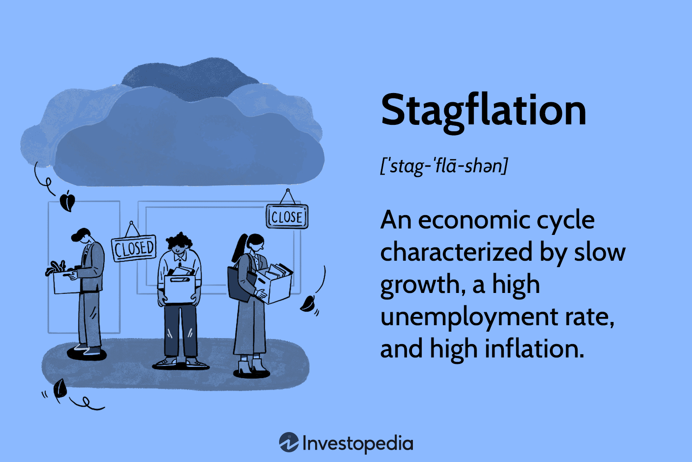

## Table of Contents

## What is stagflation?

Stagflation is when an economy has high inflation, high unemployment, and slow growth all at the same time. It's a tough situation because usually, when there's high inflation, unemployment is low, and the economy is growing. But with stagflation, things are different and more challenging.

This problem can happen because of big shocks to the economy, like a sudden increase in oil prices. When oil prices go up, it costs more to make and transport things, which can lead to higher prices for everything. At the same time, businesses might cut back on production and lay off workers, causing unemployment to rise. It's hard for governments to fix stagflation because the usual solutions, like lowering interest rates, might make inflation worse without helping unemployment or growth.

## How does stagflation differ from other economic conditions like recession or inflation?

Stagflation is different from a recession and inflation because it mixes the bad parts of both. A recession is when the economy is shrinking, and there are lots of people out of work. Inflation, on the other hand, is when prices are going up a lot, but usually, people can still find jobs. Stagflation is tricky because it has high unemployment like a recession, but also high prices like inflation, and the economy isn't growing much.

In a recession, the government might lower interest rates to help businesses borrow money and start hiring again. This can help the economy grow. But with stagflation, lowering interest rates might just make prices go up even more without fixing the unemployment problem. When there's just inflation, raising interest rates can slow down spending and bring prices down. But with stagflation, raising rates could make the unemployment problem worse without really helping with the high prices. So, stagflation is a tough situation that's hard to fix because the usual solutions don't work well.

## What are the main causes of stagflation?

Stagflation often happens because of big shocks to the economy, like when oil prices suddenly go up a lot. When oil gets more expensive, it costs more to make and move things, so prices go up for everything. At the same time, businesses might cut back on what they make and let workers go, which makes unemployment go up. This mix of high prices and lots of people out of work is what makes stagflation so hard to deal with.

Another reason for stagflation can be when a country's money loses value really fast, like with hyperinflation. When money loses value, prices go up a lot, but if the economy isn't doing well, people might still lose their jobs. So, you get high prices and high unemployment at the same time. Also, if the government tries to fix things by printing more money, it can make the problem even worse because it can cause even more inflation without helping the economy grow or people find jobs.

## Can government policies contribute to stagflation? If so, how?

Yes, government policies can contribute to stagflation. If the government prints too much money to try to boost the economy, it can lead to high inflation. When there's too much money chasing too few goods, prices go up. But if the economy isn't doing well and businesses aren't hiring, unemployment stays high. So, you end up with high prices and lots of people out of work, which is stagflation.

Another way government policies can cause stagflation is through big spending programs. If the government spends a lot of money on things like infrastructure or social programs, it can push up demand and cause prices to rise. But if the economy is already struggling, this spending might not create enough new jobs to bring down unemployment. So, you get inflation from the increased spending, but the unemployment problem doesn't get better, leading to stagflation.

## How does a supply shock lead to stagflation?

A supply shock, like a sudden big increase in oil prices, can lead to stagflation. When oil gets more expensive, it costs more to make and move things. This means businesses have to charge more for their products, which makes prices go up for everyone. This is the inflation part of stagflation. At the same time, because it's more expensive to make things, businesses might decide to make less stuff and let some workers go. This makes unemployment go up, which is the other part of stagflation.

So, a supply shock can cause both high prices and high unemployment at the same time. This is different from what usually happens, where high prices might mean more jobs because businesses are doing well. But with a supply shock, the economy can slow down even as prices go up, leading to stagflation. It's a tough situation because the usual ways to fix the economy, like lowering interest rates, might not work well.

## What role do expectations of inflation play in stagflation?

Expectations of inflation can make stagflation worse. If people think prices are going to keep going up, they might start buying things now instead of waiting. This can push prices up even more because everyone is trying to buy at the same time. Businesses might also raise their prices faster if they think costs will keep going up. So, if people expect inflation, it can actually cause more inflation, making the stagflation problem worse.

On the other hand, if people expect high inflation and the economy is already struggling, they might also expect to lose their jobs or have a hard time finding new ones. This can make them spend less money, which can slow down the economy even more. So, high expectations of inflation can lead to both higher prices and slower growth, which are the key parts of stagflation. It's a tricky situation because these expectations can make the problem harder to fix.

## How can stagflation impact employment rates?

Stagflation can make it harder for people to find jobs. When there's stagflation, businesses are dealing with high costs because of inflation. They might decide to make less stuff and let some workers go to save money. This means more people are out of work, and it can be tough to find a new job because lots of other people are looking for work too.

Also, because prices are going up a lot, people might not want to spend as much money. When people spend less, businesses don't need as many workers, so they might not hire new people or might even lay off more workers. This can keep unemployment high, even if the economy is trying to get better. So, stagflation can make it really hard for people to find and keep jobs.

## What are the effects of stagflation on consumer spending and business investment?

Stagflation can make people spend less money. When prices go up a lot because of inflation, people might feel like they can't afford to buy as much as before. They might worry about losing their jobs too, because lots of people are out of work during stagflation. So, instead of buying things they want, people might only buy what they really need. This means stores and businesses don't make as much money, and it can make the economy slower.

Businesses also might not want to spend money on new things during stagflation. When costs are high because of inflation, and they're not sure if people will keep buying their products, businesses might decide to wait before investing in new projects or equipment. They might even cut back on what they're already doing to save money. This can make the economy grow even slower, because businesses aren't putting money into new ideas or hiring more people.

## How do central banks typically respond to stagflation?

Central banks have a tough job when there's stagflation. They usually try to control inflation by raising interest rates. When interest rates go up, it costs more for people and businesses to borrow money. This can slow down spending and help bring prices down. But raising interest rates can also make it harder for businesses to grow and hire new workers, which might make unemployment even worse. So, central banks have to be careful because they don't want to make the unemployment problem bigger while trying to fight inflation.

Sometimes, central banks might try other things too. They might use special tools to help the economy grow without making inflation worse. For example, they might buy and sell government bonds to control how much money is in the economy. This can help keep prices from going up too fast while also trying to help businesses and people. It's a tricky balance, and central banks have to watch the economy closely to see if their plans are working or if they need to try something different.

## What are the long-term economic impacts of stagflation?

Stagflation can make the economy struggle for a long time. When prices keep going up and lots of people can't find jobs, it can be hard for the economy to get better. People might not spend as much money because they're worried about losing their jobs or because things cost too much. This can make businesses not want to grow or hire new workers, which keeps the economy slow. Over time, this can lead to less money being made and less new stuff being built, which can make the country's overall wealth go down.

Also, stagflation can make people lose trust in the economy and the government. When people see that prices are going up but they can't find good jobs, they might start to think that things won't get better. This can make them save their money instead of spending it, which makes the economy even slower. It can also make it harder for the government to fix things because people might not believe that the government's plans will work. So, stagflation can have big effects that last a long time, making it hard for the economy to grow and for people to feel good about their future.

## Can stagflation be predicted, and if so, what are the indicators?

Yes, stagflation can sometimes be predicted by looking at certain signs. One big sign is when prices for important things like oil go up a lot very quickly. This can make other prices go up too, which is part of stagflation. Another sign is if people start expecting prices to keep going up. When people think prices will keep rising, they might start buying more now, which can make prices go up even faster. Also, if the economy is already slowing down and businesses are not hiring as much, this can be another warning that stagflation might be coming.

Another thing to watch out for is if the government is printing a lot of new money or spending a lot without the economy growing. This can lead to higher prices, but if the economy isn't doing well, it might not create enough jobs. So, you can get high prices and high unemployment at the same time, which is stagflation. By keeping an eye on these signs, people who study the economy can sometimes see stagflation coming before it happens, but it's not always easy to predict.

## What strategies can be employed to mitigate the effects of stagflation?

To help with stagflation, the government and central bank can work together. The central bank might raise interest rates a little bit to slow down how fast prices are going up. But they have to be careful not to raise them too much, because that could make it even harder for people to find jobs. The government can also help by making it easier for businesses to grow and hire new workers. They might give businesses some money or help them in other ways, so they can keep making things and people can keep their jobs.

Another thing that can help is if the government tries to control how much prices go up. They might do this by helping businesses find cheaper ways to make things, like using less oil. The government can also help people by giving them money or other help so they can still buy what they need, even if prices are high. It's important for everyone to work together to try to fix the problem, because stagflation can be really hard to deal with.

## References & Further Reading

1. **Books:**
   - Blanchard, O. (2021). *Macroeconomics*. Pearson. This textbook provides an extensive overview of macroeconomic principles, including discussions on inflation and stagflation.
   - Shiller, R. J. (2019). *Narrative Economics: How Stories Go Viral and Drive Major Economic Events*. Princeton University Press. The book discusses how economic narratives influence economic outcomes and includes insights relevant to inflationary conditions.
   - Treynor, J. L. (2011). *Investment Management: With a Focus on Algorithmic Trading*. Wiley. This book offers insights into the world of algorithmic trading, its evolution, and its implications on the financial market.

2. **Articles and Papers:**
   - Gordon, R. J. (1975). "The Impact of Aggregate Demand on Prices." *Brookings Papers on Economic Activity*. This paper explores historical periods of inflation and the factors influencing price changes.
   - King, M. (2020). "Why Inflation Targets are Not Enough: Analyzing Stagflation Risks." *International Journal of Central Banking*. This article examines the challenges faced during stagflation and the limitations of current monetary policy measures.
   - Hendershott, T., Jones, C. M., & Menkveld, A. J. (2011). "Does Algorithmic Trading Improve Liquidity?" *The Journal of Finance*. This study investigates the impact of algorithmic trading on market liquidity, particularly important during volatile economic periods.

3. **Online Resources:**
   - Investopedia. "Stagflation: What It Is, What Causes It, and How It Ended." This article provides an accessible introduction to the concept of stagflation, including historical context and solutions.
   - Coursera. "Algorithmic Trading and Finance Models with Python, R, and Stata." This online course offers practical knowledge on implementing trading algorithms using modern programming languages.

4. **Studies and Reports:**
   - International Monetary Fund. (2021). *World Economic Outlook Reports*. These reports provide analyses of current economic conditions, including sections on inflation and global economic challenges.
   - Bank of International Settlements. (2020). "The Evolution of Algorithmic Trading in Global Markets." This report assesses the growing role of algorithmic trading across diverse financial marketplaces.

