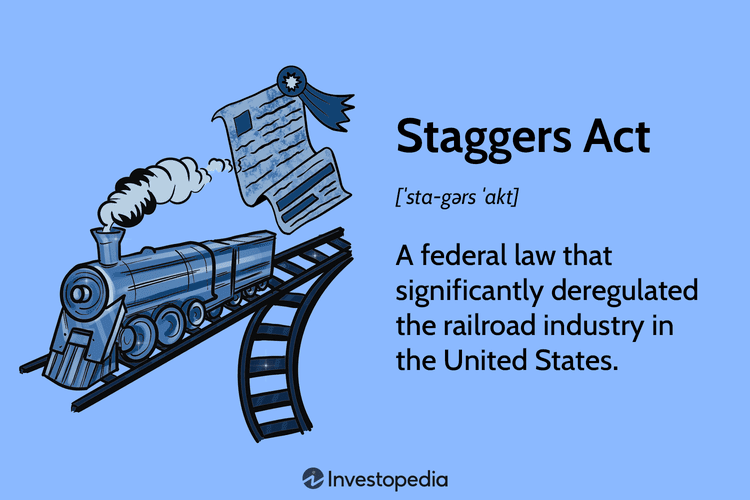

The Staggers Rail Act, enacted in 1980, stands as a pivotal development in U.S. transportation policy, redefining the operational landscape of the railroad industry. Prior to this legislation, the railroad sector was subjected to extensive regulatory oversight under the Interstate Commerce Act of 1887, which constrained the industry's ability to respond effectively to market demands. The Staggers Act marked a significant shift towards deregulation by allowing market forces to dictate rail rates, giving railroad companies the autonomy to establish competitive pricing structures without stringent regulatory constraints.

This deregulation not only revolutionized transportation logistics by enhancing operational efficiencies and reducing costs but also had profound implications for financial markets and trading strategies. By liberalizing rail rate-setting, the Act opened new avenues for financial innovation, influencing the creation of financial instruments tied to rail freight rates. The newfound financial flexibility enabled by the Staggers Act facilitated the integration of rail transportation dynamics into algorithmic trading strategies. Traders and investors started to employ sophisticated algorithms to analyze rail freight data, thus impacting derivatives and commodities markets by leveraging real-time supply chain analytics.



This article will explore the multifaceted impact of the Staggers Rail Act on rail transportation, examining how deregulation fostered an environment ripe for financial innovation. In particular, we will see how these changes have shaped the evolution and integration of rail logistics with algorithmic trading, illustrating the interconnectedness of modern transportation systems and financial markets.

## Table of Contents

## Background: The State of Railroads Pre-Staggers Act

Prior to the enactment of the Staggers Rail Act in 1980, the U.S. railroad industry was subject to extensive regulation under the Interstate Commerce Act of 1887. This act established the Interstate Commerce Commission (ICC), a federal entity tasked with overseeing the railroad industry's activities, including rate-setting and operational practices. The primary objective of this regulatory framework was to prevent monopolistic practices and ensure fair treatment for agricultural producers and smaller businesses reliant on rail transport.

However, as the 20th century progressed, the advent of trucking and personal vehicles began to erode the dominance of the railroads. The enhanced flexibility and lower costs associated with these alternative modes of transportation offered shippers more options, leading to a marked decline in the profitability of the railroad industry. The trucking industry, in particular, benefited from the development of the interstate highway system, offering a direct and efficient alternative for freight transport.

By the 1970s, these dynamics had culminated in severe financial difficulties for the railroads. The rigid regulatory controls imposed by the ICC hindered the rail industry's ability to adapt to changing market conditions. Rail companies were constrained by inflexible pricing mechanisms and were often required to maintain unprofitable routes. Consequently, many rail operators struggled with dwindling revenues and rising operational costs, placing additional financial strain on them.

This precarious situation precipitated a widespread recognition of the need for substantial reform within the rail industry. The existing regulatory framework had not only stifled competition but also discouraged innovation and investment in railway infrastructure and technological advancements. As a result, the rail industry advocated for deregulation as a means to revitalize its operations and improve economic performance.

The dire financial state of the railroads, coupled with the pressures from burgeoning competition and an inflexible regulatory environment, set the stage for the transformative changes introduced by the Staggers Rail Act. This legislation was aimed at removing the restrictive oversight that had throttled the industry, thereby allowing market forces to more effectively dictate operational and pricing strategies.

## The Staggers Rail Act: Key Provisions and Objectives

The Staggers Rail Act, signed into law in 1980, fundamentally altered the regulatory landscape of the U.S. rail industry. Aimed at revitalizing a floundering sector, the act introduced significant deregulatory measures to enhance efficiency and competitiveness. Central to the act was the provision allowing railroads to set rates based on market forces rather than adhering to predetermined tariffs set by the Interstate Commerce Commission (ICC). This shift enabled rail carriers to adjust pricing dynamically, reflecting supply and demand fluctuations, ultimately fostering a more competitive market environment.

Another critical aspect of the Staggers Act was the authorization for rail carriers to enter into confidential contracts with shippers without direct ICC oversight. This provision allowed railroads to negotiate tailored agreements with shippers, catering to specific logistical and cost requirements while promoting flexibility and innovation within the industry. By reducing the bureaucratic oversight typically associated with rate setting and contract negotiations, the act streamlined operations, expediting decision-making processes which were previously hindered by regulatory red tape.

Moreover, the act facilitated easier entry and [exit](/wiki/exit-strategy) from the rail market, allowing companies to respond quickly to shifting economic conditions. Railroads were granted the freedom to abandon unprofitable lines without extensive regulatory hurdles, thus reallocating resources to more lucrative segments of their networks. This flexibility encouraged service improvements as railroads were incentivized to enhance the profitability and efficiency of their operations.

The Staggers Act's deregulatory framework fundamentally transformed the rail industry, positioning it as a more agile and economically viable mode of transportation. By fostering competition and eliminating unnecessary regulatory constraints, the act paved the way for significant advancements in service quality and financial health across the U.S. rail network.

## Impact of the Staggers Act on the Rail Industry

The Staggers Rail Act of 1980 significantly transformed the landscape of the U.S. railroad industry by introducing extensive deregulation measures. This legislative change marked a departure from stringent controls, allowing railroads more freedom to set rates and establish services based on market dynamics.

Deregulation under the Staggers Act led to a noticeable decrease in rail transportation costs. This reduction can be attributed to increased competition among rail carriers, which encouraged efficiency and cost-cutting measures. Studies have shown that, following the enactment of the Act, rail freight rates fell by an average of 44% in real terms by the year 2000. This significant cost reduction not only benefited rail companies but also lowered shipping costs for businesses relying on rail freight, enhancing supply chain efficiency across sectors.

As a result of these changes, railroads across the United States experienced a period of revitalization. Financially, the industry's health improved markedly, with companies seeing a rise in profitability and investments in infrastructure and technology enhancements. Railroads regained market share in the freight transportation sector, reversing the decline experienced in the decades prior. In 1980, railroads' market share of intercity freight had dipped to 35%, but by 1997, it rose to over 40%.

Another major outcome of the Staggers Act was industry consolidation. The new regulatory framework encouraged mergers and acquisitions, as railroads sought to optimize their operations and service offerings. This consolidation resulted in a reduced number of major carriers, which dropped from 40 in 1980 to just a few major players by the 2000s. Despite the decrease in the number of major carriers, competitive practices intensified. Remaining carriers innovated their service delivery, integrating advanced logistics and real-time data management to enhance customer experience and operational efficiency.

Overall, the impact of the Staggers Rail Act on the U.S. rail industry is characterized by lower costs, enhanced efficiency, industry revitalization, and strategic consolidation, underscoring the significant role deregulation plays in shaping industry landscapes.

## Algorithmic Trading and Rail Transportation: A Converging Path

The financial implications of rate deregulation in the rail sector have significantly shaped [algorithmic trading](/wiki/algorithmic-trading) strategies within the derivatives and commodities markets. The deregulation allowed rail companies to set freight rates according to market supply and demand, thereby creating a dynamic pricing environment. This variability in pricing is essential data for traders, who develop algorithms to predict fluctuations in rail freight rates. These algorithms utilize historical pricing data, economic indicators, and real-time logistical information to forecast future movements.

Algorithmic trading systems often employ statistical and [machine learning](/wiki/machine-learning) models to decipher patterns within data sets. One common approach is the application of time-series analysis, which helps identify trends and seasonal patterns in freight rates. Python libraries such as `pandas`, `statsmodels`, and `scikit-learn` are frequently used by traders to perform these analyses. 

For instance, a basic implementation to forecast rail freight rates might use autoregressive integrated moving average (ARIMA) models. Here is a simplified example in Python:

```python
import pandas as pd
from statsmodels.tsa.arima.model import ARIMA

# Load historical rail freight rate data
data = pd.read_csv('rail_freight_rates.csv')
rates = data['Freight_Rate']

# Fit ARIMA model
model = ARIMA(rates, order=(5,1,0))
model_fit = model.fit()

# Forecast future rates
forecast = model_fit.forecast(steps=12)
print(forecast)
```

Additionally, as rail logistics weave more integrally with supply chain analytics, real-time data becomes increasingly central to trading decisions. High-frequency data such as sensor readings and GPS tracking of rail cars provide insights into operational efficiency and transit times, impacting cargo delivery schedules. This real-time information is critical for optimizing supply chain operations and can influence trading strategies that rely on timely shipment of goods.

Traders also pay attention to economic indicators such as industrial production indices and consumer demand metrics, which can affect freight [volume](/wiki/volume-trading-strategy) and pricing. By integrating these variables into their algorithms, traders can develop more robust models that anticipate rate changes in the context of broader economic movements.

The convergence of rail transportation and algorithmic trading illustrates the importance of data integration and analysis in modern markets. As predictive accuracy improves with technology advancements, traders continue to fine-tune their strategies to leverage the interplay between transportation logistics and financial trading. This continuous feedback loop impacts market stability and offers opportunities for profit in derivatives and commodities trading.

## Contemporary Debates and Future Prospects

The Staggers Rail Act remains a focal point of discussion in contemporary transportation policy, highlighting ongoing debates regarding the balance between deregulation and the need for fair competition. Critics argue that the act, while successful in rejuvenating the rail industry, has led to a consolidation of power among a few major railroad companies. This concentration raises concerns about potential monopolistic practices and the limited negotiating power of smaller shippers who may face fewer alternatives and potentially higher rates. The possibility of reinstating some regulatory measures to ensure competitive fairness and guard against price discrimination is an ongoing topic of legislative and economic scrutiny.

Advancements in technology and evolving economic conditions present both challenges and opportunities for the rail industry. Innovations such as autonomous trains, blockchain for supply chain transparency, and enhanced data analytics offer pathways to greater efficiency and service quality. These technologies can potentially transform rail transportation by optimizing routing, reducing costs, and improving scheduling, further integrating the rail system with broader supply chain operations.

In financial markets, the integration of advanced analytics continues to shape trading strategies linked to rail transportation. Real-time data on rail freight movements, enabled by technologies like the Internet of Things (IoT) and [artificial intelligence](/wiki/ai-artificial-intelligence) (AI), allow traders to develop more precise predictive models for rail rate fluctuations and logistics trends. This integration underscores the importance of maintaining a flexible regulatory framework that can adapt to technological advancements while safeguarding equitable market practices.

In summary, while the Staggers Rail Act successfully addressed the challenges faced by the rail industry in the late 20th century, ongoing debates and technological developments will likely influence future policy decisions. The interplay between regulation, innovation, and market dynamics will be crucial in shaping the future of rail transportation and its intersection with financial markets.

## Conclusion

The Staggers Rail Act was instrumental in transforming the U.S. rail industry, offering compelling evidence of the efficacy of deregulation. By allowing market forces to dictate rail rates and operations, the act revitalized what had been a struggling sector. Railroads experienced a renaissance, leading to improved service levels, enhanced efficiency, and a substantial reduction in shipping costs. The streamlined operations also resulted in consolidation within the industry, which, while reducing the number of players, actually fostered competitive practices and strategic partnerships.

The impact of the Staggers Act extends far beyond the boundaries of transportation logistics; it reaches into the financial markets, highlighting the deeply interconnected nature of modern economic systems. With deregulation, the [volatility](/wiki/volatility-trading-strategies) and dynamism of rail freight rates presented new opportunities and challenges for financial analysts and traders. The integration of rail logistics data into supply chain analytics and algorithmic trading strategies has become increasingly significant. By analyzing these data points, traders can predict market movements, assess risks, and create more informed trading strategies that can significantly impact derivatives and commodities markets.

As we look forward, the lessons learned from the Staggers Act continue to provide vital insights into optimizing market-driven strategies. The success of rail deregulation underscores the potential benefits that such measures can bring to other industries. However, it is crucial to balance deregulation with protective measures to ensure fairness and competition. The evolution of technology and the global economy will inevitably shape further developments in transportation and financial markets, making it essential to remain attentive to the interplay between policy and market forces.

## References & Further Reading

[1]: Gallamore, R.E., & Meyer, J.R. (2014). ["American Railroads: Decline and Renaissance in the Twentieth Century,"](https://www.hup.harvard.edu/books/9780674970793) Harvard University Press.

[2]: Bitzan, J.D., Keeler, T.E., & Peoples, J.H. (2003). ["The Staggers Act, 20 Years Later."](https://link.springer.com/article/10.1007/s11149-012-9193-4) Brookings Institution.

[3]: MacDonald, J.M. (1987). ["Railroad Deregulation: Pricing Reforms, Shipper Responses, and the Effects on Liner Shipping Rates,"](https://journals.sagepub.com/doi/abs/10.1177/001979399605000105) Journal of Law and Economics, 30(1), 63-99.

[4]: Gorman, M. F. (2008). ["Evaluating the Public Investment Mix in US Freight Transportation Infrastructure: A Transportation Agency Perspective."](https://en.wikipedia.org/wiki/Trailblazer_Project) Transportation Research Record: Journal of the Transportation Research Board, (2066), 12-19.

[5]: ["Algorithmic Trading and DMA: An Introduction to Direct Access Trading Strategies"](https://www.amazon.com/Algorithmic-Trading-DMA-introduction-strategies/dp/0956399207) by Barry Johnson.

[6]: Levinson, M. (2005). ["The Box: How the Shipping Container Made the World Smaller and the World Economy Bigger,"](https://archive.org/details/boxhowshippingco0000levi) Princeton University Press.