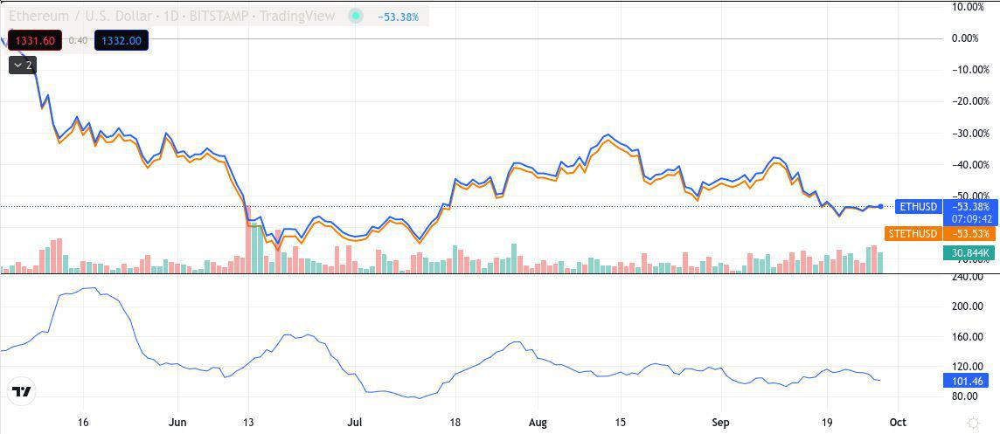

Ethereum is a decentralized blockchain platform that facilitates the creation and execution of smart contracts and decentralized applications (dApps). Launched in 2015, it has quickly become a pivotal component in the world of digital finance due to its versatility and active developer community. Ethereum's native cryptocurrency, Ether (ETH), is used for transaction fees and as a staking asset.

Staking on Ethereum involves users committing their Ether to secure and maintain the network. This process is fundamental to Ethereum's consensus mechanism, transitioning from proof-of-work (PoW) to proof-of-stake (PoS). In PoS, validators are chosen to propose and verify blocks based on the amount of ETH they stake, which enhances the network's security and energy efficiency.



stETH, short for staked Ether, represents the tokenized form of staked ETH. It plays a significant role in the Ethereum ecosystem as a liquid staking token, allowing users to engage in staking without locking their funds completely. This token is issued by platforms like Lido Finance, which pool users' ETH and provide them with stETH in return. As stETH is tradable, it provides stakers with immediate liquidity while still earning staking rewards.

Algorithmic trading is an integral topic concerning stETH as it leverages computer algorithms to automate and optimize trading strategies. In the context of stETH, algorithmic trading facilitates efficient market participation by analyzing vast datasets and executing trades at high speeds. This is particularly advantageous given stETH's liquidity attributes, as it allows traders to capitalize on market movements without the constraints of traditional staked ETH.

Interest in staking and trading stETH has surged as investors seek new ways to maximize returns in the decentralized finance (DeFi) space. The liquid nature of stETH attracts traders focused on yield optimization, while algorithmic trading tools continue to advance, providing more sophisticated tools for market analysis. This growing fascination reflects the evolving landscape of Ethereum staking, stETH, and the innovative trading strategies that accompany them.

## Table of Contents

## Understanding Ethereum Staking

Ethereum staking is a process whereby participants in the Ethereum network deposit and lock up a specific amount of Ethereum (ETH) to support network operations such as block validation, security, and governance. Staking serves as the backbone of Ethereum's consensus mechanism, Proof-of-Stake (PoS), which Ethereum transitioned to from its previous Proof-of-Work (PoW) system.

### Purpose of Ethereum Staking

The primary objective of Ethereum staking is to enable network participants to contribute to the security and efficiency of the blockchain in a decentralized manner. By staking ETH, participants, known as validators, are chosen to propose and validate new blocks on the blockchain. Validators are incentivized through rewards, which are distributed as additional ETH, contingent on their honesty and active participation in the network.

### Maintaining the Ethereum Network

Staking plays a crucial role in maintaining the Ethereum network by ensuring decentralization and enhancing security. Validators are required to maintain an online presence and perform timely block validations. In the event of dishonest behavior or inactivity, validators risk losing part or all of their staked ETH as a consequence, known as slashing. This economic incentive aligns participants' interests with the health and security of the network.

### Transition from Proof-of-Work to Proof-of-Stake

Ethereum's transition from PoW to PoS, known as "Ethereum 2.0" or "The Merge," marked a significant shift in blockchain technology aimed at improving scalability, efficiency, and energy consumption. Under the PoW model, miners competed to solve complex mathematical problems to propose new blocks, a process requiring significant computational power and energy consumption. PoS, by contrast, assigns block validation rights based on the amount of ETH staked, which substantially reduces the energy requirements and contributes to environmental sustainability.

### Benefits and Risks of Ethereum Staking

Staking ETH offers several benefits:

1. **Rewards and Passive Income**: Validators earn rewards generated through transaction fees and newly minted ETH, providing a potential source of passive income.

2. **Security Improvements**: PoS encourages a more secure and robust network by disincentivizing malicious activities through potential slashing.

3. **Reduced Energy Consumption**: Compared to PoW, PoS drastically reduces the network's energy consumption, aligning Ethereum with environmentally sustainable practices.

However, Ethereum staking also entails certain risks:

1. **Slashing Risk**: Validators that engage in malicious activities or become inactive may lose their staked ETH through slashing.

2. **Liquidity Constraints**: Staked ETH is typically locked for a specific period, limiting participants' ability to liquidate assets quickly.

3. **Volatility**: The inherent volatility of ETH prices poses a risk, as the value of rewards and staked assets can fluctuate significantly.

In conclusion, Ethereum staking forms an integral component of the network's PoS framework, driving security, decentralization, and efficiency. While it offers opportunities for rewards, participants must navigate associated risks and considerations.

## Exploring stETH: A Liquid Staking Token

stETH, or staked Ether, serves as a liquid staking token that plays a crucial role within the Ethereum ecosystem. As a liquid representation of staked Ether, stETH allows users to engage in Ethereum staking without the traditional requirement of locking up their assets. This innovative approach not only enhances liquidity but also facilitates greater participation in the Ethereum network's proof-of-stake framework.

### stETH and Staking Without Locking Assets

A primary advantage of stETH is its ability to provide [liquidity](/wiki/liquidity-risk-premium) while maintaining the benefits of staking. In typical staking models, assets are locked, preventing their use for other purposes during the staking period. However, stETH allows users to receive a token in exchange for their staked Ether, which can then be freely traded or used in decentralized finance (DeFi) applications. This flexibility ensures that users can benefit from the rewards of staking without sacrificing liquidity.

### Balancing Staking and Liquidity

stETH strikes a balance between staking and liquidity by representing staked assets with a derivative token. Users can stake their Ether through platforms that support stETH, such as Lido Finance, where their ETH is pooled together to contribute to the Ethereum network's security and block validation. In return, users receive stETH tokens equivalent to the amount of Ether they have staked. These tokens accrue value over time, reflecting the holder's share of the rewards generated from staking, thus incorporating both the benefits of liquidity and staking.

### Platforms and Mechanisms Supporting stETH

Several platforms and protocols underpin the use of stETH and provide mechanisms to facilitate its integration into the Ethereum ecosystem. Lido Finance is the primary platform that enables users to stake ETH and receive stETH in return. Lido uses a decentralized approach, distributing staked Ether across multiple validators to mitigate risk and ensure network reliability.

Additionally, the integration of stETH with DeFi platforms further enhances its utility. Users can utilize stETH in various DeFi protocols to earn additional yields, trade derivatives, or provide liquidity in automated market makers (AMMs) like Uniswap and Curve Finance. This ecosystem-wide connectivity fosters an environment where stETH holders can optimize their digital assets while actively contributing to the network's security.

Through these mechanisms, stETH not only enables seamless participation in Ethereum staking but also fosters a dynamic financial environment that promotes both asset utilization and growth. This liquid staking token epitomizes a significant advancement in the participatory model of blockchain networks, particularly within Ethereum's steadily evolving proof-of-stake architecture.

## The Role of Algorithmic Trading in stETH

Algorithmic trading, or algo trading, refers to the use of computer algorithms to execute trading strategies based on pre-defined criteria and parameters, without the need for human intervention. These algorithms can process vast amounts of data at rapid speeds, allowing traders to efficiently execute orders, manage portfolios, and exploit market inefficiencies. Algorithmic trading can mitigate human error and emotional responses, providing a systematic approach to trading.

In the context of stETH, [algorithmic trading](/wiki/algorithmic-trading) involves employing these automated strategies to optimize transactions involving stETH tokens on various trading platforms. Given stETH's unique role as a liquid staking token on the Ethereum blockchain, algorithmic trading can enhance its liquidity and market dynamics. 

One of the primary advantages of using algorithmic trading with stETH is the ability to capitalize on [arbitrage](/wiki/arbitrage) opportunities. Since stETH prices can vary across different exchanges, algorithms can quickly buy stETH where it's undervalued and sell it where it's overvalued, thereby ensuring consistent profits with minimal risk. Additionally, algorithms can manage complex strategies that incorporate staking rewards and changes in Ethereum's network dynamics, optimizing the yield on stETH holdings while maintaining desired liquidity levels.

Various strategies and tools are employed in stETH algorithmic trading. Market-making algorithms play a crucial role, as they provide liquidity by continuously quoting buy and sell prices, thus ensuring tighter spreads and smoother trading operations. These algorithms can adaptively adjust to changing market conditions, facilitating greater stETH trading [volume](/wiki/volume-trading-strategy) and stability.

Another commonly used strategy is [statistical arbitrage](/wiki/statistical-arbitrage), which involves analyzing price patterns and relationships between stETH and other correlated assets to predict future price movements. Machine learning algorithms can enhance this approach by continuously learning from new market data, optimizing predictions, and improving the overall effectiveness of the strategy.

Execution algorithms, such as TWAP (Time Weighted Average Price) and VWAP (Volume Weighted Average Price), are also vital in minimizing market impact and ensuring that large stETH trades do not disrupt the market balance. By breaking down large orders into smaller, strategically timed trades, these algorithms help maintain optimal entry and [exit](/wiki/exit-strategy) points for traders.

Overall, algorithmic trading offers a robust framework for trading stETH, allowing traders to efficiently manage risks, optimize liquidity, and maximize returns. As the stETH market continues to mature, the integration of advanced algo trading strategies is likely to become more prevalent, further enhancing the trading ecosystem for stETH.

## Benefits and Challenges of Trading stETH

Trading stETH, an Ethereum liquid staking token, offers several benefits and challenges that investors need to consider. One of the primary benefits is the ability to participate in Ethereum's proof-of-stake blockchain without losing liquidity, which is typically associated with traditional staking. This flexibility allows traders to engage in the DeFi ecosystem by leveraging their stETH holdings in other financial instruments, potentially generating additional income streams. 

**Benefits of Trading stETH:**

1. **Accessibility to Staking Rewards:** Trading stETH enables holders to earn staking rewards without directly participating in the staking process. This opens up opportunities for those who may not have the technical expertise or the required minimum deposit for direct staking.

2. **Maintained Liquidity:** Unlike conventional staking that locks funds, stETH holders can trade or use their tokens in other DeFi protocols, providing continuous liquidity. This feature supports diverse trading strategies and enhances portfolio flexibility.

3. **Capital Efficiency:** By holding stETH, traders can maximize their capital efficiency. They not only benefit from staking rewards but also retain the ability to capitalize on market opportunities through various DeFi platforms.

**Challenges of Trading stETH:**

1. **Market Volatility and Risks:** The crypto market is inherently volatile. The price of stETH can fluctuate based on Ethereum's market trends or network updates, exposing traders to potential risks. While algorithmic trading can help manage some of this volatility, it also requires robust risk management strategies.

2. **Liquidity Issues and Mitigations:** stETH may face liquidity constraints, especially during periods of high market demand or network congestion. To mitigate these issues, traders can engage with liquidity pools or utilize decentralized exchanges that support stETH trading to enhance market depth and accessibility.

3. **Maximizing Returns:** To optimize returns, traders must devise effective strategies incorporating both staking rewards and market movements. Leveraging advanced algorithmic trading tools and analytics can aid traders in identifying profitable patterns and decisions.

To illustrate maximizing stETH returns, consider a simple Python code snippet that can help simulate trading strategies under various market conditions:

```python
import numpy as np

# Assume initial investment in stETH
initial_investment = 100.0

# Simulated returns based on market volatility
steth_yearly_return = np.random.normal(loc=0.05, scale=0.15, size=365)

# Staking rewards
staking_rewards = 0.04 / 365  # Daily staking reward

# Portfolio value simulation
portfolio_value = initial_investment
for daily_return in steth_yearly_return:
    # Update daily based on market return and staking rewards
    portfolio_value *= (1 + daily_return + staking_rewards)

print(f"Final portfolio value: {portfolio_value:.2f}")
```

This script provides a basic model for understanding potential outcomes of stETH trading combined with staking rewards, helping investors calibrate their strategies to market conditions.

In conclusion, while stETH trading presents lucrative opportunities, it also requires a keen understanding of market dynamics and risk management practices. Adopting advanced trading tools and maintaining continuous market awareness can significantly enhance a trader's ability to succeed in this evolving financial landscape.

## Future Trends in stETH and Algorithmic Trading

Emerging trends in the stETH market and advancements in algorithmic trading technologies continue to shape the landscape of Ethereum staking. A significant development is the increasing adoption of decentralized finance (DeFi) platforms that offer stETH-related services. These platforms enable users to maximize their returns through yield farming and liquidity provisioning by leveraging stETH’s liquidity. Moreover, innovations in smart contract technology enhance the efficiency and security of these transactions, further driving interest and participation in the stETH market.

Algorithmic trading technologies are predicted to evolve with advancements in [artificial intelligence](/wiki/ai-artificial-intelligence) and [machine learning](/wiki/machine-learning) algorithms. These technologies are expected to improve predictive analytics, allowing traders to make more precise decisions regarding stETH transactions. Sophisticated trading algorithms can analyze vast datasets in real-time, identifying patterns and trends that may not be immediately apparent to human traders. Python libraries such as TensorFlow and PyTorch facilitate the development and implementation of these advanced trading algorithms. The increasing availability of high-frequency trading platforms specifically designed for cryptocurrencies also suggests that algorithmic trading will become more accessible to a broader range of traders, potentially leveling the playing field for individual investors.

Ethereum's further technological advancements, particularly pertaining to Ethereum 2.0, will likely influence stETH and trading activities. The improvement in network scalability and energy efficiency achieved through the Ethereum 2.0 upgrade is expected to lead to greater network adoption, thereby increasing demand for stETH. Moreover, the integration of shard chains is anticipated to enhance the processing capabilities of the Ethereum network, reducing transaction costs and times, which can in turn attract more stakers and traders to the ecosystem. These improvements could lead to more sophisticated trading strategies and reduced friction in staking activities.

The regulatory outlook is a critical [factor](/wiki/factor-investing) in shaping the future of stETH trading. As governments and regulatory bodies worldwide increase their focus on cryptocurrencies, new regulations could impact the trading and utilization of stETH. The regulatory frameworks may include mandates concerning taxation, anti-money laundering procedures, and transparency requirements, potentially affecting how stETH is traded and integrated into the financial systems. However, clear and supportive regulatory frameworks could simultaneously safeguard investors and foster an environment conducive to innovation and growth in stETH and algorithmic trading.

In conclusion, the future of stETH and algorithmic trading is expected to be a dynamic interplay of technological advancements, market trends, and regulatory developments. Stakeholders, including traders, developers, and regulatory bodies, must remain agile and informed to navigate the evolving landscape and capitalize on new opportunities.

## Conclusion

Understanding Ethereum staking and its associated token, stETH, is crucial for anyone interested in participating in or investing in blockchain technologies. Ethereum staking represents a foundational shift from proof-of-work to proof-of-stake, which offers numerous benefits, such as energy efficiency and increased network security. StETH, as a derivative of this staking process, provides flexibility by enabling liquidity that traditional staking lacks, thus offering investors the opportunity to reap staking rewards without losing access to their assets.

Algorithmic trading plays a pivotal role in maximizing the potential benefits of investing in stETH. By leveraging advanced trading algorithms, investors can enhance their strategies, potentially increasing returns while managing risks associated with [volatility](/wiki/volatility-trading-strategies). These algorithmic techniques allow for rapid analysis and execution, helping to optimize stETH investments within an often fluctuating market.

In summary, as Ethereum continues to evolve, the integration of stETH and algorithmic trading offers dynamic opportunities for investment. As these tools and technologies develop, exploring stETH trading can provide both new challenges and benefits, paving the way for further advancements in blockchain finance. Engaging with these opportunities prudently and strategically is encouraged for those aiming to capitalize on the burgeoning world of blockchain assets.

## References & Further Reading

[1]: Buterin, V. (2013). ["A next-generation smart contract and decentralized application platform."](https://www.blockchainlab.com/pdf/Ethereum_white_paper-a_next_generation_smart_contract_and_decentralized_application_platform-vitalik-buterin.pdf) Ethereum White Paper.

[2]: Sompolinsky, Y., & Zohar, A. (2013). ["Accelerating Bitcoin's Transaction Processing. Fast Money Grows on Trees, Not Chains."](https://eprint.iacr.org/2013/881) Cryptology ePrint Archive.

[3]: Muneeb, A., Raju, S. (2021). ["Ethereum 2.0: Transition to Proof-of-Stake."](https://www.mdpi.com/2813-2432/2/2/6) Journal of Innovation.

[4]: ["The Age of Cryptocurrency: How Bitcoin and Digital Money Are Challenging the Global Economic Order"](https://www.amazon.com/Age-Cryptocurrency-Blockchain-Challenging-Economic/dp/1250081556) by Paul Vigna and Michael J. Casey

[5]: Lido Finance. (n.d.). ["Lido: A liquid staking solution for Ethereum."](https://lidlifi.com/) Lido Finance Official Website.