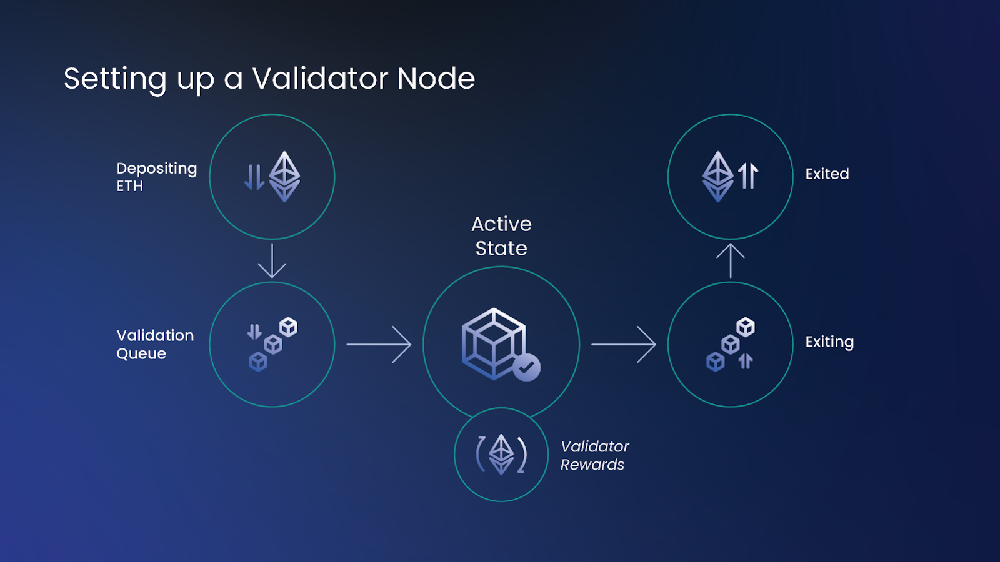

## Table of Contents

## What is Staked Ether?

Staked Ether, often called stETH, is a type of cryptocurrency that comes from Ethereum's proof-of-stake system. When people want to help secure the Ethereum network, they can "stake" their Ether (ETH) by locking it up in the system. In return, they get stETH, which represents their staked ETH. StETH can be used just like regular ETH, but it also earns rewards over time as the staker helps to validate transactions on the Ethereum network.

Staked Ether is important because it helps keep the Ethereum network running smoothly and securely. By staking their ETH, people help to process transactions and create new blocks on the blockchain. This is different from the old proof-of-work system, where miners used a lot of energy to solve puzzles. With proof-of-stake, stakers use their stETH to vote on the validity of transactions, making the process more energy-efficient and inclusive.

## How does staking Ether work?

Staking Ether means you lock up your ETH to help keep the Ethereum network safe and running smoothly. When you stake your ETH, you put it into a special part of the Ethereum system called the deposit contract. This tells the network that you want to be a validator, which means you help check and approve transactions. To become a validator, you need to stake at least 32 ETH. If you have less than that, you can join a staking pool where lots of people put their ETH together to reach the 32 ETH needed.

Once you're a validator, your job is to make sure transactions on the Ethereum network are correct. You do this by creating new blocks of transactions and adding them to the blockchain. If you do your job well, you get rewarded with more ETH. But if you make mistakes or try to cheat, you could lose some of your staked ETH as a penalty. Staking helps make the Ethereum network more secure and efficient because it encourages people to behave honestly and keep the system running smoothly.

## What are the benefits of staking Ether?

Staking Ether comes with several benefits. One big benefit is that you can earn more ETH just by helping the Ethereum network. When you stake your ETH, you become a validator, and if you do your job well, you get rewarded with extra ETH. This is a nice way to grow your crypto holdings without having to do much work. Plus, staking can be less risky than other ways to earn crypto, like trading, because you don't have to worry about the ups and downs of the market as much.

Another benefit is that staking helps make the Ethereum network better. By staking your ETH, you help keep the network safe and running smoothly. This is good for everyone who uses Ethereum because it makes transactions faster and cheaper. Also, staking is more eco-friendly than the old way of mining with computers, which used a lot of energy. So, by staking, you're not only helping yourself but also doing something good for the environment and the whole Ethereum community.

## What are the risks associated with staking Ether?

Staking Ether comes with some risks that you should know about. One big risk is that you might lose some of your staked ETH if you make mistakes or try to cheat the system. The Ethereum network has rules to keep things fair, and if you break them, you could get punished. This is called a "slashing" penalty, and it means you could lose a part of your staked ETH.

Another risk is that your staked ETH might be locked up for a while. When you stake your ETH, you can't use it for other things until you decide to stop staking. This can be a problem if you need your ETH quickly, because it might take some time to get it back. So, it's important to think about how long you're willing to have your ETH locked up before you start staking.

## How can someone start staking Ether?

To start staking Ether, you first need to have at least 32 ETH. If you have this amount, you can go to the Ethereum website and follow their steps to stake your ETH. You'll need to send your ETH to a special place called the deposit contract. This tells the Ethereum network that you want to be a validator. Once you've done this, you'll need to set up some special software on your computer to help you do your job as a validator. This software will help you check transactions and add them to the blockchain.

If you don't have 32 ETH, you can still stake by joining a staking pool. A staking pool is where lots of people put their ETH together to reach the 32 ETH needed to be a validator. You can find a staking pool online and join it by sending your ETH to them. The pool will take care of the validator work, and you'll get a share of the rewards based on how much ETH you put in. This way, even if you don't have a lot of ETH, you can still earn rewards by helping the Ethereum network.

## What is the minimum amount of Ether required to stake?

To start staking Ether on your own, you need at least 32 ETH. This is the minimum amount required by the Ethereum network to become a validator. As a validator, you help check and approve transactions on the Ethereum blockchain, and in return, you earn more ETH as rewards.

If you don't have 32 ETH, you can still stake by joining a staking pool. A staking pool is where many people combine their ETH to reach the 32 ETH needed to be a validator. By joining a pool, you can stake smaller amounts of ETH and still earn rewards based on how much you contribute to the pool.

## What is the role of validators in the Ethereum network?

Validators are really important for the Ethereum network. They help keep everything running smoothly by checking and approving transactions. When someone wants to send ETH to another person, validators make sure that the transaction is real and follows the rules. They do this by adding the transaction to a block and then adding that block to the Ethereum blockchain. This helps to make sure that all the information on the blockchain is correct and safe.

Validators also help to make the Ethereum network more secure. They do this by staking their ETH, which means they lock up their ETH to show that they're serious about doing their job well. If they make mistakes or try to cheat, they could lose some of their staked ETH as a penalty. This encourages validators to be honest and careful. By doing their job right, validators not only help the network run better but also earn more ETH as a reward for their work.

## How does staking Ether contribute to the security of the Ethereum network?

Staking Ether helps keep the Ethereum network safe by making people put their own ETH on the line. When someone stakes their ETH, they become a validator. Validators check and approve transactions to make sure they're correct. If a validator tries to cheat or mess things up, they can lose some of their staked ETH. This is called a slashing penalty. Knowing they could lose their ETH makes validators think twice before doing anything wrong, which keeps the network secure.

Validators also help the Ethereum network by voting on which transactions should be added to the blockchain. The more ETH a validator stakes, the more say they have in this process. This system makes it hard for anyone to take over the network because they would need to stake a huge amount of ETH. By staking their ETH, validators show they are committed to keeping the network honest and secure, which makes it a safer place for everyone to use.

## What are the differences between staking Ether and traditional mining?

Staking Ether and traditional mining are two different ways to help keep a blockchain network running and earn rewards. In traditional mining, like what used to happen with Bitcoin and Ethereum, miners use powerful computers to solve complex math puzzles. The first miner to solve the puzzle gets to add a new block of transactions to the blockchain and is rewarded with new coins. This process uses a lot of electricity and can be expensive because of the need for special hardware.

On the other hand, staking Ether is part of a system called proof-of-stake. Instead of solving puzzles, people who want to help the Ethereum network stake their ETH by locking it up. This makes them validators, and they help check and approve transactions. Validators don't need special computers, and the process uses much less energy. If validators do their job well, they earn more ETH as rewards, but if they mess up, they could lose some of their staked ETH. This makes staking a more eco-friendly and less costly way to help a blockchain network.

## How does the Ethereum 2.0 upgrade affect staking Ether?

The Ethereum 2.0 upgrade, also called Ethereum's transition to proof-of-stake, changed how people can stake Ether. Before this upgrade, Ethereum used a system called proof-of-work, where miners used a lot of energy to solve puzzles and add transactions to the blockchain. With Ethereum 2.0, the network switched to proof-of-stake, which means people can now stake their ETH to become validators. This new system is more energy-efficient and lets more people help keep the network running by staking smaller amounts of ETH through staking pools.

The upgrade made staking Ether easier and more accessible. Now, anyone with at least 32 ETH can become a validator by staking their ETH in the deposit contract. If you have less than 32 ETH, you can join a staking pool and still earn rewards. This change has made the Ethereum network more secure and faster, and it's also better for the environment because it uses less energy than the old mining system.

## What are the technical requirements for running a staking node?

To run a staking node for Ethereum, you need a computer that's strong enough to handle the job. You'll need a good amount of memory, usually at least 16 GB of RAM, and a fast processor. You also need a lot of storage space, around 2 TB, because the Ethereum blockchain keeps growing. It's important to have a reliable internet connection too, so your node can stay online and do its job without interruptions. Some people use special computers called servers, which are made to run all the time and handle a lot of work.

Setting up the software for your staking node can be a bit tricky. You'll need to install a special program called an Ethereum client, like Geth or Prysm. This software helps your computer talk to the Ethereum network and do the work of a validator. You'll also need to keep your software up to date and make sure it's running smoothly. If you're not good with computers, you might want to get help from someone who knows more about this stuff. But once everything is set up right, your node can help keep the Ethereum network safe and earn you rewards.

## How can staking rewards be optimized and what strategies can be used?

To optimize staking rewards, one good strategy is to choose the right staking pool. Some pools offer higher rewards than others because they have more validators or better technology. It's a good idea to look around and see which pools are doing well and have a good track record. Another way to get more rewards is to stake for a longer time. Some pools give extra rewards if you agree to keep your ETH staked for a longer period. This can help you earn more over time, but remember that your ETH will be locked up for that time, so make sure you're okay with that.

Another strategy is to keep an eye on the Ethereum network's performance. If the network is busy with lots of transactions, validators might get more rewards. So, it can be helpful to stake during times when the network is doing a lot of work. Also, make sure your staking node is always running well. If your node goes offline a lot, you might miss out on rewards or even get penalties. Keeping your software up to date and your internet connection strong can help you avoid these problems and keep your rewards coming in.

## References & Further Reading

[1]: Buterin, V. (2013). ["A next-generation smart contract and decentralized application platform."](https://www.blockchainlab.com/pdf/Ethereum_white_paper-a_next_generation_smart_contract_and_decentralized_application_platform-vitalik-buterin.pdf) Ethereum White Paper.

[2]: Sompolinsky, Y., & Zohar, A. (2013). ["Accelerating Bitcoin's Transaction Processing. Fast Money Grows on Trees, Not Chains."](https://eprint.iacr.org/2013/881) Cryptology ePrint Archive.

[3]: Muneeb, A., Raju, S. (2021). ["Ethereum 2.0: Transition to Proof-of-Stake."](https://www.mdpi.com/2813-2432/2/2/6) Journal of Innovation.

[4]: ["The Age of Cryptocurrency: How Bitcoin and Digital Money Are Challenging the Global Economic Order"](https://www.amazon.com/Age-Cryptocurrency-Blockchain-Challenging-Economic/dp/1250081556) by Paul Vigna and Michael J. Casey

[5]: Lido Finance. (n.d.). ["Lido: A liquid staking solution for Ethereum."](https://lidlifi.com/) Lido Finance Official Website.