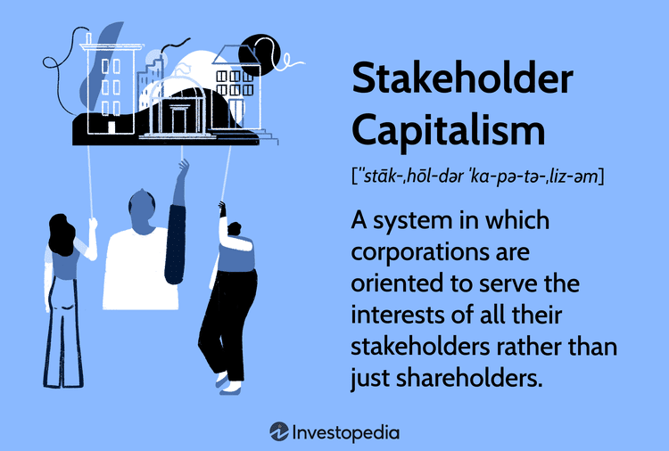

In today's rapidly evolving economic landscape, traditional views of corporate responsibility and capitalism are undergoing significant scrutiny. Stakeholder capitalism is emerging as a compelling model that seeks to expand the focus from merely serving shareholder interests to encompassing a broader array of stakeholders, including customers, employees, suppliers, and local communities. This holistic approach challenges the conventional paradigm highlighted by Milton Friedman's shareholder primacy theory, which dominated corporate governance since the 1970s. 

The shifting paradigm raises important questions about how businesses balance stakeholder interests within their operational strategies. The integration of stakeholder capitalism with corporate responsibility and algorithmic trading presents a framework that influences not just internal business strategies but also responds to growing societal expectations for ethical and sustainable practices.

Corporate responsibility, a concept often intertwined with stakeholder capitalism, serves as a framework where businesses voluntarily regulate themselves to create a positive impact on society and the environment. Ethical practices, fair treatment of employees, and sustainable operations are key components that align with the broader goals of stakeholder capitalism. By balancing these elements, businesses are better equipped to build trust and long-term value across diverse stakeholder groups.

Algorithmic trading represents a recent technological advancement that significantly impacts financial markets. It utilizes complex algorithms to improve trading efficiency, offering the potential to democratize access to financial instruments and support more inclusive economic models. However, it also presents ethical challenges, such as issues of transparency and market manipulation, which necessitate careful regulatory oversight.

Understanding these interconnected concepts—stakeholder capitalism, corporate responsibility, and algorithmic trading—provides insights into how modern business strategies are evolving to meet the demands of a changing economic landscape. These elements are fundamental to achieving sustainable economic development and maintaining investor confidence over the long term.

## Table of Contents

## Understanding Stakeholder Capitalism

Stakeholder capitalism redefines the purpose of corporations to serve all stakeholders, reflecting a paradigm shift from the traditional focus solely on shareholder interests. This model considers customers, suppliers, employees, communities, and shareholders as essential stakeholders. Each stakeholder group plays a crucial role in the ecosystem of an organization, influencing and being influenced by the corporation's policies and practices.

The idea of stakeholder capitalism aims to generate long-term value rather than concentrating on short-term profits, which dominated corporate strategies during the late 20th century, particularly following Milton Friedman's influential assertion in the 1970s. Friedman argued that the primary responsibility of a business is to increase its profits while adhering to the rules of the game, meaning engaging in open and free competition without deception or fraud.

Contrary to Friedman's view, stakeholder capitalism promotes the belief that businesses should balance the diverse and sometimes conflicting interests of different stakeholders. This approach counters the historically prevalent shareholder primacy, which centers on maximizing shareholder wealth. The shift towards stakeholder capitalism acknowledges the interconnectedness of businesses and the broader society, championing ethical considerations and sustainable growth.

Stakeholder capitalism's objective is to establish a harmonious and mutually beneficial relationship among stakeholders, ensuring the corporation's actions and strategies contribute positively to the community and environment while maintaining profitability. This multifaceted approach is essential in a globalized economy, where the impact of corporate decisions transcends geographical and operational boundaries. By prioritizing long-term value creation, companies can enhance their resilience, innovation, and reputation, ultimately fostering economic stability and societal wellbeing.

## The Role of Corporate Responsibility

Corporate responsibility, often termed corporate social responsibility (CSR), is a critical component of modern business practices, aligning with the principles of stakeholder capitalism. By embodying a commitment to operate ethically and sustainably, companies aim to address the interests of all stakeholders, including employees, customers, suppliers, and the broader community, as well as the environment.

A central aspect of corporate responsibility is the provision of fair wages. Ensuring equitable compensation not only benefits employees by enhancing their quality of life but also supports a more motivated and productive workforce. This practice contributes to reducing income inequality and fostering a more balanced economic ecosystem. Ethical operations, another key facet, involve upholding integrity and transparency throughout business dealings. This includes fair trade practices, safeguarding consumer rights, and maintaining honest communications, all of which help build trust and loyalty among stakeholders.

Environmental sustainability is a crucial pillar of corporate responsibility. Companies are increasingly recognizing the imperative of reducing their ecological footprint to mitigate climate change and preserve natural resources. This can involve adopting sustainable production methods, minimizing waste, and investing in renewable energy sources. By prioritizing environmental stewardship, businesses not only adhere to regulatory standards but also align with the growing consumer demand for sustainable products and services.

This commitment to social and environmental well-being closely aligns with the goals of stakeholder capitalism, which advocates a more holistic approach to corporate growth. Unlike the shareholder-centric model, which focuses on maximizing short-term profits, stakeholder capitalism and CSR promote long-term value creation. This balanced approach ensures that business success is measured not just in financial terms but also through positive societal impact, contributing to sustainable economic development.

In conclusion, the role of corporate responsibility is to integrate ethical considerations and social equity into the core business strategy, enhancing corporate reputation and securing a loyal consumer base. By adhering to CSR principles, companies can effectively navigate the complexities of modern economic models, ensuring that their operations contribute positively to society and the environment.

## Integration of Algorithmic Trading

Algorithmic trading has become a pivotal component of the financial markets, wielding the power of advanced technological algorithms to bolster trading efficiency. At its core, [algorithmic trading](/wiki/algorithmic-trading) involves the use of computer algorithms to automatically make trading decisions, execute orders, and manage portfolios in financial markets. This approach can process vast amounts of market data at speeds unattainable by human traders, thereby capturing market opportunities and optimizing transaction costs.

The integration of algorithmic trading into financial markets has the potential to drive these markets towards more inclusive economic models. By enabling broader access to financial instruments, algorithmic trading democratizes the market, allowing individual and smaller investors to partake in trading activities once reserved for large institutional players. With the proliferation of trading platforms and tools, retail investors can now employ algorithmic strategies, effectively leveling the playing field.

While the advancements brought by algorithmic trading are promising, they are not without significant ethical concerns. The rapid trading techniques can lead to issues of market transparency. Algorithms operate on intricate and often proprietary strategies, creating an opaque environment where the rationale behind trades is obscured. This lack of transparency can lead to unethical practices, such as market manipulation, where algorithms might be exploited to artificially influence market prices to the detriment of other participants.

There is a growing call for careful regulatory oversight to address these ethical challenges. Regulatory frameworks need to evolve to ensure that algorithmic trading does not compromise market integrity. Effective regulations should establish clear guidelines on the transparency and deployment of algorithms, mandating detailed disclosures about algorithmic functions and safeguards against manipulative practices.

In summary, while algorithmic trading enhances market efficiency and democratizes finance, it necessitates stringent ethical and regulatory standards to safeguard market fairness. Without careful oversight, the benefits of algorithmic trading could be overshadowed by potential risks and ethical pitfalls.

## Case Studies and Practical Implications

Recent corporate strategies have increasingly embraced stakeholder-focused approaches, with the 2019 Business Roundtable redefinition playing a pivotal role. This redefinition moved away from the traditional shareholder-centric model, advocating for a corporate purpose serving all stakeholders, including employees, customers, suppliers, and communities, in addition to shareholders [Business Roundtable, 2019].

Technology companies provide illustrative examples of this shift, demonstrating that valuing diverse stakeholders can foster substantial business growth and cultivate community trust. For instance, Microsoft's commitment to carbon neutrality by 2030 and its initiatives to enhance digital skills worldwide embodies a stakeholder-centric strategy that balances business growth with societal and environmental responsibilities [Microsoft, 2020]. Such approaches not only address environmental concerns but also enhance the company's brand reputation, attracting customers and investors who prioritize sustainability.

Incorporating stakeholder principles in algorithmic trading strategies has emerged as a way to mitigate risks and enhance corporate image. Algorithmic trading, characterized by the use of complex algorithms to execute trades at high speeds and frequencies, can significantly impact financial markets. However, its application raises ethical and practical questions about market transparency and potential manipulation.

By integrating stakeholder considerations, companies can address these ethical concerns while gaining competitive advantages. For example, algorithmic trading firms that emphasize data protection and transparency in their algorithms can differentiate themselves by appealing to ethically-conscious investors and clients. Moreover, adhering to responsible trading practices can prevent regulatory backlashes and foster trust among market participants.

Practical implementation of such strategies involves developing algorithms that prioritize not only profit but also compliance with ethical standards and stakeholder values. This requires interdisciplinary collaboration between data scientists, ethicists, and financial experts to create balanced trading models. Python, a versatile programming language, is extensively used to develop such algorithms due to its vast libraries and frameworks that facilitate [machine learning](/wiki/machine-learning) and data analysis.

In summary, the adoption of stakeholder-focused corporate strategies, illustrated by case studies from the tech industry and the integration of ethical principles in algorithmic trading, demonstrates a transformative trend in business environments. These strategies not only enhance growth and trust but also align with evolving societal expectations for corporate responsibility.

## Critiques and Challenges

Critics of stakeholder capitalism argue that while the model aims to broaden the focus of corporate objectives, it may inadvertently dilute the accountability of corporate leaders to shareholders. Traditional capitalism emphasizes shareholder value, making it easier for corporate leaders to align their decisions with explicit financial benchmarks. In contrast, stakeholder capitalism requires balancing a wider range of interests, potentially leading to conflicts and diluted objectives. A key critique is the possible vagueness in measuring success, as serving diverse stakeholder interests lacks clear metrics compared to financial indicators like net profit or earnings per share.

Another concern is the sustainability of the stakeholder capitalism model, particularly in competitive markets focused on short-term gains. Companies are often under pressure to deliver immediate financial results; this can conflict with the long-term vision required to adequately address the interests of various stakeholders. Fast-paced industries may find it challenging to maintain a stakeholder-oriented approach when short-term gains are prioritized by investors focused on rapid returns.

Navigating between diverse stakeholder interests and maintaining competitive advantages presents a formidable challenge. Companies face the intricate task of aligning the potentially conflicting needs of stakeholders such as employees demanding higher wages, communities requiring environmental protection, and shareholders seeking financial returns. This balancing act can strain resources and potentially hinder quick decision-making, which is often crucial in maintaining a competitive market position. Therefore, corporate leaders must develop robust strategies that transparently prioritize stakeholder interests while also preserving the agility to adapt to market changes.

Overall, implementing stakeholder capitalism requires a sophisticated governance framework capable of integrating and balancing diverse interests without compromising competitive performance. The ongoing challenge is to establish clear metrics and strategies that align with both broad stakeholder goals and the company's market objectives.

## Conclusion

The intricate balance between stakeholder capitalism, corporate responsibility, and algorithmic trading shapes the framework of modern economic models. These elements collectively redefine how businesses operate, emphasizing the creation of long-term value and sustainable economic growth over short-term gains. Stakeholder capitalism challenges the traditional focus on shareholder primacy, urging companies to consider the interests of a diverse array of stakeholders, including employees, communities, and suppliers, alongside shareholders. This holistic approach necessitates robust corporate responsibility practices that prioritize ethical operations, fair compensation, and environmental stewardship.

Algorithmic trading, while advancing trading efficiency and market access, brings to the fore critical ethical and regulatory considerations, especially relating to transparency and potential market manipulation. The synthesis of these frameworks offers the potential to nurture corporate success by aligning business operations with societal expectations and environmental imperatives. However, it also demands continuous engagement among policymakers, businesses, and stakeholders to ensure these systems evolve equitably and address the myriad challenges each sector faces.

Adopting these models calls for pragmatic strategies and ongoing conversations among all economic participants. By institutionalizing these dialogues, the evolving economic models can progressively optimize stakeholder engagement and foster a more equitable economic environment. This approach can ultimately lead to sustainable growth, increased investor confidence, and a more resilient global economy, in which corporate success and societal well-being are mutually reinforcing.

## References & Further Reading

[1]: Friedman, M. (1970). ["The Social Responsibility of Business is to Increase its Profits."](https://www.nytimes.com/1970/09/13/archives/a-friedman-doctrine-the-social-responsibility-of-business-is-to.html) The New York Times Magazine.

[2]: Freeman, R. E. (1984). ["Strategic Management: A Stakeholder Approach."](https://research.monash.edu/en/publications/strategic-management-a-stakeholder-approach) Cambridge University Press.

[3]: ["Business Roundtable Redefines the Purpose of a Corporation to Promote ‘An Economy That Serves All Americans’"](https://www.businessroundtable.org/business-roundtable-redefines-the-purpose-of-a-corporation-to-promote-an-economy-that-serves-all-americans) (2019). 

[4]: Goranova, M., & Ryan, L. V. (2014). ["Shareholder Activism: A Multidisciplinary Review."](https://papers.ssrn.com/sol3/papers.cfm?abstract_id=2384280) Journal of Management, 40(5), 1230-1268.

[5]: James, H. (2016). ["International Banking and the Financial Crisis: Lessons Participated and Lessons Learned."](https://www.cambridge.org/core/books/central-banks-at-a-crossroads/international-monetary-and-financial-system/318EB8F02EE1DFFA0ECF650FB88C52B4) Gresham College Lecture.

[6]: López de Prado, M. (2018). ["Advances in Financial Machine Learning."](https://www.amazon.com/Advances-Financial-Machine-Learning-Marcos/dp/1119482089) Wiley.

[7]: Stout, L. A. (2012). ["The Shareholder Value Myth: How Putting Shareholders First Harms Investors, Corporations, and the Public."](https://papers.ssrn.com/sol3/papers.cfm?abstract_id=2277141) Berrett-Koehler Publishers.