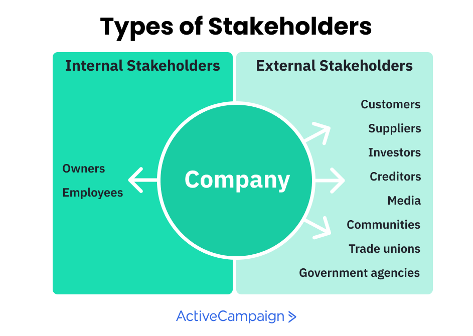

## Table of Contents

## What is a stakeholder?

A stakeholder is anyone who has an interest or concern in a business or project. This can include people inside the company, like employees and managers, and people outside the company, like customers and suppliers. Stakeholders can also be groups like the government or the local community.

Stakeholders are important because they can affect or be affected by what the business does. For example, if a company decides to build a new factory, the local community might be concerned about pollution, while employees might be worried about their jobs. Understanding and managing the needs of different stakeholders is key to making sure a business or project is successful.

## Why are stakeholders important in business and projects?

Stakeholders are important in business and projects because they can influence how things turn out. They might have a say in decisions, or their actions can change what the business or project does. For example, if customers are unhappy with a product, they might stop buying it, which can hurt the business. On the other hand, if employees feel valued, they might work harder and help the business do better.

Also, stakeholders can be affected by what the business or project does. If a company decides to close a factory, it can impact the workers who lose their jobs and the local community that loses the economic benefits the factory brought. By understanding and considering the needs and concerns of stakeholders, businesses and projects can make better decisions that help everyone involved. This can lead to more success and fewer problems in the long run.

## What are the different types of stakeholders?

Stakeholders can be divided into two main groups: internal and external. Internal stakeholders are people inside the business, like employees, managers, and owners. Employees want good pay and a safe place to work. Managers want the business to do well so they can keep their jobs and maybe get a raise. Owners want the business to make money so they can earn profits.

External stakeholders are people or groups outside the business, like customers, suppliers, the government, and the local community. Customers want good products at fair prices. Suppliers want to sell their goods to the business and get paid on time. The government wants the business to follow laws and pay taxes. The local community wants the business to be a good neighbor and not cause problems like pollution.

Both types of stakeholders are important because they can affect or be affected by what the business does. For example, if a business treats its employees well, they might work harder and help the business succeed. If customers are happy, they might keep buying the business's products. Understanding and managing the needs of all stakeholders helps a business or project do better and avoid problems.

## Can you provide examples of internal stakeholders?

Internal stakeholders are people inside a business. They include employees, managers, and owners. Employees are people who work for the business. They want good pay, a safe place to work, and maybe some benefits like health insurance. Managers are the people who run the business. They want the business to do well so they can keep their jobs and maybe get a raise or a promotion. Owners are the people who own the business. They want the business to make money so they can earn profits.

These internal stakeholders are important because they help the business run smoothly. Employees do the work that keeps the business going. If they are happy and feel valued, they might work harder and help the business do better. Managers make decisions that affect the whole business. If they make good decisions, the business can grow and succeed. Owners provide the money the business needs to start and keep going. If the business does well, they can earn more money and maybe even expand the business.

## Can you provide examples of external stakeholders?

External stakeholders are people or groups outside a business. They include customers, suppliers, the government, and the local community. Customers are people who buy things from the business. They want good products at fair prices. Suppliers are companies that sell things to the business. They want to sell their goods and get paid on time. The government makes laws that the business has to follow and collects taxes. The local community is where the business is located. They want the business to be a good neighbor and not cause problems like pollution.

These external stakeholders are important because they can affect or be affected by what the business does. If customers are happy with the products, they might keep buying them and tell their friends, which helps the business grow. If suppliers get paid on time, they will keep selling to the business, which helps it run smoothly. The government wants the business to follow laws and pay taxes, which helps the community. The local community wants the business to be a good neighbor, so it doesn't cause problems like pollution or traffic. By understanding and managing the needs of these external stakeholders, a business can do better and avoid problems.

## How do stakeholders influence an organization or project?

Stakeholders can influence an organization or project in many ways. They might have a say in decisions or their actions can change what the organization or project does. For example, if customers are unhappy with a product, they might stop buying it, which can hurt the business. Employees might go on strike if they are not happy with their pay or working conditions, which can stop the business from running smoothly. Investors can decide to pull their money out if they think the business is not doing well, which can make it hard for the business to keep going.

Stakeholders can also be affected by what the organization or project does, which can make them act in certain ways. If a company decides to close a factory, it can impact the workers who lose their jobs and the local community that loses the economic benefits the factory brought. This might make the local community protest or ask the government to step in. The government might change laws or regulations if they think the business is not doing enough to protect the environment or treat workers fairly. By understanding and considering the needs and concerns of stakeholders, organizations and projects can make better decisions that help everyone involved and lead to more success.

## What is the difference between primary and secondary stakeholders?

Primary stakeholders are people or groups that are directly affected by what a business or project does. They have a big stake in what happens because it impacts them right away. For example, employees are primary stakeholders because their jobs and pay depend on the business doing well. Customers are also primary stakeholders because they buy the products or services the business offers. If the business does not do well, it can hurt employees and customers right away.

Secondary stakeholders are people or groups that are not directly affected by what a business or project does, but they can still be influenced by it. They have a smaller stake in what happens because the impact is not as immediate. For example, the local community might be a secondary stakeholder because a business can affect the community's environment or economy, but not as directly as it affects employees or customers. The media can also be a secondary stakeholder because they report on what the business does, but they are not directly involved in the business's day-to-day operations.

## How can stakeholders be identified and analyzed?

To identify stakeholders, start by thinking about who is directly or indirectly affected by what the business or project does. Talk to people inside the business, like employees and managers, to find out who they think is important. Also, look outside the business at people like customers, suppliers, the government, and the local community. Ask them about their interests and concerns. You can use tools like surveys, interviews, or meetings to gather this information. Once you have a list of stakeholders, you can start to understand who they are and what they want.

To analyze stakeholders, you need to figure out how important they are to the business or project and how much they can influence what happens. One way to do this is by using a stakeholder analysis matrix. This is a simple chart where you put stakeholders into different groups based on their level of interest and their power to affect the business. For example, a stakeholder with high interest and high power, like a major investor, would be in one group. A stakeholder with low interest and low power, like a distant supplier, would be in another group. By understanding where each stakeholder fits, you can decide how to work with them to meet their needs and make the business or project more successful.

## What are some common stakeholder engagement strategies?

Stakeholder engagement strategies are ways to talk to and work with people who have an interest in a business or project. One common strategy is to keep stakeholders informed. This means telling them about what the business or project is doing, like sending out newsletters or holding meetings. Another strategy is to listen to what stakeholders have to say. This can be done through surveys or interviews where stakeholders can share their thoughts and concerns. By keeping stakeholders in the loop and listening to them, a business can build trust and make sure everyone feels included.

Another strategy is to involve stakeholders in decision-making. This can mean asking them for their ideas or letting them vote on certain decisions. For example, a business might set up a customer advisory board where customers can give feedback on new products. Involving stakeholders like this can make them feel valued and more likely to support the business. It's also important to be open and honest with stakeholders. If there are problems, it's better to tell them the truth and work together to find solutions. By using these strategies, a business can build strong relationships with its stakeholders and help everyone succeed.

## How do stakeholder interests and expectations vary across different industries?

Stakeholder interests and expectations can change a lot depending on the industry. In the healthcare industry, patients want good care and fair prices. Doctors and nurses want good pay and a safe place to work. The government wants hospitals to follow rules and help people stay healthy. In the tech industry, customers want new and useful products. Employees want to work on exciting projects and have good pay. Investors want the company to grow fast and make a lot of money. Each industry has its own set of stakeholders with different needs and wants.

In the energy industry, like oil and gas, the local community might worry about pollution and safety. The government wants the company to follow environmental laws. Shareholders want the company to make profits and keep growing. In the food industry, customers want safe and tasty food at good prices. Farmers and suppliers want to sell their products and get paid on time. The government wants food companies to follow health and safety rules. Even though the basic idea of stakeholders is the same in every industry, the specific interests and expectations can be very different.

## What are the challenges in managing stakeholder relationships?

Managing stakeholder relationships can be tough because different stakeholders want different things. For example, shareholders might want the company to make more money, but employees might want better pay and working conditions. It can be hard to make everyone happy at the same time. Sometimes, what one group wants can go against what another group wants. This can lead to disagreements and conflicts. It's important for the business to listen to everyone and try to find a middle ground, but this can be tricky and take a lot of time and effort.

Another challenge is keeping everyone in the loop. Stakeholders want to know what's going on with the business, but it can be hard to share information in a way that everyone understands and finds useful. If the business doesn't talk to stakeholders enough, they might feel left out or ignored. On the other hand, if the business talks too much, stakeholders might get overwhelmed with too much information. Finding the right balance and making sure everyone feels heard and valued is a big challenge. It requires clear communication and a lot of patience and understanding.

## How can advanced stakeholder management techniques improve project outcomes?

Advanced stakeholder management techniques can really help make a project better. By using these techniques, a business can understand what different stakeholders want and need. This means they can make plans that take everyone's interests into account. For example, if a project manager knows that the local community is worried about pollution, they can work to make the project more environmentally friendly. This can help avoid problems and make the project go more smoothly. When stakeholders feel like their needs are being met, they are more likely to support the project and help it succeed.

These techniques also help keep everyone talking and working together. Good communication is key to making sure stakeholders know what's going on and feel like they are part of the project. By using tools like regular meetings, surveys, and feedback sessions, a business can keep stakeholders in the loop and make them feel valued. This can build trust and make it easier to solve problems when they come up. In the end, better stakeholder management can lead to a project that finishes on time, stays within budget, and meets everyone's expectations.

## References & Further Reading

[1]: Bergstra, J., Bardenet, R., Bengio, Y., & Kégl, B. (2011). ["Algorithms for Hyper-Parameter Optimization."](https://dl.acm.org/doi/10.5555/2986459.2986743) Advances in Neural Information Processing Systems 24.

[2]: ["Advances in Financial Machine Learning"](https://www.amazon.com/Advances-Financial-Machine-Learning-Marcos/dp/1119482089) by Marcos Lopez de Prado

[3]: Aldridge, I. (2013). ["High-Frequency Trading: A Practical Guide to Algorithmic Strategies and Trading Systems."](https://www.amazon.com/High-Frequency-Trading-Practical-Algorithmic-Strategies/dp/1118343506) Wiley Finance.

[4]: ["Machine Learning for Algorithmic Trading"](https://github.com/PacktPublishing/Machine-Learning-for-Algorithmic-Trading-Second-Edition) by Stefan Jansen

[5]: ["Quantitative Trading: How to Build Your Own Algorithmic Trading Business"](https://books.google.com/books/about/Quantitative_Trading.html?id=j70yEAAAQBAJ) by Ernest P. Chan

[6]: Gomber, P., Arndt, B., Lutat, M., & Uhle, T. (2011). ["High-Frequency Trading."](https://www.semanticscholar.org/paper/High-Frequency-Trading-Gomber-Arndt/3d0ba8179934e0a45e85a184d1ec526616e2e213) SSRN Electronic Journal.

[7]: Securities and Exchange Commission (SEC). ["Algorithmic Trading."](https://www.sec.gov/files/Algo_Trading_Report_2020.pdf) U.S. Securities and Exchange Commission.