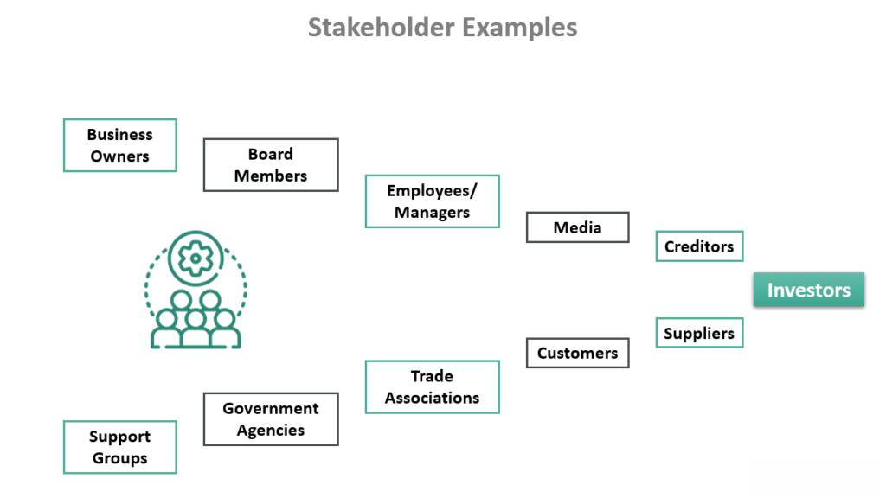

In algorithmic trading, understanding the roles and influences of various stakeholders is crucial. Algorithmic trading relies on pre-programmed trading instructions to execute orders faster and more efficiently than human traders, making it essential to identify and understand the stakeholders involved. These stakeholders range from institutional investors, who deploy vast resources to optimize trading strategies, to regulatory bodies that ensure market integrity and transparency.

Recognizing and engaging with stakeholders effectively allows traders and investors to enhance their strategies and make informed decisions. By doing so, they can navigate the complexities of the trading environment, leading to better risk management and performance optimization. This article will explore how different stakeholders contribute to the algorithmic trading landscape and how their interactions impact the overall ecosystem.

Through this exploration, we aim to provide a comprehensive understanding of who these stakeholders are, illustrate their significance, and highlight their impact within the algorithmic trading domain. With this knowledge, participants in the algo trading market can better align their strategies with broader market trends and regulatory frameworks, thereby improving their trading success.

Join us as we examine the identification of these stakeholders, share examples, and discuss their roles and types within the algo trading sphere. Understanding these dynamics is not just an academic exercise; it offers practical insights that can lead to smarter and more sustainable trading practices.

## Table of Contents

## What Are Stakeholders in Algorithmic Trading?

Stakeholders in algorithmic trading are individuals or groups with a vested interest in the processes, functions, and outcomes of trading systems and strategies. In this context, stakeholders encompass a wide range of participants, from financial institutions to individual traders and technology providers. Their roles vary significantly, influencing decision-making processes, strategic approaches, and operational functionalities.

Financial institutions, such as investment banks, hedge funds, and asset management firms, are key stakeholders in algorithmic trading. These entities rely on automated trading systems to execute large volumes of trades quickly and efficiently, often employing complex algorithms to capitalize on market inefficiencies. Moreover, individual traders, including retail investors, participate in algorithmic trading through platforms provided by brokerage firms or trading applications. These traders may use pre-defined algorithms or customize their own strategies to meet specific investment goals.

Technology providers are another crucial set of stakeholders in [algorithmic trading](/wiki/algorithmic-trading). Companies developing trading software and algorithmic models provide the necessary tools for implementing and executing trades. These stakeholders impact the technology infrastructure and ensure the systems are robust, scalable, and secure. Additionally, they may introduce innovative features that improve trading efficiency and decision-making capabilities.

Understanding stakeholders in algorithmic trading is of paramount importance. Aligning trading strategies with broader market trends and regulatory frameworks is essential for maintaining compliance and competitiveness. Stakeholders such as regulatory bodies, including the Securities and Exchange Commission (SEC) and the Commodity Futures Trading Commission (CFTC), establish rules and guidelines for ensuring safe and fair trading practices. Adhering to these regulations is critical for avoiding legal issues and maintaining the integrity of trading operations.

Engaging with these diverse stakeholders can enhance the development and refinement of trading strategies, as their feedback and requirements are instrumental in optimizing system performance. Additionally, understanding the motivations and expectations of stakeholders provides traders with a comprehensive perspective on market dynamics, enabling them to manage risks more effectively and exploit opportunities for growth. Through strategic stakeholder engagement, traders and investors can create a resilient and adaptive algorithmic trading environment, conducive to sustained success and innovation.

## Examples of Stakeholders in Algo Trading

Institutional investors in algorithmic trading include pension funds, mutual funds, and insurance companies. These entities utilize algorithmic strategies to manage large portfolios efficiently, seeking to optimize execution costs and enhance the predictability of their trading strategies. Historically, institutional investors have adopted algorithmic trading to minimize market impact and transaction costs, thus maintaining strategic competitive advantages in high-frequency trading environments.

Retail traders, on the other hand, are individual investors who access algorithmic trading through brokerages or trading platforms. The democratization of trading technology has enabled these traders to utilize sophisticated algorithms once reserved for large institutions. Retail investors often rely on broker-provided platforms that offer user-friendly algorithmic tools, facilitating engagement in various trading strategies such as [arbitrage](/wiki/arbitrage) or [momentum](/wiki/momentum) trading.

Brokerage firms play a critical role by providing platforms and tools crucial for executing algorithmic trades. These firms offer state-of-the-art trading systems with features like direct market access (DMA) and automated order management to both institutional and retail investors. Brokerage platforms are often equipped with smart order routing and algorithmic trading capabilities, essential for optimizing trade execution across different market conditions.

Regulatory bodies, such as the U.S. Securities and Exchange Commission (SEC) and the Commodity Futures Trading Commission (CFTC), establish and enforce rules ensuring fair and safe trading practices in the algorithmic trading domain. These organizations monitor and regulate trading activities to prevent abuses like spoofing or layering, thereby maintaining market integrity and investor confidence. Regulatory frameworks require continuous compliance by all stakeholders engaged in algorithmic trading.

Technology providers constitute another crucial group, developing the software and algorithms that drive trading platforms. These companies offer advanced analytics tools and trading solutions that facilitate the creation and implementation of complex trading strategies. Technology providers work closely with trading firms to ensure their systems are robust, scalable, and capable of handling the vast data volumes characteristic of algorithmic trading. They also focus on innovations such as [machine learning](/wiki/machine-learning) and [artificial intelligence](/wiki/ai-artificial-intelligence) to enhance trading efficiencies and predictive analytics.

Through the interaction of these stakeholders, the algorithmic trading space maintains its dynamic and adaptive nature, fostering innovation while adhering to regulatory standards.

## Types of Stakeholders in Algorithmic Trading

In algorithmic trading, stakeholders play distinct roles based on their level of involvement and the impact they have on trading activities. These roles can be categorized into primary, secondary, internal, and external stakeholders, each contributing to the ecosystem in unique ways.

**Primary Stakeholders**

Primary stakeholders are directly involved in or affected by trading operations. This group predominantly includes traders, investors, and brokerage firms. Traders and investors are the main drivers of algorithmic trading as they develop, implement, and benefit from trading strategies. Typically, brokerage firms provide the platforms and infrastructure essential for executing algorithmic trades efficiently. The active role of primary stakeholders means they have a vested interest in the success and performance of trading algorithms, influencing the strategies and resources allocated to trading activities.

**Secondary Stakeholders**

Secondary stakeholders indirectly influence the algorithmic trading environment through regulatory and economic perspectives. Key participants in this category are regulators, policymakers, and industry analysts. Regulators, such as the Securities and Exchange Commission (SEC) and the Commodity Futures Trading Commission (CFTC) in the United States, establish rules and guidelines to ensure fair trading practices and mitigate systemic risks. Policymakers and industry analysts contribute with insights and assessments that shape trading regulations and economic trends, which in turn affect the strategic decisions of primary stakeholders.

**Internal Stakeholders**

Within organizations engaged in algorithmic trading, internal stakeholders are vital to the development and implementation of trading systems. These stakeholders typically consist of software developers, financial analysts, and IT teams. Developers are responsible for creating the algorithms and software that underpin trading systems, ensuring they are robust and responsive to market changes. Financial analysts provide critical data analysis and insights into market trends, supporting informed decision-making. Effective collaboration among these internal stakeholders is essential for maintaining and advancing the capabilities of algorithmic trading systems.

**External Stakeholders**

External stakeholders are entities outside the organization that significantly impact or evaluate trading activities. This includes technology partners, market analysts, and regulatory bodies, similar to those listed under secondary stakeholders but evaluated from an external organizational perspective. Technology partners supply the necessary tools and technologies that enhance trading platform capabilities. Market analysts offer external evaluations and forecasts that can influence trading strategies. Engaging with external stakeholders ensures that trading activities are aligned with technological advancements and market expectations, facilitating the adaptation and growth of algorithmic trading operations.

These categories of stakeholders in the algorithmic trading ecosystem collectively contribute to the innovation, regulatory compliance, and operational success of trading activities. Understanding and effectively managing these relationships is crucial for optimizing trading strategies and ensuring adherence to industry standards and expectations.

## The Importance of Stakeholders in Algo Trading

Stakeholders play a crucial role in shaping the dynamics and operational success of algorithmic trading strategies. Their involvement is integral to both the strategic and practical aspects of trading, as they provide insights that help refine trading models and strategies. For instance, feedback from stakeholders such as institutional investors or brokerage firms can lead to adjustments in algorithm parameters or trading logic, ensuring that trading models align with current market conditions and investment goals. 

Understanding the expectations of stakeholders allows traders to enhance risk management and optimize performance. By aligning trading activities with stakeholder requirements, traders can reduce exposure to unforeseen market risks and improve the efficacy of their strategies. Stakeholders like regulatory bodies are pivotal in establishing compliance frameworks, which ensures that trading practices adhere to legal and ethical standards, thus mitigating regulatory risks.

In addition to risk management, stakeholders contribute significantly to innovation within algorithmic trading. Through collaboration with technology providers and internal financial analysts, new algorithms and trading technologies can be developed, offering competitive advantages in trade execution and market analysis. The perspectives of diverse stakeholders encourage the exploration of novel approaches and technologies, fostering a culture of continuous improvement and adaptability in trading operations.

In conclusion, the active participation of stakeholders is essential for the development, refinement, and successful implementation of algorithmic trading strategies. By engaging with various stakeholders, trading operations can remain agile and innovative, capable of thriving in a dynamic financial environment.

## Challenges and Considerations

Balancing the diverse interests of stakeholders in algorithmic trading is complex due to the dynamic nature of financial markets. Algorithmic trading stakeholders include but are not limited to institutional investors, retail traders, brokerage firms, regulatory bodies, and technology providers. Each group has distinct and sometimes conflicting priorities, which must be navigated carefully.

1. **Regulatory Compliance**: Ensuring adherence to legal and regulatory requirements is paramount in algorithmic trading. Regulations may vary by jurisdiction, such as the Securities and Exchange Commission (SEC) in the United States, which mandates fair trading practices and market transparency. Continuous collaboration with these regulatory bodies is essential. For instance, algorithmic trading systems must comply with rules on market manipulation and maintain audit trails. Regular updates and checks are necessary to adapt to new regulations, which may require the implementation of compliance monitoring systems capable of real-time audits and alerts.

2. **Technological and Security Concerns**: The rapid evolution of technology presents both opportunities and challenges. Engaging with technology providers and internal IT teams is critical to developing secure and efficient trading systems. Technology concerns may involve latency reduction, system integrity, and data security. Solutions must be proactively sought to protect against cyber threats and data breaches, which could undermine stakeholder trust. Best practices include using secure coding practices, regular vulnerability assessments, and the implementation of robust encryption protocols. Python, a language frequently used in algorithmic trading, offers libraries such as `pandas` for data analysis and `scikit-learn` for implementing machine learning models, essential for both innovation and addressing security issues.

3. **Adapting to Market Changes**: The financial market landscape is constantly evolving, influenced by geopolitical events, economic indicators, and shifts in investor sentiment. Open communication with industry analysts and financial advisors is vital for staying informed of these changes. This engagement helps traders and investors anticipate market trends and adjust strategies accordingly. Techniques such as sentiment analysis, using Python's libraries like `BeautifulSoup` for web scraping of financial news, or employing natural language processing with `NLTK`, can provide insights into market mood and potential volatility.

These considerations highlight the intricate balance needed to address stakeholder needs in algorithmic trading while maintaining regulatory compliance, leveraging technological advancement, and adapting to nimble market conditions. Addressing these challenges is fundamental for operational success and strategic advancement in this fast-paced domain.

## Conclusion

Understanding stakeholders in algorithmic trading is essential for developing robust, compliant, and adaptive trading systems. By recognizing the influence stakeholders have, not only on trading strategies but also on the innovation of algorithmic models, traders and investors can significantly enhance performance. Stakeholders' inputs help shape the algorithms that determine trade execution and risk management, ultimately dictating their effectiveness and relevance in the financial markets.

Engagement with stakeholders allows trading systems to be more reflective of current market and technological trends. By incorporating feedback from various parties, such as institutional investors, regulators, and technology providers, decision-makers can implement strategies that align with the evolving landscape of algorithmic trading. This cooperation is beneficial for anticipating potential disruptions or shifts in market dynamics, thus enabling more informed decision-making processes.

As algorithmic trading continues to grow and evolve, fostering strong relationships with stakeholders will remain a critical component of sustainable trading practices. The integration of stakeholder perspectives ensures that trading platforms not only comply with regulatory requirements but also leverage technological advancements effectively. Maintaining these relationships will help traders and organizations navigate the complexities of the market, maximize opportunities, and mitigate risks associated with the rapid pace of change in algorithmic trading.

## References & Further Reading

[1]: Bergstra, J., Bardenet, R., Bengio, Y., & Kégl, B. (2011). ["Algorithms for Hyper-Parameter Optimization."](https://dl.acm.org/doi/10.5555/2986459.2986743) Advances in Neural Information Processing Systems 24.

[2]: ["Advances in Financial Machine Learning"](https://www.amazon.com/Advances-Financial-Machine-Learning-Marcos/dp/1119482089) by Marcos Lopez de Prado

[3]: Aldridge, I. (2013). ["High-Frequency Trading: A Practical Guide to Algorithmic Strategies and Trading Systems."](https://www.amazon.com/High-Frequency-Trading-Practical-Algorithmic-Strategies/dp/1118343506) Wiley Finance.

[4]: ["Machine Learning for Algorithmic Trading"](https://github.com/PacktPublishing/Machine-Learning-for-Algorithmic-Trading-Second-Edition) by Stefan Jansen

[5]: ["Quantitative Trading: How to Build Your Own Algorithmic Trading Business"](https://books.google.com/books/about/Quantitative_Trading.html?id=j70yEAAAQBAJ) by Ernest P. Chan

[6]: Gomber, P., Arndt, B., Lutat, M., & Uhle, T. (2011). ["High-Frequency Trading."](https://www.semanticscholar.org/paper/High-Frequency-Trading-Gomber-Arndt/3d0ba8179934e0a45e85a184d1ec526616e2e213) SSRN Electronic Journal.

[7]: Securities and Exchange Commission (SEC). ["Algorithmic Trading."](https://www.sec.gov/files/Algo_Trading_Report_2020.pdf) U.S. Securities and Exchange Commission.