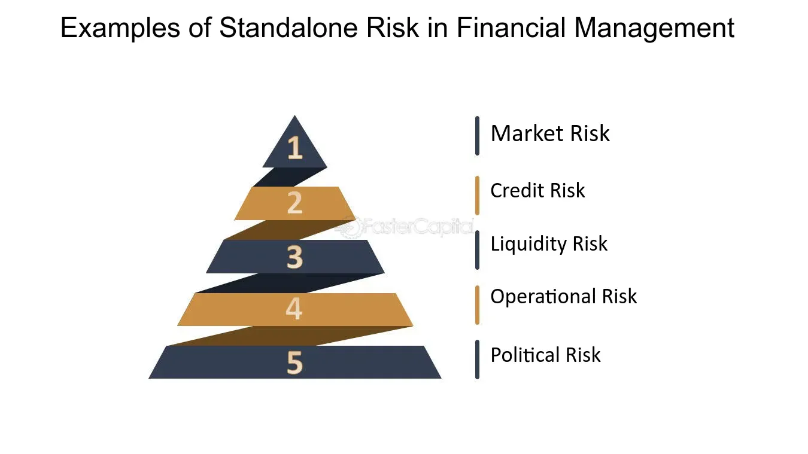

## Table of Contents

## What is standalone risk in finance?

Standalone risk in finance refers to the risk associated with a single investment or asset when it is considered on its own, without taking into account its impact on the overall portfolio. This type of risk is important for investors to understand because it helps them evaluate the potential volatility and uncertainty of an individual investment. For example, if you are thinking about buying stock in a company, standalone risk would involve looking at factors like the company's financial health, market position, and industry trends to gauge how risky that stock might be by itself.

However, standalone risk does not consider how the investment might interact with other investments in a portfolio. This is different from portfolio risk, which looks at the combined effect of all investments together. Understanding standalone risk is useful, but it's only part of the picture. Investors often use it as a starting point before considering how adding a new investment might affect the risk and return of their entire portfolio. By doing this, they can make more informed decisions about where to put their money.

## How is standalone risk different from other types of risk?

Standalone risk is all about looking at one investment by itself, without thinking about other investments. It's like checking if a single piece of a puzzle is risky without considering the whole picture. When you look at standalone risk, you focus on things like how stable the company is, how it's doing in the market, and what's happening in its industry. This helps you understand how much risk comes with owning just that one investment.

But, standalone risk is different from other types of risk, like portfolio risk. Portfolio risk looks at how all your investments work together. It's about seeing how adding or removing one investment might change the overall risk and return of your entire collection of investments. So, while standalone risk is great for understanding a single investment, it doesn't tell you how that investment fits into your bigger plan. Other risks, like market risk or interest rate risk, focus on broader factors that can affect many investments at once, not just one.

## Can you explain the concept of standalone risk with an example?

Let's say you're thinking about buying stock in a company called "GreenTech," which makes solar panels. Standalone risk means you're looking at how risky it is to invest in GreenTech by itself, without thinking about your other investments. You'd check things like how much money GreenTech is making, if it's growing, and if the solar panel industry is doing well. You might find out that GreenTech is doing great and the solar industry is booming, so the standalone risk might seem low. But, if GreenTech is struggling and the solar industry is facing challenges, the standalone risk could be high.

Now, imagine you already have a bunch of other investments, like stocks in different industries and some bonds. If you only look at GreenTech's standalone risk, you might think it's too risky to buy. But, if you add GreenTech to your whole collection of investments, it might actually help balance things out. Maybe your other investments are in industries that don't depend on solar power, so adding GreenTech could spread your risk around. That's why it's important to think about standalone risk, but also see how it fits with everything else you own.

## What are the main factors that contribute to standalone risk?

When you think about standalone risk, you're looking at what makes a single investment risky all by itself. One big thing is the financial health of the company. If the company has a lot of debt or isn't making much money, that can make the investment riskier. Another thing is how the company is doing in the market. If it's losing customers or if its products aren't selling well, that's a red flag. Also, the industry the company is in matters a lot. If the whole industry is struggling, like if there's too much competition or new laws making things harder, that can make the investment more risky.

Another factor is how much the price of the investment goes up and down. If the stock price jumps around a lot, that's more risk. And don't forget about things like management changes or legal problems. If the CEO leaves or the company gets sued, that can shake things up. All these things together help you see how risky it is to invest in just one company without thinking about your other investments.

## How can standalone risk be measured in a financial context?

To measure standalone risk, you can look at a few key things. One way is to check the standard deviation of the investment's returns. This tells you how much the returns go up and down over time. If the standard deviation is high, it means the investment is more risky because its value can change a lot. Another way is to use a tool called beta. Beta measures how much an investment moves with the overall market. If a stock has a high beta, it means it's more sensitive to market changes, which can make it riskier.

You can also look at the company's financial statements to see how stable it is. Things like debt levels, profit margins, and cash flow can show you if the company is in good shape or if it might be in trouble. By looking at these numbers, you can get a better idea of how risky the investment might be on its own. All these methods help you understand standalone risk, which is important for deciding if an investment is right for you.

## What are some common methods to assess standalone risk in investment portfolios?

To figure out how risky an investment is by itself, one common way is to look at its standard deviation. This tells you how much the investment's returns can change. If the standard deviation is big, it means the investment can go up and down a lot, which makes it riskier. Another way is to use something called beta. Beta shows how much the investment moves with the overall market. A high beta means the investment can swing a lot when the market changes, making it more risky.

You can also check the company's financial health to assess standalone risk. By looking at the company's debt, how much profit it makes, and its cash flow, you can see if it's stable or if it might run into trouble. These numbers give you clues about how risky the investment might be on its own. By using these methods, you can get a good idea of the standalone risk of an investment, which helps you decide if it's a good choice for you.

## How does standalone risk impact investment decisions?

Standalone risk is really important when you're deciding if you should invest in something. It tells you how risky an investment is by itself, without thinking about your other investments. If an investment has a high standalone risk, it means it could go up and down a lot, which might make you think twice about buying it. For example, if a company's stock has a lot of ups and downs, you might decide it's too risky for you, even if the company is doing well in other ways.

But, standalone risk is just one piece of the puzzle. You also need to think about how adding that investment will change the risk of your whole portfolio. Sometimes, an investment with high standalone risk might actually help balance out your other investments, making your overall portfolio less risky. So, while standalone risk can guide your decisions, it's important to look at the bigger picture and see how the new investment fits with everything else you own.

## What are the strategies to mitigate standalone risk in financial planning?

One way to lower standalone risk is to do a lot of research before you invest. Look at things like how much money the company makes, how much debt it has, and how well it's doing compared to others in its industry. By understanding these things, you can pick investments that seem less risky on their own. Another strategy is to spread out your money across different types of investments. If you put all your money into one stock and it does badly, you could lose a lot. But if you have money in different stocks, bonds, and maybe even real estate, a problem with one investment won't hurt you as much.

Another good idea is to keep an eye on your investments and be ready to make changes. If something about the company or the industry changes and makes your investment riskier, you might want to sell it or buy less of it. Also, think about using tools like stop-loss orders, which can help you limit how much money you could lose if the price of your investment drops a lot. By staying active and making smart choices, you can manage standalone risk better and protect your money.

## How does standalone risk interact with market risk and specific risk?

Standalone risk is like looking at how risky one investment is by itself. It includes both market risk and specific risk. Market risk is about things that can affect the whole market, like interest rates going up or a big economic change. If the market goes down, your investment might go down too, no matter how good the company is. Specific risk, on the other hand, is about things that can happen to just one company, like a bad CEO or a lawsuit. So, when you look at standalone risk, you're seeing how both these types of risks can make your investment go up and down.

But, standalone risk doesn't tell you how your investment will do when you mix it with other investments. That's where portfolio risk comes in. Portfolio risk looks at how all your investments work together. Sometimes, an investment with high standalone risk might actually help balance out your other investments, making your whole portfolio less risky. So, while standalone risk is important to understand, it's just one part of the bigger picture when you're planning your investments.

## What role does standalone risk play in the Capital Asset Pricing Model (CAPM)?

In the Capital Asset Pricing Model (CAPM), standalone risk is important because it helps figure out how much return you should expect from an investment. CAPM looks at how risky an investment is compared to the whole market. It uses something called beta to measure this. Beta shows how much an investment's price moves with the market. If an investment has a high standalone risk, it might have a high beta, which means it could be more sensitive to what's happening in the market. This helps investors understand if the extra risk they're taking on is worth the potential extra return.

But, CAPM focuses more on how an investment affects your whole portfolio, not just its standalone risk. It looks at how adding or removing an investment changes the risk of everything you own. So, while standalone risk is a part of what CAPM considers, it's really about seeing how that risk fits into your bigger investment plan. By understanding both the standalone risk and how it interacts with other investments, you can use CAPM to make smarter choices about where to put your money.

## How can advanced statistical models be used to predict and manage standalone risk?

Advanced statistical models can help predict and manage standalone risk by looking at lots of data and finding patterns that might be hard to see otherwise. For example, these models can use something called regression analysis to see how different things, like a company's profits or the overall economy, might affect an investment's risk. By understanding these patterns, investors can make better guesses about how risky an investment might be in the future. This can help them decide if they want to buy, sell, or hold onto an investment.

These models can also use something called Monte Carlo simulations, which run many different scenarios to see what might happen to an investment under different conditions. This can show investors how likely it is for an investment to go up or down a lot, which is a big part of standalone risk. By using these advanced tools, investors can get a clearer picture of the risks they're taking on and make more informed decisions. This way, they can manage standalone risk better and maybe even reduce it by choosing investments that seem less risky based on the data.

## What are the latest research findings on standalone risk and its implications for financial theory?

Recent research on standalone risk has been looking at how it affects different kinds of investments, like stocks, bonds, and even cryptocurrencies. One big finding is that standalone risk can change a lot depending on what's happening in the world. For example, during a global crisis like a pandemic, standalone risk can go up a lot because companies might struggle more. Researchers have also found that standalone risk isn't just about the company itself but can be influenced by things like how much people trust the market or new laws that come into play. This means that understanding standalone risk now involves looking at a wider range of factors than before.

These findings have important implications for financial theory. They show that standalone risk is more complex than we used to think, and it's not just about the ups and downs of one investment. Financial theories now need to think about how standalone risk can be affected by big events and broader market feelings. This can help investors make better choices by understanding that standalone risk is part of a bigger picture. It also means that financial models and risk assessments need to keep up with these new insights to stay accurate and helpful for investors.

## What is the relationship between understanding financial risk and standalone risk?

Financial risk encompasses the possibility of financial loss inherent in any investment or trading activity. It arises due to various factors, including market fluctuations, economic downturns, [interest rate](/wiki/interest-rate-trading-strategies) changes, and political instability. Investors often face financial risk when market dynamics affect the value of their investments. This type of risk is integral to the broader considerations of portfolio management, requiring investors to account for systemic factors that can impact prices across various asset classes. Effective management of financial risk involves assessing market conditions, identifying potential vulnerabilities, and implementing strategies to mitigate adverse impacts.

Standalone risk, by contrast, pertains to the risk specific to an individual asset or entity, segregated from the influence of a diversified portfolio. This risk focuses on the variability in returns related to the inherent characteristics and performance of a single investment. For example, the standalone risk associated with owning a stock depends on the company's financial health, business model, and industry conditions, independent of the wider market trends. The measure of standalone risk is critical when evaluating investments in isolation, as it helps investors understand the expected [volatility](/wiki/volatility-trading-strategies) and potential for returns relative to a particular asset.

While financial risk involves a comprehensive view of market dynamics, standalone risk emphasizes the unique factors affecting a single entity. In practice, the evaluation of both risk types requires a combination of quantitative and qualitative analysis. Quantitatively, standalone risk can be assessed using statistical measures such as variance or standard deviation of returns. Mathematically, standard deviation ($\sigma$) is calculated as follows:

$$
\sigma = \sqrt{\frac{1}{N}\sum_{i=1}^{N}(x_i - \mu)^2}
$$

where $x_i$ represents individual return observations, $\mu$ is the mean return, and $N$ is the number of observations.

Understanding both financial and standalone risks is essential for maintaining a balanced investment strategy. Investors should diversify their portfolios to spread financial risk while also conducting thorough analysis of standalone risk to make informed decisions about specific assets. Effective risk management considers the interplay between these risks, leveraging insights to optimize investment outcomes while safeguarding against adverse market events.

## What is the Role of Risk Analysis in Algorithmic Trading?

Algorithmic trading, also known as algo trading, involves the use of computer algorithms to automate trading decisions. These algorithms can quickly analyze market data and execute trades at speeds and frequencies that would be impossible for human traders. However, the automated nature of algo trading introduces a range of risks, making risk analysis an essential component in the development and deployment of algorithmic strategies.

One primary aspect of risk analysis in [algorithmic trading](/wiki/algorithmic-trading) is the assessment of potential market volatility. Market conditions can change rapidly, and without proper analysis, algorithms may not adapt swiftly enough to mitigate losses. Financial risk analysis provides the framework for evaluating these conditions, allowing traders to adjust algorithms in real-time. This typically involves the use of volatility measures such as the standard deviation of returns or more sophisticated models like Value at Risk (VaR) and Conditional Value at Risk (CVaR) to quantify potential losses. For example, CVaR can be expressed mathematically as:

$$

\text{CVaR}_\alpha(X) = \frac{1}{1-\alpha} \int_{\alpha}^{1} \text{VaR}_\beta(X) \, d\beta 
$$

where $\text{CVaR}_\alpha(X)$ is the expected loss given that the loss is beyond the VaR threshold $\text{VaR}_\alpha$ at a confidence level $\alpha$.

Moreover, a keen understanding of standalone risk is vital for algorithmic traders who focus on specific assets or instruments. Standalone risk pertains to the threat associated with holding a singular asset, independent of how it might behave as part of a diversified portfolio. Algo traders must assess how their strategies perform under isolated scenarios. This involves [backtesting](/wiki/backtesting) strategies using historical data to simulate potential outcomes and identify weaknesses. Advanced simulation techniques like Monte Carlo simulations can be employed to model various market conditions and their impact on the asset, thereby enhancing the understanding of standalone risk.

Incorporating sophisticated data analysis tools aids in the continuous monitoring of algorithm performance and the environment it operates under. Machine learning algorithms can also be integrated to predict potential risk factors based on emerging market trends or anomalies in data patterns. For instance, natural language processing (NLP) techniques could analyze news feeds or social media to capture sentiment shifts that impact asset volatility.

Implementing a comprehensive approach to risk assessment not only involves technical metrics and backtesting but also includes setting predefined risk parameters within the trading algorithm itself, such as stop-loss limits and risk exposures per trade. Python, a preferred language for developing and testing trading strategies, allows for flexible modeling and risk assessments. The use of libraries such as NumPy, pandas, and scikit-learn facilitates complex computations and model building necessary for thorough risk analysis.

In summary, risk analysis in algorithmic trading is a multi-faceted process that requires the integration of both quantitative and qualitative assessments. It ensures that algorithms are robust, adaptable, and capable of mitigating unforeseen risk factors, thereby safeguarding investments and optimizing trading outcomes.

## References & Further Reading

[1]: ["Advances in Financial Machine Learning"](https://www.amazon.com/Advances-Financial-Machine-Learning-Marcos/dp/1119482089) by Marcos Lopez de Prado

[2]: ["Quantitative Risk Management: Concepts, Techniques and Tools"](https://press.princeton.edu/books/hardcover/9780691166278/quantitative-risk-management) by Alexander J. McNeil, Rüdiger Frey, and Paul Embrechts

[3]: Aldridge, I. (2013). ["High-Frequency Trading: A Practical Guide to Algorithmic Strategies and Trading Systems."](https://www.amazon.com/High-Frequency-Trading-Practical-Algorithmic-Strategies/dp/1118343506) Wiley Trading. 

[4]: ["Quantitative Trading: How to Build Your Own Algorithmic Trading Business"](https://www.amazon.com/Quantitative-Trading-Build-Algorithmic-Business/dp/1119800064) by Ernest P. Chan

[5]: [Gomber, P., Arndt, B., Lutat, M., & Uhle, T. (2011). "High-Frequency Trading."](https://papers.ssrn.com/sol3/papers.cfm?abstract_id=1858626) Discussion Paper Series Even Markets Work. 

[6]: ["The Evaluation and Optimization of Trading Strategies"](https://onlinelibrary.wiley.com/doi/book/10.1002/9781119196969) by Robert Pardo