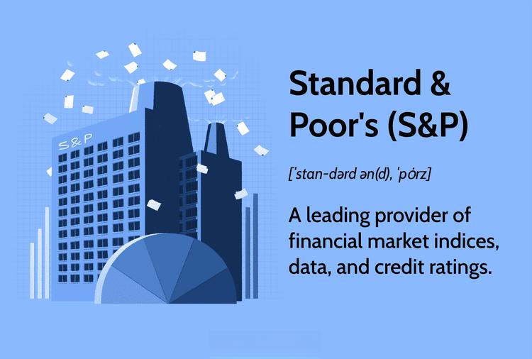

## Table of Contents

## What is the Standard & Poor's small-cap index?

The Standard & Poor's small-cap index, often referred to as the S&P SmallCap 600, is a stock market index that tracks the performance of small companies in the United States. Specifically, it includes 600 small-cap stocks, which are companies with a relatively small market capitalization, typically between $300 million and $2 billion. This index is designed to represent a broad segment of the small-cap market and is used by investors to gauge the health and direction of smaller companies.

The S&P SmallCap 600 is part of the S&P Dow Jones Indices family and is widely regarded as a reliable benchmark for small-cap stocks. It is constructed to be an investable index, meaning that it is possible for investors to buy and hold all the stocks in the index in the same proportions as the index itself. This makes it a useful tool for investors who want to diversify their portfolios by including smaller companies, which might offer higher growth potential compared to larger, more established companies.

## How is the Standard & Poor's small-cap index different from other S&P indices?

The Standard & Poor's small-cap index, or S&P SmallCap 600, focuses on smaller companies in the U.S., while other S&P indices like the S&P 500 and S&P MidCap 400 look at bigger or medium-sized companies. The S&P SmallCap 600 includes 600 companies with market values usually between $300 million and $2 billion. This makes it different because it gives investors a way to see how small companies are doing, which can be riskier but also might grow faster than bigger companies.

Other S&P indices, like the S&P 500, track the performance of 500 large companies, which are often more stable and well-known. The S&P MidCap 400, on the other hand, focuses on 400 medium-sized companies. Each of these indices helps investors understand different parts of the market. The S&P SmallCap 600 is special because it's all about small companies, which can be a good choice for investors wanting to spread their money across different sizes of businesses and possibly find new growth opportunities.

## What criteria must a company meet to be included in the S&P small-cap index?

To be included in the S&P SmallCap 600, a company must meet certain rules set by Standard & Poor's. The company needs to be based in the United States and have a market value between $300 million and $2 billion. It also needs to have enough shares available for the public to buy and sell easily. Plus, the company should make money regularly, which means it should have positive earnings for the most recent quarter and over the last year.

Another important rule is that the company must fit well with the overall group of companies in the index. This means it should be in a similar industry and size to the other companies already in the S&P SmallCap 600. Standard & Poor's also looks at how much the company is traded on the stock market, because they want to make sure it's active enough to be a good part of the index. If a company gets too big or too small, it might move to a different S&P index, like the S&P MidCap 400 or S&P 500, to keep the small-cap index focused on smaller companies.

## How often is the S&P small-cap index rebalanced?

The S&P SmallCap 600 index is checked and updated every three months. This happens in March, June, September, and December. During these times, the people at Standard & Poor's look at all the companies in the index to make sure they still fit the rules for being in the small-cap group.

Sometimes, a company can change in size or other ways between these quarterly checks. If a company gets too big or too small, or if something big happens to it, Standard & Poor's might decide to change the index right away, not waiting for the next quarterly update. This helps keep the index a good picture of small companies in the U.S.

## What is the historical performance of the S&P small-cap index?

The S&P SmallCap 600 has had ups and downs over the years, just like any other stock market index. Since it started in 1994, it has given investors some good returns, but it has also been more risky than bigger company indexes like the S&P 500. Small companies can grow fast, but they can also fall hard if things go wrong. Over the long run, the S&P SmallCap 600 has had times when it did better than the S&P 500, especially in the late 1990s and early 2000s. But it also had times when it did worse, like during the 2008 financial crisis.

Looking at specific years can show how the S&P SmallCap 600 moves. For example, in 2013, it went up by about 41%, which was a lot better than the S&P 500's increase of about 32%. But in 2018, it went down by about 8%, while the S&P 500 only dropped by about 4%. This shows how small companies can be more sensitive to what's happening in the economy. Over the last 10 years, from 2013 to 2023, the S&P SmallCap 600 has had an average yearly return of around 10%, which is pretty good but still comes with more ups and downs than investing in bigger companies.

## How does the S&P small-cap index correlate with the broader market?

The S&P SmallCap 600 often moves in the same direction as the broader market, like the S&P 500, but it can be more up and down. This means when the big companies go up or down, the small companies usually do too, but their changes can be bigger. For example, if the S&P 500 goes up by 5%, the S&P SmallCap 600 might go up by 7% or even more. But if the S&P 500 goes down by 5%, the small-cap index might drop by 6% or more. This happens because small companies are often more affected by what's happening in the economy.

Over long periods, the S&P SmallCap 600 and the broader market tend to have similar overall trends. But the small-cap index can be more exciting to watch because it can have bigger swings. Investors who like to take more risk might like the S&P SmallCap 600 because it can offer chances for bigger gains, but it also comes with the chance of bigger losses. So, while it follows the broader market, the S&P SmallCap 600 can be a wilder ride.

## What are the benefits of investing in the S&P small-cap index?

Investing in the S&P SmallCap 600 can be a good choice because it gives you a chance to grow your money faster than with bigger companies. Small companies can grow a lot quicker because they are still new and expanding. This means if you pick the right ones, you might see bigger returns than if you only invested in big, well-known companies. Also, by investing in the S&P SmallCap 600, you are spreading your money across many small companies, which can make your investment less risky than [picking](/wiki/asset-class-picking) just one or two small companies on your own.

Another benefit is that the S&P SmallCap 600 can help you diversify your investments. When you put money into different types of companies, you are not putting all your eggs in one basket. If big companies are not doing well, small companies might still be doing okay or even better. This can help balance out your overall investment returns. Plus, the S&P SmallCap 600 is checked and updated regularly, so you know it always has a good mix of small companies that fit certain rules, making it easier to keep your investments in good shape without having to do a lot of work yourself.

## What are the risks associated with investing in the S&P small-cap index?

Investing in the S&P SmallCap 600 can be riskier than investing in bigger companies. Small companies can have bigger ups and downs. This means if the economy is doing badly, small companies might lose more money than big ones. They can also be affected more by things like higher interest rates or trouble getting loans. So, if you invest in the S&P SmallCap 600, you might see your money go up and down a lot more than with the S&P 500.

Another risk is that small companies might not have as much information available about them. Big companies have to share a lot of details about their business, but small ones might not. This can make it harder to know if you are making a good investment. Also, small companies can go out of business more easily than big ones. If a few companies in the S&P SmallCap 600 do badly or go bankrupt, it can hurt the whole index and your investment. So, while the S&P SmallCap 600 can offer chances for big gains, it also comes with more risks.

## How can investors gain exposure to the S&P small-cap index?

Investors can gain exposure to the S&P SmallCap 600 by buying a mutual fund or an exchange-traded fund ([ETF](/wiki/etf-trading-strategies)) that tracks this index. These funds are made to match the performance of the S&P SmallCap 600, so when the index goes up or down, the fund does the same. This is an easy way to invest in many small companies at once without having to pick them yourself. Some popular ETFs that follow the S&P SmallCap 600 are the iShares Core S&P Small-Cap ETF and the Vanguard S&P Small-Cap 600 ETF.

Another way to invest in the S&P SmallCap 600 is through a financial advisor or a robo-advisor. These services can help you set up an investment plan that includes the S&P SmallCap 600. They can also manage your investments for you, which can be helpful if you don't want to do it yourself. By using these methods, you can spread your money across many small companies and still keep things simple.

## What are some ETFs or mutual funds that track the S&P small-cap index?

There are several ETFs and mutual funds that track the S&P SmallCap 600, making it easy for investors to get exposure to small companies. One popular ETF is the iShares Core S&P Small-Cap ETF (IJR). This ETF tries to match the performance of the S&P SmallCap 600 by holding all the same stocks in the same amounts. Another well-known option is the Vanguard S&P Small-Cap 600 ETF (VIOO). This ETF also aims to follow the S&P SmallCap 600 closely and is known for its low costs.

For those who prefer mutual funds, the SPDR S&P 600 Small Cap ETF (SLY) is another choice. This fund also tracks the S&P SmallCap 600 and can be bought or sold like a stock. Additionally, the Fidelity S&P Small Cap 600 Index Fund (FSSNX) is a mutual fund that aims to give investors the same returns as the S&P SmallCap 600. These funds and ETFs make it easy for investors to put money into small companies without having to pick them one by one.

## How does the sector composition of the S&P small-cap index compare to larger indices?

The S&P SmallCap 600 has a different mix of industries compared to bigger indices like the S&P 500. The small-cap index usually has more companies in industries like healthcare, industrials, and financials. These are areas where smaller companies can grow fast. On the other hand, the S&P 500 has a lot more big tech and big healthcare companies. This means the S&P SmallCap 600 might give you a chance to invest in smaller, growing businesses in sectors that are not as big in the S&P 500.

The sector mix in the S&P SmallCap 600 can also change more often than in the S&P 500. Because it focuses on smaller companies, the S&P SmallCap 600 can quickly add or drop companies in different industries. This can make the index more sensitive to what's happening in the economy. The S&P 500, with its bigger companies, might not change as much because those companies are often more stable and well-established. So, if you invest in the S&P SmallCap 600, you might see more changes in the kinds of businesses you're invested in.

## What advanced metrics or factors should be considered when analyzing the S&P small-cap index?

When looking at the S&P SmallCap 600, it's good to think about more than just how the index is doing overall. One important thing to check is the price-to-earnings (P/E) ratio. This tells you how much investors are willing to pay for a dollar of the company's earnings. A high P/E might mean people think the company will grow a lot, but it can also mean the stock is too expensive. Another thing to look at is the debt-to-equity ratio, which shows how much the companies are borrowing compared to what they own. If this ratio is high, it might mean the companies are riskier because they have a lot of debt.

It's also smart to think about how much the companies in the index are growing. You can look at their revenue growth and earnings growth over time. If these numbers are going up, it's a good sign that the companies are doing well. Another thing to consider is the beta of the index, which shows how much it moves compared to the broader market. A high beta means the S&P SmallCap 600 might go up or down a lot more than the S&P 500. Lastly, looking at the sector weights can help you understand which parts of the economy are driving the index's performance. If one sector is doing really well or really badly, it can affect the whole index.

## What are the benefits of incorporating small cap stocks in algo trading?

Incorporating small cap stocks into [algorithmic trading](/wiki/algorithmic-trading) offers diverse benefits, primarily due to their distinctive market behaviors and growth potential. Small cap stocks, typically defined as having a market capitalization between $300 million and $2 billion, often exhibit greater [volatility](/wiki/volatility-trading-strategies) than their large cap counterparts. This volatility can be harnessed by algorithms to capture short-term price movements and enhance trading returns.

One of the primary benefits of including small cap stocks in algorithms is diversification. By integrating small caps, traders can reduce portfolio risk associated with market movements of large cap stocks. This diversification can be mathematically modeled using the portfolio variance formula:

$$
\sigma^2_p = \sum (w_i^2 \cdot \sigma^2_i) + \sum \sum (w_i \cdot w_j \cdot Cov(i, j))
$$

where $\sigma^2_p$ is the portfolio variance, $w_i$ and $w_j$ are the asset weights, $\sigma^2_i$ is the variance of asset $i$, and $Cov(i, j)$ is the covariance between assets $i$ and $j$. Integrating small caps with low correlation to larger stocks can significantly lower this variance, increasing the portfolio's risk-adjusted return.

Algo trading platforms capitalize on the market participation of small cap stocks by leveraging advanced computational techniques. Given their faster growth rates, small caps can provide higher returns, albeit with increased risk. Algorithms can quickly process large volumes of data to execute trades at optimal prices, exploiting the price inefficiencies that small cap stocks are prone to.

The inherent volatility of small cap stocks is advantageous for algorithm development, necessitating robust systems capable of processing vast amounts of data and adjusting trading strategies dynamically. Algorithms designed for small cap trading use predictive analytics and [machine learning](/wiki/machine-learning) techniques to forecast price movements based on historical data and market sentiment. Consider a Python snippet that employs a simple moving average strategy suited for volatile stocks:

```python
import pandas as pd

def moving_average_strategy(prices, short_window=40, long_window=100):
    signals = pd.DataFrame(index=prices.index)
    signals['price'] = prices
    # Create short simple moving average
    signals['short_mavg'] = prices.rolling(window=short_window, min_periods=1, center=False).mean()
    # Create long simple moving average
    signals['long_mavg'] = prices.rolling(window=long_window, min_periods=1, center=False).mean()
    # Create signals
    signals['signal'] = 0.0
    signals['signal'][short_window:] = np.where(signals['short_mavg'][short_window:] 
                                                > signals['long_mavg'][short_window:], 1.0, 0.0)   
    return signals

# Example usage
# prices is a pandas Series of stock closing prices
# signals = moving_average_strategy(prices)
```

Small cap stocks, due to their unpredictability, challenge algorithmic adaptability and robustness. This demand for adaptability can push the development of more sophisticated models that incorporate real-time data analysis, machine learning, and [artificial intelligence](/wiki/ai-artificial-intelligence). Enhanced algorithm robustness is critical to maintaining stable performance across volatile market conditions. Moreover, agile algorithms can swiftly rebalance portfolios and hedge against adverse market events, providing a crucial edge in volatile trading environments.

In conclusion, integrating small cap stocks in algorithmic trading holds substantial potential for enhanced returns through diversification and captures volatility-driven opportunities. This incorporation requires sophisticated, adaptable algorithms designed to optimize market participation and manoeuver the challenges posed by small caps' unique market behaviors.

## References & Further Reading

1. **"Algorithmic Trading: Winning Strategies and Their Rationale" by Ernie Chan**  
   This book provides a comprehensive look at different algorithmic trading strategies, including their practical implementation. It is an essential read for those interested in the mechanics and logic behind successful algo trading strategies. [Link to the book](https://www.amazon.com/Algorithmic-Trading-Winning-Strategies-Rationale/dp/1118460146).

2. **"Advances in Financial Machine Learning" by Marcos López de Prado**  
   This book explores the role of machine learning in financial markets, offering insights on its integration into trading strategies. It is particularly useful for understanding the data-driven techniques applicable to small cap stock trading. [Link to the book](https://www.amazon.com/Advances-Financial-Machine-Learning-Marcos/dp/1119482089).

3. **"High-Frequency Trading: A Practical Guide to Algorithmic Strategies and Trading Systems" by Irene Aldridge**  
   This resource details the workings of high-frequency trading systems and the algorithmic strategies employed within them, highlighting the technical precision needed for trading small cap stocks. [Link to the book](https://www.amazon.com/High-Frequency-Trading-Algorithmic-Strategies-Systems/dp/1118343506).

4. **Research Paper: "The Impact of Algorithmic Trading on Market Quality: Evidence from the NYSE" by Joel Hasbrouck and Gideon Saar**  
   This paper examines how algorithmic trading influences market quality, providing empirical evidence that is pertinent to understanding the implications of integrating small cap stocks in such frameworks. [Link to the paper](https://papers.ssrn.com/sol3/papers.cfm?abstract_id=1557869).

5. **"Algorithmic Trading using Python: A Beginner's Guide"**  
   This online resource offers a practical introduction to implementing algorithmic trading strategies using Python, from data collection and analysis to strategy formulation. A valuable tool for beginners looking to code algorithmic trading systems. [Link to the online guide](https://www.turingfinance.com/introduction-to-algorithmic-trading-in-python/).

6. **"Small Caps: Investing for Competition-beating Returns" by David Stevenson**  
   This book discusses the potential of small cap stocks, including their risks and benefits. It is crucial for those looking to understand why small cap stocks are attractive in the context of algorithmic trading. [Link to the book](https://www.amazon.com/Small-Caps-Investing-Competition-beating-Returns/dp/0857193025).

7. **Research Paper: "Market Microstructure in Practice" by Charles-Albert Lehalle and Sophie Laruelle**  
   This paper focuses on the market microstructure and the role of algorithmic trading within it, offering insights crucial for developing strategies in small cap markets. [Link to the paper](https://www.risk.net/market-microstructure-in-practice).

For those interested in further exploring the advanced mathematical concepts and analytics in algorithmic trading, numerous online courses and seminars are available through platforms like Coursera, edX, and Udacity. These resources collectively cover foundational to advanced topics necessary for mastering algorithmic trading in small and larger cap markets.

