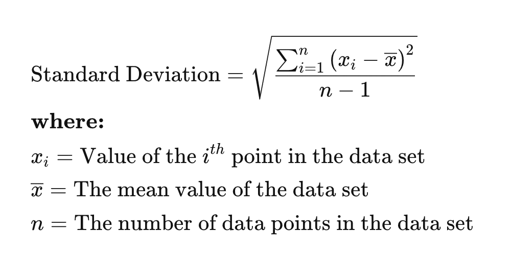

## Table of Contents

## What is standard deviation and why is it important in investment portfolios?

Standard deviation is a way to measure how much numbers in a set differ from the average. Imagine you have a bunch of test scores. If most scores are close to the average, the standard deviation is small. If the scores are all over the place, the standard deviation is large. In investments, standard deviation tells you how much the return on an investment might go up or down.

In investment portfolios, standard deviation is important because it helps you understand the risk. If an investment has a high standard deviation, it means the returns could be very different from what you expect, which is riskier. If it has a low standard deviation, the returns are more predictable, which is less risky. Knowing this helps investors decide if they want to take a chance on a risky investment or stick with something safer.

## How is standard deviation calculated for an investment portfolio?

To calculate the standard deviation for an investment portfolio, you start by figuring out the average return of the portfolio over a period of time. This could be daily, monthly, or yearly returns. Once you have the average return, you then look at how much each individual return differs from this average. You square these differences to make sure they are all positive, and then you find the average of these squared differences. This average is called the variance.

After you have the variance, you take the square root of it to get the standard deviation. The square root step is important because it brings the numbers back to the same scale as the original returns. A higher standard deviation means the returns of the portfolio are spread out more, which means it's riskier. A lower standard deviation means the returns are more consistent, which means it's less risky. This helps investors understand how much their portfolio might go up or down in the future.

## What does a high standard deviation indicate about an investment portfolio?

A high standard deviation in an investment portfolio means that the returns on the investments can change a lot. Imagine you're looking at how much money you might make or lose each month. If the numbers are all over the place, with some months showing big gains and other months showing big losses, that's what a high standard deviation looks like. It tells you that the portfolio is riskier because you can't predict how much you'll make or lose.

This kind of information is really important for someone deciding where to put their money. If you don't like surprises and want your investments to be more predictable, a portfolio with a high standard deviation might not be for you. But if you're okay with taking bigger risks because you think you might get bigger rewards, then a high standard deviation might be something you're willing to accept. It's all about knowing how much risk you're comfortable with.

## What does a low standard deviation suggest about the risk of an investment portfolio?

A low standard deviation in an investment portfolio means that the returns on your investments don't change much. Imagine you're checking how much money you make each month. If the numbers are pretty close to each other every month, that's what a low standard deviation looks like. It tells you that the portfolio is less risky because you can guess pretty well how much you'll make or lose.

This kind of information is helpful if you want your investments to be steady and predictable. If you don't like taking big risks and prefer knowing what to expect, a portfolio with a low standard deviation might be a good choice for you. It's all about feeling comfortable with how much your money might go up or down.

## How can standard deviation be used to compare different investment portfolios?

Standard deviation is a great way to compare how risky different investment portfolios are. Imagine you have two portfolios. One has a standard deviation of 5%, and the other has a standard deviation of 15%. The one with 5% is less risky because its returns don't change much. The one with 15% is riskier because its returns can swing a lot. By looking at the standard deviation, you can see which portfolio might give you more predictable returns and which one might surprise you more.

When you're choosing between different portfolios, knowing their standard deviations helps you make a smarter choice. If you don't like surprises and want your money to grow steadily, you'll pick the portfolio with the lower standard deviation. But if you're okay with bigger ups and downs because you think you might get bigger rewards, you might go for the portfolio with the higher standard deviation. It's all about matching the risk level of the portfolio to what you're comfortable with.

## What are the limitations of using standard deviation as a measure of risk in investment portfolios?

Standard deviation is a useful way to measure risk in investment portfolios, but it has some limits. One big limit is that it assumes the returns of investments follow a normal distribution, like a bell curve. But in real life, investment returns can be all over the place and not follow this pattern. This means standard deviation might not give you the full picture of how risky an investment really is. It can make you think an investment is safer than it actually is if it has big drops that happen more often than a normal distribution would predict.

Another problem is that standard deviation looks at how much returns change, but it doesn't tell you about the direction of those changes. For example, it treats big gains and big losses the same way. But most investors care more about big losses than big gains. So, standard deviation might not show you the true risk if an investment has a lot of big drops. Also, standard deviation doesn't take into account other risks like changes in interest rates, inflation, or what's happening in the economy. These things can affect your investments in big ways, but standard deviation won't show you that.

## How does the standard deviation of an individual asset affect the overall portfolio's standard deviation?

The standard deviation of an individual asset can change the overall portfolio's standard deviation. When you add an asset with a high standard deviation to your portfolio, it can make the whole portfolio riskier. That's because the big ups and downs of that asset can affect the overall returns. On the other hand, if you add an asset with a low standard deviation, it can make your portfolio less risky because it helps keep the returns more steady.

But it's not just about the standard deviation of each asset. How the assets move together, called correlation, also matters. If you have two assets with high standard deviations but they move in opposite directions, they can actually lower the overall portfolio's standard deviation. This is called diversification. It means that when one asset goes down, the other might go up, balancing things out. So, understanding both the standard deviation of each asset and how they relate to each other is key to figuring out the risk of your whole portfolio.

## Can you explain the concept of portfolio diversification in relation to standard deviation?

Portfolio diversification is like not putting all your eggs in one basket. It means spreading your money across different types of investments. When you do this, you can lower the overall risk of your portfolio, even if some of the individual investments have high standard deviations. Standard deviation measures how much an investment's returns can go up and down. If you have a bunch of investments that don't move in the same way, the big ups and downs of one investment can be balanced out by the others. This can make the whole portfolio's standard deviation smaller, which means it's less risky.

Imagine you have two investments. One is a stock that goes up and down a lot, so it has a high standard deviation. The other is a bond that stays pretty steady, with a low standard deviation. If you mix them together in your portfolio, the ups and downs of the stock can be smoothed out by the steadiness of the bond. This happens because the stock and bond don't move in the same way at the same time. By diversifying, you're not just looking at the standard deviation of each investment on its own, but how they work together to make your whole portfolio less risky.

## How do financial advisors use standard deviation to help clients make investment decisions?

Financial advisors use standard deviation to help clients understand the risk of their investments. They explain that a high standard deviation means the investment's returns can go up and down a lot, which makes it riskier. On the other hand, a low standard deviation means the returns are more predictable and the investment is less risky. By showing clients the standard deviation of different investments, advisors help them see which ones might fit their comfort level with risk. If a client doesn't like big surprises and wants steady growth, the advisor might suggest investments with lower standard deviations.

Advisors also use standard deviation to talk about diversification. They show how mixing different types of investments can lower the overall risk of a portfolio. Even if some investments have high standard deviations, combining them with others that have low standard deviations or move differently can balance things out. This helps clients feel more confident about their investments because they know the advisor is working to keep their portfolio's ups and downs as smooth as possible. By using standard deviation, financial advisors help clients make smarter choices that match their goals and how much risk they're okay with.

## What advanced statistical methods can be used alongside standard deviation to better assess portfolio risk?

Besides standard deviation, financial experts often use something called Value at Risk (VaR) to understand portfolio risk better. VaR tells you the most money you could lose in a certain time, like a day or a month, with a certain chance of it happening. For example, if your VaR is $10,000 at a 5% chance over a month, there's a 5% chance you could lose $10,000 or more in that month. VaR helps you see the worst-case scenarios and plan for them, which is something standard deviation doesn't do as well.

Another tool is Conditional Value at Risk (CVaR), which goes a step further than VaR. CVaR looks at what could happen if things go really bad, beyond just the worst case that VaR shows. It tells you the average loss you might face if you hit that worst-case scenario. This is helpful because it gives you a better idea of how bad things could get, not just how likely they are to happen. By using these methods along with standard deviation, you get a fuller picture of the risks in your investment portfolio.

## How does the time period over which standard deviation is calculated impact its interpretation in investment portfolios?

The time period you use to calculate standard deviation can really change how you see the risk of your investment portfolio. If you look at a short time, like a month, the standard deviation might show big ups and downs because short-term changes can be wild. But if you look at a longer time, like a year or more, the standard deviation might be smaller because the big ups and downs can balance out over time. So, when you're deciding how risky your investments are, it's important to think about how long you're looking at the numbers.

For example, if you check the standard deviation of your portfolio over just a few weeks, you might think it's really risky because the numbers jump around a lot. But if you check it over a few years, you might see that those jumps even out, and your portfolio seems less risky. This is why financial advisors often tell people to think about their long-term goals when they look at standard deviation. It helps you get a better idea of the real risk and not just the short-term bumps.

## What are some real-world examples where understanding standard deviation has significantly influenced investment strategies?

One real-world example where understanding standard deviation influenced investment strategies is during the 2008 financial crisis. Many investors looked at the standard deviation of their portfolios and realized how risky their investments were. They saw big ups and downs in their returns, which made them nervous. So, they started moving their money into safer investments like bonds, which had lower standard deviations. This shift helped them protect their money during a time when the stock market was crashing. By understanding standard deviation, they made smarter choices to lower their risk.

Another example is how big investment firms like pension funds use standard deviation to decide how to spread their money across different types of investments. They want to make sure their portfolio isn't too risky, so they look at the standard deviation of each investment. If they see that one type of investment has a high standard deviation, they might not put too much money into it. Instead, they mix in other investments with lower standard deviations to balance things out. This way, they can keep their overall portfolio steady and safe, even if some parts of it are more risky.

## What is Financial Risk and Standard Deviation?

Financial risk pertains to the possibility of losing financial capital when engaging in investments, directly impacting the stability and performance of portfolios. Managing this risk is essential for investors seeking to preserve capital and maximize returns over the long term.

Standard deviation is a critical statistical measure used to quantify the extent of variation or dispersion in a set of data points from their mean. In the context of investments, it serves as an indicator of the volatility or risk associated with a particular asset or portfolio. A higher standard deviation implies greater variability in the asset's returns, suggesting higher risk. Conversely, a lower standard deviation indicates more consistent performance and potentially lower risk.

In mathematical terms, the standard deviation (σ) of a dataset $X = \{x_1, x_2, ..., x_n\}$ with mean $\mu$ is calculated using the formula:

$$
\sigma = \sqrt{\frac{1}{n}\sum_{i=1}^{n}(x_i - \mu)^2}
$$

where:
- $n$ is the number of observations,
- $x_i$ represents each individual data point,
- $\mu$ is the mean of the dataset.

In finance, this formula helps investors understand how much the returns of an asset are likely to deviate from the expected average return. A portfolio with a higher standard deviation suggests that its returns are more spread out over a range of values, which typically signifies higher investment risk and the potential for higher returns. This is especially true when comparing different assets or portfolios where the expected returns are similar, making standard deviation a useful tool in risk assessment and portfolio diversification efforts.

## How is Standard Deviation Applied in Algorithmic Trading?

Algorithmic trading has brought a paradigm shift in financial markets by utilizing computational power and statistical methods to automate trading decisions. A pivotal metric in this sphere is standard deviation, which quantifies market volatility and aids in refining strategies for optimal trading outcomes. 

Standard deviation is instrumental in systems like Bollinger Bands, a popular technique used by traders to analyze market trends. Bollinger Bands consist of three lines: the middle band representing a simple moving average (SMA), and two outer bands calculated as standard deviations away from the middle band. The general formula for Bollinger Bands is:

$$
\text{Upper Band} = \text{SMA}(n) + k \times \sigma
$$
$$
\text{Lower Band} = \text{SMA}(n) - k \times \sigma
$$

where $n$ is the number of periods, $k$ is the factor by which the standard deviation is multiplied, and $\sigma$ denotes the standard deviation. This strategy allows traders to establish bounds within which a price is expected to fluctuate, providing insights into market volatility and potential price breakouts or retracements.

Algorithmic trading systems utilize standard deviation to monitor these fluctuations, adapting entry and [exit](/wiki/exit-strategy) strategies to capitalize on market movements. For instance, when prices move outside the predefined bands, it may signal a potential bullish or bearish trend, triggering automated buy or sell instructions. Such strategies are particularly useful in high-frequency trading environments where rapid decisions based on empirical data are crucial.

Python offers robust libraries such as NumPy and pandas, enabling traders to efficiently compute standard deviation and implement Bollinger Bands in their algorithms. Below is a basic Python implementation using these libraries:

```python
import pandas as pd
import numpy as np

# Sample data for closing prices
data = {'Close': [220, 225, 230, 228, 232, 235, 237, 240]}
df = pd.DataFrame(data)

# Parameters for Bollinger Bands
n = 5  # Window size for simple moving average
k = 2  # Number of standard deviations for the bands

# Calculate the moving average and standard deviation
df['SMA'] = df['Close'].rolling(window=n).mean()
df['STD'] = df['Close'].rolling(window=n).std()

# Calculate the upper and lower Bollinger Bands
df['Upper Band'] = df['SMA'] + (k * df['STD'])
df['Lower Band'] = df['SMA'] - (k * df['STD'])

print(df)
```

In this example, traders can visualize the price dynamics relative to the calculated bands and align their algorithmic strategies accordingly. By harnessing standard deviation, [algorithmic trading](/wiki/algorithmic-trading) systems enhance their capability to adapt to market volatility, ensuring informed and timely trading decisions. This systematic approach mitigates random guessing and leverages statistical insights for superior trading performance in rapidly changing markets.

## References & Further Reading

[1]: ["An Introduction to Risk Management in Finance"](https://www.cfainstitute.org/insights/professional-learning/refresher-readings/2024/introduction-risk-management) by John C. Hull.

[2]: Hull, J. C. (2009). ["Options, Futures, and Other Derivatives"](https://www.amazon.com/Options-Futures-Other-Derivatives-9th/dp/0133456315). Pearson.

[3]: Lo, A. W., & MacKinlay, A. C. (1999). ["A Non-Random Walk Down Wall Street"](https://www.jstor.org/stable/j.ctt7tccx). Princeton University Press.

[4]: ["The Art of Statistics: Learning from Data"](https://www.amazon.com/Art-Statistics-How-Learn-Data/dp/1541618513) by David Spiegelhalter.

[5]: Alexander, C. (2008). ["Market Risk Analysis, Volume I: Quantitative Methods in Finance"](https://archive.org/details/marketriskanalys0001alex). Wiley.

[6]: Taleb, N. N. (2007). ["The Black Swan: The Impact of the Highly Improbable"](https://archive.org/details/10.1.1.695.4305). Penguin Books.

[7]: Tsay, R. S. (2005). ["Analysis of Financial Time Series"](https://cpb-us-w2.wpmucdn.com/blog.nus.edu.sg/dist/0/6796/files/2017/03/analysis-of-financial-time-series-copy-2ffgm3v.pdf). Wiley.

[8]: ["Algorithmic Trading and DMA: An Introduction to Direct Market Access"](https://archive.org/details/algorithmictradi0000john) by Barry Johnson.