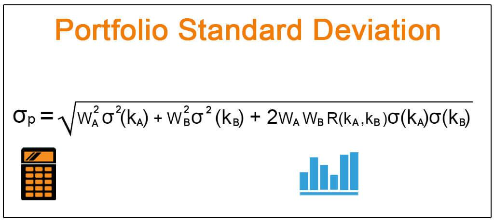

Understanding financial risk in investments is crucial for effective portfolio management. Financial risk pertains to the uncertainty of returns and the potential loss of capital that investors might face. Effective management of this risk is essential to achieve optimal returns and to safeguard investors' capital. Standard deviation serves as a primary metric for measuring the volatility of an investment portfolio. It quantifies the dispersion of a set of data points, in this case, returns, from their mean. A higher standard deviation indicates greater volatility, signifying that an investment’s returns may deviate significantly from the average, which suggests higher risk.

The evolution of financial markets has been notably influenced by the advent of algorithmic trading. This trading method employs complex algorithms and statistical measures like standard deviation to analyze massive datasets, enabling traders to make data-driven decisions swiftly. Algorithmic trading has transformed how traders assess and manage risk, facilitating the ability to handle market volatility efficiently. Statistical measures ensure that traders can optimize trading strategies, set appropriate limits, and identify profitable trends — all key to managing risk and enhancing returns.



This article explores the application of standard deviation in financial risk assessment, portfolio management, and algorithmic trading. By understanding how standard deviation is utilized in these areas, finance professionals can effectively navigate market complexities to achieve their investment goals.

## Table of Contents

## What is Financial Risk and Standard Deviation?

Financial risk pertains to the possibility of losing financial capital when engaging in investments, directly impacting the stability and performance of portfolios. Managing this risk is essential for investors seeking to preserve capital and maximize returns over the long term.

Standard deviation is a critical statistical measure used to quantify the extent of variation or dispersion in a set of data points from their mean. In the context of investments, it serves as an indicator of the volatility or risk associated with a particular asset or portfolio. A higher standard deviation implies greater variability in the asset's returns, suggesting higher risk. Conversely, a lower standard deviation indicates more consistent performance and potentially lower risk.

In mathematical terms, the standard deviation (σ) of a dataset $X = \{x_1, x_2, ..., x_n\}$ with mean $\mu$ is calculated using the formula:

$$
\sigma = \sqrt{\frac{1}{n}\sum_{i=1}^{n}(x_i - \mu)^2}
$$

where:
- $n$ is the number of observations,
- $x_i$ represents each individual data point,
- $\mu$ is the mean of the dataset.

In finance, this formula helps investors understand how much the returns of an asset are likely to deviate from the expected average return. A portfolio with a higher standard deviation suggests that its returns are more spread out over a range of values, which typically signifies higher investment risk and the potential for higher returns. This is especially true when comparing different assets or portfolios where the expected returns are similar, making standard deviation a useful tool in risk assessment and portfolio diversification efforts.

## Understanding the Role of Standard Deviation in Investment Portfolios

Standard deviation is a critical metric for assessing the [volatility](/wiki/volatility-trading-strategies) and consistency of investment returns in a portfolio. It quantifies the extent to which individual returns deviate from the mean return over a given period, serving as an indicator of the investment's risk level. Specifically, a high standard deviation indicates a wide range of potential returns, translating to increased volatility and risk. Conversely, a lower standard deviation suggests that the returns are stable and predictable, thereby implying reduced volatility.

For investors constructing portfolios, understanding standard deviation is essential to align their investment choices with their risk tolerance. Diversification is a common strategy employed to manage risk, and standard deviation plays a vital role in this process. By combining assets with varying levels of standard deviation, investors can balance their portfolios such that the overall risk is mitigated while targeting desired return levels. This balance is showcased in the Modern Portfolio Theory, which emphasizes optimizing a portfolio to achieve the best possible returns for a given amount of risk.

Historically, funds that exhibit lower standard deviations are associated with predictable returns. They are typically favored by risk-averse investors, such as those nearing retirement, seeking to preserve capital while receiving steady income. An example of such investments could include government bonds and high-grade corporate bonds. These investment vehicles have a lower standard deviation and are hence more attractive for conservative investment strategies.

On the other hand, funds with higher standard deviations often signify greater potential returns accompanied by increased risk. These funds are usually of interest to investors who have a higher tolerance for risk and are willing to endure volatility for the prospect of higher gains. Equity stocks or emerging market funds might exhibit higher standard deviations due to fluctuating market conditions, presenting opportunities for significant returns albeit with greater associated risk.

In summary, standard deviation is indispensable in investment portfolio management, fostering a comprehensive understanding of the risk-return trade-off. Through strategic analysis and application of standard deviation data, investors can make informed decisions tailoring portfolios to match their risk preferences and financial objectives.

## Application of Standard Deviation in Algorithmic Trading

Algorithmic trading has brought a paradigm shift in financial markets by utilizing computational power and statistical methods to automate trading decisions. A pivotal metric in this sphere is standard deviation, which quantifies market volatility and aids in refining strategies for optimal trading outcomes. 

Standard deviation is instrumental in systems like Bollinger Bands, a popular technique used by traders to analyze market trends. Bollinger Bands consist of three lines: the middle band representing a simple moving average (SMA), and two outer bands calculated as standard deviations away from the middle band. The general formula for Bollinger Bands is:

$$
\text{Upper Band} = \text{SMA}(n) + k \times \sigma
$$
$$
\text{Lower Band} = \text{SMA}(n) - k \times \sigma
$$

where $n$ is the number of periods, $k$ is the factor by which the standard deviation is multiplied, and $\sigma$ denotes the standard deviation. This strategy allows traders to establish bounds within which a price is expected to fluctuate, providing insights into market volatility and potential price breakouts or retracements.

Algorithmic trading systems utilize standard deviation to monitor these fluctuations, adapting entry and [exit](/wiki/exit-strategy) strategies to capitalize on market movements. For instance, when prices move outside the predefined bands, it may signal a potential bullish or bearish trend, triggering automated buy or sell instructions. Such strategies are particularly useful in high-frequency trading environments where rapid decisions based on empirical data are crucial.

Python offers robust libraries such as NumPy and pandas, enabling traders to efficiently compute standard deviation and implement Bollinger Bands in their algorithms. Below is a basic Python implementation using these libraries:

```python
import pandas as pd
import numpy as np

# Sample data for closing prices
data = {'Close': [220, 225, 230, 228, 232, 235, 237, 240]}
df = pd.DataFrame(data)

# Parameters for Bollinger Bands
n = 5  # Window size for simple moving average
k = 2  # Number of standard deviations for the bands

# Calculate the moving average and standard deviation
df['SMA'] = df['Close'].rolling(window=n).mean()
df['STD'] = df['Close'].rolling(window=n).std()

# Calculate the upper and lower Bollinger Bands
df['Upper Band'] = df['SMA'] + (k * df['STD'])
df['Lower Band'] = df['SMA'] - (k * df['STD'])

print(df)
```

In this example, traders can visualize the price dynamics relative to the calculated bands and align their algorithmic strategies accordingly. By harnessing standard deviation, [algorithmic trading](/wiki/algorithmic-trading) systems enhance their capability to adapt to market volatility, ensuring informed and timely trading decisions. This systematic approach mitigates random guessing and leverages statistical insights for superior trading performance in rapidly changing markets.

## Case Studies: Practical Applications of Standard Deviation

Traders have increasingly relied on standard deviation to assess and respond to market volatility in both equity and Forex trading. This statistical measure allows them to make informed decisions by quantifying the volatility or variability of asset prices over a certain period. In equity trading, standard deviation is utilized to understand the historical volatility of stock prices, thus providing insights into potential future movements.

For example, during the 2008 financial crisis, traders observed significant spikes in the standard deviation of major stock indices, signaling periods of economic turmoil. These high deviations highlighted increased risk and prompted traders to adjust their portfolios, reduce exposure to equities, and shift towards safer assets like government bonds. By gauging the standard deviation, traders were able to identify heightened risk periods and optimally manage their portfolios to safeguard against substantial losses.

In Forex trading, the standard deviation is critical for analyzing currency fluctuations. Traders use it to measure the [dispersion](/wiki/dispersion-trading) of currency pairs, helping them anticipate periods of high volatility that could present both risks and opportunities. During events such as Brexit or geopolitical tensions, the standard deviation of currency pairs like GBP/USD escalated, serving as a warning to traders to manage their positions cautiously.

Standard deviation is also vital in options trading, primarily for estimating implied volatility and managing risk. Implied volatility represents the market's forecast of a likely movement in a security's price and is pivotal in options pricing. Traders calculate the standard deviation of an asset's returns to estimate its implied volatility, which they then use to price options accurately. This approach helps in assessing the fair value of options and identifying underpriced or overpriced contracts.

For empirical analysis, Python's statistical libraries can be used to calculate the standard deviation. Here's a simple example using NumPy:

```python
import numpy as np

# Sample data representing equity or currency price returns
price_returns = [0.01, -0.02, 0.015, 0.002, -0.005, 0.025, -0.01]

# Calculate standard deviation
std_dev = np.std(price_returns)

print("Standard Deviation of Price Returns:", std_dev)
```

In summary, by leveraging standard deviation, traders gain insights into market conditions, allowing them to strategize effectively and mitigate risks associated with economic uncertainties and short-term volatility.

## Considerations and Limitations of Using Standard Deviation

Standard deviation is a widely used metric in finance to measure the volatility or risk associated with an investment portfolio. However, its application comes with several considerations and limitations that traders and investors must be aware of.

One major assumption of using standard deviation in financial analysis is that it presupposes a normal distribution of returns. This assumption does not always hold in the unpredictable and complex dynamics of financial markets. Financial returns often exhibit skewness or kurtosis, resulting in distributions that deviate significantly from the Gaussian curve. In such cases, relying solely on standard deviation might lead to underestimating the likelihood of extreme market events.

Another limitation of standard deviation is its historical focus. It estimates risk based on past data, which may not accurately reflect future market conditions. This is particularly true during black swan events—rare and unpredictable occurrences that can cause severe disruptions in financial markets. During such times, historical volatility metrics like standard deviation may fail to capture the extent of potential volatility.

Given these challenges, it is crucial for traders to employ additional risk assessment tools alongside standard deviation to achieve a robust evaluation of financial risk. Value at Risk (VaR) is one such tool that estimates the maximum potential loss over a specified period and confidence level. Unlike standard deviation, VaR provides a more intuitive measure of risk by expressing it in monetary terms.

Similarly, Conditional Value at Risk (CVaR), also known as Expected Shortfall, offers a comprehensive view by focusing on the tail of the loss distribution, thus providing insights into potential losses in extreme scenarios beyond the VaR threshold.

While standard deviation remains a fundamental tool for measuring volatility, its limitations necessitate the integration of other analytical metrics. By combining these measures, investors and traders can better navigate the uncertainties of financial markets and optimize their risk management strategies.

## Conclusion

Standard deviation remains a fundamental tool for financial risk management in investment portfolios and algorithmic trading, offering a quantitative measure of volatility and risk. By evaluating the dispersion of returns around the mean, investors and traders can gain valuable insights into the consistency and reliability of their investments. This statistical measure plays a crucial role in constructing diversified portfolios that align with individual risk appetites and in shaping trading strategies that are responsive to market fluctuations.

Despite its effectiveness, standard deviation has limitations. It assumes that financial returns follow a normal distribution, an assumption that may not hold true in markets characterized by irregular and unpredictable events. Furthermore, as a historical measure, it may not fully capture future market dynamics, especially during black swan events. This suggests the importance of integrating standard deviation with additional risk assessment tools such as Value at Risk (VaR) and Conditional Value at Risk (CVaR) for a more comprehensive evaluation of risk.

Overall, by incorporating standard deviation alongside other metrics, investors and traders can establish a robust foundation for decision-making. This enhances their ability to strategize effectively, manage risk exposure efficiently, and pursue financial goals with greater assurance.

## References & Further Reading

[1]: ["An Introduction to Risk Management in Finance"](https://www.cfainstitute.org/insights/professional-learning/refresher-readings/2024/introduction-risk-management) by John C. Hull.

[2]: Hull, J. C. (2009). ["Options, Futures, and Other Derivatives"](https://www.amazon.com/Options-Futures-Other-Derivatives-9th/dp/0133456315). Pearson.

[3]: Lo, A. W., & MacKinlay, A. C. (1999). ["A Non-Random Walk Down Wall Street"](https://www.jstor.org/stable/j.ctt7tccx). Princeton University Press.

[4]: ["The Art of Statistics: Learning from Data"](https://www.amazon.com/Art-Statistics-How-Learn-Data/dp/1541618513) by David Spiegelhalter.

[5]: Alexander, C. (2008). ["Market Risk Analysis, Volume I: Quantitative Methods in Finance"](https://archive.org/details/marketriskanalys0001alex). Wiley.

[6]: Taleb, N. N. (2007). ["The Black Swan: The Impact of the Highly Improbable"](https://archive.org/details/10.1.1.695.4305). Penguin Books.

[7]: Tsay, R. S. (2005). ["Analysis of Financial Time Series"](https://cpb-us-w2.wpmucdn.com/blog.nus.edu.sg/dist/0/6796/files/2017/03/analysis-of-financial-time-series-copy-2ffgm3v.pdf). Wiley.

[8]: ["Algorithmic Trading and DMA: An Introduction to Direct Market Access"](https://archive.org/details/algorithmictradi0000john) by Barry Johnson.