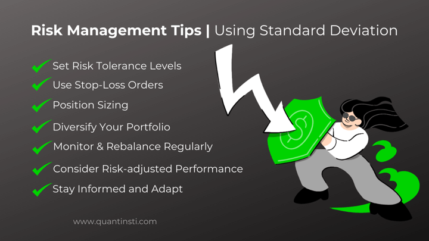

Financial risk assessment, standard deviation, and algorithmic trading form an intricate trio essential to modern investment and trading environments. In finance, risk measurement is crucial for informed decision-making. It helps investors and traders understand potential losses and enables them to devise strategies that align with their risk tolerance and investment goals. The objective of financial risk assessment is to quantify the uncertainty associated with different financial instruments and markets, which guides investors in allocating assets and managing portfolios effectively.

Standard deviation is a fundamental statistical concept used to measure investment risk. It provides a numerical representation of volatility by quantifying the dispersion of a set of financial returns around their mean. In finance, a high standard deviation is synonymous with high volatility, which implies greater risk and unpredictability in the returns of an investment. Conversely, a low standard deviation indicates relative stability and lower risk. Understanding standard deviation aids investors in evaluating the risk associated with individual assets and entire portfolios, thereby facilitating risk-adjusted decision-making.



Algorithmic trading, which relies heavily on quantitative methods, uses complex algorithms and advanced computational models to automate trading strategies. These algorithms process vast amounts of financial data rapidly, executing trades at speeds and frequencies impossible for a human trader. Standard deviation plays a pivotal role in these strategies, enabling algorithms to incorporate risk assessments and adapt trading positions in real-time to market volatility. By leveraging statistical measures like standard deviation, algorithmic trading systems can optimize returns while maintaining a desired level of risk exposure.

The core concepts of financial risk assessment, standard deviation, and algorithmic trading help investors and traders develop informed and adaptive strategies in dynamic financial markets. Understanding and applying these principles is vital to managing risk and achieving investment objectives, particularly given the increasing complexity and volatility of today's global financial systems.

## Table of Contents

## Understanding Standard Deviation in Finance

Standard deviation is a statistical measure that quantifies the amount of variation or dispersion in a set of data values. In finance, it serves as a critical tool for measuring investment risk. This metric offers insights into the volatility of an asset's price. A higher standard deviation indicates greater volatility, suggesting that an asset's price might experience significant changes over short periods, thereby presenting higher investment risk.

Mathematically, standard deviation (σ) is calculated as the square root of the variance. The formula to calculate the standard deviation for a dataset is:

$$
\sigma = \sqrt{\frac{1}{N} \sum_{i=1}^{N} (x_i - \mu)^2}
$$

Here, $N$ is the number of data points, $x_i$ represents each individual data point, and $\mu$ is the mean of the dataset.

In the context of market [volatility](/wiki/volatility-trading-strategies), standard deviation is an instrumental metric. It helps financial analysts and investors assess how much an asset's returns deviate from its average return over a period, thus providing a measure of the asset's potential risk and reward. For example, a stock with a high standard deviation may offer the potential for high returns due to its larger price swings, but it also carries the risk of steep losses.

The relationship between standard deviation and investment risk is foundational in evaluating and developing financial strategies. Investors often use standard deviation to make informed decisions about asset allocation, portfolio diversification, and risk management. By understanding the standard deviation of historic returns, an investor can gauge how much risk is involved in an asset and decide whether it aligns with their risk tolerance and investment goals.

In summary, standard deviation serves as a key indicator of market volatility and investment risk. Its application allows investors to measure the fluctuation in asset prices and make strategic decisions that balance potential returns with acceptable levels of risk.

## Calculating Standard Deviation for Financial Risk Assessment

Standard deviation is a fundamental metric in finance used to quantify the amount of variation or [dispersion](/wiki/dispersion-trading) in a set of financial data. Calculating standard deviation is a key step in assessing the risk associated with an investment. Here's a straightforward guide to computing standard deviation and discussing its utility in financial trading scenarios.

### Calculating Standard Deviation

To calculate the standard deviation of a dataset, follow these steps:

1. **Collect Data**: Obtain a series of financial returns for the asset or portfolio you are analyzing. For instance, these could be daily, weekly, or monthly returns.

2. **Calculate the Mean**: Compute the average of these returns. The mean (μ) is the sum of all observed returns divided by the number of observations (n):
$$
   \mu = \frac{\sum_{i=1}^{n} x_i}{n}

$$

   where $x_i$ represents each individual return in the dataset.

3. **Compute Variances**: Determine the squared differences from the mean for each return. This is also known as volatility:
$$
   \sigma^2 = \frac{\sum_{i=1}^{n} (x_i - \mu)^2}{n}

$$

4. **Standard Deviation**: The standard deviation (σ) is the square root of the variance:
$$
   \sigma = \sqrt{\sigma^2} = \sqrt{\frac{\sum_{i=1}^{n} (x_i - \mu)^2}{n}}

$$

This measure provides insight into the level of risk; the larger the standard deviation, the more volatile and hence riskier the asset.

### Application in Trading Scenarios

In trading, understanding the extent of return dispersion helps in shaping strategies. For example, a high standard deviation in historical returns suggests potential for drastic price swings, warranting cautious position-sizing or hedging to manage risk.

### Tools and Technologies

In practice, the computation of standard deviation is often facilitated through financial software and programming languages. Python is one of the most widely used tools because of its robust libraries like NumPy and Pandas, which simplify statistical calculations.

Here's a basic example using Python to calculate the standard deviation of an asset's return:

```python
import numpy as np

# Sample data: Returns of an asset
returns = [0.02, 0.05, -0.01, 0.03, -0.02]

# Calculate the mean
mean_return = np.mean(returns)

# Calculate the standard deviation
std_deviation = np.std(returns)

print(f"Mean Return: {mean_return}")
print(f"Standard Deviation: {std_deviation}")
```

This Python code provides a quick and efficient way to calculate standard deviation, with results that can inform trading strategy and risk management.

Financial tools and platforms such as Bloomberg Terminal, MetaTrader, and various online analytics dashboards also offer functionalities to compute and visualize standard deviation, allowing traders and analysts to make informed decisions with ease.

## Algorithmic Trading and Risk Assessment

Algorithmic trading is a method of executing orders using automated pre-programmed trading instructions that account for variables such as time, price, and [volume](/wiki/volume-trading-strategy). This trading method relies heavily on quantitative methods to optimize the execution efficiency and achieve strategic goals. Central to these quantitative methods is the concept of standard deviation, a statistical measure of the dispersion of data points from their mean, which has significant implications for investment risk and trading strategies.

Standard deviation impacts [algorithmic trading](/wiki/algorithmic-trading) strategies by serving as an indicator of market volatility. A higher standard deviation suggests a greater degree of market fluctuation and hence, increased risk. Conversely, a lower standard deviation indicates a more stable market environment. Algorithmic traders rely on these insights to adjust their strategies dynamically, either capitalizing on volatility or opting for more conservative approaches in stable conditions.

One prominent algorithmic strategy that leverages standard deviation for risk management is the Bollinger Bands. Bollinger Bands encapsulate moving averages surrounded by standard deviation bands. Traders use these bands to identify 'overbought' or 'oversold' conditions in the market. When the price moves outside the bands, it typically signals a potential reversal, thus providing a trading signal.

```python
import numpy as np
import pandas as pd

# Simulating fetching historical price data
prices = [300, 305, 310, 300, 295, 290, 285]
data = pd.DataFrame(prices, columns=['Close'])

# Calculating moving average and standard deviation
data['Moving Average'] = data['Close'].rolling(window=3).mean()
data['Standard Deviation'] = data['Close'].rolling(window=3).std()

# Calculating Bollinger Bands
data['Upper Band'] = data['Moving Average'] + (data['Standard Deviation'] * 2)
data['Lower Band'] = data['Moving Average'] - (data['Standard Deviation'] * 2)

print(data)
```

This Python code snippet demonstrates how Bollinger Bands are calculated. Traders analyze the bands to identify price breakouts, which assists in making buy or sell decisions.

Another strategy is the Statistical Arbitrage, which involves complex algorithms to identify trading opportunities discovered through statistical modeling and the use of standard deviation. The strategy typically involves buying underperforming assets while simultaneously selling overperforming ones within the same category. This strategy assumes that the deviation from statistical norm will eventually correct.

Beyond individual strategies, standard deviation is instrumental in the broader spectrum of portfolio risk management within algorithmic trading. Algorithms are designed to maintain a desired risk level by continuously calculating the standard deviation of portfolio returns and adjusting positions accordingly. This approach ensures that volatility does not exceed pre-defined thresholds, thus protecting investments from unforeseen market shocks.

Through these examples, it is clear that standard deviation is not only a foundational concept in [statistics](/wiki/bayesian-statistics) but also a critical tool in developing and refining algorithmic trading strategies aimed at mitigating risk while maximizing returns.

## Practical Applications and Case Studies

Standard deviation plays a pivotal role in shaping trading strategies by quantifying risk and aiding in the formulation of data-driven decisions. In practice, traders and financial analysts employ standard deviation as a metric to determine the volatility of an asset, which is instrumental in assessing the potential risk involved in investment decisions.

### Real-World Applications of Standard Deviation

In trading strategies, standard deviation is often used to develop what's known as a Bollinger Bands trading approach. Bollinger Bands are a technical analysis tool that consists of a moving average and two standard deviation lines plotted above and below the moving average. The upper and lower bands expand and contract based on market volatility, as measured by the standard deviation. When the price of an asset moves outside these bands, it can indicate a potential trading opportunity due to overbought or oversold market conditions. For instance, if the asset price surges beyond the upper band, it may signal that the asset is overbought, suggesting a potential shorting opportunity.

Additionally, traders often use the concept of standard deviation in Value at Risk (VaR) calculations, which estimate the maximum potential loss over a given time frame at a certain confidence level. Here's a simplified Python example for calculating a one-day VaR for a stock portfolio:

```python
import numpy as np

# Example stock returns
returns = np.array([-0.02, 0.01, 0.03, -0.01, 0.02])  # Daily returns
portfolio_value = 1000000  # Total portfolio value

# Calculate mean and standard deviation
mean_return = np.mean(returns)
std_dev = np.std(returns)

# Define confidence level
confidence_level = 0.95

# Calculate VaR using standard deviation and the inverse of the normal cumulative distribution
z_score = 1.65  # Approximate z-score for 95% confidence

# VaR formula
var = portfolio_value * (mean_return - z_score * std_dev)

print(f"Value at Risk (VaR): ${var:.2f}")
```

### Case Studies

1. **Portfolio Optimization**: In one case study, an asset management firm successfully optimized its portfolio by using standard deviation to balance risk and return. By analyzing the historical return data of their investment pool, they recalibrated the asset allocation to minimize portfolio volatility while targeting specific return levels. The standard deviation served as a guide to adjust asset weights dynamically, ensuring risk levels remained within acceptable bounds.

2. **Algorithmic Trading Firms**: Algorithmic trading firms routinely incorporate standard deviation into their algorithms to manage risk. A notable example is the development of mean-reversion strategies, where assets that deviate significantly from their historical average prices (beyond a certain number of standard deviations) are identified as potential trades. By calculating the standard deviation of price data, these algorithms determine entry and exit points aimed at capitalizing on price reversions to the mean.

### Lessons Learned

Through various implementations, several key lessons have emerged:

- **Dynamic Strategy Adaptation**: Markets are ever-changing, and rigid strategies can be detrimental. Using standard deviation enables traders to adapt their strategies in response to new information and changing market conditions, thus maintaining robustness in trading models.

- **Limitations of Standard Deviation**: As a measure of volatility, standard deviation assumes normal distribution and may not account for extreme events or "black swan" occurrences. Traders have learned to incorporate additional metrics, such as skewness or kurtosis, and stress testing to complement standard deviation for a more comprehensive risk assessment. 

- **Balance between Simplicity and Complexity**: While complex models may offer precision, simplicity in employing standard deviation-related strategies often yields effective results, especially when speed and computational efficiency are critical.

In summary, the application of standard deviation in trading strategies provides a numerical lens to navigate market risk, offering structured pathways for algorithmic and discretionary trading.

## Challenges and Considerations in Using Standard Deviation

Standard deviation is a widely used measure of risk in financial markets, but it comes with certain limitations when employed as the sole metric for risk assessment. Its primary disadvantage is that it assumes a normal distribution of returns, which might not accurately reflect real-world market conditions. In reality, financial returns often exhibit skewness and kurtosis—departures from the normal curve—making standard deviation insufficient on its own to capture all aspects of investment risk.

Standard deviation measures only the dispersion of returns around the mean, without distinguishing between upside and downside variability. This is problematic because investors are typically more concerned about downside risk, essentially the likelihood and magnitude of potential losses. As such, relying solely on standard deviation can lead to suboptimal decision-making, particularly in volatile markets where large, unpredictable swings are more common.

To enhance risk assessment, complementary metrics and tools are advisable. Value at Risk (VaR) is one such metric that estimates the maximum loss an investment portfolio might incur over a given time period, at a certain confidence level. Unlike standard deviation, VaR directly addresses downside risk, providing a more focused understanding of potential losses. Conditional Value at Risk (CVaR) goes a step further, measuring the expected loss beyond the VaR threshold, offering additional insights into extreme market movements.

Another useful metric is the Sortino Ratio, a modification of the Sharpe Ratio that considers only downside deviation as opposed to total volatility. This allows traders to focus more specifically on the risks they are keen to minimize.

In volatile markets, additional considerations must be taken into account when applying standard deviation. Traders should be aware of the temporal nature of volatility—during periods of market upheaval, historical data might underestimate future risk. Thus, employing dynamic models that adjust to changing market conditions, such as GARCH (Generalized Autoregressive Conditional Heteroskedasticity) models, can be effective.

Moreover, the application of stress testing and scenario analysis can illuminate potential risks that standard deviation-based measures might miss. These techniques simulate extreme market conditions to evaluate the resilience of investment portfolios.

While standard deviation remains a fundamental component of financial risk assessment, it should be integrated with other tools and metrics to form a comprehensive risk management strategy. By acknowledging its limitations and augmenting it with advanced techniques, traders can better navigate the complexities of financial markets, particularly in scenarios characterized by high volatility.

## Conclusion

Standard deviation is a crucial component in financial risk management as it provides a quantitative measure of the dispersion or variability of a financial instrument's returns. By quantifying how much the returns deviate from the average, investors and traders can gauge the volatility of an asset. This understanding of volatility is fundamental in assessing the inherent risk associated with potential investments, enabling more informed decision-making.

In algorithmic trading, standard deviation serves as a foundational tool to optimize trading strategies. Algorithms often integrate standard deviation to assess risk levels, inform decisions on asset allocation, and set thresholds for buying or selling trades. For instance, many algorithmic trading strategies employ standard deviation as part of technical indicators such as the Bollinger Bands, which use standard deviation to define upper and lower bands around a moving average. These bands help traders identify overbought or oversold conditions in the market, ultimately guiding trading decisions.

Continual learning and adaptation are necessary in the world of finance, especially as markets grow increasingly complex and dynamic. Market conditions evolve rapidly, influenced by economic, geopolitical, and technological changes. Therefore, relying solely on standard deviation without considering other metrics or adapting to new financial models may lead to insufficient risk assessments. Traders and investors are encouraged to complement standard deviation with additional metrics, such as Value at Risk (VaR) or the Sharpe Ratio, to create robust trading strategies that can withstand various market conditions.

Emphasizing ongoing education in risk assessment techniques and staying informed about technological advancements in finance, such as [machine learning](/wiki/machine-learning) and [artificial intelligence](/wiki/ai-artificial-intelligence), will empower traders to maintain a competitive edge. In conclusion, while standard deviation remains integral to financial risk management and algorithmic trading, its efficacy is maximized when combined with ongoing learning and the use of supplementary analytical tools.

## References & Further Reading

### References & Further Reading

1. **"Quantitative Financial Risk Management" by Desheng Dash Wu and David L. Olson**  
   This book provides comprehensive insights into risk management strategies using quantitative methods. It covers various statistical techniques, including standard deviation, with illustrative examples pertinent to financial markets.

2. **"Algorithmic Trading: Winning Strategies and Their Rationale" by Ernest P. Chan**  
   Ernest Chan's guide provides practical advice on building algorithmic trading strategies. It explains the importance of quantitative methods, emphasizing the role of standard deviation in managing trading risks effectively.

3. **"The Mathematics of Financial Derivatives: A Student Introduction" by Paul Wilmott, Sam Howison, and Jeff Dewynne**  
   This resource offers an introduction to the mathematical foundations of financial derivatives. It is beneficial for understanding the theoretical underpinnings of risk measurement and standard deviation's application in trading.

4. **Investopedia's Guide to Standard Deviation (https://www.investopedia.com)**  
   A detailed online guide explaining standard deviation, its calculation, and significance in financial assessments. This web resource is valuable for those seeking a quick yet thorough understanding of market volatility metrics.

5. **"Quantitative Trading: How to Build Your Own Algorithmic Trading Business" by Ernie Chan**  
   This book serves as a practical guide for aspiring quantitative traders. It outlines strategies, tools, and the pivotal role of risk assessment metrics, including standard deviation, in forming successful trading algorithms.

6. **"Risk Management and Financial Institutions" by John C. Hull**  
   This text provides an in-depth exploration of risk management within financial institutions, focusing on tools that can apply to algorithmic trading. Hull discusses standard deviation and other statistical tools to better understand and mitigate financial risks.

7. **"Python for Finance: Analyze Big Financial Data" by Yves Hilpisch**  
   A valuable resource for those interested in applying Python to financial scenarios, including risk assessment. It includes numerous examples and code snippets illustrating the computation of standard deviation and other quantitative analyses.

8. **"Introduction to Risk Management and Insurance" by Mark S. Dorfman**  
   This book introduces various risk management concepts and practices. It's a useful resource for gaining a broader understanding of risk measurement tools, including the application of statistical metrics like standard deviation in insurance and trading. 

These resources offer a thorough foundation for understanding and applying financial risk management techniques. They also provide guidance on advancing one's knowledge in quantitative finance and algorithmic trading strategies.

