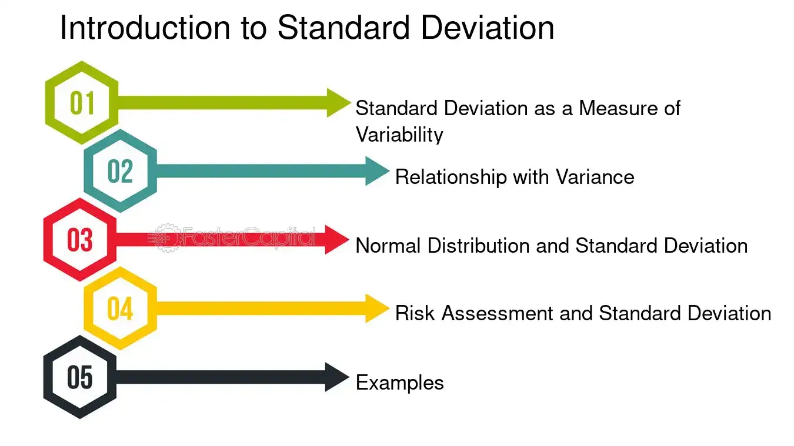

## Table of Contents

## What is standard deviation and why is it important in risk assessment?

Standard deviation is a way to measure how spread out numbers are in a set of data. It tells you how much the numbers differ from the average (mean). If the standard deviation is small, it means the numbers are close to the average. If it's big, the numbers are spread out a lot.

In risk assessment, standard deviation is important because it helps us understand how risky something might be. For example, if you're looking at the returns of an investment, a high standard deviation means the returns could change a lot, making it riskier. A low standard deviation means the returns are more predictable, which is less risky. So, by knowing the standard deviation, you can make better decisions about how much risk you're willing to take.

## How is standard deviation calculated in the context of risk assessment?

To calculate standard deviation in the context of risk assessment, you start by finding the average (mean) of the data set, like the returns of an investment over time. Next, you figure out how far each number in your data set is from that average. This is called the deviation. You square each of these deviations to make sure they are all positive numbers, then you find the average of these squared deviations. This average is called the variance. Finally, you take the square root of the variance to get the standard deviation.

In risk assessment, using standard deviation helps us see how much the returns of an investment might change. If the standard deviation is high, it means the returns can be very different from the average, which means the investment is riskier. If the standard deviation is low, the returns are more likely to stay close to the average, making the investment less risky. By calculating and understanding the standard deviation, people can make smarter choices about the risks they are willing to take with their investments.

## Can you explain the difference between population and sample standard deviation in risk assessment?

In risk assessment, we often use data to make decisions. When we talk about standard deviation, there are two types: population standard deviation and sample standard deviation. Population standard deviation is used when we have data for every single item in a group. For example, if we want to know the risk of all the stocks in a stock market, we would use population standard deviation. It's calculated using a formula that includes every data point in the group.

On the other hand, sample standard deviation is used when we only have data for a part of the group, or a sample. This is more common because it's often too hard or expensive to collect data on every single item. For example, if we want to assess the risk of a large group of stocks but only have data on a few of them, we would use sample standard deviation. The formula for sample standard deviation is a bit different because it tries to estimate what the population standard deviation might be. It uses a smaller set of data to make a guess about the whole group.

Both types of standard deviation help us understand risk, but they are used in different situations. Population standard deviation gives us a precise measure when we have all the data, while sample standard deviation helps us make an educated guess when we only have some of the data. Knowing which one to use can make a big difference in how we assess and manage risk.

## What does a high standard deviation indicate about the risk involved in a project or investment?

A high standard deviation in a project or investment means that the outcomes can be very different from what we expect. Imagine you're looking at the returns of an investment. If the standard deviation is high, it tells you that the returns might go up a lot or go down a lot. This makes the investment riskier because it's hard to predict what will happen. It's like riding a roller coaster where you don't know if you'll go really high or really low.

Because of this unpredictability, a high standard deviation can make people feel nervous about putting their money into the project or investment. They might worry about losing a lot if things go wrong. So, when you see a high standard deviation, it's a sign to be careful and think hard about whether you're okay with taking that risk. It's all about understanding how much you're willing to gamble on the chance of big changes.

## How can standard deviation be used to compare the risk levels of different investments?

Standard deviation helps us compare the risk levels of different investments by showing how much their returns can change. Imagine you're looking at two different investments. If one has a high standard deviation, it means its returns can go up or down a lot, making it riskier. The other investment might have a low standard deviation, meaning its returns stay closer to the average, making it less risky. By comparing the standard deviations, you can see which investment might be more unpredictable and which one is more stable.

For example, let's say you're choosing between investing in stocks or bonds. Stocks might have a higher standard deviation, which means their returns could swing widely from year to year. Bonds, on the other hand, might have a lower standard deviation, suggesting their returns are more predictable. By looking at the standard deviations, you can decide if you're okay with the bigger swings of stocks or if you'd rather have the steadier returns of bonds. This helps you pick an investment that matches how much risk you're willing to take.

## What are the limitations of using standard deviation as a measure of risk?

Standard deviation is a good tool for measuring risk, but it has some limits. One big limit is that it assumes the data follows a normal distribution, which means the data is spread out evenly around the average. But in real life, investment returns often don't follow this pattern. They might have more extreme ups and downs than a normal distribution would predict. This means standard deviation might not show the full picture of how risky an investment really is.

Another limit is that standard deviation only tells us about how much the returns can change, but it doesn't say anything about the direction of those changes. For example, a high standard deviation might mean big gains or big losses, but it doesn't tell us which one is more likely. This can make it hard to decide if the risk is worth taking. Also, standard deviation doesn't consider other important factors like how long you plan to keep the investment or other risks that might affect it. So, while standard deviation is helpful, it's not the only thing you should look at when assessing risk.

## How does standard deviation relate to other statistical measures like variance and mean in risk assessment?

Standard deviation, variance, and mean are all connected when we look at risk in investments. The mean is the average of all the numbers in your data set, like the average return of an investment. Variance tells us how spread out those numbers are from the mean. It's like measuring how much the returns can change. To find variance, you take the difference between each number and the mean, square those differences, and then find the average of those squared differences. Standard deviation is just the square root of variance. It's important because it gives us a number in the same units as the original data, making it easier to understand how much the returns might change.

In risk assessment, these three measures help us see the whole picture. The mean gives us a starting point by showing what we can expect on average. Variance and standard deviation then show us how much we can trust that average. A high variance or standard deviation means the returns can be very different from the mean, making the investment riskier. A low variance or standard deviation means the returns are more likely to stay close to the mean, making the investment less risky. By looking at all three together, we get a better idea of the risk involved and can make smarter choices about our investments.

## Can you provide an example of how standard deviation is applied in a real-world risk assessment scenario?

Imagine you're a financial advisor helping a client decide between two mutual funds. One fund has had average yearly returns of 8%, while the other has had average yearly returns of 10%. At first glance, the second fund seems better because it has a higher average return. But you also need to look at the standard deviation to understand the risk. The first fund has a standard deviation of 2%, which means its returns don't change much from year to year. The second fund, on the other hand, has a standard deviation of 5%. This means its returns can swing a lot more, making it riskier.

You explain to your client that even though the second fund has a higher average return, its higher standard deviation means there's a bigger chance the returns could be much lower or much higher than 10% in any given year. If your client is someone who doesn't like taking big risks, the first fund might be a better choice because its returns are more predictable. By looking at the standard deviation along with the average returns, you can help your client pick an investment that matches their comfort with risk.

## What are some advanced statistical techniques that can be used alongside standard deviation to enhance risk assessment?

In addition to standard deviation, other advanced statistical techniques can help us understand risk better. One such technique is Value at Risk (VaR), which tells us the most we could lose on an investment over a certain period of time with a given level of confidence. For example, if the VaR of an investment is $10,000 at a 95% confidence level over a month, it means there's a 5% chance we could lose more than $10,000 in that month. VaR helps us see the worst-case scenario, which is something standard deviation alone can't show. Another technique is stress testing, where we look at how an investment would do under really bad conditions, like a big drop in the stock market. This helps us understand how much risk we're taking in extreme situations.

Another useful tool is the use of Monte Carlo simulations. These simulations run many different scenarios to see how an investment might perform under various conditions. By doing this, we can get a better idea of the range of possible outcomes and the likelihood of each one. This can help us see not just the average risk, but also the potential for big wins or losses. Finally, we can use Conditional Value at Risk (CVaR), which goes a step further than VaR by looking at the average loss we might face if we go beyond the VaR threshold. This gives us a clearer picture of what could happen in the worst 5% of cases, helping us plan for the really bad outcomes. By using these advanced techniques alongside standard deviation, we can get a fuller understanding of the risks involved in our investments.

## How does the concept of standard deviation fit into broader risk management frameworks?

Standard deviation is a key part of broader risk management frameworks because it helps us measure how much things can change. In risk management, we want to know how likely it is that something bad could happen and how bad it could be. Standard deviation gives us a way to see how much the results of our investments or projects might differ from what we expect. If the standard deviation is high, it means the outcomes could be very different from the average, which makes it riskier. If it's low, the outcomes are more likely to stay close to the average, making it less risky. This helps us make decisions about how much risk we're willing to take.

In a risk management framework, standard deviation works together with other tools to give us a complete picture of risk. For example, we might use standard deviation to see how much our investment returns can change, but we also use other measures like Value at Risk (VaR) to understand the worst-case scenarios. We might also do stress tests to see how our investments would do in really bad situations. By putting all these pieces together, we can better plan for the future and make choices that match our goals and how much risk we're okay with. Standard deviation is just one part of the puzzle, but it's an important one that helps us manage risk more effectively.

## What are the current debates or criticisms regarding the use of standard deviation in risk assessment?

Some people think that using standard deviation to measure risk has its problems. One big issue is that standard deviation assumes the data follows a normal distribution, which means the data is spread out evenly around the average. But in real life, things like stock market returns don't always follow this pattern. They can have more extreme ups and downs than a normal distribution would predict. This means standard deviation might not show the full picture of how risky an investment really is. Also, standard deviation only tells us how much the returns can change, but it doesn't say anything about whether those changes are more likely to be good or bad. This can make it hard to decide if the risk is worth taking.

Another criticism is that standard deviation doesn't consider other important factors like how long you plan to keep the investment or other risks that might affect it. For example, if you're planning to hold an investment for a long time, short-term changes might not matter as much. Standard deviation can also be misleading if there are big, rare events that happen outside of what we normally expect. Some people argue that we should use other measures like Value at Risk (VaR) or stress tests alongside standard deviation to get a better understanding of risk. These tools can help us see the worst-case scenarios and how investments might do in really bad situations, giving us a fuller picture of the risks involved.

## How might future developments in statistical analysis impact the use of standard deviation in risk assessment?

Future developments in statistical analysis could change how we use standard deviation in risk assessment. As technology gets better, we might be able to use computers to run more complex models that look at risk in new ways. For example, [machine learning](/wiki/machine-learning) could help us see patterns in data that we can't see now. This might mean we don't rely on standard deviation as much because we can use these new models to get a better understanding of risk. Also, as we learn more about how things like stock markets work, we might find that standard deviation doesn't always tell us the whole story about risk. We might start using other measures more often to get a clearer picture.

Even though standard deviation might not be the only tool we use in the future, it will still be important. It's a simple way to understand how much things can change, and it's easy for people to understand. But as our tools get better, we'll probably use standard deviation along with other measures like Value at Risk (VaR) or stress tests. These other tools can help us see the worst-case scenarios and how investments might do in really bad situations. So, while standard deviation will still be part of risk assessment, it might be just one piece of a bigger puzzle as we learn more and our technology improves.

## What is the understanding of standard deviation in finance?

Standard deviation is a statistical measure that quantifies the amount of variation or dispersion in a set of data values. In finance, it serves as a critical tool for measuring investment risk. This metric offers insights into the volatility of an asset's price. A higher standard deviation indicates greater volatility, suggesting that an asset's price might experience significant changes over short periods, thereby presenting higher investment risk.

Mathematically, standard deviation (σ) is calculated as the square root of the variance. The formula to calculate the standard deviation for a dataset is:

$$
\sigma = \sqrt{\frac{1}{N} \sum_{i=1}^{N} (x_i - \mu)^2}
$$

Here, $N$ is the number of data points, $x_i$ represents each individual data point, and $\mu$ is the mean of the dataset.

In the context of market [volatility](/wiki/volatility-trading-strategies), standard deviation is an instrumental metric. It helps financial analysts and investors assess how much an asset's returns deviate from its average return over a period, thus providing a measure of the asset's potential risk and reward. For example, a stock with a high standard deviation may offer the potential for high returns due to its larger price swings, but it also carries the risk of steep losses.

The relationship between standard deviation and investment risk is foundational in evaluating and developing financial strategies. Investors often use standard deviation to make informed decisions about asset allocation, portfolio diversification, and risk management. By understanding the standard deviation of historic returns, an investor can gauge how much risk is involved in an asset and decide whether it aligns with their risk tolerance and investment goals.

In summary, standard deviation serves as a key indicator of market volatility and investment risk. Its application allows investors to measure the fluctuation in asset prices and make strategic decisions that balance potential returns with acceptable levels of risk.

## How do you calculate standard deviation for financial risk assessment?

Standard deviation is a fundamental metric in finance used to quantify the amount of variation or [dispersion](/wiki/dispersion-trading) in a set of financial data. Calculating standard deviation is a key step in assessing the risk associated with an investment. Here's a straightforward guide to computing standard deviation and discussing its utility in financial trading scenarios.

### Calculating Standard Deviation

To calculate the standard deviation of a dataset, follow these steps:

1. **Collect Data**: Obtain a series of financial returns for the asset or portfolio you are analyzing. For instance, these could be daily, weekly, or monthly returns.

2. **Calculate the Mean**: Compute the average of these returns. The mean (μ) is the sum of all observed returns divided by the number of observations (n):
$$
   \mu = \frac{\sum_{i=1}^{n} x_i}{n}

$$

   where $x_i$ represents each individual return in the dataset.

3. **Compute Variances**: Determine the squared differences from the mean for each return. This is also known as volatility:
$$
   \sigma^2 = \frac{\sum_{i=1}^{n} (x_i - \mu)^2}{n}

$$

4. **Standard Deviation**: The standard deviation (σ) is the square root of the variance:
$$
   \sigma = \sqrt{\sigma^2} = \sqrt{\frac{\sum_{i=1}^{n} (x_i - \mu)^2}{n}}

$$

This measure provides insight into the level of risk; the larger the standard deviation, the more volatile and hence riskier the asset.

### Application in Trading Scenarios

In trading, understanding the extent of return dispersion helps in shaping strategies. For example, a high standard deviation in historical returns suggests potential for drastic price swings, warranting cautious position-sizing or hedging to manage risk.

### Tools and Technologies

In practice, the computation of standard deviation is often facilitated through financial software and programming languages. Python is one of the most widely used tools because of its robust libraries like NumPy and Pandas, which simplify statistical calculations.

Here's a basic example using Python to calculate the standard deviation of an asset's return:

```python
import numpy as np

# Sample data: Returns of an asset
returns = [0.02, 0.05, -0.01, 0.03, -0.02]

# Calculate the mean
mean_return = np.mean(returns)

# Calculate the standard deviation
std_deviation = np.std(returns)

print(f"Mean Return: {mean_return}")
print(f"Standard Deviation: {std_deviation}")
```

This Python code provides a quick and efficient way to calculate standard deviation, with results that can inform trading strategy and risk management.

Financial tools and platforms such as Bloomberg Terminal, MetaTrader, and various online analytics dashboards also offer functionalities to compute and visualize standard deviation, allowing traders and analysts to make informed decisions with ease.

## References & Further Reading

#