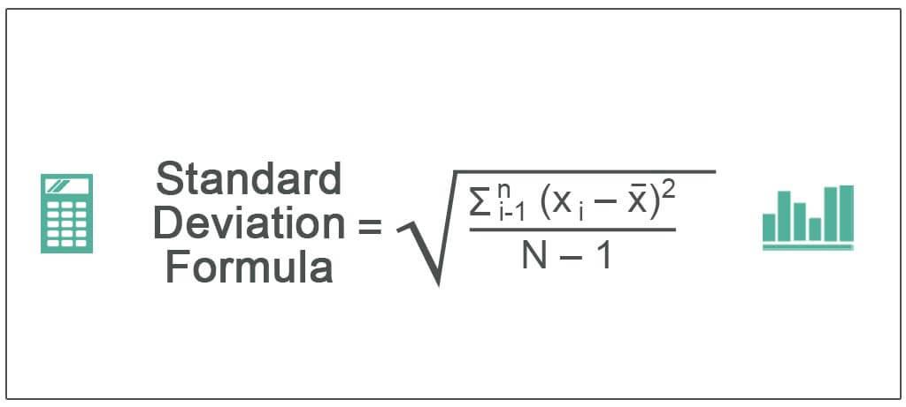

Standard deviation is a fundamental statistical measure widely employed in quantitative finance, and its application is particularly prominent in algorithmic trading. As a measure of volatility, it provides traders with insights into the degree of variation or dispersion in a set of financial data points, such as prices or returns. In trading, understanding and quantifying volatility is crucial because it directly correlates with market uncertainty and risk. High volatility often indicates a higher risk, but it may also suggest greater potential for profit due to more significant price fluctuations.

In the context of algorithmic trading strategies, standard deviation plays a vital role in shaping trading decisions and managing risks. By analyzing historical price data, traders can utilize standard deviation to forecast future price movements and identify trading opportunities that align with their risk management criteria. This article will discuss how standard deviation can be effectively computed using Python, a popular programming language for data analysis, and examine its integration into various algorithmic trading strategies to optimize decision-making processes.



## Table of Contents

## Understanding Standard Deviation

Standard deviation is a statistical measure that quantifies the amount of variation or dispersion in a set of numerical data values. When calculated, it tells us how much individual data points deviate from the mean or average of the dataset. Mathematically, standard deviation is represented as the square root of the variance. If we denote a dataset by $x_1, x_2, ..., x_n$, the mean ($\mu$) can be calculated as:

$$
\mu = \frac{1}{n} \sum_{i=1}^{n} x_i
$$

The variance ($\sigma^2$) is given by:

$$
\sigma^2 = \frac{1}{n} \sum_{i=1}^{n} (x_i - \mu)^2
$$

Thus, the standard deviation ($\sigma$) becomes:

$$
\sigma = \sqrt{\frac{1}{n} \sum_{i=1}^{n} (x_i - \mu)^2}
$$

In trading, standard deviation is significant as it serves as a measure of market [volatility](/wiki/volatility-trading-strategies). Volatility is crucial because it represents the degree of variation of trading prices over time and influences the risk associated with an investment. Higher standard deviation indicates more dramatic price fluctuations, suggesting increased volatility and, typically, higher risk. Conversely, a lower standard deviation suggests a more stable price pattern with less risk.

For traders, especially those involved in [algorithmic trading](/wiki/algorithmic-trading), understanding and calculating standard deviation can assist in evaluating market uncertainties and making informed decisions. It helps assess whether the price movements are typical or signaling deeper issues, enabling traders to better gauge the potential risk or profit opportunities from those price levels. For instance, in risk management, traders might set their stop-loss orders based on the standard deviation to limit potential losses. Similarly, it aids in identifying overbought or oversold conditions when prices have deviated significantly from their historical average. Consequently, standard deviation is a fundamental component of many [quantitative trading](/wiki/quantitative-trading) strategies.

## Calculating Standard Deviation in Python

Calculating standard deviation in Python is efficiently achieved with the use of powerful libraries such as NumPy and Pandas, which provide robust tools for data manipulation and statistical analysis. In finance, these libraries are pivotal for analyzing historical stock price data to evaluate market volatility.

NumPy's `numpy.std` function swiftly calculates the standard deviation by executing statistical operations on arrays. This function handles large datasets and offers efficient computation speed, which is essential when dealing with financial data. The formula for standard deviation is:

$$

\sigma = \sqrt{\frac{1}{N} \sum_{i=1}^{N} (x_i - \mu)^2} 
$$

where $\sigma$ denotes the standard deviation, $N$ is the number of data points, $x_i$ is each individual data point, and $\mu$ represents the mean of the data set.

Pandas, another key library, provides high-level data manipulation capabilities, crucial for handling time series data often encountered in financial analysis. The `pandas.DataFrame.std` method computes the standard deviation for data within a DataFrame, allowing for seamless integration with more complex data structures.

Below is a simple Python code example that demonstrates how to compute the standard deviation of historical stock price data using these libraries:

```python
import pandas as pd
import numpy as np

# Creating a Pandas DataFrame with historical stock price data
data = {
    'Date': ['2023-10-01', '2023-10-02', '2023-10-03', '2023-10-04', '2023-10-05'],
    'Close': [150, 152, 153, 155, 154]
}

df = pd.DataFrame(data)

# Calculating standard deviation of the closing prices using Pandas
std_dev_pandas = df['Close'].std()
print(f"Standard Deviation using Pandas: {std_dev_pandas}")

# Alternatively, calculating standard deviation using NumPy
close_prices = np.array(df['Close'])
std_dev_numpy = np.std(close_prices, ddof=1)  # ddof=1 for sample standard deviation
print(f"Standard Deviation using NumPy: {std_dev_numpy}")
```

In this example, a DataFrame is initialized with sample stock prices. The standard deviation of closing prices is then computed using both Pandas and NumPy. Note the use of `ddof=1` in the NumPy function specifies that the calculation is for a sample, not a whole population, which aligns with most financial applications where data represents a sample of the entire market.

Utilizing these Python libraries simplifies the computation of standard deviation, allowing traders and analysts to focus on using this metric for strategic decision-making in algorithmic trading.

## Application in Algorithmic Trading

Standard deviation plays a pivotal role in algorithmic trading by serving as a foundational tool for assessing market volatility and forming the basis for various trading strategies. One prominent example of its application is in the development of Bollinger Bands, a widely used technical analysis indicator that utilizes standard deviation to determine relative high and low prices of a market.

### Bollinger Bands

Bollinger Bands consist of three lines: a middle band, which is a simple moving average (SMA), and two outer bands that represent standard deviations away from the SMA. The calculation for the upper and lower bands is as follows:

- **Middle Band**: $\text{SMA}(n) = \frac{1}{n} \sum_{i=0}^{n-1} P_i$

- **Upper Band**: $\text{Upper Band} = \text{SMA}(n) + (k \times \sigma)$

- **Lower Band**: $\text{Lower Band} = \text{SMA}(n) - (k \times \sigma)$

Here, $P_i$ represents the price point at time $i$, $n$ is the number of periods, $\sigma$ is the standard deviation of the price over the past $n$ periods, and $k$ is a constant typically set to 2.

### Python Implementation

Python, with its rich set of libraries such as NumPy and Pandas, provides an effective environment for calculating and applying Bollinger Bands in algorithmic trading. An example of implementing Bollinger Bands in Python would be:

```python
import pandas as pd
import numpy as np
import yfinance as yf  # For more datasets, visit: https://paperswithbacktest.com/datasets

# Fetch historical stock data
data = yf.download("AAPL", start="2022-01-01", end="2023-01-01")
close_prices = data['Close']

# Calculate moving average and standard deviation
n = 20  # Period for moving average
sma = close_prices.rolling(window=n).mean()
std_dev = close_prices.rolling(window=n).std()

# Calculate Bollinger Bands
k = 2
upper_band = sma + (k * std_dev)
lower_band = sma - (k * std_dev)

# Add bands to DataFrame
data['SMA'] = sma
data['Upper Band'] = upper_band
data['Lower Band'] = lower_band

# Visualize the bands
data[['Close', 'SMA', 'Upper Band', 'Lower Band']].plot(title="Bollinger Bands")
```

### Strategy Development

Bollinger Bands offer traders signals for potential buy or sell decisions. For instance, when the price touches the lower band, it may suggest a signal to buy, indicating that the market is oversold. Conversely, a price touching the upper band might suggest a selling signal, indicating overbought conditions. 

Other algorithmic trading strategies leveraging standard deviation include statistical [arbitrage](/wiki/arbitrage) and mean reversion strategies. Statistical arbitrage exploits the assumption that prices will revert to their mean, using standard deviation to identify deviations. Similarly, mean reversion strategies assume that prices fluctuate around a mean value, prompting traders to buy during low-standard deviation periods and sell during high ones.

Overall, while standard deviation on its own doesn't predict future price movements, it is crucial in enhancing the predictive power of trading algorithms when combined with strategic frameworks and complementary indicators.

## Practical Case Studies

Traders across various markets utilize standard deviation to make informed decisions and develop trading strategies. Here are some real-world examples demonstrating its application:

### Example 1: Equity Markets and Volatility Estimation

In equity markets, traders often employ standard deviation to gauge stock price volatility. For instance, a trader analyzing historical price data to assess a stock's risk might find that a high standard deviation suggests significant price fluctuations. This knowledge can guide the trader in setting stop-loss orders to mitigate potential losses during volatile periods. Moreover, traders frequently use standard deviation-based indicators, like Bollinger Bands, to identify overbought or oversold conditions. A stock price deviating significantly from its average may signal a potential reversal, prompting buy or sell actions.

### Example 2: Forex Trading Strategies

In Forex trading, standard deviation helps measure currency pair volatility, which is crucial for determining position sizes and risk management. For example, a Forex trader may use the standard deviation to calculate the Average True Range (ATR) as part of a strategy to set stop-loss levels. By understanding the market's typical price movements, the trader can avoid premature stop-loss triggers during normal fluctuations. This ensures that stop-loss levels are neither too tight to cause frequent stop-outs nor too loose to allow excessive losses.

### Example 3: Options Trading and Implied Volatility

Options traders leverage standard deviation to estimate implied volatility, which influences option pricing. A common approach is using standard deviation to form an expectation range for an asset's price, determining whether options are over or underpriced. For example, an options trader might assume an asset price will stay within one standard deviation over time to calculate probabilities and decide whether to engage in strategies such as straddles or strangles. These strategies are particularly effective when a trader anticipates a significant move in the stock but is uncertain of its direction.

### Case Study Analysis: Impact on Trading Decisions

An analysis of trading decisions reveals that understanding volatility through standard deviation assists traders in aligning their strategies with market conditions. For instance, during the 2008 financial crisis, traders who actively monitored standard deviation and adjusted their strategies in anticipation of heightened volatility succeeded in preserving capital compared to those relying on static trading models. By continuously evaluating standard deviation, these traders were able to adjust their risk exposure quickly and dynamically.

In summary, standard deviation plays a pivotal role in shaping trading strategies by providing insights into market volatility and price movements. Through its application in different markets, traders can enhance decision-making processes, optimize risk management, and improve overall profitability. Understanding and applying standard deviation within the context of specific markets empowers traders to react adeptly to changing conditions, thereby achieving favourable trading outcomes.

## Limitations and Considerations

Standard deviation is a powerful tool in assessing volatility and market risk in trading. However, relying solely on standard deviation poses several limitations that traders must consider. One major pitfall is its inherent assumption of normal distribution. Standard deviation presumes that price movements follow a Gaussian distribution, but financial markets often exhibit skewness and kurtosis, resulting in returns that have fatter tails. This can lead to underestimating extreme events or "black swan" occurrences, where actual losses surpass those predicted by models relying solely on standard deviation. 

Another limitation is that standard deviation is a backward-looking measure. It is calculated based on historical data, which may not adequately reflect future volatility. Financial markets are dynamic, influenced by numerous unpredictable factors, and past performance is not always indicative of future outcomes. Therefore, traders relying exclusively on historical standard deviations risk making decisions based on outdated or irrelevant data.

Standard deviation also has limitations as it treats all deviations from the mean equally, whether they're upside or downside. In trading, positive deviations (profits) are usually not a concern; it is the negative deviations (losses) that have a more significant impact. This can be problematic when analyzing strategies or assets with asymmetric returns.

To address these limitations, traders should combine standard deviation with other indicators for a more comprehensive risk assessment. Measures like Value at Risk (VaR), Conditional Value at Risk (CVaR), and beta can provide additional insights into potential losses and market behaviors. Incorporating risk-adjusted performance metrics such as the Sharpe ratio can also be useful. This ratio links a portfolio’s excess returns to its standard deviation, offering a more holistic view of the risk-return trade-off.

In practical algorithmic trading, combining standard deviation with technical indicators like moving averages or the Relative Strength Index (RSI) can optimize entry and [exit](/wiki/exit-strategy) strategies. For example, Bollinger Bands, which consist of a moving average and standard deviation lines, illustrate how standard deviation can be effectively coupled with other measures to create more resilient trading strategies, reflecting both volatility and market trends.

## Conclusion

Standard deviation is an indispensable tool in the domain of quantitative finance, particularly for algorithmic trading. It provides a quantitative measure of volatility, which is crucial for understanding and managing market uncertainties and risks. Throughout this article, we have explored the utility of standard deviation in assessing the [dispersion](/wiki/dispersion-trading) of returns from their mean, thereby enabling traders to gauge the volatility inherent in a trading strategy.

Using Python libraries like NumPy and Pandas, calculating standard deviation becomes a straightforward task, allowing traders to analyze historical stock price data efficiently. This statistical measure is not only critical in formulating algorithmic trading strategies but also plays a pivotal role in tools like Bollinger Bands, which utilize standard deviation to create dynamic trading bands around a moving average.

The practical applications of standard deviation extend across various markets, as evidenced by real-world case studies. However, while adopting standard deviation, traders should be wary of its limitations, particularly the risks associated with over-relying on this singular measure. It should be viewed as a part of a broader toolkit that includes complementary indicators for a well-rounded risk assessment.

In conclusion, standard deviation is not just a measure of volatility; it is a vital component in building robust algorithmic trading strategies. Its incorporation should be balanced with other metrics to ensure a comprehensive evaluation of risk and opportunity, ultimately contributing to more informed trading decisions.

## References & Further Reading

[1]: Bergstra, J., Bardenet, R., Bengio, Y., & Kégl, B. (2011). ["Algorithms for Hyper-Parameter Optimization."](https://papers.nips.cc/paper/4443-algorithms-for-hyper-parameter-optimization) Advances in Neural Information Processing Systems 24.

[2]: ["Advances in Financial Machine Learning"](https://www.amazon.com/Advances-Financial-Machine-Learning-Marcos/dp/1119482089) by Marcos Lopez de Prado

[3]: ["Evidence-Based Technical Analysis: Applying the Scientific Method and Statistical Inference to Trading Signals"](https://www.amazon.com/Evidence-Based-Technical-Analysis-Scientific-Statistical/dp/0470008741) by David Aronson

[4]: ["Machine Learning for Algorithmic Trading"](https://github.com/stefan-jansen/machine-learning-for-trading) by Stefan Jansen

[5]: ["Quantitative Trading: How to Build Your Own Algorithmic Trading Business"](https://books.google.com/books/about/Quantitative_Trading.html?id=j70yEAAAQBAJ) by Ernest P. Chan