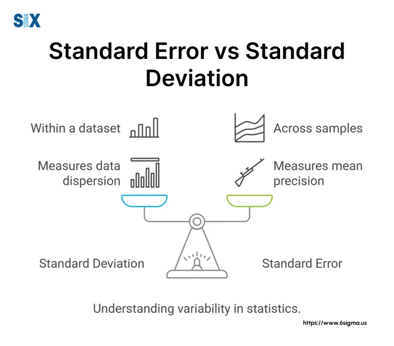

## Table of Contents

## What is the basic definition of standard deviation?

Standard deviation is a measure that shows how spread out numbers are in a set of data. Imagine you have a bunch of test scores. If all the scores are close to the average score, the standard deviation will be small. But if the scores are all over the place, with some very high and some very low, the standard deviation will be large.

It's like measuring how much the numbers differ from the average. To find the standard deviation, you first work out the average of all the numbers. Then, you see how far each number is from that average, square those differences, find the average of those squared differences, and finally take the square root of that average. This gives you a single number that tells you about the spread of your data.

## How is standard deviation calculated?

To calculate the standard deviation, start by finding the mean, or average, of your set of numbers. Add up all the numbers and then divide by how many numbers you have. This gives you the mean. Next, you need to see how far each number is from this mean. Subtract the mean from each number to find these differences. Some differences will be positive, and some will be negative.

Now, square each of these differences. Squaring makes all the numbers positive and also gives more weight to larger differences. After squaring, add up all these squared differences. Then, divide this total by the number of items in your set minus one (this is called the sample variance). Finally, take the square root of this result. This square root is your standard deviation. It tells you how spread out your numbers are from the mean.

If you're working with an entire population instead of a sample, you divide by the number of items instead of the number of items minus one when finding the variance. But the rest of the steps are the same. So, standard deviation is a way to measure how much your data varies from the average, and it's useful for understanding the spread of your data.

## What does standard deviation tell us about a dataset?

Standard deviation tells us how much the numbers in a dataset vary from the average, or mean. If the standard deviation is small, it means that most of the numbers are close to the mean. It's like if you measured the heights of a group of people and everyone was about the same height, the standard deviation would be small. But if the standard deviation is big, it means the numbers are spread out a lot. For example, if you measured the heights of a group where some people were very tall and some were very short, the standard deviation would be large.

This measure helps us understand the consistency or variability in our data. In a classroom, if all the students scored around 80 on a test, the standard deviation would be low, showing that the scores are consistent. But if some students scored 100 and others scored 50, the standard deviation would be high, showing a lot of variability in the test scores. By knowing the standard deviation, we can better understand how reliable or predictable our data is, which is useful in many areas like science, finance, and education.

## What is the definition of standard error?

Standard error is a way to measure how accurate our estimate of the mean is when we're looking at a sample of data instead of the whole population. Imagine you want to know the average height of all students in a big school, but you can't measure everyone, so you take a sample. The standard error tells you how much your sample mean might differ from the true mean of the whole school. It's like a measure of uncertainty; a smaller standard error means your sample mean is likely closer to the true mean.

To calculate the standard error, you start with the standard deviation of your sample. The standard deviation shows how spread out the numbers in your sample are. Then, you divide this standard deviation by the square root of the number of items in your sample. So, if you have a bigger sample, the standard error gets smaller, which means your estimate of the mean is more precise. Standard error is important because it helps us understand how much we can trust our sample data to represent the whole population.

## How is standard error calculated?

Standard error is a way to see how accurate our guess of the average is when we look at just a small group instead of everyone. It tells us how much our small group's average might be different from the real average of the whole group. To find the standard error, we start with the standard deviation of our small group. The standard deviation shows how spread out the numbers in our group are. Then, we divide this standard deviation by the square root of how many people or things are in our small group.

So, if we have a bigger small group, the standard error gets smaller. This means our guess of the average is more accurate. For example, if we want to know the average height of all students in a school, but we only measure 30 students, the standard error helps us know how good our guess is. If we measure 100 students instead, the standard error would be smaller, and our guess would be more reliable. Standard error is important because it helps us trust our small group's data to represent the whole group.

## How does standard error relate to sample size?

Standard error tells us how much our guess of the average might be off when we only look at a small group instead of everyone. The size of this small group, or sample size, is really important for the standard error. When we have a bigger sample size, the standard error gets smaller. This means our guess of the average is more accurate because we've looked at more people or things.

Think of it like this: if you want to know the average height of all students in a school, measuring just 10 students might give you a rough guess, but the standard error would be big. That means your guess might be far from the true average. But if you measure 100 students, your guess will be closer to the real average because you've seen more of the school. So, a bigger sample size makes the standard error smaller, which makes our guess of the average more reliable.

## What is the difference between standard deviation and standard error?

Standard deviation and standard error are both ways to understand how numbers in a group spread out, but they look at different things. Standard deviation tells us how much the numbers in our whole group differ from the average. It's like measuring how spread out the test scores are in a class. If everyone scores around the same, the standard deviation is small. If some score really high and some really low, it's big. It's a measure of how much the numbers vary within the group we're looking at.

Standard error, on the other hand, is about how much our guess of the average might be wrong when we only look at a small part of the group instead of everyone. It's like if you want to know the average height of all students in a school, but you only measure a few. The standard error tells you how much your guess of the average height might be off from the real average of all students. The bigger the group you measure, the smaller the standard error gets, making your guess more accurate. So, standard deviation is about the spread of numbers in the group, while standard error is about how well our small group's average represents the whole group's average.

## In what situations would you use standard deviation versus standard error?

You would use standard deviation when you want to understand how spread out the numbers are in your whole group of data. Imagine you're a teacher and you want to see how much the test scores in your class vary. If all the scores are close to the average, the standard deviation will be small, showing that the scores are consistent. But if some students scored very high and others very low, the standard deviation will be large, showing a lot of difference in the scores. It's useful for looking at the spread of data within a group, like how much people's heights or weights differ in a group.

On the other hand, you would use standard error when you're working with just a part of a bigger group and you want to know how good your guess of the average is. Let's say you're trying to find out the average height of all students in a school, but you only measured a few students. The standard error tells you how much your guess of the average height might be off from the real average of all students in the school. The more students you measure, the smaller the standard error gets, making your guess more accurate. It's all about understanding how reliable your sample's average is for representing the whole group's average.

## How do standard deviation and standard error affect the interpretation of statistical results?

Standard deviation helps us understand how much the numbers in our data spread out. If we're looking at a set of test scores, a small standard deviation means most students scored around the same, showing the scores are consistent. A big standard deviation means the scores are all over the place, with some students doing much better or worse than others. This helps us see if our data is tightly grouped or widely spread. When we see a small standard deviation, we can trust that our average is a good representation of the whole group. But if it's large, we know there's a lot of variety, and the average might not tell the whole story.

Standard error, on the other hand, tells us how much our guess of the average might be off when we only look at a small part of a bigger group. If we want to know the average height of all students in a school but only measure a few, the standard error shows us how accurate our guess is. A small standard error means our guess is probably close to the real average, making our results more reliable. A big standard error means our guess could be far from the true average, so we need to be careful about how much we trust our results. By understanding both standard deviation and standard error, we can better interpret our statistical results and know how much we can rely on our data.

## Can you explain the concept of sampling distribution in relation to standard error?

A sampling distribution is like a big picture of what happens when we take many small groups, or samples, from a larger group, or population. Imagine you want to know the average height of all students in a school, but you can't measure everyone at once. So, you take different small groups of students and measure their heights. Each time you do this, you get a different average height. If you did this many times, you would have a bunch of different average heights. The collection of all these averages is called the sampling distribution. It shows us how much the average height can change just because we're looking at different small groups.

Standard error is closely related to the sampling distribution. It tells us how spread out the averages in our sampling distribution are. If the standard error is small, it means that most of the averages from our different small groups are pretty close to each other. This makes us feel more confident that our guess of the average height is close to the true average of all students in the school. But if the standard error is big, it means the averages from our different small groups can be quite different from each other. This tells us that our guess of the average height might not be very accurate, and we need to be careful about how much we trust our results. So, standard error helps us understand how reliable our sample's average is for representing the whole group's average.

## How does the Central Limit Theorem influence our understanding of standard error?

The Central Limit Theorem is a big idea in statistics that helps us understand how averages from different small groups, or samples, behave. It says that if you take many small groups from a bigger group and find the average of each small group, the collection of these averages, called the sampling distribution, will look like a normal bell-shaped curve, no matter what the original bigger group's data looks like. This is really helpful because it means we can predict how the averages will spread out, even if the original data is messy or not normal.

The Central Limit Theorem directly affects our understanding of standard error. Standard error tells us how much the averages from different small groups might differ from the true average of the whole group. Because the Central Limit Theorem tells us that the sampling distribution of these averages will be normal, we can use this to figure out the standard error. The standard error gets smaller as we use bigger small groups, which makes our guess of the average more accurate. So, the Central Limit Theorem gives us a way to trust our results more by showing us how the standard error works with different sizes of small groups.

## What are some advanced applications of standard error in statistical modeling and analysis?

Standard error is super important in statistical modeling because it helps us see how reliable our guesses are. When we build models to predict things like how much people will spend on shopping or how well students will do on a test, we use data from a smaller group to make guesses about a bigger group. The standard error tells us how much our guess might be off. If we're using a model to predict the average price of houses in a city, the standard error helps us know how much we can trust our prediction. By understanding the standard error, we can make better decisions about how to use our model and how confident we can be in the results it gives us.

In more advanced statistical analysis, like regression analysis, standard error is used to figure out if the things we're looking at really affect the outcome. For example, if we're trying to see if studying more hours leads to better test scores, the standard error helps us understand if the relationship we see is real or just by chance. We look at the standard error of the coefficients in our regression model to see if they are statistically significant. This means we can tell if the things we think matter actually do make a difference. By using standard error in this way, we can build better models and make more accurate predictions about the world around us.

## What is the significance of understanding standard error?

Standard error (SE) is a critical concept in [statistics](/wiki/bayesian-statistics), particularly within inferential statistics, where it helps to determine the accuracy of a sample mean as an estimate of the population mean. The standard error provides insight into how representative a sample is of the entirety of its population, thus bridging the gap between the sample and the larger dataset from which it derives. By quantifying the variability, or dispersion, of sample means, the standard error allows researchers and analysts to make more precise inferences about population parameters.

Mathematically, the standard error of the sample mean is defined by the formula:

$$
SE = \frac{\sigma}{\sqrt{n}}
$$

where $\sigma$ is the population standard deviation, and $n$ is the sample size. The formula highlights a fundamental property of the standard error: it is inversely proportional to the square root of the sample size. As the sample size increases, the standard error decreases, suggesting a more accurate estimate of the population mean. This relationship underscores the importance of sample size in statistical inference and risk assessment within algorithmic trading contexts.

In practical terms, a smaller standard error indicates that the sample mean is a more precise estimate of the true population mean. Conversely, a larger standard error suggests greater variability among sample means, which may lead to less reliable estimations. For traders and financial analysts, understanding the standard error is essential for evaluating the precision of sample-derived metrics, making informed predictions about future market conditions, and enhancing the reliability of [algorithmic trading](/wiki/algorithmic-trading) strategies.

By applying standard error in their analyses, traders can gain a better understanding of how individual data points contribute to overall market behavior. This can lead to more informed investment decisions and improved trading outcomes, especially when combined with other statistical tools and methodologies. Such applications are vital in volatile market environments where subtle variations can significantly impact trading strategies and investment performance.

## What is the Role of Standard Deviation in Finance?

Standard deviation is a key statistical measure used in finance to quantify the amount of variation or [dispersion](/wiki/dispersion-trading) of a set of data points. It provides a numerical value that represents the spread of data within a sample or population. In finance, this metric is crucial for assessing market [volatility](/wiki/volatility-trading-strategies), which is a measure of the uncertainty or risk associated with the magnitude of changes in a security's value.

In the context of algorithmic trading, standard deviation plays a fundamental role in risk assessment and strategy formulation. One popular trading strategy that utilizes standard deviation is Bollinger Bands. Developed by John Bollinger in the 1980s, this strategy involves plotting two standard deviations above and below a moving average. The resulting bands help identify overbought or oversold conditions in a market, as well as periods of high or low volatility. When the bands widen, it indicates increased volatility, while narrowing suggests decreased volatility.

Calculating standard deviation in financial datasets involves determining the square root of the variance. Mathematically, if $X_1, X_2, ..., X_n$ represent a data set, the standard deviation $\sigma$ is calculated as follows:

$$
\sigma = \sqrt{\frac{1}{N} \sum_{i=1}^{N} (X_i - \mu)^2}
$$

where $\mu$ is the mean of the data set, and $N$ is the total number of observations.

In algorithmic trading, standard deviation can be used to forecast price movements, identify trading opportunities, and set stop-loss levels to manage risk more effectively. By analyzing past price data, traders can calculate historical volatility and use it as a baseline for future volatility expectations.

In addition to Bollinger Bands, standard deviation is used in various risk management and portfolio optimization strategies. For example, Modern Portfolio Theory leverages standard deviation to assess the expected return relative to risk for an investment portfolio. This approach helps traders and investors to construct portfolios that optimize returns while minimizing risks.

Overall, understanding and utilizing standard deviation allows traders to better navigate volatile markets and make informed decisions based on statistically significant data patterns. The robust application of these concepts is vital for developing sophisticated and efficient trading algorithms.

## What are the applications in algorithmic trading?

Standard deviation is an essential statistical tool in algorithmic trading, playing a significant role in the development of diverse trading strategies. One notable application is in the formulation of Bollinger Bands, a widely used technical analysis indicator. Bollinger Bands consist of a middle band (typically a simple moving average) and two outer bands, which are calculated by adding and subtracting the standard deviation from the moving average. The formula for the upper and lower Bollinger Bands is given by:

$$
\text{Upper Band} = \text{SMA}(n) + k \times \sigma(n)
$$

$$
\text{Lower Band} = \text{SMA}(n) - k \times \sigma(n)
$$

where $\text{SMA}(n)$ is the n-period simple moving average, $\sigma(n)$ is the n-period standard deviation of the data, and $k$ is a constant that determines the width of the bands, often set to 2.

In Python, the calculation of Bollinger Bands is facilitated by libraries such as NumPy and Pandas. These tools streamline data processing, making it efficient for traders to analyze market conditions. Below is a Python code snippet illustrating how standard deviation is applied in calculating Bollinger Bands:

```python
import pandas as pd
import numpy as np

# Sample data for a stock's closing prices
data = {'Close': [210.0, 211.5, 207.7, 214.2, 213.8, 216.9, 220.3]}
df = pd.DataFrame(data)

# Parameters for Bollinger Bands
n = 20  # period for moving average
k = 2   # number of standard deviations from the mean

# Calculating the moving average
df['SMA'] = df['Close'].rolling(window=n).mean()

# Calculating the standard deviation
df['STD'] = df['Close'].rolling(window=n).std()

# Calculating Bollinger Bands
df['Upper Band'] = df['SMA'] + (k * df['STD'])
df['Lower Band'] = df['SMA'] - (k * df['STD'])

print(df.tail())
```

While Bollinger Bands assess market conditions by signaling overbought or oversold scenarios, standard deviation is also central to other strategies like statistical [arbitrage](/wiki/arbitrage) and mean reversion. Statistical arbitrage exploits temporary deviations from a statistical equilibrium, assuming that prices will revert to their mean. Standard deviation is pivotal here as it quantifies those deviations, enabling traders to execute arbitrage opportunities when prices diverge significantly. 

Similarly, mean reversion strategies hinge on the idea that asset prices and returns will revert to their long-term mean or average level. By measuring how far a data point is from the mean, standard deviation assists traders in identifying potential entry and [exit](/wiki/exit-strategy) points based on extreme values, reflecting buy or sell signals.

In summary, the application of standard deviation in algorithmic trading enhances a trader's capability to devise and implement strategies based on quantitative assessments of price movements, ultimately aiding in the execution of informed trading decisions.

## References & Further Reading

#