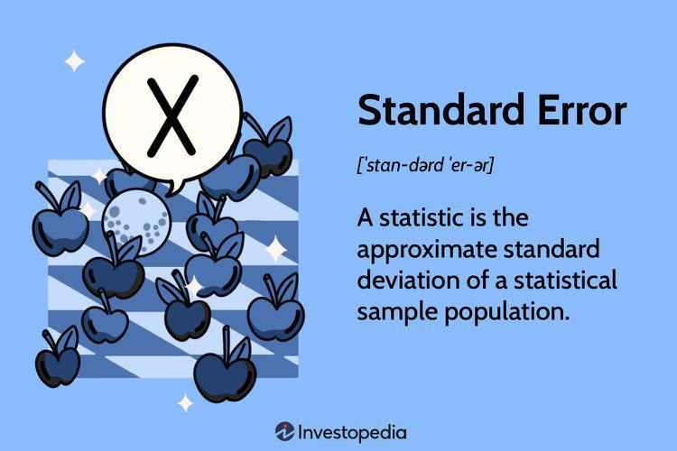

In statistics and algorithmic trading, understanding core concepts such as standard error and standard deviation is essential. These statistical measures are fundamental to many trading strategies, offering insight into market volatility and risk management. Standard error provides an estimate of the variability of the sample mean relative to the true population mean, playing a critical role in inferential statistics. On the other hand, standard deviation quantifies the dispersion of data points from their mean, serving as a key metric for assessing market volatility.

These concepts are integral to algorithmic trading, which relies heavily on quantitative analysis to generate trading signals and manage risk. Standard error helps in evaluating how well a sample of data represents the broader market, a crucial aspect when testing trading algorithms on historical data. By understanding the degree of variability or precision of an estimate, traders can evaluate the reliability of their strategies.



Standard deviation, meanwhile, is vital for measuring risk and volatility, guiding the development of strategies like Bollinger Bands and volatility-based trading systems. It is calculated as the square root of the variance and provides a statistical measure of market fluctuations which traders use to predict price movements and identify potential entry and exit points.

This article examines the application of standard error and standard deviation in algorithmic trading, highlighting their significance in developing robust trading strategies and managing financial risk effectively.

## Table of Contents

## Understanding Standard Error and Its Significance

Standard error (SE) is a critical concept in [statistics](/wiki/bayesian-statistics), particularly within inferential statistics, where it helps to determine the accuracy of a sample mean as an estimate of the population mean. The standard error provides insight into how representative a sample is of the entirety of its population, thus bridging the gap between the sample and the larger dataset from which it derives. By quantifying the variability, or dispersion, of sample means, the standard error allows researchers and analysts to make more precise inferences about population parameters.

Mathematically, the standard error of the sample mean is defined by the formula:

$$
SE = \frac{\sigma}{\sqrt{n}}
$$

where $\sigma$ is the population standard deviation, and $n$ is the sample size. The formula highlights a fundamental property of the standard error: it is inversely proportional to the square root of the sample size. As the sample size increases, the standard error decreases, suggesting a more accurate estimate of the population mean. This relationship underscores the importance of sample size in statistical inference and risk assessment within algorithmic trading contexts.

In practical terms, a smaller standard error indicates that the sample mean is a more precise estimate of the true population mean. Conversely, a larger standard error suggests greater variability among sample means, which may lead to less reliable estimations. For traders and financial analysts, understanding the standard error is essential for evaluating the precision of sample-derived metrics, making informed predictions about future market conditions, and enhancing the reliability of [algorithmic trading](/wiki/algorithmic-trading) strategies.

By applying standard error in their analyses, traders can gain a better understanding of how individual data points contribute to overall market behavior. This can lead to more informed investment decisions and improved trading outcomes, especially when combined with other statistical tools and methodologies. Such applications are vital in volatile market environments where subtle variations can significantly impact trading strategies and investment performance.

## The Role of Standard Deviation in Finance

Standard deviation is a key statistical measure used in finance to quantify the amount of variation or [dispersion](/wiki/dispersion-trading) of a set of data points. It provides a numerical value that represents the spread of data within a sample or population. In finance, this metric is crucial for assessing market [volatility](/wiki/volatility-trading-strategies), which is a measure of the uncertainty or risk associated with the magnitude of changes in a security's value.

In the context of algorithmic trading, standard deviation plays a fundamental role in risk assessment and strategy formulation. One popular trading strategy that utilizes standard deviation is Bollinger Bands. Developed by John Bollinger in the 1980s, this strategy involves plotting two standard deviations above and below a moving average. The resulting bands help identify overbought or oversold conditions in a market, as well as periods of high or low volatility. When the bands widen, it indicates increased volatility, while narrowing suggests decreased volatility.

Calculating standard deviation in financial datasets involves determining the square root of the variance. Mathematically, if $X_1, X_2, ..., X_n$ represent a data set, the standard deviation $\sigma$ is calculated as follows:

$$
\sigma = \sqrt{\frac{1}{N} \sum_{i=1}^{N} (X_i - \mu)^2}
$$

where $\mu$ is the mean of the data set, and $N$ is the total number of observations.

In algorithmic trading, standard deviation can be used to forecast price movements, identify trading opportunities, and set stop-loss levels to manage risk more effectively. By analyzing past price data, traders can calculate historical volatility and use it as a baseline for future volatility expectations.

In addition to Bollinger Bands, standard deviation is used in various risk management and portfolio optimization strategies. For example, Modern Portfolio Theory leverages standard deviation to assess the expected return relative to risk for an investment portfolio. This approach helps traders and investors to construct portfolios that optimize returns while minimizing risks.

Overall, understanding and utilizing standard deviation allows traders to better navigate volatile markets and make informed decisions based on statistically significant data patterns. The robust application of these concepts is vital for developing sophisticated and efficient trading algorithms.

## Calculating Standard Deviation in Python

Python provides robust libraries such as NumPy and Pandas that greatly facilitate the calculation of standard deviation, a critical measure in analyzing market volatility and developing trading strategies.

NumPy, a foundational library for numerical computing in Python, offers functions that simplify statistical calculations. The `numpy.std()` function can compute the standard deviation of a dataset with ease. For example:

```python
import numpy as np

data = [10, 12, 23, 23, 16, 23, 21, 16]
standard_deviation = np.std(data)
print("Standard Deviation:", standard_deviation)
```

In this code snippet, the standard deviation of a simple dataset is calculated using NumPy. This operation is pivotal in assessing how much the data points deviate from the average value, informing traders about potential market fluctuations.

Pandas, another essential library, is particularly useful for handling time-series data prevalent in financial markets. Pandas integrate seamlessly with NumPy, offering methods like `pandas.Series.std()` that make the computation of standard deviation straightforward when dealing with financial data stored in DataFrames.

Consider a scenario where you have historical stock prices stored in a CSV file. Using Pandas, you can quickly load this data and compute the standard deviation to evaluate market volatility:

```python
import pandas as pd

# Load historical stock price data
data = pd.read_csv('historical_stock_prices.csv')
closing_prices = data['Close']

# Calculate standard deviation of closing prices
closing_std = closing_prices.std()
print("Standard Deviation of Closing Prices:", closing_std)
```

This example demonstrates how traders can utilize Pandas to handle large datasets and perform essential statistical calculations. By examining the historical volatility of a stock, traders can make more informed decisions regarding risk management and strategy development.

In algorithmic trading, the standard deviation is often used in conjunction with other indicators. For instance, Bollinger Bands, a popular trading indicator, use the standard deviation to determine the bands around a moving average, helping traders identify overbought or oversold conditions. Here's a simplified implementation using Python:

```python
# Calculate Bollinger Bands
rolling_mean = closing_prices.rolling(window=20).mean()
rolling_std = closing_prices.rolling(window=20).std()
upper_band = rolling_mean + (rolling_std * 2)
lower_band = rolling_mean - (rolling_std * 2)

data['Upper Band'] = upper_band
data['Lower Band'] = lower_band

print(data[['Close', 'Upper Band', 'Lower Band']].tail())
```

In this implementation, the rolling mean and standard deviation form the basis of the Bollinger Bands around the stock's closing prices. Traders use such indicators to gauge market conditions and potential price movements, making Python an indispensable tool in algorithmic trading strategies.

## Application in Algorithmic Trading

Standard deviation is an essential statistical tool in algorithmic trading, playing a significant role in the development of diverse trading strategies. One notable application is in the formulation of Bollinger Bands, a widely used technical analysis indicator. Bollinger Bands consist of a middle band (typically a simple moving average) and two outer bands, which are calculated by adding and subtracting the standard deviation from the moving average. The formula for the upper and lower Bollinger Bands is given by:

$$
\text{Upper Band} = \text{SMA}(n) + k \times \sigma(n)
$$

$$
\text{Lower Band} = \text{SMA}(n) - k \times \sigma(n)
$$

where $\text{SMA}(n)$ is the n-period simple moving average, $\sigma(n)$ is the n-period standard deviation of the data, and $k$ is a constant that determines the width of the bands, often set to 2.

In Python, the calculation of Bollinger Bands is facilitated by libraries such as NumPy and Pandas. These tools streamline data processing, making it efficient for traders to analyze market conditions. Below is a Python code snippet illustrating how standard deviation is applied in calculating Bollinger Bands:

```python
import pandas as pd
import numpy as np

# Sample data for a stock's closing prices
data = {'Close': [210.0, 211.5, 207.7, 214.2, 213.8, 216.9, 220.3]}
df = pd.DataFrame(data)

# Parameters for Bollinger Bands
n = 20  # period for moving average
k = 2   # number of standard deviations from the mean

# Calculating the moving average
df['SMA'] = df['Close'].rolling(window=n).mean()

# Calculating the standard deviation
df['STD'] = df['Close'].rolling(window=n).std()

# Calculating Bollinger Bands
df['Upper Band'] = df['SMA'] + (k * df['STD'])
df['Lower Band'] = df['SMA'] - (k * df['STD'])

print(df.tail())
```

While Bollinger Bands assess market conditions by signaling overbought or oversold scenarios, standard deviation is also central to other strategies like statistical [arbitrage](/wiki/arbitrage) and mean reversion. Statistical arbitrage exploits temporary deviations from a statistical equilibrium, assuming that prices will revert to their mean. Standard deviation is pivotal here as it quantifies those deviations, enabling traders to execute arbitrage opportunities when prices diverge significantly. 

Similarly, mean reversion strategies hinge on the idea that asset prices and returns will revert to their long-term mean or average level. By measuring how far a data point is from the mean, standard deviation assists traders in identifying potential entry and [exit](/wiki/exit-strategy) points based on extreme values, reflecting buy or sell signals.

In summary, the application of standard deviation in algorithmic trading enhances a trader's capability to devise and implement strategies based on quantitative assessments of price movements, ultimately aiding in the execution of informed trading decisions.

## Practical Case Studies

In the context of equity markets, standard deviation serves as a pivotal tool for traders aiming to gauge market volatility. It facilitates the identification of periods of overbought or oversold conditions, thereby aiding in strategic decision-making. For instance, a trader examining the historical prices of a particular stock can calculate the standard deviation to estimate the expected fluctuation from the average price. This approach enables traders to set stop-loss orders by determining optimal exit points to mitigate potential losses.

In Forex trading, standard deviation is employed to evaluate currency pair volatility, assisting traders in understanding potential price shifts. For example, when trading a currency pair like EUR/USD, a high standard deviation may indicate increased volatility, suggesting a significant price movement. Traders can leverage this information to adjust their positions or hedge their trades, protecting against adverse market conditions.

Options trading similarly benefits from the application of standard deviation, particularly in the context of option pricing and risk management. Traders often use standard deviation to calculate the implied volatility of an option, providing insights into the market's future volatility expectations. This information proves critical when setting strike prices and determining expiration dates. By understanding the potential range of price movements, traders can make informed decisions about which options to purchase or sell.

Consider the application of Bollinger Bands in these trading scenarios. Bollinger Bands, a widely used technical indicator, consist of a central moving average and two bands set at a distance of one standard deviation above and below this average. Traders can write Python scripts to compute these values and visualize them, aiding in decision-making processes. For instance:

```python
import pandas as pd
import numpy as np
import matplotlib.pyplot as plt

# Sample stock prices
prices = pd.Series([105, 106, 108, 110, 112, 115, 116, 114, 113, 115])

# Calculate moving average and standard deviation
rolling_mean = prices.rolling(window=5).mean()
rolling_std = prices.rolling(window=5).std()

# Calculate Bollinger Bands
upper_band = rolling_mean + (rolling_std * 2)
lower_band = rolling_mean - (rolling_std * 2)

# Plotting
plt.plot(prices, label='Price')
plt.plot(rolling_mean, label='Moving Average')
plt.plot(upper_band, label='Upper Band', linestyle='--')
plt.plot(lower_band, label='Lower Band', linestyle='--')
plt.legend(loc='best')
plt.title('Bollinger Bands')
plt.show()
```

This script calculates the moving average and standard deviation over a specified window, then plots the Bollinger Bands to visually represent price volatility. Such practical examples underscore how standard deviation is instrumental in forming robust trading strategies across various financial markets.

In summary, understanding standard deviation's role in these diverse market contexts empowers traders to make informed decisions, enhancing trading performance and risk management. By integrating standard deviation into their analyses, traders can better anticipate market conditions and optimize their trading outcomes.

## Limitations and Considerations

Standard deviation is a widely used statistical measure in finance and algorithmic trading due to its power in quantifying market volatility. However, it has some important limitations. One crucial assumption underlying standard deviation is that data is normally distributed. This assumption may not hold true in financial markets, where returns can exhibit skewness and kurtosis, leading to inaccurate evaluations of risk if standard deviation is used in isolation.

Another limitation of standard deviation is its backward-looking nature. It relies on historical data to assess volatility, which may not always be indicative of future market conditions. This reliance on past data can overlook unforeseen market events and changes in volatility, potentially impacting trading decisions.

To address these limitations, it is advisable for traders to integrate standard deviation with other risk assessment tools and indicators. One such tool is Value at Risk (VaR), which estimates the potential loss in value of a portfolio over a defined period for a given confidence interval. VaR heavily relies on historical price data but also considers the tail risk, i.e., the potential for extreme losses.

Another complementary tool is Conditional Value at Risk (CVaR), also known as Expected Shortfall. CVaR provides additional insights by considering not just the tail risk like VaR, but also the average loss beyond the VaR threshold. This makes CVaR a more informative measure for assessing potential severe losses in trading portfolios.

Incorporating these tools alongside standard deviation can provide a more comprehensive and nuanced understanding of market conditions and portfolio risk. For traders, this enhanced risk assessment approach can lead to more informed and balanced trading decisions, especially in volatile markets. By using these measures in tandem, traders can better mitigate risks that may not be adequately captured by standard deviation alone.

## Conclusion

Standard deviation and standard error are crucial components in understanding and managing the inherent volatility in algorithmic trading. They aid traders in deciphering complex market dynamics and quantifying the risk associated with asset price movements. While standard deviation measures the dispersion or variability of a set of data points, standard error provides insight into the accuracy of sample estimates when extrapolated to a whole population. These metrics are indispensable in building trading strategies that need precise volatility assessments and risk estimations.

Despite its powerful application, standard deviation comes with limitations, particularly its assumption of normal distribution and its retrospective analysis of data. These constraints suggest that sole reliance on standard deviation might not suffice for comprehensive risk assessment. Therefore, traders are encouraged to pair it with other analytical tools, such as Value at Risk (VaR) and Conditional Value at Risk (CVaR), to develop a more nuanced understanding of potential market movements and risks.

Using a combination of statistical measures allows traders to circumvent the limitations associated with a single metric, leading to more informed decisions in volatile markets. Integrating these tools within algorithmic trading strategies ensures a balanced approach to risk, potentially enhancing profitability and reducing exposure to adverse market conditions. Ultimately, a thorough understanding and application of standard deviation, when combined with a diverse set of analytical techniques, equip traders to navigate the complexities of financial markets with greater confidence and precision.

## References & Further Reading

### References & Further Reading

1. Bergstra, J., et al. discuss the significance of algorithms for hyper-parameter optimization in their paper "Algorithms for Hyper-Parameter Optimization," published in Advances in Neural Information Processing Systems. This literature sheds light on optimizing algorithmic trading strategies for enhanced performance and accuracy.

2. Marcos Lopez de Prado's "Advances in Financial Machine Learning" provides insights into applying modern machine learning techniques within financial contexts. This resource is invaluable for understanding how statistical measures such as standard deviation can be integrated into trading models to predict market movements effectively.

3. In "Evidence-Based Technical Analysis: Applying the Scientific Method and Statistical Inference to Trading Signals," David Aronson explores the application of statistical inference in creating reliable trading signals. The book underscores the importance of evidence-based approaches in developing technical analysis strategies, highlighting tools like standard deviation and standard error.

These references provide foundational knowledge and cutting-edge techniques for leveraging statistical measures in the development of algorithmic trading strategies. They advocate for a scientific approach to trading, emphasizing the role of statistical tools in risk management and decision-making processes.