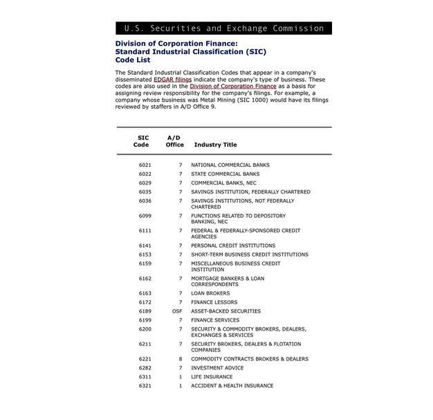

In today's rapidly evolving business landscape, correctly classifying industries and businesses is crucial for economic analysis, regulation, and strategic marketing. The ability to categorize an economic entity into a coherent and universally recognized framework allows stakeholders to make informed decisions based on industry-specific data. The Standard Industrial Classification (SIC) system provides this categorization, serving as a foundational tool for systematically dividing industries into defined sectors. Established in the early 20th century, SIC codes have been instrumental in standardizing economic activities across various sectors, aiding government agencies, regulatory bodies, and corporations in effective data management and policy-making.

Moreover, with the rise of algorithmic trading in the financial markets, understanding industry classifications has gained new importance. Algorithms, which drive a significant portion of today’s market trading activities, utilize industry classification to refine data analysis and devise market segmentation strategies. By providing a structured means to relate businesses and sectors, SIC codes help traders and financial analysts in identifying trends, assessing risks, and crafting investment strategies based on sectoral performance.

This article explores the intersection of SIC codes, business classification, and their implications for algorithmic trading. It investigates into the relevance of SIC codes in contemporary business practices, their comparison with alternative classification systems like the North American Industry Classification System (NAICS), and their role in strategic business and trading decisions. Through this analysis, the enduring significance of SIC codes in a digitally-driven economic framework is underscored, providing insights into their continuing utility and potential evolution in the future.

## Table of Contents

## What is Standard Industrial Classification (SIC) Code?

The Standard Industrial Classification (SIC) code is a systematic framework, first introduced by the U.S. government in 1937, to categorize businesses according to their primary economic activities. This four-digit numerical system was designed to standardize the classification of industries in order to streamline data analysis and inform policy development. Each SIC code is structured as follows: the first two digits identify the major industry group, the third digit defines the more specific industry group within that major category, and the fourth digit pinpoints the sub-industry. 

Although the SIC codes were largely replaced by the North American Industry Classification System (NAICS) in 1997, they remain in significant use, particularly in certain government filings and business applications. Their enduring relevance is attributed to widespread historical usage and the ease with which they facilitate cross-referencing and continuity in longitudinal economic datasets. These codes not only aid in maintaining a consistent framework for economic analysis but also serve a practical function in various business practices, including regulatory compliance and strategic planning. Despite the advent of the more detailed six-digit NAICS, the simplicity and historical significance of SIC codes ensure their ongoing application in the classification of industries.

## SIC Codes vs. NAICS Codes

The transition from the Standard Industrial Classification (SIC) system to the North American Industry Classification System (NAICS) has not been completely seamless, despite NAICS being introduced in 1997 as the preferred standard for industry classification. The NAICS system emerged to provide a more detailed and granular classification approach, utilizing a six-digit code system as opposed to the four-digit SIC code. This increased detail facilitates the exchange and comparison of standardized industry data across North America, enhancing international economic analysis and cooperation.

However, many organizations, particularly within government sectors such as the Securities and Exchange Commission (SEC), continue to rely on SIC codes. This persistent use is often due to longstanding policies, historical data comparisons, and the established role of SIC codes in certain regulatory frameworks. The dual application of SIC and NAICS codes is a testament to the inertia within institutional systems that depend on consistent classification methodologies.

For businesses, this scenario necessitates navigating both classification systems for comprehensive compliance and strategic planning. Companies must align their operations with NAICS for broader industry standardization efforts while simultaneously retaining familiarity with SIC codes for regulatory purposes. This dual system navigation often requires strategic allocation of administrative resources to ensure that businesses can fulfill all compliance requirements effectively. While NAICS offers greater specificity in categorizing industry sectors, the historical prevalence and regulatory attachment of SIC codes ensure their continued relevance in various sectors, perpetuating their coexistence with NAICS in the landscape of industry classification.

## How SIC Codes Impact Business Classification

SIC codes provide a systematic approach to categorizing businesses within specific market sectors, enabling a structured method for analysis and comparison. By offering a uniform classification framework, SIC codes play a vital role in market research, regulatory compliance, and strategic planning. Businesses can utilize these codes to evaluate their position relative to competitors and identify potential market opportunities. 

Accurate classification through SIC codes assists businesses in honing their competitive strategies by revealing insights into industry trends and benchmarking performance. For instance, by examining SIC-based groupings, companies can pinpoint emerging competitors or identify sectors experiencing growth or decline, thereby facilitating informed decision-making regarding market entry or expansion.

Financial institutions and investors often depend on SIC codes to quantify industry-specific risks and evaluate investment prospects. By categorizing companies into specific SIC codes, investors can fine-tune their portfolios based on sectorial risk assessment. This method allows for diversification strategies and the evaluation of sectoral exposure to macroeconomic factors, leading to more informed investment choices.

For example, a financial analyst might use Python to filter investment opportunities by SIC code, ensuring that a client's asset allocation strategy aligns with their risk tolerance and sector preferences. This could involve data queries from financial databases that track SIC-coded company performance, thereby enabling nuanced insights into sector-specific financial health and investment potential. The ability to classify and analyze industries through SIC codes thus fosters a deeper understanding of market dynamics and enhances the strategic planning capabilities of businesses and investors alike.

## Algorithmic Trading and Industry Classification

Algorithmic trading employs automated systems to facilitate the execution of trades based on predefined criteria, which can include factors such as timing, price, or [volume](/wiki/volume-trading-strategy). In this context, the accurate classification of industries becomes paramount, as it provides essential data that inform the trading strategies deployed by these automated systems.

Standard Industrial Classification (SIC) codes play a pivotal role in this process by offering a structured method for categorizing businesses according to their primary industry activities. By leveraging SIC codes, traders can effectively analyze market trends and pinpoint sectors that provide lucrative investment opportunities. This analysis enables the differentiation of sectors with expanding growth potentials from those facing stagnation or decline. Consequently, SIC codes are integrated into algorithms for the selection of stocks or assets that align with broader market movements, thus enhancing potential returns.

For instance, an algorithmic trader might develop a strategy that allocates capital to industries demonstrating positive growth trajectories. The classification provided by SIC codes allows the algorithm to filter and prioritize stocks within these industries, potentially optimizing portfolio performance. This approach is particularly beneficial in dynamic market environments where sector-specific news or developments can rapidly alter the investment landscape.

Moreover, understanding industry classifications permits algorithmic traders to operate with heightened decision-making precision. As market conditions shift, traders can adjust their strategies to reflect changes in specific sectors, thereby maintaining alignment with economic trends. For example, the onset of a technological innovation in a particular industry, identifiable through SIC categorization, might prompt a reallocation of resources to capitalize on emerging opportunities.

Algorithmic trading strategies can also incorporate SIC data to mitigate risks associated with sector-specific volatilities. By considering historical performance data linked to SIC classifications, traders can devise risk management tactics tailored to industry-specific conditions. This ensures a balanced approach to investment, incorporating both growth potential and risk exposure.

Hence, the integration of SIC codes into [algorithmic trading](/wiki/algorithmic-trading) frameworks represents a sophisticated method for navigating complex market environments. It enhances strategic decision-making by providing a robust classification system that supports nuanced analysis of market trends and sectoral shifts. This, in turn, facilitates the development of innovative trading algorithms capable of responding to the intricate dynamics of modern financial markets.

## How to Find and Use SIC Codes

The U.S. Department of Labor provides an online database enabling businesses and analysts to search for Standard Industrial Classification (SIC) codes using keywords related to their industry or business activities. This tool simplifies the process of identifying the appropriate SIC code that accurately represents a company's primary line of business. Utilizing SIC codes properly can help businesses align their classification with widely accepted industry standards, thereby supporting regulatory compliance and strategic business planning.

Accurate classification using SIC codes is essential for businesses as it impacts how they are perceived in the industry landscape. By correctly identifying their SIC codes, businesses can access specialized resources such as targeted marketing lists, which are crucial for developing focused and effective marketing campaigns. This targeted approach allows companies to reach the most relevant audience, optimizing their marketing strategies and potentially increasing their market share.

Moreover, SIC codes assist in aligning with industry standards, which is critical for companies looking to maintain competitiveness and adhere to regulatory frameworks. For example, SIC codes can play a vital role in financial reporting and corporate filings where precise industry classification is often mandatory.

In modern business practices, leveraging SIC codes extends beyond mere compliance. Financial institutions and investors frequently utilize these codes to analyze industry-specific risks, assess market opportunities, and develop investment strategies. By tapping into this classification system, businesses can enhance their market analysis, improve decision-making, and align strategically with economic trends.

In summary, finding and using SIC codes is a straightforward process facilitated by the Department of Labor's online resources. Correct application of these codes not only ensures compliance and alignment with industry standards but also enhances marketing efforts and strategic planning. Thus, businesses should prioritize their understanding and implementation of SIC codes to maximize operational efficiency and market effectiveness.

## Future of SIC Codes in Business Classification

While the North American Industry Classification System (NAICS) offers a more detailed and granular approach to categorizing businesses, the Standard Industrial Classification (SIC) system maintains its relevance due to its historical usage and widespread acceptance. This persistence is not merely nostalgic; it serves a practical purpose in data continuity and industry comparison over time. 

The integration of SIC codes with modern technologies, such as data analytics and [machine learning](/wiki/machine-learning), offers significant potential for deriving deep business insights. Machine learning algorithms can leverage historical SIC data to identify trends and patterns in industry behaviors, allowing businesses and analysts to predict future market developments. For instance, clustering algorithms can group businesses with similar SIC codes to uncover strategic partnerships or competitive landscapes within a sector.

As industries transform with technological advances and economic shifts, there may arise a necessity for classification systems that encapsulate these changes more effectively. Existing systems like SIC and NAICS might need to evolve to accommodate emerging sectors, such as digital services, renewable energy, and biotechnology, which did not exist in the same form when these classification systems were established. This evolution could take the form of additional subclasses or entirely new classification criteria to better reflect contemporary economic realities.

Moreover, the integration of SIC codes into sophisticated data analysis platforms can aid businesses in their strategic positioning, marketing, and risk assessment efforts. By combining such codes with external data sets, like consumer behavior analytics or global economic indicators, organizations can enhance their decision-making processes and improve their market strategies.

In conclusion, while SIC codes are rooted in the past, their application in conjunction with modern data technologies offers opportunities for significant advancements in business classification. The challenge will be in updating these systems to align with new industry configurations and technological innovations.

## Conclusion

SIC codes remain a key component in classifying businesses, providing a foundational framework that has stood the test of time. Despite the technological advancements and newer classification systems like NAICS, the durability of SIC codes is evident, especially in the context of algorithmic trading. The consistency and uniformity offered by SIC codes enable traders, analysts, and marketers to categorize businesses efficiently, forming the backbone for robust market analysis.

Understanding and employing SIC codes strategically can significantly enhance market analysis. For instance, algorithmic trading relies on precise data and structured classifications to execute trades based on complex algorithms. SIC codes serve as a reliable mechanism by which traders can identify market trends, sectoral shifts, and potential investment opportunities. By classifying sectors accurately, algorithmic models can be calibrated to respond to real-time market dynamics, thus improving decision-making accuracy and trading outcomes. 

Moreover, SIC codes provide valuable insights that can streamline targeting and investment strategies for traders, analysts, and marketers. By leveraging these codes, businesses can refine their market segmentation strategies, identify niche markets, and optimize resource allocation. For financial institutions, the use of SIC codes aids in risk assessment and investment decision processes, ultimately enhancing the precision of their financial strategies. 

In summary, while new classification systems emerge and evolve, SIC codes continue to be an indispensable tool, offering clarity and uniformity in business classification. Their relevance is particularly pronounced as they adapt to serve modern technological needs, ensuring their continued value in market analysis and strategic business decision-making.

## References & Further Reading

[1]: North American Industry Classification System (NAICS) - [Census.gov](https://www.census.gov/naics/)

[2]: Securities and Exchange Commission (SEC) Division of Corporation Finance: Standard Industrial Classification (SIC) Code List. [SEC.gov](https://www.sec.gov/search-filings/standard-industrial-classification-sic-code-list)

[3]: GICS and ICB Systems - Industry Classification in Financial Markets. [FTSE Russell](https://www.investopedia.com/articles/stocks/08/global-industry-classification-industrial-classification-benchmark.asp)

[4]: "Classification of Economic Activities" - OECD Data and Research. [OECD](https://www.oecd-ilibrary.org/oecd-taxonomy-of-economic-activities-based-on-r-d-intensity_5jlv73sqqp8r.pdf?itemId=%2Fcontent%2Fpaper%2F5jlv73sqqp8r-en)

[5]: Malkiel, B. G. (2007). ["A Random Walk Down Wall Street: The Time-Tested Strategy for Successful Investing"](https://www.amazon.com/Random-Walk-Down-Wall-Street/dp/0393358380), W. W. Norton & Company.

[6]: "Algorithmic Trading: Winning Strategies and Their Rationale" by Ernie Chan. [Wiley Finance Series](https://www.wiley.com/en-us/Algorithmic+Trading%3A+Winning+Strategies+and+Their+Rationale-p-9781118460146)

[7]: Twede, D., "Evolution of Retail Industry Classifications and Their Use in the SIC System." [Journal of Retailing](https://www.taylorfrancis.com/chapters/edit/10.4324/9781315882857-8/history-packaging-diana-twede)

[8]: Jagerson, J., Hansen, W. (2015). "All About Forex Trading." New York: McGraw-Hill Education.

[9]: "Federal Reserve Bulletin: SIC Codes and Financial Data Analysis." [FederalReserve.gov](https://en.wikipedia.org/wiki/Federal_Reserve_Economic_Data)