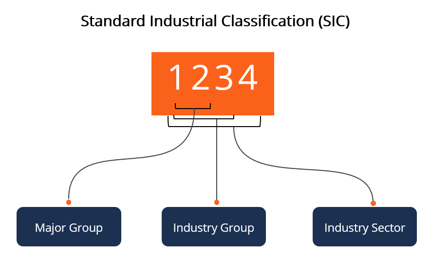

## Table of Contents

## What is a Standard Industrial Classification (SIC) code?

A Standard Industrial Classification (SIC) code is a system used to categorize businesses by the type of activity they do. It helps in organizing and understanding the economy by grouping similar businesses together. For example, a company that makes cars would have a different SIC code than a company that sells clothes.

SIC codes were first used in the United States in the 1930s. They are used by government agencies, businesses, and researchers to collect, analyze, and publish data about different industries. Even though they are still used, a newer system called the North American Industry Classification System (NAICS) has replaced SIC codes in many places.

## How are SIC codes structured?

SIC codes are made up of four numbers. The first two numbers show the main group the business belongs to, like manufacturing or retail. The last two numbers give more details about what the business does within that group. For example, a business with the SIC code 2024 is in the food and kindred products group (20) and makes ice cream and frozen desserts (24).

There are about 1,500 different SIC codes. They cover all kinds of businesses, from farming to services. Each code helps to put businesses into clear categories so that people can easily understand what kind of work they do. This makes it easier to compare businesses and see how different parts of the economy are doing.

## What is the purpose of using SIC codes?

SIC codes help to put businesses into groups based on what they do. This makes it easier for people to understand and study the economy. For example, if you want to know how many companies make cars, you can look at the SIC code for car manufacturing and find out quickly.

Government agencies, businesses, and researchers use SIC codes to collect and share information about different industries. This helps them make better decisions and understand trends. Even though a newer system called NAICS is used more often now, SIC codes are still important because they have been used for a long time and many people know how to use them.

## Who uses SIC codes and why are they important?

SIC codes are used by government agencies, businesses, and researchers. They help these groups to organize and understand the economy better. For example, the government might use SIC codes to see how many companies are in a certain industry, like farming or manufacturing. This helps them make decisions about laws and policies that affect those industries.

Businesses use SIC codes to compare themselves with others in the same field. This can help them see how they are doing compared to their competitors. Researchers use SIC codes to study trends and changes in different parts of the economy. Even though a newer system called NAICS is used more often now, SIC codes are still important because they have been used for a long time and many people know how to use them.

## How do you find the SIC code for a specific business?

To find the SIC code for a specific business, you can start by looking at the business's website or official documents. Many companies list their SIC code in their annual reports or on their "About Us" page. If you can't find it there, you can use online databases like the U.S. Securities and Exchange Commission's (SEC) EDGAR database, where public companies file their information. Just type in the company's name and look for their SIC code in their filings.

Another way to find a business's SIC code is to use a search engine. Type in the company's name along with "SIC code" and see what comes up. There are also websites and tools specifically designed to help you find SIC codes, like the one from the U.S. Department of Labor's OSHA. If you know what the business does, you can also look up the SIC code in a directory or list of SIC codes. Just find the category that matches the business's main activity, and you'll see the SIC code that goes with it.

## Can you explain the difference between SIC codes and NAICS codes?

SIC codes and NAICS codes are both used to put businesses into groups based on what they do. SIC codes, or Standard Industrial Classification codes, were first used in the United States in the 1930s. They use four numbers to show what kind of business it is. For example, a company that makes cars might have a different SIC code than a company that sells clothes. SIC codes are still used today, but they are getting old and can be hard to use for new kinds of businesses.

NAICS codes, or North American Industry Classification System codes, are newer and were made to replace SIC codes. They started being used in the late 1990s and are used in the United States, Canada, and Mexico. NAICS codes use six numbers instead of four, which lets them be more specific about what a business does. For example, a company that makes cars might have a more detailed NAICS code that shows if they make electric cars or gas-powered cars. NAICS codes are updated every five years to keep up with changes in the economy, making them more useful for understanding modern businesses.

## How have SIC codes evolved over time?

SIC codes were first used in the United States in the 1930s to help people understand the economy by grouping businesses based on what they do. At the start, SIC codes used four numbers to show what kind of business it was. For example, a company that makes cars would have a different SIC code than a company that sells clothes. Over the years, as new types of businesses started, the government had to add new SIC codes to keep up with changes in the economy.

Even though SIC codes helped a lot, they started to get old and hard to use for new kinds of businesses. In the late 1990s, a new system called the North American Industry Classification System (NAICS) was made to replace SIC codes. NAICS codes use six numbers and are updated every five years to keep up with the economy. But SIC codes are still used today because many people know how to use them, and they have a lot of history behind them.

## What are the limitations of using SIC codes?

SIC codes have some problems that make them hard to use today. They were made a long time ago, in the 1930s, and they don't always fit with new kinds of businesses. For example, there are no SIC codes for businesses that work with the internet or new technology. This makes it hard to put these businesses into the right groups. Also, SIC codes only use four numbers, so they can't be very specific about what a business does. This means that businesses that do different things might end up with the same SIC code, which can be confusing.

Another problem with SIC codes is that they don't change very often. The economy changes all the time, with new businesses and new ways of doing things, but SIC codes don't get updated to match these changes. This makes them less useful for understanding the economy today. Because of these problems, a new system called NAICS was made to replace SIC codes. NAICS uses six numbers and gets updated every five years, so it can keep up with the economy better. But even though SIC codes have these limitations, they are still used because many people know how to use them and they have a lot of history behind them.

## How can businesses benefit from correctly classifying their SIC code?

When businesses use the right SIC code, it helps them in many ways. It makes it easier for them to compare themselves with other businesses in the same field. This can show them how they are doing compared to their competitors. It also helps them find the right customers and partners because people can easily see what kind of work they do. For example, if a business makes cars, having the right SIC code helps car buyers and parts suppliers find them.

Using the right SIC code also helps businesses follow the rules and get the right help from the government. Some government programs and rules are made for specific types of businesses, and having the right SIC code can make sure a business gets the help it needs. It can also make it easier for the business to get loans or other financial help because banks and other lenders can see what the business does and how it fits into the economy. Even though SIC codes are old, using them correctly still has many benefits for businesses today.

## What are the common mistakes to avoid when assigning SIC codes?

One common mistake when assigning SIC codes is choosing a code that is too general. Businesses might pick a broad SIC code because it seems to fit, but this can make it hard to show what they really do. For example, a company that makes only electric cars might pick a code for all car manufacturers, which doesn't show that they specialize in electric cars. It's important to pick a code that is as specific as possible to show what the business does best.

Another mistake is not updating the SIC code when the business changes what it does. If a company starts making new products or offering new services, they need to check if their SIC code still fits. Using an old SIC code can make it hard for people to understand what the business does now. It's a good idea to look at the SIC code every year to make sure it still matches what the business is doing.

## How do international SIC codes compare to those used in the United States?

SIC codes, or Standard Industrial Classification codes, were first used in the United States in the 1930s. They help to put businesses into groups based on what they do. Other countries have their own versions of SIC codes, but they might use different names and numbers. For example, the United Kingdom uses a system called the UK Standard Industrial Classification of Economic Activities. Even though these codes are similar, they are not exactly the same as the ones used in the U.S. This can make it hard to compare businesses from different countries.

A newer system called the North American Industry Classification System (NAICS) is used in the United States, Canada, and Mexico. NAICS codes are more detailed and get updated every five years, so they can keep up with changes in the economy. Some countries outside of North America use a system called the International Standard Industrial Classification (ISIC), which is made by the United Nations. ISIC codes are used to compare businesses all over the world, but they might not be as detailed as NAICS codes. Because of these differences, it can be tricky to compare businesses from different countries using their SIC or similar codes.

## What advanced strategies can be used to analyze industry trends using SIC codes?

To analyze industry trends using SIC codes, one advanced strategy is to look at data over a long time. By collecting information on businesses with the same SIC code over many years, you can see how that part of the economy is changing. For example, you might see that the number of companies making cars is going up or down. This can help you understand if the car industry is growing or shrinking. You can also compare this data with other information, like how much money people are spending or what new laws are being made, to see how these things affect the industry.

Another strategy is to use SIC codes to compare different parts of the economy. For example, you might want to see how the car industry is doing compared to the clothing industry. By looking at the SIC codes for both, you can see which one is growing faster or making more money. This can help you understand where the economy is heading and where there might be good opportunities for businesses. Using SIC codes in this way can give you a big picture of how different industries are doing and help you make better decisions.

## References & Further Reading

[1]: North American Industry Classification System (NAICS) - [Census.gov](https://www.census.gov/naics/)

[2]: Securities and Exchange Commission (SEC) Division of Corporation Finance: Standard Industrial Classification (SIC) Code List. [SEC.gov](https://www.sec.gov/search-filings/standard-industrial-classification-sic-code-list)

[3]: GICS and ICB Systems - Industry Classification in Financial Markets. [FTSE Russell](https://www.investopedia.com/articles/stocks/08/global-industry-classification-industrial-classification-benchmark.asp)

[4]: "Classification of Economic Activities" - OECD Data and Research. [OECD](https://www.oecd-ilibrary.org/oecd-taxonomy-of-economic-activities-based-on-r-d-intensity_5jlv73sqqp8r.pdf?itemId=%2Fcontent%2Fpaper%2F5jlv73sqqp8r-en)

[5]: Malkiel, B. G. (2007). ["A Random Walk Down Wall Street: The Time-Tested Strategy for Successful Investing"](https://www.amazon.com/Random-Walk-Down-Wall-Street/dp/0393358380), W. W. Norton & Company.

[6]: "Algorithmic Trading: Winning Strategies and Their Rationale" by Ernie Chan. [Wiley Finance Series](https://www.wiley.com/en-us/Algorithmic+Trading%3A+Winning+Strategies+and+Their+Rationale-p-9781118460146)

[7]: Twede, D., "Evolution of Retail Industry Classifications and Their Use in the SIC System." [Journal of Retailing](https://www.taylorfrancis.com/chapters/edit/10.4324/9781315882857-8/history-packaging-diana-twede)

[8]: Jagerson, J., Hansen, W. (2015). "All About Forex Trading." New York: McGraw-Hill Education.

[9]: "Federal Reserve Bulletin: SIC Codes and Financial Data Analysis." [FederalReserve.gov](https://en.wikipedia.org/wiki/Federal_Reserve_Economic_Data)