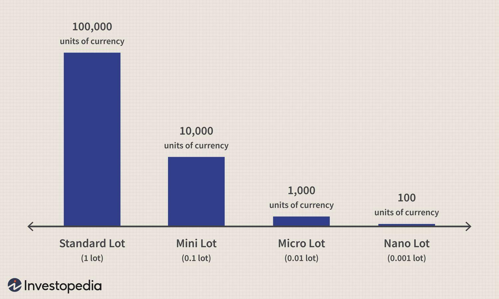

Forex trading represents one of the largest and most liquid financial markets globally, enticing participants with the prospect of significant profits alongside its distinctive challenges. At its core, a vital concept that every trader should comprehend is the 'standard lot'. This unit serves as a benchmark for transaction sizes in forex trading, establishing a uniform framework for engaging with currency pairs.

The standard lot is inherently linked to how traders approach the forex market, influencing both strategy and risk management. It provides a structured means for traders to measure and manage their positions, thereby facilitating informed decision-making. This understanding is indispensable, whether you are initiating your journey in forex trading or refining existing strategies as an experienced trader.

In contemporary forex trading, the infusion of technology through algorithmic trading has further transformed how market opportunities are captured. By employing algorithmic strategies, traders harness the analytical capabilities of computers to optimize trade executions and gain a competitive edge. This convergence forms the foundational elements of modern forex trading: currency trading basics, standard lots, and the precision and speed of algorithmic strategies.

As we navigate these concepts, it becomes evident that a profound comprehension of standard lots and the strategic use of technology are key to thriving in forex trading. These elements collectively underpin the successful navigation of the forex landscape, aligning with the overarching goal of achieving balance between risk management and opportunity capitalization. Understanding these concepts is essential as the trading environment evolves, demanding adaptability and informed decision-making.

## Table of Contents

## Understanding Standard Lot in Forex Trading

A standard lot in forex trading is a fundamental concept that denotes a transaction size of 100,000 units of the base currency in any forex pair. This standardized measure substantially facilitates trading by establishing a uniform scale, essential for executing large trades efficiently. Trading in standard lots is prevalent among professional traders and financial institutions owing to its potential for significant profit margins, coupled with substantial financial risk. 

The size of the standard lot allows traders to capitalize on minor price movements, owing to the amplified impact that trading in such large quantities has on profit and loss. Thus, understanding the dynamics of a standard lot assists traders in managing risk effectively; it enables them to calculate their exposure and strategize their risk management approaches to avoid devastating losses.

The notion of standard lot sizes is central to risk management as it relates directly to the leverage and margin requirements in [forex](/wiki/forex-system) trading. For instance, with a leverage of 100:1, a trader needs only $1,000 to control a $100,000 position. This leverage can amplify both gains and losses, highlighting the importance of cautious approach.

Recognizing the need for flexibility, many trading firms provide different lot sizes to cater to diverse capitalization levels of traders. These include mini lots (10,000 units), micro lots (1,000 units), and nano lots (100 units). By choosing appropriate lot sizes, traders can tailor their trading strategies to their financial resources, risk appetites, and market conditions. For example, a trader with a smaller account balance might opt for micro or mini lots to manage risk and gradually build proficiency without committing substantial capital. This adaptability ensures that forex trading remains accessible to a broad spectrum of participants, from novice traders to season professionals.

## The Role of Algorithmic Trading in Forex

Algorithmic trading, commonly known as algo trading, employs computer algorithms to automate forex trading decisions. These algorithms function based on predefined criteria and can execute trades at speeds and frequencies beyond human capability, providing a significant advantage in the highly dynamic forex markets. 

Algo trading strategies are diverse, encompassing methods such as trend-following, [arbitrage](/wiki/arbitrage), and market-making. Trend-following strategies analyze historical price trends and patterns to predict future movements, buying or selling currencies based on these predictions. Arbitrage strategies, on the other hand, seek to exploit price discrepancies between different markets or financial instruments by executing simultaneous transactions that yield risk-free profits. Market-making involves providing [liquidity](/wiki/liquidity-risk-premium) by offering simultaneous buy and sell quotes, capturing the spread as profit while maintaining neutrality regarding market direction.

The adoption of [algorithmic trading](/wiki/algorithmic-trading) allows traders to harness vast amounts of data and sophisticated analytical tools to improve trading precision and operational efficiency. By minimizing human intervention, traders can enhance their risk management practices and potential for returns. For instance, algorithms can adjust trading parameters rapidly in response to market [volatility](/wiki/volatility-trading-strategies), ensuring that traders capture optimal entry and [exit](/wiki/exit-strategy) points.

However, algorithmic trading is not without its risks and limitations. Constant monitoring is essential to ensure the algorithms function as intended, especially in the face of unforeseen market events. Algorithms must be continually adjusted and refined to remain effective, as market dynamics are in perpetual flux.

Moreover, while algorithms can process large datasets at remarkable speeds, they may overlook qualitative factors or external influences not captured within their datasets. This could lead to erroneous trading decisions if not supplemented by human oversight. Consequently, traders must maintain a balanced approach, leveraging the strengths of algorithmic systems while remaining alert to potential vulnerabilities.

## The Importance of Lot Size in Risk Management

Choosing the correct lot size is a fundamental aspect of risk management in forex trading, as it directly impacts exposure to the market. A larger lot size inherently carries greater potential for profit but also heightens the risk, due to increased exposure. This relationship underscores the importance of carefully considering one’s capital, risk tolerance, and trading strategy when selecting a lot size.

### Lot Size and Market Exposure
Lot size determines the magnitude of market exposure. For example, trading a standard lot, which equals 100,000 units of the base currency, entails a significant commitment and can lead to substantial gains or losses due to small price fluctuations. Conversely, smaller lot sizes such as mini (10,000 units) or micro (1,000 units) lots allow traders to participate with lower risk, making them suitable for beginners or those with limited capital.

### Risk Management Strategies
An effective risk management strategy involves not only selecting an appropriate lot size but also combining it with stop-loss and take-profit mechanisms. These tools help traders limit potential losses and secure profits by automatically closing positions once they reach predetermined price levels. By meticulously calculating the lot size in tandem with these measures, traders can strike a balance between risk and reward. For instance, using a risk management formula:

$$
\text{Position Size} = \frac{\text{Account Risk}}{\text{Trade Risk}}
$$

where:
- **Account Risk** is the dollar amount the trader is willing to lose.
- **Trade Risk** is the pip risk in the trade.

Such a formula helps avoid over-leveraging and ensures position sizes align with individual risk parameters.

### Advantages for Beginners
For new traders, engaging in forex trading using smaller lot sizes can mitigate potential losses while providing an educational experience in real market conditions. Trading micro or mini lots enables beginners to refine their strategies and gain insights into market dynamics without the pressure of significant financial risk. This incremental approach to trading equips them with the experience necessary to manage larger trades effectively in the future.

In conclusion, selecting the right lot size is integral to a robust risk management strategy in forex trading. By aligning lot sizes with comprehensive risk assessments and individual trading strategies, traders can enhance their chances for sustainable profitability while protecting their capital from unnecessary exposure.

## Common Mistakes in Currency Trading and How to Avoid Them

Forex trading is a complex and dynamic field where even experienced traders can make mistakes that significantly impact their success. One of the most frequent errors involves failing to understand the full implications of leverage. Leverage allows traders to control large positions with a relatively small amount of capital, magnifying both potential gains and losses. This can lead to overexposure and consequently increased risk of significant financial loss. Traders should exercise caution and use leverage judiciously, ensuring that they do not take on more risk than they can afford to lose.

An effective trading strategy is critical in avoiding impulsive, emotion-driven decisions. A well-defined strategy offers a framework for making calculated choices based on data and analysis rather than emotion. By adhering to a strategy, traders can maintain discipline and consistency, crucial factors for long-term success. Failing to follow a clear plan often leads to inconsistency and losses, which could be avoided through structured decision-making processes.

Risk management is another crucial aspect of currency trading that is often neglected. This includes setting appropriate stop-loss orders and choosing lot sizes that align with one's risk tolerance. Stop-loss orders serve as a safety net, capping potential losses and helping traders manage their risk exposure effectively. Meanwhile, selecting the wrong lot size can overly expose a trader's account to market fluctuations, making it essential to tailor lot sizes to meet individual risk profiles.

Continuous education and self-improvement are pillars that underpin success in forex trading. Currency markets are tumultuous and subject to rapid changes, making it vital for traders to stay informed about market trends and emergent financial instruments. By doing so, traders can refine their strategies, adapt to new conditions, and maintain a competitive edge.

While algorithmic trading offers advantages in terms of speed and efficiency, it should not supplant a comprehensive understanding of market dynamics. Algorithms can process and analyze data quickly, executing trades at optimal times. However, human oversight remains imperative. Algorithms must be monitored, tested, and adjusted regularly to align with shifting market conditions and to mitigate unforeseen risks. Thus, blending automated systems with human intuition ensures a balanced, adaptable approach to trading.

In conclusion, minimizing common mistakes in forex trading requires a thorough understanding of leverage, adherence to effective trading strategies, robust risk management practices, continuous education, and the prudent integration of algorithmic trading. By holistically addressing these areas, traders can enhance their performance and longevity in the ever-evolving forex market.

## Conclusion

Understanding the nuances of forex trading is vital for traders aiming for success in this complex marketplace. A fundamental grasp of components like standard lots and algorithmic strategies is essential, as they form the foundation of effective trading practices. 

Risk management is a crucial aspect, as the volatile nature of forex markets means prices can fluctuate rapidly, potentially impacting trading positions significantly. Traders must be vigilant in their strategies, constantly aligning their risk tolerance with market conditions. This involves setting appropriate stop-loss and take-profit levels, selecting the correct lot size, and exercising caution in leveraged trades to prevent magnified losses.

Continuous education and the development of adaptable strategies are necessary for staying competitive. As market conditions and technology continuously evolve, traders can leverage advancements in algorithmic strategies to enhance their decision-making processes. Embracing these tools allows for better execution of trades and improved analysis of market trends, providing a competitive edge when harnessed effectively.

Ultimately, the objective is to maintain a balance between risk and reward. This involves making informed decisions and engaging in strategic planning while being prepared to adjust strategies as the market dictates. By consistently refining their techniques and understanding market dynamics, traders can position themselves advantageously, enabling long-term success in the forex market.

## References & Further Reading

[1]: Bergstra, J., Bardenet, R., Bengio, Y., & Kégl, B. (2011). ["Algorithms for Hyper-Parameter Optimization."](https://dl.acm.org/doi/10.5555/2986459.2986743) Advances in Neural Information Processing Systems 24.

[2]: ["Advances in Financial Machine Learning"](https://www.amazon.com/Advances-Financial-Machine-Learning-Marcos/dp/1119482089) by Marcos Lopez de Prado

[3]: ["Evidence-Based Technical Analysis: Applying the Scientific Method and Statistical Inference to Trading Signals"](https://www.amazon.com/Evidence-Based-Technical-Analysis-Scientific-Statistical/dp/0470008741) by David Aronson

[4]: ["Machine Learning for Algorithmic Trading"](https://github.com/PacktPublishing/Machine-Learning-for-Algorithmic-Trading-Second-Edition) by Stefan Jansen

[5]: ["Quantitative Trading: How to Build Your Own Algorithmic Trading Business"](https://github.com/LucindaYa/quant-resources/blob/master/Quantitative%20Trading%20How%20to%20Build%20Your%20Own%20Algorithmic%20Trading%20Business.pdf) by Ernest P. Chan