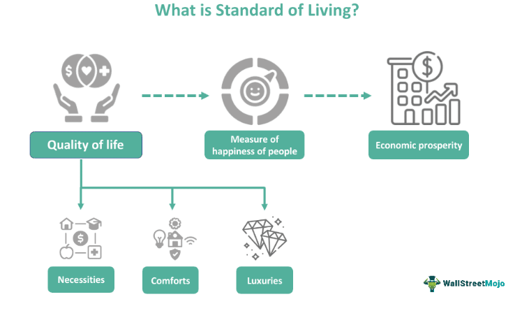

## Table of Contents

## What is the standard of living?

The standard of living is a measure of the level of comfort, wealth, and material goods available to a person or group of people in a certain area. It includes things like income, the quality of housing, access to healthcare, education, and other basic needs. It helps us understand how well people are doing in a community or country.

Different places can have different standards of living. For example, a country with a high standard of living usually has good healthcare, safe homes, and good schools. On the other hand, a country with a low standard of living might struggle with poverty, poor healthcare, and limited access to education. Governments and organizations often work to improve the standard of living for their people by creating better jobs, improving services, and reducing poverty.

## Why is measuring the standard of living important?

Measuring the standard of living is important because it helps us understand how well people are doing in different places. When we know the standard of living, we can see if people have enough money, good homes, and access to healthcare and education. This information helps governments and organizations make better decisions about where to focus their efforts to help people live better lives.

For example, if a country has a low standard of living, leaders might decide to build more schools or hospitals to improve education and health. By tracking changes in the standard of living over time, we can also see if these efforts are working. This way, we can keep improving the quality of life for everyone, making sure that people have what they need to live comfortably and happily.

## What are the common indicators used to measure the standard of living?

Common indicators used to measure the standard of living include income, which shows how much money people have to spend on things they need and want. Another important indicator is life expectancy, which tells us how long people are expected to live. This can show how good healthcare and living conditions are in a place. Gross Domestic Product (GDP) per capita is also used, which measures the total value of goods and services produced in a country divided by the number of people living there. This gives an idea of the average wealth of the country.

Other indicators include the Human Development Index (HDI), which combines measures of health, education, and income to give a broader picture of well-being. The poverty rate is also important because it shows what percentage of people live below a certain income level, helping us understand how widespread poverty is. Access to clean water and sanitation is another key indicator, as it directly affects health and quality of life.

Lastly, education levels are often used, looking at things like literacy rates and years of schooling. Employment rates and the quality of jobs available also matter, as they show how many people have work and how good those jobs are. By looking at all these indicators together, we can get a good idea of the standard of living in a place and see where improvements might be needed.

## How does GDP per capita relate to the standard of living?

GDP per capita is a way to measure how rich a country is by looking at the total value of all the goods and services it makes in a year and dividing it by the number of people living there. This number can tell us about the standard of living because it shows how much money, on average, each person has to spend on things they need and want. If a country has a high GDP per capita, it usually means that people there have more money to buy things like good food, nice homes, and healthcare, which can make their lives better.

However, GDP per capita is not perfect for measuring the standard of living. It doesn't tell us everything about how people live. For example, it doesn't show if the wealth is shared fairly among everyone or if only a few people have most of the money. Also, it doesn't tell us about things like how safe people feel, how good their schools are, or if they have clean water to drink. So, while GDP per capita can give us a good starting point to understand the standard of living, we need to look at other things too to get the full picture.

## What role does the Human Development Index (HDI) play in measuring living standards?

The Human Development Index (HDI) is a special tool that helps us measure how well people are living in different countries. It looks at three important things: how healthy people are, how much education they have, and how much money they make. By combining these three things, the HDI gives us a bigger picture of how good life is for people, not just how much money they have. This is important because having a lot of money doesn't always mean people are happy or healthy.

For example, a country might have a high GDP per capita, meaning people have a lot of money, but if they don't have good schools or hospitals, their HDI score might not be as high. The HDI helps us see if countries are doing a good job at making sure everyone has what they need to live a good life. It's a helpful way for governments and organizations to see where they need to focus their efforts to make life better for everyone.

## Can you explain the Gini coefficient and its relevance to living standards?

The Gini coefficient is a number that helps us understand how evenly money is shared among people in a country. It goes from 0 to 1, where 0 means everyone has the same amount of money, and 1 means one person has all the money and everyone else has nothing. A lower Gini coefficient shows that the money is more evenly spread out, while a higher number means some people have a lot more money than others.

This number is important for understanding living standards because when money is shared more evenly, more people can afford things like good food, safe homes, and healthcare. If a few people have most of the money, many others might struggle to meet their basic needs, which can lower the overall standard of living. By looking at the Gini coefficient, we can see if a country needs to work on making sure everyone has a fair chance to live a good life.

## How do life expectancy and education levels influence the standard of living?

Life expectancy is a big part of the standard of living because it shows how long people are expected to live. If a country has a high life expectancy, it usually means that people there have good healthcare and live in safe, healthy places. When people live longer, they can enjoy their lives more and have more time to do things they love, like spending time with family or working on hobbies. This makes life better overall. On the other hand, if life expectancy is low, it might mean that people don't have good healthcare or face other problems that make their lives shorter and harder.

Education levels also play a big role in the standard of living. When people get a good education, they can get better jobs that pay more money. This means they can afford nicer homes, better food, and healthcare, which all make life more comfortable and enjoyable. Education also helps people make smart choices about their health and money, which can lead to a longer, happier life. If a country has low education levels, people might struggle to find good jobs and improve their lives, which can lower the overall standard of living.

## What are some qualitative factors that affect the standard of living?

Qualitative factors that affect the standard of living are things that we can't measure with numbers but still make a big difference in how good life feels. One important qualitative [factor](/wiki/factor-investing) is happiness. When people feel happy, they enjoy their lives more, even if they don't have a lot of money. Things like having friends, feeling safe, and enjoying nature can all make people happier. Another factor is the sense of community. When people feel connected to others and have support from their neighbors and friends, they often feel better about their lives.

Another qualitative factor is the quality of the environment. Clean air, safe water, and green spaces make life more enjoyable and healthy. If people live in polluted areas or places without parks, it can make their lives harder and less enjoyable. Lastly, the level of freedom and rights people have is also important. When people feel free to express themselves and have their rights respected, they tend to feel more satisfied with their lives. All these qualitative factors together help shape how good life feels, even if they don't show up in numbers like income or life expectancy.

## How do different countries' standards of living compare using various metrics?

Different countries have different standards of living, and we can compare them using various metrics like income, life expectancy, and education levels. For example, countries like Norway, Switzerland, and Australia often have high standards of living because they have high incomes, good healthcare, and strong education systems. In these countries, people generally live longer and have more money to spend on things they need and want. On the other hand, countries like Burundi, Central African Republic, and Malawi might have lower standards of living because many people there have less money, shorter life expectancies, and fewer opportunities for education.

When we look at the Human Development Index (HDI), which combines health, education, and income, we see similar patterns. Countries with high HDI scores, like those in Western Europe and North America, tend to have better living conditions overall. However, the Gini coefficient, which measures income inequality, can show a different side of the story. For instance, a country might have a high average income but a high Gini coefficient, meaning that wealth is not shared evenly. This can affect the standard of living for many people, even in rich countries. By looking at these different metrics together, we get a fuller picture of how people live in different places around the world.

## What are the limitations of current methods used to measure the standard of living?

Current methods to measure the standard of living, like GDP per capita and the Human Development Index (HDI), have some limitations. One big problem is that they mostly focus on things we can measure with numbers, like income and life expectancy. But they don't tell us about how happy people are or how safe they feel. These things are important for a good life, but they are hard to measure. Also, these methods don't always show if wealth is shared fairly. A country might have a high average income, but if only a few people have most of the money, many others might still struggle.

Another issue is that these methods can be affected by things like how prices change over time or how much things cost in different places. For example, the same amount of money might buy a lot more in one country than in another. This makes it hard to compare standards of living across countries. Also, these measures might not capture the quality of services like healthcare and education. Just because a country spends a lot on these things doesn't mean they are good. So, while these methods give us some good information, they don't tell the whole story about how people live.

## How have standards of living changed globally over the past century?

Over the past century, the standard of living has improved a lot in many parts of the world. In the early 1900s, many people lived without things we take for granted today, like electricity, clean water, and good healthcare. As time went on, countries got richer and started to build better schools and hospitals. This meant that people could live longer and have more money to spend on things they needed and wanted. For example, in many developed countries, life expectancy went up a lot, and more people could go to school and get good jobs.

However, the improvements have not been the same everywhere. In some places, especially in poorer countries, the standard of living has not improved as much. Many people in these countries still struggle with poverty, bad healthcare, and not enough education. Even in richer countries, not everyone benefits equally. Some people still have a hard time getting what they need, even though the overall standard of living is higher. So while the world has made big steps forward, there is still a lot of work to do to make sure everyone can live a good life.

## What future trends might impact global standards of living?

In the future, technology will play a big role in changing the standard of living around the world. New inventions like better healthcare tools and faster ways to communicate can make life easier and healthier for people. For example, if doctors can use technology to treat diseases better, people might live longer and feel happier. Also, if more people can work from home using the internet, they might save time and money on traveling, which can improve their lives. But technology can also create problems. If only some people can use these new tools because they are too expensive, it might make life harder for others who can't afford them.

Another important trend is how the world is working to fight climate change. If we can make the air cleaner and the planet cooler, it will help everyone live better. Clean air and water make people healthier, and if we can stop big storms and floods, people's homes and lives will be safer. But if we don't stop climate change, it could make life much harder. More storms, hotter weather, and less food could lower the standard of living for many people. So, how we deal with the environment will be a big part of how good life is in the future.

Lastly, how countries work together can also change the standard of living. If rich countries help poorer ones build better schools and hospitals, more people around the world can live good lives. But if countries don't work together, some places might stay poor while others get richer. So, making sure everyone has a chance to live well will be important for the future.

## What is the importance of understanding economic indicators?

Economic indicators are critical tools for assessing the health and trajectory of an economy. They encompass a variety of statistical measures that provide insights into economic performance and future prospects. Among the most significant indicators are Gross Domestic Product (GDP), unemployment rates, inflation rates, and monetary policies. These indicators collectively offer a comprehensive view of an economy's operational status and potential future directions.

**Gross Domestic Product (GDP)** is a primary indicator used to gauge the health of a country's economy. It represents the total monetary value of all goods and services produced over a specific time period. GDP can be expressed as:

$$
\text{GDP} = C + I + G + (X - M)
$$

where $C$ is consumption, $I$ is investment, $G$ is government spending, $X$ is exports, and $M$ is imports. A rising GDP indicates economic growth, while a declining GDP may signify economic distress.

**Unemployment rates** provide insight into the labor market's health. High unemployment signals economic distress, leading to lower consumer spending and economic output. Conversely, low unemployment rates suggest a thriving economy with robust job creation. The unemployment rate is calculated using the formula:

$$
\text{Unemployment Rate} = \left( \frac{\text{Number of Unemployed}}{\text{Labor Force}} \right) \times 100 \%
$$

**Inflation rates** measure the rate at which the general level of prices for goods and services rises, eroding purchasing power. Central banks monitor inflation closely, as high inflation can lead to economic instability, while deflation can signal weak demand and economic stagnation. Inflation is typically estimated using indices like the Consumer Price Index (CPI).

Monetary policies, implemented by central banks, are designed to control money supply and interest rates in an economy. These policies aim to manage inflation, influence employment, and support economic growth. For example, lowering interest rates can stimulate borrowing and investment, while raising rates can help control inflation.

By analyzing these economic indicators, stakeholders such as investors, policymakers, and economists can identify economic cycles, such as expansion or recession. Expansion phases are characterized by increasing GDP, low unemployment, and stable inflation, often leading to improved living standards. In contrast, recession periods may involve shrinking GDP, high unemployment, and potentially deflation or high inflation, adversely affecting living conditions.

In conclusion, economic indicators are fundamental in forecasting potential growth or distress within an economy. Accurate interpretation of these indicators allows for informed decision-making regarding economic policies and investment strategies.

## References & Further Reading

[1]: Bergstra, J., Bardenet, R., Bengio, Y., & Kégl, B. (2011). ["Algorithms for Hyper-Parameter Optimization."](https://dl.acm.org/doi/10.5555/2986459.2986743) Advances in Neural Information Processing Systems 24.

[2]: ["Advances in Financial Machine Learning"](https://www.amazon.com/Advances-Financial-Machine-Learning-Marcos/dp/1119482089) by Marcos Lopez de Prado

[3]: ["Evidence-Based Technical Analysis: Applying the Scientific Method and Statistical Inference to Trading Signals"](https://books.google.com/books/about/Evidence_Based_Technical_Analysis.html?id=jbD47VkOHAEC) by David Aronson

[4]: ["Machine Learning for Algorithmic Trading"](https://github.com/stefan-jansen/machine-learning-for-trading) by Stefan Jansen

[5]: ["Quantitative Trading: How to Build Your Own Algorithmic Trading Business"](https://github.com/LucindaYa/quant-resources/blob/master/Quantitative%20Trading%20How%20to%20Build%20Your%20Own%20Algorithmic%20Trading%20Business.pdf) by Ernest P. Chan