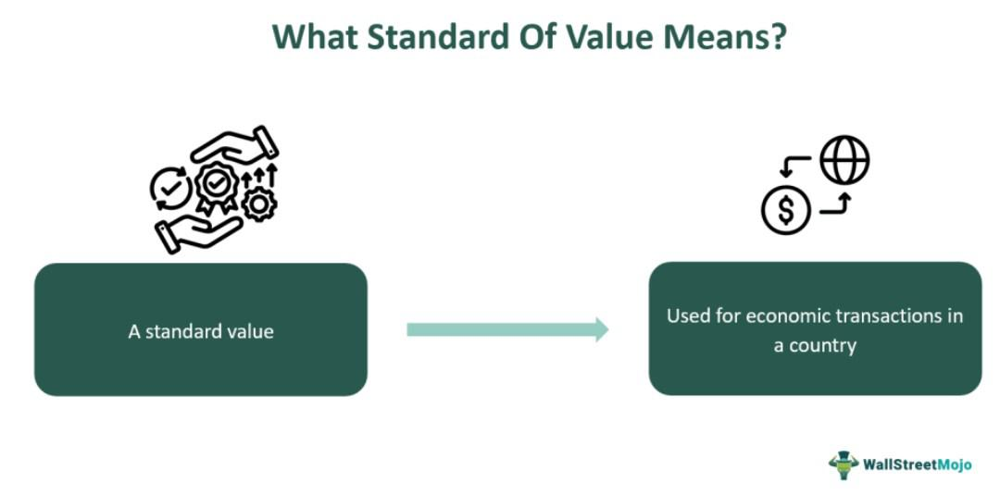

## Table of Contents

## What is the standard of value?

The standard of value is a basic concept in economics and finance that refers to a common measure used to determine the worth of goods, services, and other assets. In most countries, the standard of value is the national currency, like the dollar in the United States or the euro in the European Union. This standard helps people compare the value of different things easily. For example, if you want to know if a toy is more expensive than a book, you can compare their prices in dollars.

Using a standard of value makes economic transactions simpler and more efficient. Without a common measure, it would be hard to trade or understand the value of things. Imagine trying to trade a cow for some apples without knowing how many apples equal the value of a cow. A standard of value solves this problem by giving everything a price in the same unit, making it easier for everyone to make decisions about buying, selling, and trading.

## Why is the standard of value important in economics?

The standard of value is really important in economics because it helps everyone understand how much things are worth. Imagine if we didn't have a common way to measure value. It would be super hard to decide if trading a bike for a laptop was a good deal. By using a standard like dollars or euros, we can easily see if something is expensive or cheap compared to other things. This makes buying and selling much simpler and helps the economy run smoothly.

Also, having a standard of value helps keep prices stable over time. If everyone agrees that a dollar is worth a certain amount, businesses and people can plan better. They know how much money they'll need to buy things in the future. This stability is good for the economy because it makes people feel more confident about spending and investing. Without a standard of value, the economy could get really confusing and chaotic, which nobody wants.

## How does the standard of value differ from other economic concepts like medium of exchange and unit of account?

The standard of value is different from a medium of exchange and a unit of account, even though they all help make economic activities easier. The standard of value is about having a common way to measure how much things are worth. For example, if you want to know if a toy is more expensive than a book, you use dollars or euros to compare their prices. This common measure helps everyone understand value in the same way.

A medium of exchange, on the other hand, is something people use to trade goods and services. Instead of bartering, like trading a cow for apples, you use money. Money is easy to carry and divide, making trading much simpler. The unit of account is closely related to the standard of value but focuses on keeping track of debts and financial records. For example, when you buy something on credit, the price is recorded in dollars or euros, which is the unit of account. This helps businesses and people keep clear financial records.

So, while the standard of value helps measure worth, the medium of exchange makes trading easier, and the unit of account helps keep financial records straight. All three are important and work together to make the economy run smoothly, but they each have their own special job.

## What are some historical examples of standards of value?

In the past, different things were used as standards of value. One famous example is gold. Many countries used the gold standard, which means the value of their money was based on how much gold they had. For example, in the United States, one dollar was worth a certain amount of gold. This made it easy for people to understand the value of money because they knew it was tied to something valuable like gold. The gold standard was used by many countries until the 20th century.

Another historical standard of value was silver. Some countries used the silver standard, where the value of money was based on silver. For example, in China, the value of money was often measured in silver taels. Just like with gold, using silver as a standard helped people understand how much their money was worth because it was tied to something everyone agreed was valuable. Both gold and silver standards helped make trading and understanding value easier in different parts of the world.

## How has the concept of standard of value evolved over time?

The concept of standard of value has changed a lot over time. In the old days, people used things like gold and silver to measure value. For example, many countries used the gold standard, which meant their money was worth a certain amount of gold. This helped everyone understand how much their money was worth because it was tied to something valuable. But using gold and silver had problems. Sometimes there wasn't enough gold or silver to go around, which could make the economy unstable.

Over time, countries moved away from using gold and silver and started using their own currencies as the standard of value. Today, most countries use their national currency, like the dollar in the United States or the euro in Europe, as the standard of value. This makes it easier to buy and sell things because everyone agrees on what the money is worth. The change to using national currencies has helped make economies more stable and easier to manage. But it also means that the value of money can change based on what's happening in the economy, which is something people have to keep an eye on.

## What are the criteria for an effective standard of value?

An effective standard of value needs to be widely accepted by people. If everyone agrees that something, like a dollar, is a good way to measure value, then it works well. It should also be easy to use. That means it should be simple for people to understand and use when they're buying, selling, or trading things. If a standard of value is too hard to understand or use, then it won't be very effective.

Another important thing is that the standard of value should be stable. This means its value shouldn't change too much over time. If people know that a dollar will be worth about the same next week as it is today, they can plan better. They'll feel more confident about spending and saving. If the value changes a lot, it can make the economy feel unpredictable and hard to navigate.

## How do different currencies function as standards of value?

Different currencies, like the dollar or the euro, work as standards of value by giving everything a price in that currency. This makes it easy for people to understand how much things are worth and to compare the prices of different items. For example, if you want to know if a toy is more expensive than a book, you can look at their prices in dollars. Because everyone in a country uses the same currency, it helps make buying and selling simpler and more efficient.

Currencies also help keep the economy stable. When people agree that a dollar is worth a certain amount, it makes planning easier. Businesses and people can predict how much money they'll need in the future. This stability makes people feel more confident about spending and investing. However, the value of a currency can change because of things like inflation or economic policies, which means people always need to keep an eye on how much their money is worth.

## What role does inflation play in affecting the standard of value?

Inflation is when the prices of things go up over time, which means the value of money goes down. If you have a dollar today, it might not buy as much stuff next year because of inflation. This can make the standard of value, like the dollar, less stable. When people see that their money is worth less, they might spend it faster or ask for higher wages, which can make prices go up even more.

But inflation isn't always bad. A little bit of inflation can be good for the economy because it encourages people to spend and invest rather than just saving their money. However, if inflation gets too high, it can make it hard for people to plan because they don't know how much their money will be worth in the future. This can make the standard of value less reliable and cause problems in the economy.

## How do standards of value impact international trade and finance?

Standards of value are super important for international trade and finance because they help countries understand how much things are worth in different parts of the world. When countries use different currencies, like dollars and euros, they need a way to compare these currencies to know how much their goods and services are worth in other countries. This is where exchange rates come in. Exchange rates show how much one currency is worth compared to another. For example, if one dollar can buy two euros, then businesses and people can figure out how much their products cost in different countries. This makes trading easier because everyone can understand the value of what they're buying or selling.

But standards of value can also cause problems in international trade and finance. If the value of a country's currency changes a lot, it can make it harder for businesses to plan and trade. For example, if the dollar gets weaker compared to the euro, then things made in the U.S. might become cheaper for people in Europe, which could help U.S. businesses sell more. But it also means that U.S. companies might have to pay more for things they buy from Europe. So, having a stable standard of value is really important for keeping international trade and finance running smoothly.

## What are the challenges in maintaining a stable standard of value?

Keeping a standard of value stable can be tough because lots of things can make the value of money change. One big challenge is inflation. When prices go up, the value of money goes down, and people might start spending their money faster or asking for more pay. This can make prices go up even more, which makes it hard for people and businesses to plan. Another challenge is what's happening in the world economy. If other countries' currencies change a lot, it can affect the value of a country's own money. For example, if the dollar gets weaker compared to the euro, it can make things more expensive for people in the U.S. who want to buy stuff from Europe.

Another challenge is keeping people's trust in the money. If people start to think that their money won't be worth as much in the future, they might not want to use it as much. This can make the economy unstable. Governments and central banks try to keep the value of money stable by setting interest rates and controlling how much money is in the economy. But it's a tricky balancing act because they have to make sure they're not causing too much inflation or making the economy slow down too much. Keeping a stable standard of value is important for a healthy economy, but it's not easy to do.

## How do cryptocurrencies challenge traditional standards of value?

Cryptocurrencies like Bitcoin challenge traditional standards of value because they're not controlled by any government or bank. Instead, they use something called blockchain technology, which is like a big, public record book that everyone can see. This means that the value of cryptocurrencies can change a lot based on what people think they're worth, rather than being tied to a country's economy or gold like traditional money. This makes them more unpredictable, which can be both exciting and scary for people who want to use them.

Another way cryptocurrencies challenge traditional standards of value is by making it easier to send money across borders without needing banks. Traditional money, like dollars or euros, can be hard to use in other countries because of exchange rates and fees. But with cryptocurrencies, you can send money to anyone, anywhere, without worrying about those things. This could change how people think about and use money, making the world of finance more open and connected. But it also means that the rules and stability we're used to with traditional money might not apply in the same way.

## What future trends might influence the concept and application of the standard of value?

In the future, technology could change how we think about and use the standard of value. One big trend might be the use of digital currencies, like cryptocurrencies, becoming more common. These digital currencies aren't controlled by any government or bank, which means their value can change a lot based on what people think they're worth. This could make the standard of value more unpredictable but also more flexible. Another trend could be the use of smart contracts, which are like digital agreements that automatically do things when certain conditions are met. This could make buying and selling things easier and more secure, changing how we use money as a standard of value.

Another trend that might affect the standard of value is the growing use of data and AI in finance. With more data, businesses and governments could better predict and control inflation, making the standard of value more stable. AI could also help create new ways to measure value, like using a person's online activity or reputation as a form of currency. These changes could make the standard of value more personalized and dynamic, but they might also raise questions about privacy and fairness. As these trends develop, the way we understand and use the standard of value could change a lot, making the world of money and finance more complex and interesting.

## References & Further Reading

[1]: ["The Gold Standard in Theory and History"](https://www.taylorfrancis.com/books/edit/10.4324/9780203978870/gold-standard-theory-history-barry-eichengreen-marc-flandreau) by Barry Eichengreen and Marc Flandreau

[2]: ["Currency Wars: The Making of the Next Global Crisis"](https://archive.org/details/currencywarsmaki0000rick) by James Rickards

[3]: ["Money: The Unauthorized Biography—From Coinage to Cryptocurrencies"](https://www.amazon.com/Money-Unauthorized-Biography-Coinage-Cryptocurrencies/dp/0345803558) by Felix Martin

[4]: ["Algorithmic and High-Frequency Trading"](https://www.amazon.com/Algorithmic-High-Frequency-Trading-Mathematics-Finance/dp/1107091144) by Álvaro Cartea, Sebastian Jaimungal, and José Penalva

[5]: ["Flash Boys: A Wall Street Revolt"](https://en.wikipedia.org/wiki/Flash_Boys) by Michael Lewis

[6]: ["History of the International Monetary System"](https://efinancemanagement.com/international-financial-management/international-monetary-system) by Barry Eichengreen and Peter B. Kenen

[7]: ["Trading and Exchanges: Market Microstructure for Practitioners"](https://www.amazon.com/Trading-Exchanges-Market-Microstructure-Practitioners/dp/0195144708) by Larry Harris