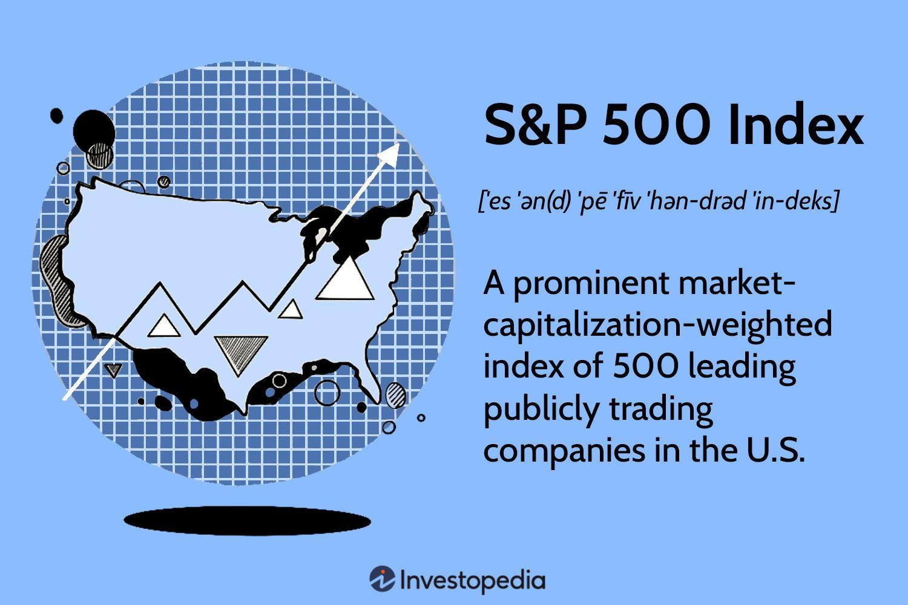

## Table of Contents

## What is the Standard & Poor's 500 Index?

The Standard & Poor's 500 Index, often called the S&P 500, is a stock market index that measures the stock performance of 500 large companies listed on stock exchanges in the United States. It is one of the most widely followed equity indices, providing a broad look at how the U.S. stock market is doing. The companies in the S&P 500 are chosen because they are big, important, and represent many different parts of the economy, like technology, healthcare, and finance.

Investors and financial experts use the S&P 500 to see how the overall market is performing. If the S&P 500 goes up, it usually means the market is doing well, and if it goes down, the market might be struggling. Many people also use it as a benchmark to compare their own investments. For example, if someone's investment portfolio is doing better than the S&P 500, they might think they are making good investment choices.

## How is the S&P 500 Index calculated?

The S&P 500 Index is calculated using a method called market capitalization weighting. This means that the bigger a company is, the more it affects the index's value. Imagine a company's size is like the weight of a fruit in a basket. If you have a big watermelon and a small grape, the watermelon will make the basket weigh a lot more than the grape. In the S&P 500, the "watermelon" companies have a bigger impact on the index than the "grape" companies.

To figure out the index's value, you start by finding the total market value of all 500 companies. This is done by multiplying the number of shares each company has by the price of each share. Then, you add up all these values. After that, you divide this big total by a special number called the divisor. The divisor is adjusted over time to keep the index fair and accurate, even when companies are added or removed, or when they do things like stock splits. This process gives you the current value of the S&P 500 Index.

## What types of companies are included in the S&P 500?

The S&P 500 includes companies from many different parts of the economy. This means it has companies that make things like cars and computers, companies that provide services like health care and banking, and companies that sell things like food and clothes. By including companies from so many areas, the S&P 500 gives a good overall picture of how the U.S. economy is doing.

All the companies in the S&P 500 are big and important. They are chosen because they are leaders in their industries and have a lot of influence. This makes the S&P 500 a good way to see how the biggest and most powerful companies in the U.S. are doing.

## How often is the S&P 500 Index updated?

The S&P 500 Index is updated all the time during the trading day. As soon as the stock prices of the companies in the index change, the value of the S&P 500 changes too. This happens every second the stock market is open, so you can see the latest value of the S&P 500 whenever you want during trading hours.

The companies that make up the S&P 500 can change, but this doesn't happen very often. The people who manage the index look at it every now and then to see if they should add new companies or take out old ones. This usually happens a few times a year, but it's not something that changes every day like the index's value does.

## What is the significance of the S&P 500 in the financial markets?

The S&P 500 is very important in the financial markets because it shows how the biggest and most important companies in the U.S. are doing. It's like a report card for the stock market. People who invest money, like to check the S&P 500 to see if their investments are doing well compared to the overall market. If the S&P 500 goes up, it usually means the market is doing well, and if it goes down, the market might be struggling. This helps investors decide when to buy or sell stocks.

The S&P 500 also helps people understand the economy. Since it includes companies from many different parts of the economy, it gives a good picture of how the whole country is doing. For example, if companies in the S&P 500 that make cars are doing well, it might mean people are buying more cars. This can tell us about how people are spending their money and how the economy is growing. So, the S&P 500 is not just a number; it's a tool that helps us see the bigger picture of the U.S. economy.

## How does the S&P 500 Index differ from other major indices like the Dow Jones Industrial Average?

The S&P 500 and the Dow Jones Industrial Average are both important stock market indices, but they are different in a few key ways. The S&P 500 includes 500 large companies from many different parts of the U.S. economy, like technology, health care, and finance. This makes it a good way to see how the whole market is doing. The Dow Jones Industrial Average, on the other hand, only includes 30 big companies. These companies are mostly in the industrial sector, but they also come from other areas like technology and health care. Because it has fewer companies, the Dow Jones can be more affected by how just a few companies are doing.

Another big difference is how they are calculated. The S&P 500 uses a method called market capitalization weighting. This means that bigger companies have a bigger impact on the index's value. If a big company like Apple does well, it can move the whole S&P 500 a lot. The Dow Jones, however, uses a price-weighted method. This means that companies with higher stock prices have more influence on the index, no matter how big or small the company is. So, if a company in the Dow Jones has a high stock price, it can move the index more than a company with a lower stock price, even if the high-priced company is smaller overall.

## What are the criteria for a company to be included in the S&P 500?

To be included in the S&P 500, a company must meet several important criteria. First, it must be a U.S. company, which means it is based in the United States and its stock is traded on a U.S. stock exchange. Second, the company needs to be big enough, measured by its market capitalization, which is the total value of all its shares. The S&P 500 includes the 500 largest companies in the U.S., so a company has to be among these top 500 to be considered. Lastly, the company must have enough shares available for the public to buy. This means that a large portion of the company's stock must be owned by investors, not just by the company's founders or a few big shareholders.

Another important [factor](/wiki/factor-investing) is that the company should be profitable. The S&P 500 looks for companies that have made money in the last four quarters, which shows they are doing well financially. Also, the company should represent a part of the economy that is not already too heavily represented in the index. This helps make sure the S&P 500 includes a good mix of companies from different industries. The people who manage the S&P 500 look at all these things carefully to decide which companies to include.

## How has the S&P 500 performed historically?

The S&P 500 has had a lot of ups and downs over the years, but overall, it has grown a lot. If you look at the long-term, the S&P 500 has gone up by about 10% a year on average, counting both the rise in stock prices and the money paid out as dividends. This means that if you had put money into the S&P 500 a long time ago, it would be worth a lot more now. But, it's not always a smooth ride. There have been times when the S&P 500 has dropped a lot, like during the Great Depression in the 1930s, the dot-com bubble burst in the early 2000s, and the financial crisis in 2008. These big drops can be scary, but the S&P 500 has always come back and kept growing over time.

Even though the S&P 500 has had some rough patches, it has shown that it can recover and keep going up. For example, after the big drop in 2008, it took several years, but the S&P 500 eventually reached new highs. This shows that the U.S. economy and the big companies in it can be strong and resilient. It's important to remember that while the S&P 500 can go down, it has a history of coming back and growing over the long term. This is why many people think of it as a good place to invest their money for the future.

## What are some investment vehicles that track the S&P 500?

One common way to invest in the S&P 500 is through index funds. These funds are designed to match the performance of the S&P 500 by holding the same stocks in the same proportions. When you buy shares of an S&P 500 index fund, you're basically buying a tiny piece of all 500 companies in the index. This makes it easy to invest in the whole U.S. market without having to pick individual stocks. Some popular S&P 500 index funds are offered by companies like Vanguard and Fidelity.

Another way to invest in the S&P 500 is through exchange-traded funds (ETFs). ETFs are similar to index funds but they trade on stock exchanges like individual stocks. The most well-known S&P 500 [ETF](/wiki/etf-trading-strategies) is the SPDR S&P 500 ETF Trust, often called SPY. When you buy shares of an S&P 500 ETF, you're also getting a piece of all the companies in the index. ETFs can be bought and sold throughout the trading day, which gives you more flexibility than index funds, which are usually bought or sold at the end of the trading day.

Both index funds and ETFs are popular because they offer a simple and low-cost way to invest in the S&P 500. They help spread out the risk because you're not betting on just one company, but on the whole market. Over time, this can lead to steady growth, making them a good choice for people who want to invest for the long term.

## How can investors use the S&P 500 to gauge market performance?

Investors can use the S&P 500 to see how the overall stock market is doing. Since the S&P 500 includes 500 of the biggest and most important companies in the U.S., it gives a good idea of how the whole market is performing. If the S&P 500 goes up, it usually means that many of these big companies are doing well, and the market is strong. If it goes down, it might mean that the market is struggling, and investors might want to be more careful.

Investors also use the S&P 500 as a benchmark to compare their own investments. If someone's investment portfolio is doing better than the S&P 500, they might think they are making smart investment choices. On the other hand, if their investments are not keeping up with the S&P 500, they might need to rethink their strategy. This helps investors make decisions about when to buy or sell stocks and how to manage their money.

## What are the risks associated with investing in S&P 500 index funds?

Investing in S&P 500 index funds is generally seen as a safe way to invest in the stock market, but there are still some risks to think about. One big risk is that the whole market can go down. If the S&P 500 drops a lot, like it did during the financial crisis in 2008, your investment will lose value too. This can be scary, especially if you need the money soon. Another risk is that the S&P 500 might not grow as fast as you hope. Even though it has gone up by about 10% a year on average over the long term, there can be years when it doesn't grow at all, or even goes down.

Another thing to consider is that the S&P 500 is made up of big companies, and sometimes smaller companies can grow faster. If you only invest in the S&P 500, you might miss out on these opportunities. Also, while index funds are usually low-cost, there are still some fees to pay, and these can add up over time. It's important to understand these fees and how they might affect your returns. Overall, while investing in S&P 500 index funds can be a good way to grow your money over time, it's not without risks, and you should think carefully about how it fits into your overall investment plan.

## How do changes in the S&P 500 composition affect the market?

When a company is added to or removed from the S&P 500, it can cause some big changes in the market. If a company gets added to the S&P 500, it usually means more people want to buy its stock. This is because many investors have money in S&P 500 index funds, and those funds need to buy the new company's stock to keep matching the index. This extra demand can make the stock price go up a lot in a short time. On the other hand, if a company gets taken out of the S&P 500, people might sell its stock because the index funds have to get rid of it. This can make the stock price go down.

These changes can also affect other parts of the market. When a new company is added, it might take money away from other stocks because investors are putting their money into the new S&P 500 member. This can cause some other stock prices to go down a bit. Also, the overall value of the S&P 500 might change because the new company might be bigger or smaller than the one it replaced. So, even though the S&P 500 is meant to show how the market is doing, changes in what companies are in it can shake things up a bit.

## What is the S&P 500 and how can it be understood?

The S&P 500 is a prominent stock market index that provides insights into the performance of the U.S. equity market by encompassing a diverse array of industries. As a critical barometer of the U.S. economy's health, the index captures the market sentiment through its comprehensive structure and selection criteria.

Characterized by its market capitalization-weighted methodology, the S&P 500 ensures substantial coverage of the U.S. equities market, representing approximately 75% of it. Market capitalization weighting involves assigning a weight to each component company based on its market cap relative to the total market cap of all the companies in the index. The formula for calculating the index level involves the sum of the float-adjusted market cap of all index components divided by the index divisor, which maintains continuity in case of corporate actions:

$$
\text{Index Level} = \frac{\Sigma (\text{Current Market Cap of Company}_i)}{\text{Index Divisor}}
$$

Inclusion in the S&P 500 necessitates adherence to specific criteria. Companies selected must primarily be U.S.-based, and crucial requirements include a minimum market capitalization, which ensures the index accurately reflects the large-cap market segment. As of recent updates, companies typically need a market capitalization of at least $14.6 billion for eligibility. Another essential requirement is the public float, where a specified percentage of shares must be publicly available for trading, facilitating market [liquidity](/wiki/liquidity-risk-premium) and accurate price reflection. Companies must also demonstrate financial viability through the presentation of positive earnings over a specified period, typically four consecutive quarters, ensuring that only financially stable entities are represented.

Overall, the S&P 500's design as a market-cap-weighted index, along with its rigorous inclusion criteria, allows it to provide a reliable snapshot of the U.S. stock market's overall sentiment and the broader economic landscape.

## What are the mechanics of the S&P 500's calculation?

The calculation of the S&P 500 index is central to its role as a benchmark for U.S. equities, employing a float-adjusted market capitalization methodology. This approach accounts for only the shares that are available to the public for trading, excluding those held by insiders or controlling entities that are less likely to be sold. Consequently, the index effectively captures the investable value of its constituent companies and provides an accurate representation of their market impact.

The float-adjusted market capitalization of each company in the S&P 500 is calculated by taking the company's stock price and multiplying it by the number of shares available for public trading. Specifically, the calculation follows the formula:

$$
\text{Float-adjusted Market Cap} = \text{Stock Price} \times \text{Public Float Shares}
$$

The individual market caps are then summed across all 500 companies to derive the total market cap of the index. Changes in this aggregate value due to stock price fluctuations are reflected in the index's value, offering a real-time snapshot of market sentiment.

Adjustments to the index are necessary to maintain its consistency over time, particularly in response to corporate actions like mergers, acquisitions, stock splits, and spinoffs. Such events can significantly alter the market capitalization of a company, and thereby the index. To account for these, the S&P 500 uses an index divisor, an arbitrary number that is adjusted to ensure continuity of the index value before and after these changes.

When a company in the index undergoes a corporate action, an adjustment is made to the index divisor using the formula:

$$
\text{New Divisor} = \frac{\text{Initial Value of Index} \times \text{Old Divisor}}{\text{New Value of Index}}
$$

This practice ensures that the daily movements of the index are purely a reflection of market changes rather than distortions from stock adjustments. By maintaining a stable divisor, the index computation remains an equitable measure for stakeholders.

Overall, the meticulous mechanism of the S&P 500 calculation provides investors with reliable and accurate data that reflects current market conditions, crucial for making informed investment decisions.

## References & Further Reading

1. **Books and Publications:**
   - **"Algorithmic Trading: Winning Strategies and Their Rationale" by Ernest P. Chan**: This book explores various algorithmic trading strategies, providing insight into the underlying rationales and offering practical guidance for their implementation.
   - **"Quantitative Finance for Dummies" by Steve Bell**: This book offers a comprehensive overview of key quantitative finance concepts, including algorithmic trading strategies applied to indices like the S&P 500.
   - **"Introduction to Machine Learning in Finance" by Yves Hilpisch**: It covers how machine learning techniques can be applied to financial data, enhancing the effectiveness of algorithmic trading strategies.

2. **Academic Papers:**
   - **"High-Frequency Trading and Price Discovery" by Jonathan Brogaard, Terrence Hendershott, and Ryan Riordan**: This paper examines the role of high-frequency trading in the price discovery process in financial markets, including its impact on the S&P 500 Index.
   - **"The Effects of Algorithmic Trading on Market Quality: Evidence from the S&P 500" by Ekkehart Boehmer, Kingsley Y. L. Fong, and Juan (Julie) Wu**: It analyzes how algorithmic trading affects market quality, emphasizing its interaction with the liquidity and volatility of the S&P 500.

3. **Financial Reports and Analyses:**
   - **S&P Dow Jones Indices' "S&P 500 Annual Reports"**: These reports provide detailed analyses of the index's performance and methodological adjustments, essential reading for understanding its dynamics.
   - **"The Impact of Algorithmic Trading on Market Liquidity" by CFA Institute Research Foundation**: This report explores the implications of algorithmic trading on market liquidity, addressing both benefits and risks.

4. **Online Resources and Websites:**
   - **Investopedia's Algorithmic Trading Section**: Offers an accessible guide to the principles and practices of algorithmic trading, including useful strategies for engaging with indices like the S&P 500.
   - **QuantInsti Blog**: Provides articles and tutorials on algorithmic trading, including case studies and Python code snippets for implementing specific strategies aimed at indices like the S&P 500.

5. **Suggested Journals for Continued Learning:**
   - **Journal of Finance**: Publishes significant research across areas of finance, including empirical and theoretical studies related to algorithmic trading.
   - **Journal of Financial Markets**: Offers insights into the dynamics of financial markets, with articles covering topics such as market structure and trading strategies. 

For ongoing learning, these resources provide diverse perspectives on [algorithmic trading](/wiki/algorithmic-trading) and the S&P 500, offering valuable insights into both theoretical frameworks and practical applications.

