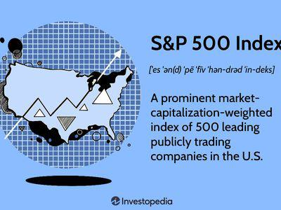

Standard & Poor's (S&P) indices and credit ratings are fundamental components of the financial landscape, serving as benchmarks and measures of creditworthiness, respectively. S&P, a leading financial services company, provides indices such as the S&P 500, which represents the performance of 500 large companies listed on stock exchanges in the United States. These indices are used by investors worldwide as indicators of market trends and economic health, forming the basis for various financial products and investment strategies.

Credit ratings, on the other hand, assess the creditworthiness of issuers, including governments and corporations, helping investors evaluate the risk associated with debt securities. S&P's credit ratings range from 'AAA,' denoting the highest level of creditworthiness, to 'D,' indicating default. These ratings are crucial for determining interest rates and investment decisions, influencing the cost and accessibility of capital for issuers.



In recent years, there has been a growing trend towards algorithmic trading, or algo trading, which involves using computer algorithms to execute trades based on predefined criteria. This approach has gained popularity due to its ability to process vast amounts of data, execute trades at high speed, and reduce human error. Algo trading leverages data from indices and credit ratings to make informed trading decisions, enhancing market efficiency and liquidity.

Understanding the intersection of S&P indices, credit ratings, and algorithmic trading is key to comprehending modern financial markets. The integration of these elements allows for sophisticated trading strategies that capitalize on market movements and credit information, offering both opportunities and challenges for investors and financial institutions alike.

## Table of Contents

## Understanding Standard & Poor's Indices

Standard & Poor's (S&P) has established itself as a leading financial services company, with a history spanning over a century. Founded in 1860 by Henry Varnum Poor as a publishing company that provided financial [statistics](/wiki/bayesian-statistics) on US companies, S&P has evolved significantly. It became part of McGraw Hill Financial in 1966, which was later rebranded as S&P Global in 2016. Today, S&P Global provides essential insights into the financial markets, offering a range of indices and credit ratings.

Central to S&P's influence are its market indices, which serve as benchmarks and tools for investors globally. Among these, the S&P 500, S&P MidCap 400, and S&P SmallCap 600 are the most prominent:

1. **S&P 500**: Launched in 1957, the S&P 500 is one of the most widely followed equity indices. It includes 500 of the largest publicly traded companies in the United States, serving as a representation of the US stock market's performance. The index is market-capitalization-weighted, meaning the index components are weighted according to their total market capitalization. The calculation of the S&P 500 index value involves dividing the sum of the market caps of all 500 companies by a divisor, which is adjusted for changes like stock splits or company substitutions. This index provides a comprehensive snapshot of the overall economic health and investor sentiment.

2. **S&P MidCap 400**: This index captures the performance of mid-sized companies, representing a segment of the market that falls between the larger firms of the S&P 500 and the smaller firms represented by the S&P SmallCap 600. The S&P MidCap 400 includes 400 companies and offers insights into the growth potential of mid-sized businesses that might not be as visible in broader indices like the S&P 500. Like the S&P 500, this index is also weighted by market capitalization, reflecting the sizes of the included entities.

3. **S&P SmallCap 600**: Completing the suite of major S&P indices is the S&P SmallCap 600, which targets smaller, less capitalized companies. This index provides exposure to an important area of the market indicative of entrepreneurial growth and business innovation. It includes 600 companies and, similar to the other indices, it is market-cap-weighted.

The construction of these indices is a meticulous process. Companies are selected based on criteria such as market capitalization, [liquidity](/wiki/liquidity-risk-premium), and sector classification. The goal is to ensure each index accurately reflects the specific segment of the market it represents. These indices are rebalanced regularly to maintain their accuracy as market conditions change.

In the stock market, S&P indices are crucial for several reasons. They serve as performance benchmarks for a wide range of investments, from mutual funds to exchange-traded funds (ETFs). Investors often use these indices to gauge the health of specific market sectors or the economy as a whole. Furthermore, they provide a foundation for index-linked investment products, allowing investors to simulate holding a diversified portfolio that mimics the index's performance.

Overall, S&P's indices play a pivotal role in shaping investment strategies and driving market analysis, providing a standard against which global investors measure their investments.

## Decoding Credit Ratings

Credit ratings are assessments provided by credit rating agencies that evaluate the creditworthiness of an issuer, which can be a corporation, government, or other types of entities. They inform investors about the risk involved in investing in a particular financial instrument, such as bonds. Ratings influence the [interest rate](/wiki/interest-rate-trading-strategies) an issuer may need to pay and can significantly affect borrowing costs and investment attractiveness. 

### Significance of Credit Ratings for Investors

Investors rely on credit ratings to make informed decisions. A higher credit rating typically suggests a lower risk of default, potentially translating into lower yields for investors, while lower-rated securities might offer higher yields due to higher associated risks. Credit ratings serve as a quick reference to understand the financial health and risk profile of an investment, influencing portfolio management strategies and risk assessment.

### S&P's Credit Ratings Methodology

Standard & Poor's, a leading credit rating agency, employs a comprehensive methodology to assign these ratings. S&P's process involves an analysis of both quantitative and qualitative factors. Quantitatively, it assesses financial ratios, earnings patterns, debt levels, and other fiscal parameters. Qualitatively, it considers business environment, industry position, regulatory context, and management competencies. 

S&P categorizes credit ratings using a letter-based system ranging from 'AAA' to 'D':

- **AAA**: Represents an entity with a very strong capacity to meet financial commitments.
- **AA**, **A**: Indicate higher grades with robust, albeit varying degrees, of financial stability.
- **BBB**: The lowest investment-grade rating, suggesting adequate capacity to meet obligations but vulnerability to adverse economic conditions.
- **BB** and **below**: Denote non-investment grade or speculative grades, implying higher risk.
- **D**: Indicates default.

### Recent Trends and Methodological Changes

In recent years, S&P has made strides toward enhancing the transparency and robustness of its rating assignment process. This includes increased emphasis on environmental, social, and governance ([ESG](/wiki/esg-investing)) factors as part of their assessments. ESG evaluation aims to capture non-financial risks that could impact an issuer's credit situation. Moreover, there is a growing integration of [machine learning](/wiki/machine-learning) and [artificial intelligence](/wiki/ai-artificial-intelligence) tools to analyze vast datasets for delivering more precise and timely ratings.

Changes also include refining models to adjust for economic shifts and financial innovations, ensuring that ratings remain pertinent across various market conditions. These advancements reflect S&P's commitment to providing accurate and reliable credit assessments that adapt to dynamic financial landscapes. 

Incorporating these methodologies, S&P endeavors to offer ratings that are not only reliable indicators of credit risk but also adaptive to a rapidly transforming global economic environment.

## The Rise of Algorithmic Trading

Algorithmic trading, commonly known as algo trading, refers to the use of computer algorithms to automate the process of trading financial instruments. This method of trading has seen exponential growth in recent years, substantially transforming financial markets.

The core advantage of [algorithmic trading](/wiki/algorithmic-trading) lies in its ability to process vast amounts of market data and execute trades with remarkable speed and accuracy. Algorithms can identify trading opportunities within milliseconds, a feat unattainable by human traders. This increased efficiency minimizes per-trade costs and offers the potential for higher profit margins. The elimination of human error is another notable benefit, as algorithms follow predefined rules, reducing the impact of emotional decision-making.

Several strategies underpin algorithmic trading. One prominent strategy is [trend following](/wiki/trend-following), which involves identifying and exploiting trends in security prices. Trend-following algorithms analyze historical data to predict future movements, employing techniques such as moving averages and [momentum](/wiki/momentum) indicators.

Another widely-used strategy is [arbitrage](/wiki/arbitrage), where algorithms exploit price discrepancies across different markets or instruments. Arbitrage algorithms scan multiple exchanges or related financial products to identify and act upon these discrepancies, profiting from the price differentials.

The rise of algorithmic trading has also been fueled by advancements in technology and increased access to vast datasets. High-frequency trading ([HFT](/wiki/high-frequency-trading-strategies)), a form of algo trading, allows traders to execute a large number of orders in fractions of a second. HFT firms often leverage advanced network infrastructures, placing their servers in close proximity to exchange servers to reduce latency.

Python has become a popular programming language for developing algorithmic trading systems due to its powerful data analysis libraries such as Pandas, NumPy, and SciPy. An example of a simple moving average crossover strategy in Python might look like this:

```python
import pandas as pd

# Load historical price data
data = pd.read_csv('price_data.csv')

# Calculate moving averages
data['SMA_50'] = data['Close'].rolling(window=50).mean()
data['SMA_200'] = data['Close'].rolling(window=200).mean()

# Generate trading signals
data['Signal'] = 0
data['Signal'][50:] = np.where(data['SMA_50'][50:] > data['SMA_200'][50:], 1, -1)

# Calculate positions
data['Position'] = data['Signal'].diff()
```

In conclusion, the rise of algorithmic trading represents a paradigm shift in financial markets, driven by the quest for efficiency and the capability to process and respond to data faster than ever before. As technology continues to evolve, so too will the sophistication and prevalence of algorithmic trading strategies.

## Integrating S&P Indices and Credit Ratings into Algo Trading

Standard & Poor's (S&P) indices and credit ratings provide critical data points used in the development of sophisticated algorithmic trading strategies. These financial instruments offer valuable insights into market movements and credit risks, making them integral components of trading algorithms.

### S&P Indices as Inputs in Trading Algorithms

S&P indices, such as the S&P 500, are pivotal inputs in algorithmic trading systems. Trading algorithms leverage these indices to monitor market trends, assess broad market conditions, and identify trading opportunities. A common approach is to track the movement of an index relative to historical averages or moving averages to predict future price movements.

For instance, a simple trading algorithm might include logic similar to:

```python
import numpy as np

def moving_average(prices, window_size):
    return np.convolve(prices, np.ones(window_size)/window_size, mode='valid')

def trading_signal(prices):
    ma_10_day = moving_average(prices, 10)
    ma_30_day = moving_average(prices, 30)
    if ma_10_day[-1] > ma_30_day[-1]:
        return "Buy"
    elif ma_10_day[-1] < ma_30_day[-1]:
        return "Sell"
    else:
        return "Hold"
```

This Python code demonstrates how a simple moving average crossover strategy could be implemented to generate trading signals based on S&P index prices.

### Influence of Credit Ratings on Trading Strategies

Credit ratings are essential for assessing the creditworthiness of a corporation or government entity. They can significantly influence trading strategies by affecting the perceived risk associated with specific securities. A downgrade in the credit rating of a company, for instance, might trigger a sell order for its bonds or stocks as investors reassess risk levels. Conversely, an upgrade might prompt buy orders.

Credit ratings are often incorporated into multi-[factor](/wiki/factor-investing) models within algorithms, which may look like:

```python
def calculate_risk_adjusted_return(expected_return, credit_rating):
    risk_factor = {'AAA': 0.01, 'AA': 0.02, 'A': 0.03, 'BBB': 0.04}  # Hypothetical risk factors
    return expected_return - risk_factor.get(credit_rating, 0.05)

risk_adjusted_return = calculate_risk_adjusted_return(0.07, 'AA')  # Example usage
```

### Case Studies and Examples

1. **ETF Arbitrage**: Exchange-traded funds (ETFs) that track S&P indices provide fertile ground for algorithmic trading. Arbitrage algorithms exploit price discrepancies between the ETF and its underlying index, engaging in buy or sell orders until prices converge. 

2. **Credit Default Swaps (CDS) Trading**: Credit rating changes reflected in CDS spreads can drive trading strategies. Algorithmic trading systems analyze CDS spreads to forecast potential bond pricing adjustments following a credit rating adjustment.

3. **Volatility Trading**: S&P indices, particularly the CBOE Volatility Index (VIX), are integral to volatility trading strategies. Algorithms compute implied volatility levels from these indices to inform trading decisions across different asset classes.

These integrations highlight how S&P indices and credit ratings underpin sophisticated trading systems, constantly parsing through data to execute trades based on quantitative models and predetermined risk assessments.

## Advantages and Challenges

Incorporating Standard & Poor's (S&P) indices and credit ratings into algorithmic trading presents several advantages. One of the primary benefits is the richness of data. S&P indices like the S&P 500 offer a diversified basket of securities, providing robust input for trading algorithms designed to exploit market patterns. This diversity allows traders to create strategies that can target specific market segments, balancing risk and opportunity in a systematic manner.

Credit ratings provide critical insights into the financial health of issuers, helping algorithms assess the risk and potential return of different securities. Incorporating these ratings into trading strategies can enable more informed decision-making, allowing traders to dynamically adjust their portfolios based on changing credit risk profiles. The appeal lies in the ability to leverage both quantitative index data and qualitative credit assessments to refine and enhance trading strategies.

Despite these advantages, integrating S&P indices and credit ratings into algorithmic trading systems also entails significant challenges. Data reliability and latency are critical concerns. Real-time financial data must be accurately and quickly processed to maintain trading competitiveness, but any delay or inaccuracy can result in substantial financial losses. Additionally, integrating credit ratings into models is complex, requiring sophisticated algorithms to interpret qualitative data within the context of [quantitative trading](/wiki/quantitative-trading) frameworks.

Evaluating the impact of credit ratings changes involves intricate modeling, often necessitating advanced statistical and machine learning techniques. These models must be capable of identifying potential correlations between credit ratings and market movements while accounting for external variables that may distort these relationships.

Regulatory considerations add another layer of complexity to this integration. Algorithmic trading strategies must comply with existing financial regulations aimed at ensuring market stability and fairness. Regulatory bodies often scrutinize the use of indices and ratings in trading algorithms due to their potential impact on market dynamics. Market risk is also a prevalent concern, as algorithms that heavily rely on indices and ratings may be susceptible to systemic risks, where adverse developments in credit ratings or index performance could lead to cascading trading losses.

In conclusion, while the incorporation of S&P indices and credit ratings into algorithmic trading can significantly enhance trading strategies by providing rich and diverse data sets, it requires careful management of data reliability, latency, integration complexities, and compliance with regulatory frameworks to mitigate associated risks. Continued advancements in technology and data analytics are essential to addressing these challenges and harnessing the full potential of this approach.

## Future Trends and Innovations

The future utilization of Standard & Poor's (S&P) data in algorithmic trading is poised for significant advancement, driven by evolving trends and technological innovations. As financial markets become increasingly complex, the integration of advanced data analytics with S&P indices and credit ratings offers new strategic opportunities for traders and financial institutions.

Predictive analytics and real-time data processing are set to play a crucial role in the future of algorithmic trading. The ability to analyze vast datasets quickly and accurately can enhance decision-making processes by identifying patterns and trends that were previously undetectable. This is particularly relevant when dealing with S&P indices, where market fluctuations can be swift and substantial. The incorporation of high-frequency trading algorithms with real-time S&P data enables traders to respond instantaneously to market changes, thereby optimizing trading performance and reducing the risk of losses.

Artificial intelligence (AI) and machine learning (ML) are further transforming how algorithmic trading strategies are developed. These technologies enable the creation of dynamic models that can adapt to changing market conditions. For example, through machine learning algorithms, traders can predict future index movements by analyzing historical data trends in S&P indices. AI methodologies such as natural language processing (NLP) can also extract valuable insights from news articles and reports, assessing market sentiment and potential impacts on index performance. Python libraries like TensorFlow and scikit-learn are commonly used to build such predictive models, enhancing their effectiveness by continuously updating with new data.

One promising area of innovation is the integration of neural networks for credit risk assessment. S&P credit ratings can be dynamically incorporated into trading algorithms to forecast credit events or shifts in financial stability. By leveraging [deep learning](/wiki/deep-learning) models, these algorithms can assess complex relationships between various financial factors and predict downgrades or upgrades in credit ratings. This not only enhances risk management but also provides a strategic advantage in trading decisions.

Blockchain technology and distributed ledger systems may offer another avenue for innovation, particularly in ensuring data integrity and reducing latency issues associated with current trading platforms. By securely and efficiently managing transaction data, blockchain could streamline the assimilation and utilization of S&P data across various trading algorithms, increasing transparency and reliability.

Looking forward, regulatory technologies (RegTech) might also influence how S&P data is applied in algorithmic trading. Enhanced compliance and monitoring tools could ensure adherence to evolving financial regulations, reducing the risk of legal penalties while maintaining the integrity of trading operations. This regulatory insight, combined with S&P data, could inform more compliant and secure trading strategies.

In summary, the intersection of S&P data with emerging technologies promises to create more sophisticated and adaptive trading strategies. The continuous evolution of AI, machine learning, and other technological innovations will likely redefine the trajectory of algorithmic trading, fostering an environment where precision, speed, and strategic foresight are paramount.

## Conclusion

The article explored the integration of Standard & Poor's (S&P) indices, credit ratings, and algorithmic trading, highlighting the transformative influence this intersection holds in modern finance. S&P indices, with their comprehensive representation of different market segments, provide robust benchmarks and valuable data points. They serve as integral components in developing trading algorithms, which leverage their precision and predictive power to enhance investment decisions.

Credit ratings from S&P offer critical insights into a company's financial health and creditworthiness, influencing trading strategies by helping investors assess risk. The combination of S&P’s detailed credit assessments and index data enriches the datasets available to algorithmic traders, allowing for more nuanced and informed decision-making.

The adoption of algorithmic trading has revolutionized how financial markets operate, enhancing speed, efficiency, and reducing human errors. Algorithms that incorporate S&P indices and credit ratings can achieve improved performance, exemplifying the benefits of a data-driven approach to trading.

There are challenges to consider, such as data reliability and the need for robust models capable of integrating diverse types of financial data. The complexity of creating algorithms that correctly interpret and act upon this information remains substantial, further compounded by regulatory considerations and potential market risks.

Looking forward, continued exploration and research in this growing field are crucial. Technological innovations, particularly in artificial intelligence and machine learning, promise to further evolve algorithmic trading strategies. By leveraging these advances, the integration of S&P data with algorithmic trading can continue to drive financial technology, fostering more efficient markets and innovative investment strategies.

## References & Further Reading

[1]: Bergstra, J., Bardenet, R., Bengio, Y., & Kégl, B. (2011). ["Algorithms for Hyper-Parameter Optimization."](https://papers.nips.cc/paper/4443-algorithms-for-hyper-parameter-optimization) Advances in Neural Information Processing Systems 24.

[2]: ["Advances in Financial Machine Learning"](https://www.amazon.com/Advances-Financial-Machine-Learning-Marcos/dp/1119482089) by Marcos Lopez de Prado

[3]: ["Evidence-Based Technical Analysis: Applying the Scientific Method and Statistical Inference to Trading Signals"](https://www.amazon.com/Evidence-Based-Technical-Analysis-Scientific-Statistical/dp/0470008741) by David Aronson

[4]: ["Machine Learning for Algorithmic Trading"](https://github.com/stefan-jansen/machine-learning-for-trading) by Stefan Jansen

[5]: ["Quantitative Trading: How to Build Your Own Algorithmic Trading Business"](https://www.amazon.com/Quantitative-Trading-Build-Algorithmic-Business/dp/1119800064) by Ernest P. Chan