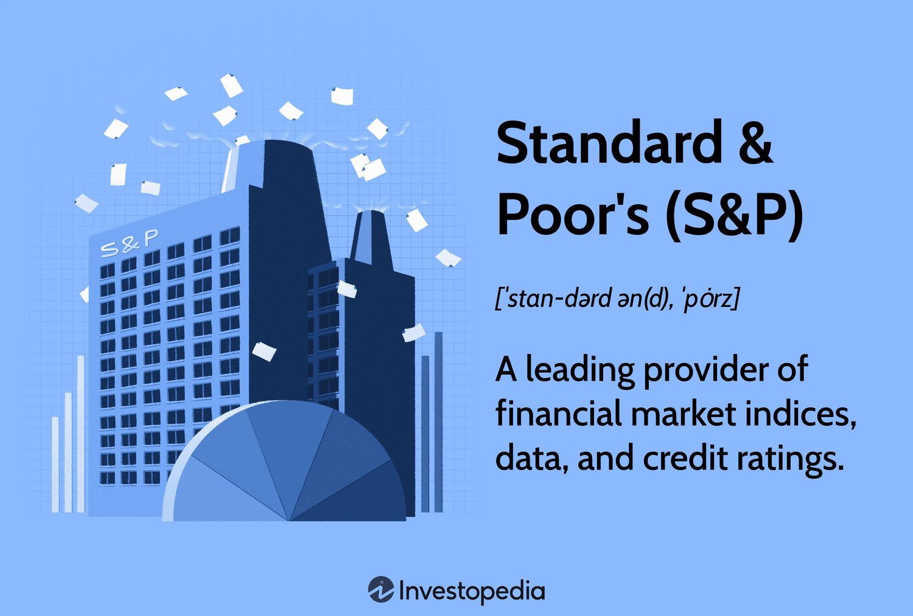

## Table of Contents

## What is Standard & Poor's and what do they do?

Standard & Poor's, often called S&P, is a company that gives information and ratings about financial things like stocks and bonds. They are very important in the world of money because they help people and companies decide if investing in something is safe or risky. S&P looks at a lot of information to decide if a company or a country can pay back money they borrow. If S&P thinks they can, they give a good rating. If not, they give a bad rating.

S&P also makes something called the S&P 500, which is a list of 500 big companies in the United States. This list helps people see how well the stock market is doing. If the S&P 500 goes up, it usually means the market is doing well. If it goes down, it might mean the market is not doing so well. People use this information to make choices about buying or selling stocks.

## What are the main types of indices provided by Standard & Poor's?

Standard & Poor's, or S&P, makes different kinds of lists called indices that help people understand how the stock market is doing. The most famous one is the S&P 500, which tracks the performance of 500 big companies in the United States. This index is very important because it gives a good picture of how the overall market is doing. People often use the S&P 500 to see if the market is going up or down.

Besides the S&P 500, S&P also has other indices like the S&P MidCap 400 and the S&P SmallCap 600. The MidCap 400 looks at medium-sized companies, while the SmallCap 600 focuses on smaller companies. These indices help investors see how different sizes of companies are doing in the market. S&P also has global indices, like the S&P Global 1200, which tracks companies from all around the world. This helps people understand how the global market is performing.

## How does Standard & Poor's calculate the S&P 500?

Standard & Poor's calculates the S&P 500 by looking at the stock prices of 500 big companies in the United States. They don't just add up all the stock prices and divide by 500. Instead, they use something called a market capitalization weighted index. This means that bigger companies have a bigger effect on the index than smaller companies. For example, if a big company's stock price goes up a lot, it will pull the whole S&P 500 up more than if a smaller company's stock price goes up the same amount.

To figure out the S&P 500, S&P first finds out how much each company is worth by multiplying the number of shares it has by the price of each share. This is called the market capitalization. Then, they add up the market capitalization of all 500 companies to get the total value of the index. They divide this total by a special number called the divisor, which helps keep the index stable even when companies are added or removed. This way, the S&P 500 gives a good picture of how these big companies are doing in the stock market.

## What is the significance of the S&P 500 in the financial markets?

The S&P 500 is very important in the financial markets because it shows how well the stock market is doing. It includes 500 big companies from different parts of the U.S. economy, so it gives a good overall picture. When people want to know if the market is going up or down, they often look at the S&P 500. It's like a report card for the market. If the S&P 500 goes up, it usually means that many companies are doing well and the market is strong. If it goes down, it might mean that the market is not doing so well.

The S&P 500 is also important because many people use it to make decisions about their investments. For example, lots of mutual funds and exchange-traded funds (ETFs) try to match the performance of the S&P 500. This means that if you invest in these funds, your money will go up and down with the S&P 500. Also, the S&P 500 is used as a benchmark. This means that people compare other investments to the S&P 500 to see if they are doing better or worse. So, the S&P 500 helps people make smart choices about where to put their money.

## How do Standard & Poor's credit ratings work?

Standard & Poor's credit ratings help people understand if it's safe to lend money to a company or a country. They look at a lot of information to decide how likely it is that the borrower will pay back the money on time. If S&P thinks the borrower is very likely to pay back the money, they give a high rating, like AAA. This means the investment is very safe. If they think it's not so likely, they give a lower rating, like BB or even lower. A lower rating means the investment is riskier.

S&P uses letters to show their ratings, starting from AAA (the highest and safest) and going down to D (the lowest, which means the borrower has already failed to pay back the money). The ratings are divided into two big groups: investment grade and speculative grade. Investment grade ratings, from AAA to BBB-, are for borrowers that S&P thinks are pretty safe. Speculative grade ratings, from BB+ and below, are for borrowers that S&P thinks are riskier. People use these ratings to decide if they want to lend money or buy bonds from a company or a country.

## What are the different credit rating categories used by Standard & Poor's?

Standard & Poor's uses letters to show how safe it is to lend money to a company or a country. They start with AAA, which is the highest and safest rating. This means the borrower is very likely to pay back the money. Ratings go down from there, like AA, A, BBB, BB, B, CCC, CC, C, and the lowest is D. The D rating means the borrower has already failed to pay back the money. The ratings are split into two main groups: investment grade and speculative grade. Investment grade ratings, from AAA to BBB-, mean the borrower is pretty safe. Speculative grade ratings, from BB+ and below, mean the borrower is riskier.

People use these ratings to decide if they want to lend money or buy bonds from a company or a country. If a rating is high, like AAA or AA, it means the investment is very safe, and more people might want to invest. If the rating is low, like BB or CCC, it means the investment is riskier, and fewer people might want to take the chance. S&P looks at a lot of information to decide on these ratings, like how much money the borrower has, how well they manage their money, and what's happening in the economy.

## How does Standard & Poor's assess the creditworthiness of a company or government?

Standard & Poor's looks at a lot of information to decide if a company or a government is good at paying back money they borrow. They check things like how much money the company or government makes, how much money they owe, and how well they manage their money. They also look at the economy to see if it's doing well or not. If the economy is strong, it might be easier for the borrower to pay back their money. S&P also talks to the people in charge of the company or government to understand their plans and see if they are making smart decisions.

After looking at all this information, S&P gives a rating. The rating is like a score that tells people how safe it is to lend money to that company or government. A high rating, like AAA, means the borrower is very likely to pay back the money, so it's a safe investment. A low rating, like D, means the borrower has already failed to pay back the money, so it's a very risky investment. People use these ratings to decide if they want to lend money or buy bonds from the company or government.

## What impact do Standard & Poor's credit ratings have on borrowing costs?

Standard & Poor's credit ratings can change how much it costs for a company or a government to borrow money. If S&P gives a high rating, like AAA, it means they think the borrower is very likely to pay back the money. This makes the borrower look safe, so lenders might be happy to lend money at a lower [interest rate](/wiki/interest-rate-trading-strategies). Lower interest rates mean the borrower doesn't have to pay as much extra money over time. On the other hand, if S&P gives a low rating, like BB or CCC, it means the borrower is riskier. Lenders might want more money to take that risk, so they charge higher interest rates. Higher interest rates make borrowing more expensive.

These ratings can also affect how much people want to invest in a company or a government. If the rating is high, more people might want to buy bonds or lend money because they feel it's safe. This can make it easier for the borrower to get money when they need it. But if the rating is low, fewer people might want to invest because they think it's too risky. This can make it harder for the borrower to find people willing to lend them money, and when they do, it's at a higher cost. So, S&P's ratings can really change how much it costs to borrow money and how easy it is to get it.

## Can you explain the methodology behind Standard & Poor's ESG (Environmental, Social, and Governance) ratings?

Standard & Poor's looks at how well companies are doing with the environment, how they treat people, and how they are run. This is called their [ESG](/wiki/esg-investing) (Environmental, Social, and Governance) rating. To figure out the rating, S&P looks at a lot of information. For the environment part, they check if the company is doing things to help the planet, like using less energy or making less pollution. For the social part, they look at how the company treats its workers, its customers, and the communities it works in. For governance, they see if the company is run in a fair and honest way, with good rules and leaders who make smart choices.

S&P uses a special way to give the ESG rating. They look at all the information they have and give a score from 1 to 100. A higher score means the company is doing really well with ESG things. A lower score means there might be some problems. S&P also gives a letter grade, like AAA to CCC, to show how the company is doing compared to other companies. This helps people see if a company is doing better or worse than others when it comes to taking care of the environment, treating people well, and being run in a good way.

## How have Standard & Poor's indices and ratings influenced global investment strategies?

Standard & Poor's indices and ratings have a big impact on how people and companies around the world decide to invest their money. The S&P 500, which shows how 500 big U.S. companies are doing, is used by many investors to see if the market is going up or down. When the S&P 500 goes up, it can make people feel good about investing in the market. Many investment funds try to match the S&P 500's performance, so if you invest in these funds, your money will go up and down with the S&P 500. This helps people make choices about where to put their money, making it easier for them to invest in a way that follows how the market is doing.

S&P's credit ratings also play a big role in global investment strategies. When S&P gives a high rating to a company or a country, it means they think it's safe to lend them money. This can make borrowing cheaper because lenders might charge lower interest rates. On the other hand, a low rating means it's riskier, so borrowing can become more expensive. Investors use these ratings to decide if they want to buy bonds or lend money to a company or a country. If the rating is high, more people might want to invest because they feel it's safe. If it's low, fewer people might want to take the risk. This way, S&P's ratings help shape how and where people invest their money around the world.

## What are some criticisms or controversies surrounding Standard & Poor's methodologies and ratings?

Some people have criticized Standard & Poor's because they think the company's ratings are not always right. For example, during the 2008 financial crisis, S&P gave high ratings to some risky investments, like mortgage-backed securities. When these investments failed, it caused a lot of problems. People said S&P should have seen the risks and given lower ratings. This made some investors lose a lot of money because they trusted S&P's ratings.

Another issue is that some people think S&P might be influenced by the companies they rate. S&P gets paid by the companies to rate them, which could make them want to give better ratings to keep the business. This is called a conflict of interest. Critics worry that this might make S&P's ratings less fair and honest. There have been lawsuits and investigations about this, and it has made some people question how much they can trust S&P's ratings.

## How does Standard & Poor's adapt its indices and ratings to new market conditions and emerging sectors?

Standard & Poor's keeps its indices and ratings up to date by watching the market and making changes when needed. They look at new companies and industries that are growing, like technology or green energy, and decide if they should be added to their indices. For example, if a new tech company gets really big, S&P might add it to the S&P 500. They also take out companies that are not doing so well or are no longer as important. This way, the indices stay relevant and show a good picture of the market.

S&P also changes its ratings to fit new market conditions. They keep an eye on things like new laws, economic changes, or big events that could affect how safe it is to lend money to a company or a country. If something big happens, like a new environmental rule, S&P might change a company's ESG rating to show how well they are doing with the new rule. By doing this, S&P helps investors make smart choices based on the latest information.

## References & Further Reading

[1]: Bergstra, J., Bardenet, R., Bengio, Y., & Kégl, B. (2011). ["Algorithms for Hyper-Parameter Optimization."](https://papers.nips.cc/paper/4443-algorithms-for-hyper-parameter-optimization) Advances in Neural Information Processing Systems 24.

[2]: ["Advances in Financial Machine Learning"](https://www.amazon.com/Advances-Financial-Machine-Learning-Marcos/dp/1119482089) by Marcos Lopez de Prado

[3]: ["Evidence-Based Technical Analysis: Applying the Scientific Method and Statistical Inference to Trading Signals"](https://www.amazon.com/Evidence-Based-Technical-Analysis-Scientific-Statistical/dp/0470008741) by David Aronson

[4]: ["Machine Learning for Algorithmic Trading"](https://github.com/stefan-jansen/machine-learning-for-trading) by Stefan Jansen

[5]: ["Quantitative Trading: How to Build Your Own Algorithmic Trading Business"](https://www.amazon.com/Quantitative-Trading-Build-Algorithmic-Business/dp/1119800064) by Ernest P. Chan