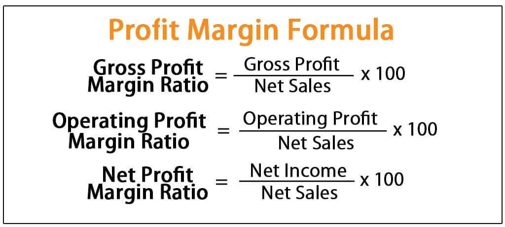

In the dynamic world of retail, profit margins are a fundamental measure of a company's profitability. They serve as a critical metric to assess financial health, reflecting the efficiency with which a business converts sales into profits. A variety of factors can impact these profit margins, including market conditions, consumer behavior, operational efficiency, and pricing strategies. Understanding these factors is imperative for retailers seeking to make informed decisions that bolster their profitability.

The significance of profit margins in the retail industry cannot be overstated. For businesses operating within this sector, they provide insights into pricing power and cost control, informing strategic decisions that drive competitiveness. Retail profit margins tend to be razor-thin compared to other industries due to relentless competition and the price-sensitive nature of consumer spending. Products with low margins require high sales volumes to achieve profitability, while high-margin items necessitate precise pricing and marketing strategies.



Retailers regularly face challenges such as fluctuating consumer preferences, economic pressures, and digital disruptions. These challenges demand agile responses and innovative solutions to maintain or improve profit margins. Moreover, the role of algorithmic trading in the retail sector has emerged as a promising avenue for enhanced business performance. By leveraging data-driven insights and automation, retailers can optimize inventory management, refine pricing strategies, and ultimately improve margins.

This article aims to explore these facets, shedding light on the complexities of retail profit margins, the obstacles encountered, and the transformative potential of algorithmic trading in facilitating superior business outcomes. Through a comprehensive understanding of these elements, retailers can position themselves strategically to thrive in a competitive and ever-evolving market.

## Table of Contents

## Understanding Retail Profit Margins

Retail profit margins refer to the percentage of revenue that remains as profit after all expenses have been deducted. This financial metric is crucial in evaluating a retailer's profitability, as it provides insights into how effectively a business controls its costs relative to its sales. Typically, profit margins in retail are narrower compared to other sectors due to several influential factors.

One primary [factor](/wiki/factor-investing) influencing retail profit margins is competition. The retail industry is characterized by intense rivalry, which often leads to price wars and discounted offerings to attract customers. This competitive environment can compress margins as retailers strive to maintain their market share. For instance, fast-moving consumer goods (FMCG) sectors like grocery retail often operate on thin margins due to the commoditized nature of their products and consumer sensitivity to pricing. 

Operational costs also significantly impact retail profit margins. Expenses such as rent, labor, supply chain logistics, and utilities constitute a large portion of a retailer’s expenditure. High operational costs can diminish profit margins, especially for brick-and-mortar stores located in prime urban areas where rent is steep. In contrast, sectors like e-commerce can potentially reduce some of these costs by leveraging digital platforms, though they face their own challenges related to logistics and cybersecurity expenses.

Consumer preferences further influence retail profit margins. As consumer expectations evolve, retailers are compelled to invest in enhancing customer experiences, whether through in-store renovations, better customer service, or technology integration. High-end fashion retail, for instance, often enjoys higher profit margins compared to grocery retail due to the premium pricing of luxury items and a customer base that is less price-sensitive. However, this sector must continuously innovate to remain appealing to an affluent clientele, which can entail significant costs.

Sub-sector analysis reveals notable differences in profitability. High-end fashion, despite higher margins, relies on brand perception, exclusivity, and trends, requiring constant reinvention and marketing expenditure. Conversely, grocery retailers focus on high-[volume](/wiki/volume-trading-strategy), low-margin sales, depending on rapid inventory turnover to maintain profitability. These variations underscore the importance of strategic positioning and cost management within different retail sub-sectors to optimize profit margins.

Understanding these dynamics is essential for retailers aiming to improve their profitability. By strategically navigating competition, managing operational costs, and aligning with consumer preferences, retailers can more effectively control their profit margins and enhance their overall financial health.

## Challenges in Achieving High Profit Margins

In the retail industry, achieving high profit margins is challenging due to several intrinsic and extrinsic factors. One defining characteristic is the industry's low average net margins, largely because retail spending is mostly discretionary. Consumers prioritize essential expenses, often relegating retail purchases to secondary importance. Consequently, retailers must offer compelling value propositions to capture a slice of consumer spending.

Furthermore, the rise of online competition exacerbates these challenges. E-commerce platforms have significantly altered consumer purchasing habits, providing convenience and access to a broader range of products. Traditional brick-and-mortar retailers face heightened pressure from these digital counterparts, which often operate with lower overhead costs. Online price comparison tools empower consumers to find the best deals effortlessly, prompting traditional retailers to lower prices to stay competitive. This price war can squeeze profit margins even tighter.

Retailers also operate within an environment of volatile market conditions, including economic fluctuations, supply chain disruptions, and changes in consumer confidence. These factors can dramatically impact sales, inventory levels, and pricing strategies. For example, during economic downturns, discretionary spending decreases, compelling retailers to find ways to cut costs without compromising customer service or product quality.

Lastly, consumer demand is unpredictable and constantly evolving. Shifts in preferences, driven by trends, technology, and cultural influences, necessitate that retailers remain agile and responsive. Retailers must anticipate these shifts and adapt their inventory, marketing strategies, and customer engagement approaches to reflect the current consumer landscape.

Navigating these challenges requires strategic planning and innovation. Retailers must balance the need to remain price-competitive while also offering unique value through customer experience, product quality, and exclusive offerings. By doing so, they can maintain and potentially improve their profit margins despite the myriad of industry pressures.

## Impact of Algorithmic Trading on Retail Business

Algorithmic trading is increasingly impacting retail business models, primarily by automating inventory management and pricing strategies, which can result in more efficient operations and improved margin control. This integration allows retailers to streamline processes traditionally hindered by manual intervention, thereby reducing errors and enhancing decision-making efficiency. 

Automated inventory management systems, powered by [algorithmic trading](/wiki/algorithmic-trading) principles, enable retailers to maintain optimal stock levels. These systems predict demand patterns using historical sales data and market trends, ensuring that inventory is aligned with consumer demand. For instance, algorithms can determine reorder points and order quantities based on variables such as sales velocity and lead time. The formula for calculating reorder points can be expressed as:

$$
\text{Reorder Point} = (\text{Average Daily Usage Rate} \times \text{Lead Time in Days}) + \text{Safety Stock}
$$

This precision minimizes instances of overstocking or stockouts, thus protecting profit margins.

In terms of pricing strategies, algorithmic systems analyze competitor pricing, market trends, and consumer behavior to dynamically adjust prices. This capability not only ensures competitive pricing but also maximizes revenue potential by capitalizing on market opportunities in real-time. Python libraries such as pandas and scikit-learn can be utilized to develop models predicting optimal pricing adjustments based on these inputs. An example snippet for a simple pricing adjustment might look like this:

```python
import pandas as pd
from sklearn.linear_model import LinearRegression

# Sample data
data = pd.DataFrame({'competitor_price': [100, 200, 300], 'demand': [30, 40, 50]})

# Linear regression model
model = LinearRegression()
model.fit(data[['competitor_price']], data['demand'])

# Predict demand for a new competitor price
new_price = 250
predicted_demand = model.predict([[new_price]])

# Pricing strategy based on prediction
optimal_price = new_price * (1 + (predicted_demand - 40) / 100)
```

In addition to these operational enhancements, algorithmic systems empower retailers to respond rapidly to market changes. This agility is crucial for optimizing supply chains and enhancing customer experiences, ensuring that goods are available when and where consumers want them. For example, algorithms can identify shifts in consumer preferences and redirect inventory accordingly, thus minimizing markdowns and maximizing sales.

Furthermore, the data-driven insights generated through algorithmic models contribute to enhanced customer experiences by personalizing offerings and promotions. This personalization not only drives customer loyalty but also potentially increases the frequency and value of purchases, which are critical metrics for profitability.

In summary, the adoption of algorithmic trading systems in retail offers significant potential for improving operational efficiencies and profit margins. By harnessing the power of automation and data analytics, retailers can not only optimize their supply chains and pricing strategies but also better meet consumer demands, gaining a competitive advantage in the dynamic retail landscape.

## Strategies to Improve Retail Profit Margins

Retailers can enhance their profit margins by adopting several strategic approaches, focusing on pricing optimization and inventory management. By leveraging data analytics and [artificial intelligence](/wiki/ai-artificial-intelligence) (AI), retailers can gain valuable insights into consumer behavior, enabling more targeted marketing and efficient operations.

One effective strategy is optimizing pricing through dynamic pricing models. These models involve adjusting prices based on various factors such as demand, competition, and inventory levels. Python, a popular programming language for data analysis, can be employed to implement dynamic pricing algorithms. Here's a simple example using Python to adjust prices based on demand:

```python
def dynamic_pricing(initial_price, demand_factor, competition_factor):
    adjusted_price = initial_price * (1 + demand_factor - competition_factor)
    return adjusted_price

# Example usage
initial_price = 50
demand_factor = 0.2   # 20% increase in demand
competition_factor = 0.1  # 10% increase in competition
new_price = dynamic_pricing(initial_price, demand_factor, competition_factor)
print(f"Adjusted Price: ${new_price:.2f}")
```

Inventory management is another critical area where retailers can improve profit margins. Effective inventory management ensures that stock levels are aligned with consumer demand, minimizing excess inventory and reducing storage costs. Retailers can use AI-driven demand forecasting to predict future sales and optimize inventory levels, thereby reducing stockouts and overstock situations.

Data analytics tools enable retailers to identify purchasing patterns and seasonal trends. By analyzing historical sales data, retailers can make informed decisions about product assortment and stock quantities. This data-driven approach can be supported by AI algorithms that continuously learn and adapt to changing market conditions.

Low-margin, high-volume sales strategies, employed successfully by industry giants like Walmart and Amazon, can also help improve profit margins. These strategies focus on selling large quantities of goods at lower prices, increasing overall revenue and compensating for lower per-unit profit. This approach requires efficient supply chain management to maintain cost-effective operations and fulfill large order volumes.

Retailers must also focus on enhancing customer experiences to increase sales volumes and foster brand loyalty. Personalized marketing strategies, powered by AI-generated insights, can help tailor promotions and offers to individual preferences, driving higher conversion rates.

In conclusion, by optimizing pricing strategies, improving inventory management, and leveraging data analytics and AI, retailers can significantly enhance their profit margins. Implementing low-margin, high-volume sales strategies further complements these efforts, positioning retailers for sustained success in a competitive marketplace.

## The Future of Retail Profitability

The future of retail profitability is intricately linked to the adoption of advanced technologies such as [machine learning](/wiki/machine-learning) and big data analytics. These technologies enable retailers to analyze vast amounts of data generated by consumer interactions, market trends, and supply chain logistics. By leveraging machine learning algorithms, retailers can predict consumer behaviors and preferences with higher accuracy, allowing for more personalized marketing strategies and optimized inventory management. For instance, predictive analytics can forecast demand for specific products, reducing overstock and associated holding costs, thereby improving profit margins.

Incorporating big data analytics allows retailers to gain insights into complex datasets. This data-driven approach aids in identifying sales patterns, customer demographics, and emerging market trends, which helps in calibrating pricing strategies and promotional campaigns. The ability to process and analyze real-time data ensures that retailers can swiftly adapt to the dynamic retail environment, maintaining competitiveness and profitability.

Retailers investing in innovative technologies are likely to achieve a competitive advantage. Automation tools can streamline operations, reducing labor costs and minimizing errors in processes such as checkout, inventory replenishment, and supply chain management. Cloud computing and IoT (Internet of Things) integration further enhance operational efficiency by enabling seamless data sharing and connectivity across various retail components.

The retail landscape is constantly evolving, necessitating agility and a customer-centric approach from businesses to sustain profitability. Adopting a business model centered on customer satisfaction ensures sustained engagement and brand loyalty, ultimately driving sales and margin growth. Retailers must continually assess and realign their strategies, focusing on enhancing the customer experience, whether through various channels, such as e-commerce platforms or in physical stores.

The seamless integration of advanced technologies into retail strategies not only provides a pathway to improved profitability but also equips retailers for future challenges. Companies that embrace digital transformation and remain attuned to technological advancements will better position themselves for long-term success, fostering a sustainable competitive edge in an increasingly digital world.

## Conclusion

Retail profit margins are a critical metric for assessing business health, shaped by a multitude of external and internal influences. These influences include market competition, changing consumer preferences, operational costs, and macroeconomic factors. Retailers must navigate these challenges while striving to improve their profit margins, which often tend to be lower compared to other industries due to the nature of retail operations and spending.

Despite these challenges, there are significant opportunities for enhancing profitability through innovative strategies and technological advancements. Implementing data analytics and artificial intelligence allows retailers to gain deeper insights into consumer behavior, optimize pricing strategies, and streamline inventory management. By using technology like machine learning, companies can more accurately predict demand, personalize customer interactions, and increase overall efficiency.

Additionally, as the retail landscape becomes more competitive, adopting flexible business models that leverage algorithmic trading and real-time data can offer substantial advantages. These advancements enable retailers to adjust quickly to market changes, improving their ability to maintain or increase profit margins in turbulent conditions.

In summary, while the path to sustaining profitability in the retail sector is fraught with obstacles, embracing modern strategies and technologies provides a pathway to success. Retailers that invest in these areas are better positioned to navigate market complexities, enhance their competitiveness, and achieve long-term business health.

## References & Further Reading

[1]: ["Retail Industry: A Deep Dive Into Profit Margins"](https://www.investopedia.com/ask/answers/071615/what-profit-margin-usual-company-retail-sector.asp) - McKinsey & Company

[2]: ["Impact of Digital Innovation on Retail Business Models"](https://www.forbes.com/sites/bernardmarr/2023/10/12/the-impact-of-digital-transformation-on-business-models-opportunities-and-challenges/) - Deloitte Insights

[3]: ["Algorithmic Trading and Information"](https://www.investopedia.com/articles/active-trading/101014/basics-algorithmic-trading-concepts-and-examples.asp) - CFA Institute

[4]: ["Advances in Financial Machine Learning"](https://www.amazon.com/Advances-Financial-Machine-Learning-Marcos/dp/1119482089) by Marcos Lopez de Prado

[5]: ["The Retail Apocalypse: What Strategies Will Survive the Latest Shakeout?"](https://fitsmallbusiness.com/retail-apocalypse/) - Harvard Business Review

[6]: ["Machine Learning for Algorithmic Trading"](https://github.com/stefan-jansen/machine-learning-for-trading) by Stefan Jansen

[7]: ["Quantitative Trading: How to Build Your Own Algorithmic Trading Business"](https://www.amazon.com/Quantitative-Trading-Build-Algorithmic-Business/dp/1119800064) by Ernest P. Chan

[8]: ["Retail Profitability: Balancing Strategy and Execution"](https://sloanreview.mit.edu/article/the-retail-profitability-paradox/) - Deloitte Insights