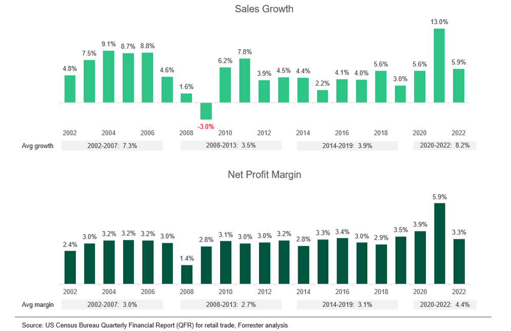

## Table of Contents

## What is a profit margin?

A profit margin is the amount of money a business makes after it pays for all its costs. It is usually shown as a percentage. To find the profit margin, you take the profit and divide it by the total revenue, then multiply by 100. This tells you what part of each dollar of sales is profit.

Profit margins are important because they show how well a business is doing. A higher profit margin means the business is keeping more money from each sale. This can help the business grow or save for the future. Different industries have different average profit margins, so it's good to compare a business to others in the same field.

## How is profit margin calculated in the retail industry?

In the retail industry, profit margin is calculated by first finding the profit, which is the money left after subtracting the cost of goods sold from the total revenue. The cost of goods sold includes the price the retailer paid for the products they sell. Once you have the profit, you divide it by the total revenue and then multiply by 100 to get the profit margin as a percentage. This tells you how much profit the retailer makes for every dollar of sales.

For example, if a retailer has total revenue of $100,000 and the cost of goods sold is $60,000, the profit would be $40,000. To find the profit margin, you divide $40,000 by $100,000, which equals 0.4. When you multiply 0.4 by 100, you get a profit margin of 40%. This means the retailer keeps 40 cents of every dollar in sales as profit.

## What is considered a standard profit margin in retail?

In the retail industry, what is considered a standard profit margin can vary a lot. It depends on things like the type of products sold, the size of the store, and where it is located. On average, many retail businesses aim for a profit margin between 2% and 5%. This means for every dollar they make in sales, they keep 2 to 5 cents as profit after paying for the products and other costs.

Some retail sectors can have higher profit margins. For example, luxury goods or specialty stores might have margins up to 10% or even higher. But, big retail chains that sell a lot of products at low prices might only have margins around 1% to 3%. Knowing the standard profit margin helps retailers see how well they are doing compared to others in their field.

## How do profit margins vary across different retail sectors?

Profit margins in retail can be very different depending on what kind of products are being sold. For example, grocery stores usually have very low profit margins, often around 1% to 3%. This is because they sell a lot of products but make very little money on each one. On the other hand, stores that sell luxury items like jewelry or high-end clothing can have much higher profit margins, sometimes as high as 50% or more. These stores sell fewer items but make a lot more money on each sale.

Another [factor](/wiki/factor-investing) that affects profit margins is how much competition there is. Stores in crowded markets might have to keep their prices low to attract customers, which can lead to lower profit margins. For example, electronics stores often have profit margins around 3% to 5% because there are many other stores selling similar products. In contrast, specialty stores that sell unique products, like a store that only sells handmade crafts, might have higher profit margins because they face less competition. Understanding these differences helps retailers know where they stand and how they can improve their business.

## What factors influence profit margins in the retail industry?

Profit margins in the retail industry can be affected by many things. One big factor is the type of products sold. Stores that sell everyday items like food or clothes usually have small profit margins because they have to keep prices low to get customers. But, stores that sell special or luxury items, like jewelry or fancy clothes, can have bigger profit margins because people are willing to pay more for those things. Another thing that matters is how much competition there is. If there are lots of other stores selling the same stuff, a store might have to lower prices to keep customers, which means smaller profit margins.

The size of the store and where it is located also play a role. Big stores that sell a lot of different things might have small profit margins but make up for it by selling a lot of products. Small stores or those in expensive areas might be able to charge more and have bigger profit margins. Also, how well a store manages its costs, like rent, employee salaries, and marketing, can make a big difference. If a store can keep these costs low, it can keep more of the money from each sale as profit. Understanding these factors helps retailers figure out how to make their business more successful.

## How do small retailers compare to large retail chains in terms of profit margins?

Small retailers often have different profit margins compared to large retail chains. Small stores might have higher profit margins because they can charge more for their products. They often sell special or unique items that people can't find in big stores. Also, small retailers usually don't have to spend as much money on things like big marketing campaigns or huge store rents. This means they can keep more of the money they make from each sale.

On the other hand, large retail chains usually have smaller profit margins, often around 1% to 3%. They make up for this by selling a lot of products. Big stores can buy things in bulk, which means they pay less for each item. They also have the advantage of being able to attract a lot of customers because they are well-known and have many locations. Even though their profit margins are small, the total amount of profit they make can be very large because of the high [volume](/wiki/volume-trading-strategy) of sales.

## What strategies can retailers use to improve their profit margins?

Retailers can improve their profit margins by focusing on their costs. One way to do this is by buying products at a lower price. When retailers can get their products cheaper, they can sell them for the same price and keep more of the money as profit. Another way is to look at all the other costs, like rent, employee salaries, and marketing. If retailers can find ways to spend less on these things, they can keep more money from each sale. For example, using cheaper advertising methods like social media instead of big TV ads can help save money.

Another strategy is to change how they sell their products. Retailers can try to sell more of the items that have higher profit margins. This means focusing on selling special or luxury items that people are willing to pay more for. They can also try to get customers to buy more things each time they shop. Offering deals or bundles can encourage people to spend more money. By doing this, retailers can increase their total sales and, in turn, their overall profit margins.

Lastly, retailers can work on making their customers happier. Happy customers are more likely to come back and buy more things. Good customer service, easy returns, and loyalty programs can make people want to shop at the store again. When customers keep coming back, it helps the store sell more and improve its profit margins over time.

## How have profit margins in the retail industry changed over the past decade?

Over the past decade, profit margins in the retail industry have faced a lot of changes. One big reason for this is the rise of online shopping. More people are buying things online, which has made it harder for traditional stores to keep their profit margins high. Online stores often have lower costs, like not having to pay for big store spaces, so they can offer lower prices. This has pushed traditional retailers to lower their prices too, which can lead to smaller profit margins. Also, the economy has had ups and downs, which can affect how much people are willing to spend and how much profit retailers can make.

Another thing that has changed profit margins is how retailers manage their costs. Many have tried to find new ways to save money, like using technology to make their stores run more smoothly or cutting back on staff. Some have also started selling their own brands of products, which can have higher profit margins than name-brand items. But, not all changes have been good for profit margins. For example, the cost of shipping and handling has gone up, especially with more people shopping online. Overall, the past ten years have been a time of big changes and challenges for retailers trying to keep their profit margins healthy.

## What role does competition play in determining retail profit margins?

Competition is a big factor in deciding how much profit a retail store can make. When there are a lot of other stores selling the same things, a store might have to lower its prices to keep customers coming in. This can mean less money left over as profit for each item sold. For example, if there are many clothing stores in one area, they might all start selling their clothes for less to attract more shoppers. This can make their profit margins smaller because they are making less money on each sale.

But competition isn't always bad for profit margins. Sometimes, it can push stores to find new ways to save money or offer better things to their customers. A store might try to buy products cheaper, so they can still make a good profit even if they have to sell them at a lower price. Or, they might focus on selling special items that other stores don't have, which can let them charge more and keep their profit margins high. So, while competition can make it harder to keep high profit margins, it can also make stores better at finding ways to make more money.

## How do online retail profit margins differ from brick-and-mortar stores?

Online retail stores often have different profit margins compared to brick-and-mortar stores. One big reason is that online stores usually have lower costs. They don't need to pay for big store spaces or as many employees to help customers in a store. This means they can keep more of the money they make from each sale as profit. But, online stores do have other costs, like shipping and handling, that can eat into their profit margins. Overall, many online retailers have higher profit margins than traditional stores because their costs are lower.

On the other hand, brick-and-mortar stores have to deal with higher costs, like rent and salaries for store staff. These costs can make their profit margins smaller. But, some people like to shop in person, so brick-and-mortar stores can still attract customers and make sales. To stay competitive, these stores might focus on selling special items or offering great customer service to keep their profit margins healthy. So, while online stores often have higher profit margins, brick-and-mortar stores have their own ways to make money and keep customers happy.

## What are the implications of low profit margins for long-term business sustainability in retail?

Low profit margins can make it hard for a retail business to stay healthy over time. When a store doesn't make much profit on each sale, it can be tough to pay for things like rent, employee salaries, and other costs. If these costs go up, and the store can't raise prices or find ways to save money, it might start losing money. Over time, this can make it hard for the store to keep going. They might need to borrow money or find other ways to keep the business running, which can add more problems in the long run.

But, low profit margins aren't always a bad thing. Some stores, like big retail chains, can still do well even with small profit margins because they sell a lot of products. They make up for the low profit on each item by selling a huge number of them. However, these stores need to be very careful about managing their costs and finding ways to keep selling more. If they can't keep their costs down or keep their sales up, even a small drop in profit margins can cause big problems for their long-term success.

## How can advanced analytics be used to optimize profit margins in the retail sector?

Advanced analytics can help retail stores make more money by looking at a lot of information and finding ways to improve. For example, stores can use analytics to see which products are selling well and which ones are not. This can help them decide what to sell more of and what to stop selling. Analytics can also help stores find out who their best customers are and what they like to buy. By understanding this, stores can offer special deals or products that these customers will want, which can increase sales and profit margins.

Another way analytics can help is by looking at costs. Stores can use analytics to find out where they are spending too much money and how they can spend less. This might mean finding cheaper ways to get products, using less energy in the store, or figuring out the best times to have sales. By keeping costs down, stores can keep more of the money they make from each sale. Over time, using advanced analytics can help retail stores make smarter choices and improve their profit margins, making their business stronger and more successful.

## What is the impact of algorithmic trading on retail business?

Algorithmic trading is increasingly impacting retail business models, primarily by automating inventory management and pricing strategies, which can result in more efficient operations and improved margin control. This integration allows retailers to streamline processes traditionally hindered by manual intervention, thereby reducing errors and enhancing decision-making efficiency. 

Automated inventory management systems, powered by [algorithmic trading](/wiki/algorithmic-trading) principles, enable retailers to maintain optimal stock levels. These systems predict demand patterns using historical sales data and market trends, ensuring that inventory is aligned with consumer demand. For instance, algorithms can determine reorder points and order quantities based on variables such as sales velocity and lead time. The formula for calculating reorder points can be expressed as:

$$
\text{Reorder Point} = (\text{Average Daily Usage Rate} \times \text{Lead Time in Days}) + \text{Safety Stock}
$$

This precision minimizes instances of overstocking or stockouts, thus protecting profit margins.

In terms of pricing strategies, algorithmic systems analyze competitor pricing, market trends, and consumer behavior to dynamically adjust prices. This capability not only ensures competitive pricing but also maximizes revenue potential by capitalizing on market opportunities in real-time. Python libraries such as pandas and scikit-learn can be utilized to develop models predicting optimal pricing adjustments based on these inputs. An example snippet for a simple pricing adjustment might look like this:

```python
import pandas as pd
from sklearn.linear_model import LinearRegression

# Sample data
data = pd.DataFrame({'competitor_price': [100, 200, 300], 'demand': [30, 40, 50]})

# Linear regression model
model = LinearRegression()
model.fit(data[['competitor_price']], data['demand'])

# Predict demand for a new competitor price
new_price = 250
predicted_demand = model.predict([[new_price]])

# Pricing strategy based on prediction
optimal_price = new_price * (1 + (predicted_demand - 40) / 100)
```

In addition to these operational enhancements, algorithmic systems empower retailers to respond rapidly to market changes. This agility is crucial for optimizing supply chains and enhancing customer experiences, ensuring that goods are available when and where consumers want them. For example, algorithms can identify shifts in consumer preferences and redirect inventory accordingly, thus minimizing markdowns and maximizing sales.

Furthermore, the data-driven insights generated through algorithmic models contribute to enhanced customer experiences by personalizing offerings and promotions. This personalization not only drives customer loyalty but also potentially increases the frequency and value of purchases, which are critical metrics for profitability.

In summary, the adoption of algorithmic trading systems in retail offers significant potential for improving operational efficiencies and profit margins. By harnessing the power of automation and data analytics, retailers can not only optimize their supply chains and pricing strategies but also better meet consumer demands, gaining a competitive advantage in the dynamic retail landscape.

## References & Further Reading

[1]: ["Retail Industry: A Deep Dive Into Profit Margins"](https://www.investopedia.com/ask/answers/071615/what-profit-margin-usual-company-retail-sector.asp) - McKinsey & Company

[2]: ["Impact of Digital Innovation on Retail Business Models"](https://www.forbes.com/sites/bernardmarr/2023/10/12/the-impact-of-digital-transformation-on-business-models-opportunities-and-challenges/) - Deloitte Insights

[3]: ["Algorithmic Trading and Information"](https://www.investopedia.com/articles/active-trading/101014/basics-algorithmic-trading-concepts-and-examples.asp) - CFA Institute

[4]: ["Advances in Financial Machine Learning"](https://www.amazon.com/Advances-Financial-Machine-Learning-Marcos/dp/1119482089) by Marcos Lopez de Prado

[5]: ["The Retail Apocalypse: What Strategies Will Survive the Latest Shakeout?"](https://fitsmallbusiness.com/retail-apocalypse/) - Harvard Business Review

[6]: ["Machine Learning for Algorithmic Trading"](https://github.com/stefan-jansen/machine-learning-for-trading) by Stefan Jansen

[7]: ["Quantitative Trading: How to Build Your Own Algorithmic Trading Business"](https://www.amazon.com/Quantitative-Trading-Build-Algorithmic-Business/dp/1119800064) by Ernest P. Chan

[8]: ["Retail Profitability: Balancing Strategy and Execution"](https://sloanreview.mit.edu/article/the-retail-profitability-paradox/) - Deloitte Insights