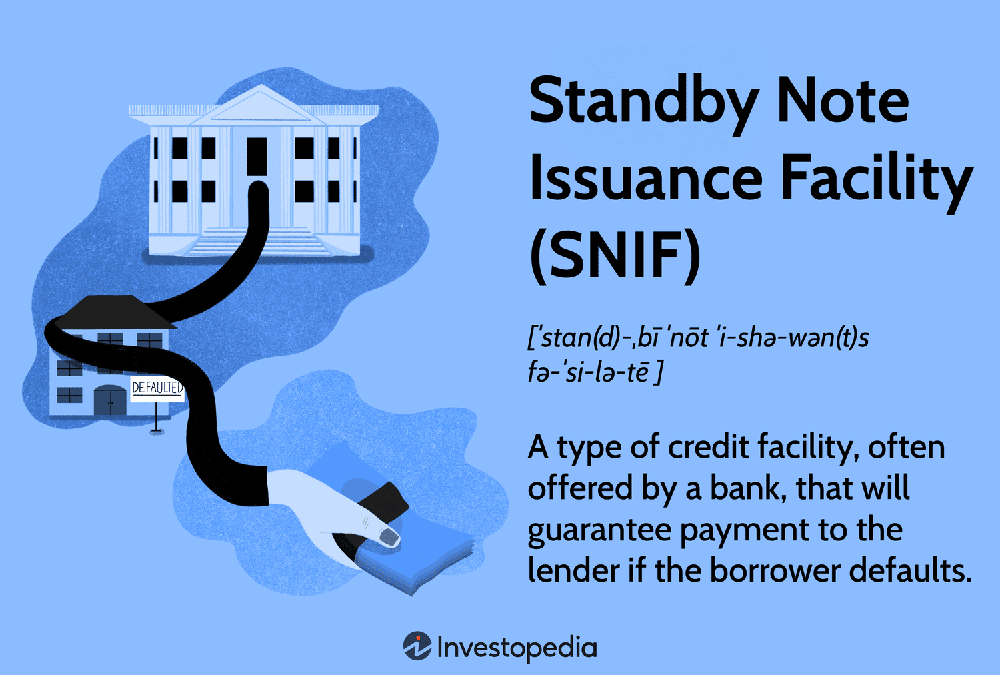

In the complex world of finance, credit facilities play a crucial role in bridging gaps between lenders and borrowers. These facilities ensure liquidity, mitigate risk, and facilitate smoother transactions, which are essential for maintaining the stability and growth of financial markets. Among these tools, the Standby Note Issuance Facility (SNIF) emerges as a versatile mechanism offering a strategic advantage to lenders. It provides a form of insurance, safeguarding the interests of lenders by serving as a safety net should borrowers fail to meet their obligations.

The concept of SNIF is particularly relevant in today's rapidly evolving financial landscape, where uncertainty can pose significant challenges. By offering credit assurances, SNIFs minimize the potential default risk associated with borrowers who might have poor credit histories or those new to the lending institution. This article explores SNIF, its applications, and its burgeoning significance in contemporary practices like algorithmic trading, which demands precision, timing, and reliability.



For anyone seeking a deeper understanding of financial instruments and effective risk management, grasping the nuances of SNIF proves invaluable. It is not merely a tool for risk mitigation but a critical component that fosters trust and facilitates engagement between unfamiliar parties in high-stakes environments. As the finance sector continues to integrate technology, understanding the application and strategic benefit of facilities like SNIF can enhance decision-making and operational success.

## Table of Contents

## Understanding Standby Note Issuance Facility (SNIF)

A Standby Note Issuance Facility (SNIF) is a financial instrument designed to reduce the risk faced by lenders when providing loans to borrowers with potentially unstable credit profiles. By serving as a credit assurance, a SNIF acts as a safeguard that minimizes the potential losses a lender could incur if a borrower defaults on their payment. This makes SNIFs particularly useful in scenarios where borrowers are assessed as high-risk, generally due to their poor credit histories or lack of financial stability.

The core function of a SNIF can be likened to that of a standby letter of credit. Both instruments assure the lender that they will receive payment even if the borrower does not fulfill their contractual responsibilities. This guarantee emerges as a vital tool in situations where the borrower and lender do not possess a history of prior financial interactions, thereby mitigating the uncertainties and lack of trust that might otherwise hinder the agreement.

Such facilities are crucial in initiating and maintaining financial interactions between previously unfamiliar parties. The reassurance provided by a SNIF encourages lenders to offer credit more willingly, knowing that their exposure to default risk is substantially lowered. For borrowers, this can open doors to obtaining financing that might otherwise be inaccessible due to their credit standing.

The risk mitigation offered by SNIFs is embodied in a straightforward contractual arrangement, which stipulates that the financial institution responsible for issuing the SNIF will compensate the lender in the event of the borrower's default. This form of credit assurance facilitates smoother lending processes, bridges trust gaps, and enhances financial transactions in various sectors, especially international trade and speculative project financing. Consequently, SNIFs play a crucial role in expanding opportunities for credit access across different industries.

## Applications of SNIF in Modern Finance

Standby Note Issuance Facilities (SNIFs) are gaining traction in modern financial applications due to their ability to enhance trust and manage risk in high-stakes transactions. A prominent area of application is international trade, where SNIFs help overcome the challenges posed by trading between parties that do not have prior engagements. These facilities act as credit assurances that bolster confidence among traders by guaranteeing payments, thus facilitating smoother transactions in global markets.

Another critical application of SNIFs is in project financing, particularly where future cash flows are speculative or uncertain. Projects with uncertain outcomes can pose significant risks to lenders, who require protective measures to safeguard their investments. By employing SNIFs, financial institutions provide lenders with added security, ensuring that their financial interests are protected even if the project's revenue generation does not meet expectations.

In the field of [algorithmic trading](/wiki/algorithmic-trading), SNIFs are increasingly recognized for their role in mitigating risks associated with potential trading defaults. Algorithmic trading systems operate at high speeds and high volumes, often encountering volatile market conditions. In such an environment, the risk of counterparties failing to fulfill their contractual obligations can be substantial. SNIFs offer a protective layer, ensuring continual cash flow and reducing the financial shock caused by defaults. This risk management tool not only aids in maintaining [liquidity](/wiki/liquidity-risk-premium) but also enhances the strategic robustness of trading systems, enabling them to operate more effectively in unpredictable markets.

Overall, the utilization of SNIFs in these financial contexts underscores their importance as instruments that bridge the gap between security and opportunity, paving the way for more resilient financial interactions.

## SNIF and Risk Management in Algorithmic Trading

Algorithmic trading relies on executing pre-programmed trading instructions with precision, taking into account various factors such as timing, price, and [volume](/wiki/volume-trading-strategy). This strategy helps traders capitalize on market inefficiencies by executing trades at speeds that are impossible for human traders. However, it involves inherent risks, especially related to default by counterparties in volatile markets. Integrating Standby Note Issuance Facilities (SNIF) within algorithmic trading platforms can provide a layer of protection against these risks.

The principal function of a SNIF in algorithmic trading is to serve as a safeguard against potential default risks associated with trading partners. When counterparties engage in high-frequency trades, any failure to fulfill contractual obligations—such as in cases of bankruptcy or liquidity issues—can disrupt the involved party’s financial flow, leading to significant losses. A SNIF acts as an insurance policy; if a counterparty defaults, the facility steps in to ensure that payments are made, thereby securing continuous cash flow.

For example, consider a trader executing a high-frequency trading ([HFT](/wiki/high-frequency-trading-strategies)) strategy where the speed of order execution is paramount. If one of the counterparties in the transaction defaults due to unforeseen circumstances, the lack of immediate liquidity can halt trading operations and lead to cascading losses. Incorporating SNIFs ensures that funds are available to cover such contingencies, maintaining liquidity and allowing trading activities to proceed without interruption.

The implementation of SNIFs in algorithmic trading can be understood with simple Python code, exemplifying how it might function in an algorithmic trading algorithm:

```python
class SNIFManager:
    def __init__(self, balance, snif_coverage):
        self.balance = balance
        self.snif_coverage = snif_coverage

    def execute_trade(self, trade_amount, counterparty_default):
        if counterparty_default:
            self.balance += self.snif_coverage
            print(f"Default occurred. SNIF activated. New balance: {self.balance}")
        else:
            self.balance -= trade_amount
            print(f"Trade executed. Current balance: {self.balance}")

# Example usage:
snif_manager = SNIFManager(balance=100000, snif_coverage=50000)
snif_manager.execute_trade(trade_amount=20000, counterparty_default=True)
```

In this code, `SNIFManager` simulates a simple trading system where a SNIF covers part of the trade amount if a counterparty defaults. If a default occurs, the SNIF is activated, adding coverage funds to the balance, thus preventing a cash flow interruption.

By mitigating counterparty risk, SNIFs bolster strategic trading initiatives, enabling traders to pursue aggressive strategies while maintaining financial safeguarding. Consequently, these facilities enhance confidence among market participants, encouraging efficient market functioning and fostering innovation within the trading ecosystem.

## Importance of SNIF in Financial Reporting

Standby Note Issuance Facilities (SNIFs) hold significant importance in financial reporting, primarily due to their treatment as off-balance sheet items. These facilities represent contingent liabilities, as they constitute a potential obligation for the issuer, dependent on specific conditions, like borrower defaults. This categorization is essential for maintaining the integrity and accuracy of financial statements, as it provides a comprehensive view of the potential liabilities that a financial institution may face.

Banks employ extensive due diligence and actuarial analysis to estimate the contingent liabilities associated with SNIFs. This involves assessing the likelihood of such obligations becoming actual liabilities, which requires a detailed examination of borrower creditworthiness, historical default rates, and macroeconomic factors that could influence repayment capabilities. The rigorous nature of this analysis aims to quantify the risk and potential impact accurately, thereby allowing banks to adequately prepare for any call on these guarantees.

This meticulous evaluation process contributes to financial transparency, as stakeholders, including investors and regulators, demand clarity regarding the risk exposure of financial institutions. By accounting for SNIFs as off-balance sheet items, financial statements reflect a more realistic financial position, offering insights into the institution's true risk landscape. Furthermore, thorough reporting and disclosure of SNIFs ensure that financial institutions are equipped for any eventualities where guarantees might be invoked, reinforcing confidence in their risk management practices and overall financial health.

The preparation and disclosure around SNIFs not only comply with accounting standards but also reinforce prudent financial management. It reflects a financial institution's readiness to meet these contingent obligations without compromising liquidity or capital adequacy. Thus, the importance of SNIFs in financial reporting lies in their role in fostering transparency, facilitating effective risk assessment, and ultimately contributing to the stability and reliability of financial systems.

## Conclusion

The Standby Note Issuance Facility (SNIF) is an essential financial instrument with significant implications for both traditional finance and the evolving field of algorithmic trading. Its ability to act as a credit risk mitigator is vital for ensuring smoother operations where the stakes are high, enabling both lenders and borrowers to engage with greater confidence. By providing a robust assurance against default, SNIF fortifies financial interactions, enhancing trust among parties involved.

Institutions partaking in high-risk transactions derive considerable benefit from SNIF. This facility not only serves as a financial buffer but also improves operational continuity by securing cash flows even when anticipated payments are not fulfilled. For the financial world, particularly in settings characterized by risk and [volatility](/wiki/volatility-trading-strategies), SNIFs are indispensable. They offer an extra layer of protection that is crucial for maintaining stability and fostering reliable trading environments, thereby supporting strategic growth and development in finance-driven markets.

## References & Further Reading

[1]: ["Standby Letters of Credit under the Uniform Commercial Code"](https://corporate.findlaw.com/business-operations/standby-letters-of-credit.html) - Business Lawyer Journal

[2]: ["Algorithmic and High-Frequency Trading"](https://assets.cambridge.org/97811070/91146/frontmatter/9781107091146_frontmatter.pdf) by Álvaro Cartea, Sebastian Jaimungal, & Jose Penalva

[3]: ["Risk Management and Financial Institutions"](https://www.amazon.com/Management-Financial-Institutions-Wiley-Finance/dp/1119932483) by John C. Hull

[4]: ["The Role of Standby Letters of Credit in Trade Finance"](https://www.chandracredit.com/blog-details/88/the-role-of-standby-letters-of-credit-in-international-trade) - Mayer Brown Publication

[5]: ["Liquid Markets and the Role of Standby Facilities"](https://fastercapital.com/content/Liquidity-Provision--The-Role-and-Benefits-of-Liquidity-Providers-in-Financial-Markets.html) - ResearchGate Article by M. Brunnermeier