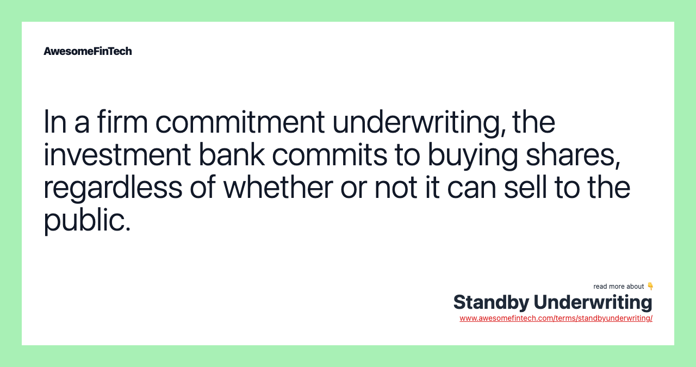

## Table of Contents

## What is standby underwriting?

Standby underwriting is a type of agreement between a company and an underwriter. In this agreement, the underwriter agrees to buy any unsold shares of a new stock issue if the public doesn't buy all of them. This helps the company make sure they can sell all their new shares and get the money they need.

It's like a safety net for the company. If not enough people want to buy the new shares, the underwriter steps in and buys the rest. This way, the company doesn't have to worry about what will happen if their new stock issue doesn't sell well. It gives them more confidence to go ahead with their plans.

## How does standby underwriting differ from firm commitment underwriting?

Standby underwriting and firm commitment underwriting are two ways that underwriters help companies sell new stocks. In standby underwriting, the underwriter agrees to buy any unsold shares only if the public doesn't buy all of them. This means the company tries to sell the shares to the public first, and the underwriter steps in as a backup if needed. It's like having a safety net; the underwriter is there to help if things don't go as planned.

In firm commitment underwriting, the underwriter agrees to buy all the new shares from the company right away, no matter what. The underwriter then tries to sell these shares to the public. This means the company gets the money it needs immediately, but the underwriter takes on more risk because they have to buy all the shares upfront. It's like the underwriter is fully committed to making sure the company gets its money, even if it means they have to work harder to sell the shares later.

## What are the key roles involved in standby underwriting?

In standby underwriting, the main roles are the company issuing the new stock and the underwriter. The company wants to sell new shares to raise money for its business. They work with an underwriter to make sure they can sell all their new shares. The underwriter's job is to step in and buy any shares that the public doesn't buy. This helps the company feel more secure about their new stock issue.

The underwriter also helps the company by giving advice on how to price the new shares and how to market them to the public. They use their knowledge of the stock market to help the company make the best decisions. If the public doesn't buy all the shares, the underwriter buys the rest, which means they take on some risk but also help the company succeed.

## What are the primary benefits of standby underwriting for issuers?

Standby underwriting helps issuers by giving them a safety net when they want to sell new shares. If not enough people buy the shares, the underwriter steps in and buys the rest. This means the issuer can be sure they will get the money they need, even if the stock doesn't sell well to the public. It's like having a backup plan that helps the issuer feel more confident about going ahead with their plans.

Another benefit is that standby underwriting can help issuers get better terms when they sell their shares. Because the underwriter is there to buy any unsold shares, the issuer might be able to set a higher price for the shares. This can help them raise more money. Plus, the underwriter can give the issuer advice on how to price and market the shares, which can make the whole process go more smoothly.

## How does the process of standby underwriting work?

When a company wants to sell new shares, they might choose standby underwriting to help them. In standby underwriting, the company first tries to sell the new shares to the public. They work with an underwriter who helps them set the price and market the shares. If all the shares sell to the public, everything is great, and the company gets the money it needs.

But if not all the shares sell, the underwriter steps in. The underwriter has agreed to buy any shares that the public doesn't buy. This means the company can still get all the money they wanted, even if the public doesn't buy all the shares. It's like a safety net for the company, making sure they can go ahead with their plans without worrying about unsold shares.

## What are the potential risks for underwriters in standby underwriting?

In standby underwriting, underwriters take on the risk of having to buy any shares that the public doesn't want. This means if the new stock issue doesn't sell well, the underwriter might have to spend a lot of money to buy the unsold shares. This can be risky because if the stock price drops after the underwriter buys the shares, they might lose money when they try to sell them later.

Another risk for underwriters is that they might not be able to sell the shares they bought at a good price. If the market conditions change or if people lose interest in the company, the underwriter might have to sell the shares at a lower price than they paid. This can lead to financial losses for the underwriter. So, while standby underwriting helps the company, it can be a risky job for the underwriter.

## In what scenarios is standby underwriting most commonly used?

Standby underwriting is most often used when a company wants to be sure they can sell all their new shares. This happens a lot when a company is doing a rights offering. A rights offering is when a company gives its current shareholders the chance to buy more shares before they offer them to the public. If not all the shareholders want to buy the new shares, the underwriter steps in and buys the rest. This helps the company make sure they get the money they need.

Another time standby underwriting is used is when a company is not sure how well their new stock will sell. Maybe the market is a bit shaky, or the company is new and not well-known yet. In these cases, having an underwriter ready to buy any unsold shares gives the company more confidence to go ahead with their plans. It's like having a safety net that helps the company feel more secure about selling their new shares.

## How do issuers and underwriters negotiate the terms of a standby underwriting agreement?

When issuers and underwriters negotiate the terms of a standby underwriting agreement, they talk about how much the underwriter will get paid for their help. The underwriter wants to be paid well because they are taking on the risk of buying any shares that don't sell. The issuer wants to pay as little as possible, so they can keep more of the money they raise. They also discuss how long the underwriter has to sell the shares they buy. The issuer might want the underwriter to sell the shares quickly, while the underwriter might want more time to find the best buyers.

Another important part of the negotiation is the price of the new shares. The issuer and underwriter need to agree on a price that will attract buyers but also help the issuer raise the money they need. The underwriter might suggest a lower price to make sure the shares sell well, while the issuer might want a higher price to raise more money. They also talk about what happens if the stock price goes down after the underwriter buys the shares. The underwriter might ask for some protection against losing money, while the issuer might not want to give too much. Both sides work to find a deal that works for them.

## What are the financial implications for an issuer if the standby underwriting is invoked?

If the standby underwriting is invoked, it means the underwriter has to buy any shares that the public didn't want. This helps the issuer because they still get all the money they were hoping to raise from selling the new shares. The issuer doesn't have to worry about what to do with unsold shares because the underwriter takes care of them. This can be really helpful for the issuer, especially if they were unsure about how well the new stock would sell.

However, there might be some costs for the issuer. The underwriter will usually charge a fee for their services, and this fee might be higher if they have to buy a lot of unsold shares. The issuer might also have to pay more if the underwriter needs some protection against losing money if the stock price goes down after they buy the shares. So, while standby underwriting helps the issuer get the money they need, it can also add to the costs they have to pay.

## How does standby underwriting affect the pricing of securities?

Standby underwriting can affect how a company decides to price their new shares. When a company knows that an underwriter will buy any unsold shares, they might feel more confident about setting a higher price for the shares. This is because they know they will still get the money they need, even if not all the shares sell to the public. The underwriter might also suggest a higher price if they think the market will support it, but they will want to make sure it's not so high that it scares away buyers.

On the other hand, the underwriter might suggest a lower price to make sure the shares sell well. If the price is too high, fewer people might want to buy the shares, and the underwriter will have to buy more of them. This can be risky for the underwriter because they might lose money if they have to sell the shares later at a lower price. So, the price of the new shares is a balance between what the company wants and what the underwriter thinks is best to minimize their risk.

## What are the regulatory considerations for standby underwriting?

When a company uses standby underwriting, they have to follow certain rules set by the government. These rules are there to make sure everything is fair and that people who buy the new shares are protected. For example, the company has to tell everyone about the standby underwriting agreement in their offering documents. They also need to make sure they don't say anything that could trick people into buying the shares. The government agencies, like the Securities and Exchange Commission (SEC) in the United States, watch over these things to make sure companies follow the rules.

The underwriter also has to follow some rules. They need to make sure they are doing a good job helping the company sell the new shares. If they have to buy any unsold shares, they need to be careful about how they sell them later. They can't do anything that would make the price of the shares go up or down in a way that's not fair. The underwriter has to report everything they do to the government, so the government can check that they are following the rules.

## Can you provide case studies or examples where standby underwriting played a critical role?

One example where standby underwriting was crucial happened with a company called XYZ Corp. XYZ Corp wanted to raise money by selling new shares, but they were worried that not all the shares would sell because the market was a bit uncertain. They decided to use standby underwriting to make sure they would get the money they needed. In the end, only 70% of the shares sold to the public, but the underwriter stepped in and bought the other 30%. This helped XYZ Corp raise all the money they wanted and go ahead with their plans without any worries.

Another case was with ABC Inc., a smaller company that was not very well-known. ABC Inc. wanted to do a rights offering, where they would give their current shareholders the chance to buy more shares before offering them to the public. They used standby underwriting to make sure they could sell all the new shares. When the rights offering happened, only half of the shareholders bought the new shares. The underwriter bought the rest, which helped ABC Inc. raise the money they needed to grow their business. This example shows how standby underwriting can be really helpful for companies, especially smaller ones that might not be as popular with the public.

## References & Further Reading

[1]: Marcos Lopez de Prado. ["Advances in Financial Machine Learning."](https://www.amazon.com/Advances-Financial-Machine-Learning-Marcos/dp/1119482089) Wiley, 2018.

[2]: David Aronson. ["Evidence-Based Technical Analysis: Applying the Scientific Method and Statistical Inference to Trading Signals."](https://www.amazon.com/Evidence-Based-Technical-Analysis-Scientific-Statistical/dp/0470008741) Wiley, 2007.

[3]: Stefan Jansen. ["Machine Learning for Algorithmic Trading."](https://github.com/stefan-jansen/machine-learning-for-trading) Packt Publishing, 2018.

[4]: Ernest P. Chan. ["Quantitative Trading: How to Build Your Own Algorithmic Trading Business."](https://www.amazon.com/Quantitative-Trading-Build-Algorithmic-Business/dp/0470284889) Wiley, 2008.

[5]: James Chen. ["Standby Underwriting."](https://www.investopedia.com.cach3.com/terms/s/standbyunderwriting.asp.html) Investopedia, 2023. 

[6]: Michael J. Fleming, "The Microstructure of the U.S. Treasury Market," *Financial Markets, Institutions & Instruments*, vol. 7, no. 5, pp. 1-46, 1998.

[7]: Rachev, S. T., Mittnik, S., Fabozzi, F. J., Focardi, S. M., & Jasic, T. ["Financial Econometrics: From Basics to Advanced Modeling Techniques."](https://www.wiley.com/en-us/Financial+Econometrics%3A+From+Basics+to+Advanced+Modeling+Techniques+-p-9780471784500) Wiley, 2007.