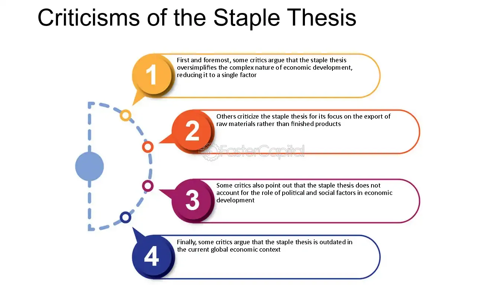

## Table of Contents

## What is the Staple Thesis?

The Staple Thesis is a theory about how countries grow their economies. It was first talked about by a Canadian economist named Harold Innis in the early 1900s. The theory says that a country can develop by focusing on exporting one main product, called a staple. For Canada, this staple was things like fur, fish, and later wheat and timber. The idea is that by selling these staples to other countries, a nation can earn money and use it to build industries and improve its economy.

Innis believed that the success of a staple could shape a country's whole economy and society. For example, the way Canada developed its transportation systems, like railways, was influenced by the need to move staples like wheat from farms to ports. Over time, the money made from staples could be used to start new industries, like manufacturing. However, Innis also pointed out that relying too much on one staple could be risky. If the demand for that staple dropped, it could hurt the country's economy. So, while the Staple Thesis helped explain Canada's growth, it also showed the importance of diversifying the economy.

## Who developed the Staple Thesis and when?

The Staple Thesis was developed by a Canadian economist named Harold Innis. He came up with this idea in the early 1900s. Innis was trying to understand how countries like Canada grew their economies. He noticed that Canada's growth was closely tied to exporting certain key products, which he called staples. These staples included things like fur, fish, wheat, and timber.

Innis believed that by focusing on exporting these staples, a country could earn money and use it to build other parts of its economy. For example, the money made from selling wheat could be used to build railways and start new industries. However, Innis also warned that relying too much on one staple could be risky. If the demand for that staple went down, it could hurt the country's economy. So, while the Staple Thesis helped explain Canada's growth, it also showed the importance of not putting all the country's eggs in one basket.

## What are the main components of the Staple Thesis?

The Staple Thesis is a theory about how countries can grow their economies by focusing on one main product, called a staple. This idea was first talked about by a Canadian economist named Harold Innis in the early 1900s. The main part of the Staple Thesis is that a country can earn money by exporting its staple to other countries. For example, Canada's staples included fur, fish, wheat, and timber. By selling these products, Canada could make money and use it to build other parts of its economy, like transportation systems and new industries.

Another important part of the Staple Thesis is how the success of a staple can shape a country's whole economy and society. For instance, the need to move wheat from farms to ports in Canada led to the building of railways. This shows how the staple can influence the development of infrastructure and other industries. However, Innis also pointed out that relying too much on one staple can be risky. If the demand for the staple goes down, it could hurt the country's economy. So, while the Staple Thesis explains how countries can grow by focusing on a staple, it also highlights the importance of having a diverse economy to avoid risks.

## How does the Staple Thesis explain economic development?

The Staple Thesis explains economic development by saying that a country can grow its economy by focusing on exporting one main product, called a staple. For Canada, this staple was things like fur, fish, wheat, and timber. By selling these products to other countries, Canada could earn money. This money could then be used to build things like railways and start new industries. This idea was first talked about by a Canadian economist named Harold Innis in the early 1900s. He noticed that countries could develop by using the money from their staples to improve their economies.

Innis also believed that the success of a staple could shape a whole country's economy and society. For example, the need to move wheat from farms to ports in Canada led to the building of railways. This shows how the staple can influence the development of infrastructure and other industries. However, Innis pointed out that relying too much on one staple can be risky. If the demand for the staple drops, it could hurt the country's economy. So, while the Staple Thesis explains how countries can grow by focusing on a staple, it also shows the importance of having a diverse economy to avoid risks.

## Can you provide examples of staple products discussed in the Staple Thesis?

The Staple Thesis talks about how countries can grow their economies by focusing on one main product, called a staple. In Canada, one of the key staples was fur. During the early days of Canada's history, people hunted animals like beavers for their fur and sold it to Europe. This helped Canada make money and build its economy. Another important staple for Canada was fish, especially cod. Fishermen caught cod off the coast of Newfoundland and sold it to other countries. This also helped Canada earn money and grow.

Another staple discussed in the Staple Thesis is wheat. As Canada's farming industry grew, wheat became a big product that the country sold to other places. The money from selling wheat helped Canada build railways to move the wheat from farms to ports. Timber, or wood, was also a staple. Canada cut down trees and sold the wood to other countries. This helped Canada's economy grow by [earning](/wiki/earning-announcement) money from selling timber. All these examples show how focusing on one main product can help a country develop its economy.

## What are the criticisms of the Staple Thesis regarding its assumptions?

Some people criticize the Staple Thesis because it assumes that a country can grow its economy just by focusing on one main product. They say this idea is too simple. Not every country that focuses on a staple will do well. For example, if a country only sells one thing and other countries stop wanting it, the economy can get into trouble. Also, the Staple Thesis does not talk much about how other things like technology, government policies, or global trade rules can affect a country's growth. These critics think that a country's economy is influenced by many factors, not just one staple product.

Another criticism is that the Staple Thesis might not work for all countries. It was based on Canada's history, where staples like fur, fish, wheat, and timber helped the country grow. But other countries might not have the same resources or the same luck with their staples. Critics also say that the Staple Thesis does not explain how a country can move from selling raw materials to making finished products. This is important because selling finished products can make more money than selling raw materials. So, while the Staple Thesis helped explain Canada's growth, it might not fit every country's situation.

## How has the Staple Thesis been applied to different countries or regions?

The Staple Thesis has been used to explain how different countries and regions grew their economies by focusing on one main product. For example, in Canada, the theory was first developed by Harold Innis to explain how Canada grew by selling staples like fur, fish, wheat, and timber. Canada used the money from these products to build railways and start new industries. In Australia, people have used the Staple Thesis to talk about how the country grew by selling wool and minerals. Just like Canada, Australia used the money from these staples to develop its economy.

Another place where the Staple Thesis has been applied is in Latin America. Countries like Argentina and Brazil have been studied using this theory. Argentina grew by selling beef and wheat, while Brazil focused on coffee and sugar. These countries used the money from their staples to build up their economies. However, not every country that focused on a staple did well. Some countries faced problems when the demand for their staple went down. This shows that while the Staple Thesis can help explain how some countries grew, it might not work for everyone.

## What are the limitations of the Staple Thesis in explaining modern economies?

The Staple Thesis has some limitations when it comes to explaining how modern economies work. One big problem is that it focuses too much on one main product, called a staple. But today, most countries have many different products and services. They don't just rely on one thing. Also, the Staple Thesis does not talk about how things like technology, government policies, and global trade rules can affect a country's economy. These things are very important in today's world. For example, technology can change how we make and sell things, and global trade rules can open up new markets or close old ones.

Another limitation is that the Staple Thesis was based on Canada's history, where staples like fur, fish, wheat, and timber helped the country grow. But not every country has the same resources or the same luck with their staples. Some countries might not have a strong staple to begin with. Also, the Staple Thesis does not explain how a country can move from selling raw materials to making finished products. In modern economies, selling finished products can make more money than selling raw materials. So, while the Staple Thesis helped explain Canada's growth, it might not fit every country's situation today.

## How have scholars modified or expanded upon the original Staple Thesis?

Scholars have modified and expanded upon the original Staple Thesis to make it more relevant to today's world. They realized that relying on just one main product, or staple, is not enough for modern economies. So, they started looking at how countries can use the money from their staples to build new industries and make finished products. This is called the "linkages" idea. It means that the staple can help create other parts of the economy, like manufacturing or services. For example, if a country sells a lot of oil, it can use the money to build factories that make things from oil, like plastics.

Another way scholars have expanded the Staple Thesis is by considering other factors that affect a country's economy. They talk about how things like technology, government policies, and global trade rules can make a big difference. For instance, new technology can change how a country makes and sells its products. Government policies can help or hurt a country's economy by setting rules for businesses. And global trade rules can open up new markets or close old ones. By looking at these factors, scholars can better understand how countries grow their economies today.

## What role does technology play in the Staple Thesis according to critics?

Critics say that the Staple Thesis does not talk enough about how technology can change a country's economy. They think that technology is very important because it can help a country make and sell its products better. For example, if a country uses new technology to farm wheat, it can grow more wheat and make more money. But the Staple Thesis was made a long time ago when technology was not as important. So, critics say that the theory misses out on how technology can help a country grow its economy today.

Also, critics point out that technology can help a country move from just selling raw materials to making finished products. This is important because selling finished products can make more money than selling raw materials. For instance, if a country sells oil, it can use new technology to turn the oil into things like plastics and sell those. The Staple Thesis does not explain how this can happen. So, critics say that to understand modern economies, we need to think about how technology can help countries grow and change.

## How does the Staple Thesis relate to other economic theories?

The Staple Thesis is like a cousin to other economic theories because it talks about how countries can grow their economies. One theory it is related to is the Dependency Theory. This theory says that rich countries get richer by using resources from poor countries. The Staple Thesis is a bit different because it focuses on how a country can use its own resources, like fur or wheat, to grow. But both theories talk about how countries can use their resources to develop their economies.

Another theory that the Staple Thesis is related to is the Export-Led Growth model. This model says that a country can grow by selling a lot of its products to other countries. The Staple Thesis is similar because it also says that selling one main product, or staple, can help a country's economy. But the Staple Thesis is more specific because it talks about how the money from selling the staple can be used to build other parts of the economy, like railways or new industries. So, while the Staple Thesis shares some ideas with other theories, it has its own special way of explaining how countries can grow.

## What are the current debates surrounding the relevance of the Staple Thesis?

The Staple Thesis is still talked about today, but some people think it's not as useful as it used to be. They say that the world has changed a lot since Harold Innis came up with the idea. Countries don't just rely on one main product anymore. They have many different products and services. Also, things like technology, government rules, and global trade deals are very important now. These things can help or hurt a country's economy in ways that the Staple Thesis does not explain. So, some people argue that the Staple Thesis is too simple to help us understand today's complex economies.

However, other people think the Staple Thesis can still be useful if we change it a bit. They say we can use the idea of "linkages" to make it better. This means that the money from selling a staple can be used to start new industries and make finished products, not just sell raw materials. For example, if a country sells oil, it can use the money to make things like plastics. By thinking about these linkages, we can see how the Staple Thesis can still help us understand how countries grow their economies. But we need to remember that it's just one part of the puzzle and other factors, like technology and global trade, also matter a lot.

## References & Further Reading

[1]: Innis, H. A. (1956). ["The Fur Trade in Canada: An Introduction to Canadian Economic History."](https://archive.org/details/FURTRADEINCANADA) University of Toronto Press.

[2]: Mackintosh, W. A. (1939). ["Economic Factors in Canadian History."](https://www.semanticscholar.org/paper/Economic-Factors-in-Canadian-History-Mackintosh/54708d0cf11433d9109bc3ca4110d9a21a5b3753)

[3]: Andrew B. Bernard, Jonathan Eaton, J. Bradford Jensen, & Samuel Kortum. (2003). ["Plants and Productivity in International Trade."](https://www.aeaweb.org/articles?id=10.1257/000282803769206296) American Economic Review.

[4]: Gomber, P., Arndt, B., Lutat, M., & Uhle, T. (2011). ["High-Frequency Trading."](https://papers.ssrn.com/sol3/papers.cfm?abstract_id=1858626) In Algorithmic Trading and DMA. 

[5]: Engle, R. & Russell, J. (1998). ["Autoregressive Conditional Duration: a New Model for Irregularly Spaced Transaction Data."](https://www.jstor.org/stable/2999632) Econometrica. 

[6]: Lopez de Prado, M. (2018). ["Advances in Financial Machine Learning."](https://www.amazon.com/Advances-Financial-Machine-Learning-Marcos/dp/1119482089) Wiley.

[7]: Jansen, S. (2020). ["Machine Learning for Algorithmic Trading."](https://github.com/stefan-jansen/machine-learning-for-trading) Packt Publishing.

[8]: Chan, E. P. (2008). ["Quantitative Trading: How to Build Your Own Algorithmic Trading Business."](https://github.com/ftvision/quant_trading_echan_book) Wiley.