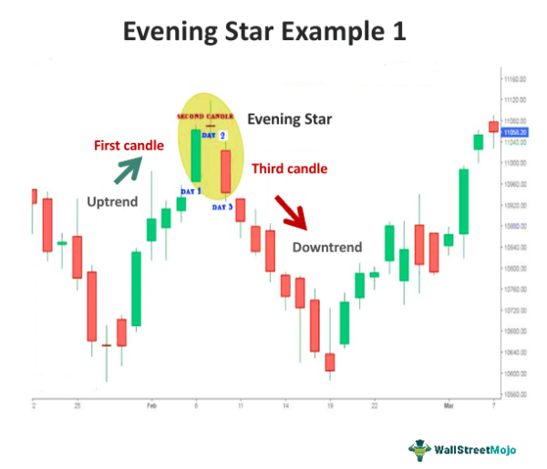

Candlestick patterns serve as crucial tools in technical analysis for traders, providing visual insights into market sentiment and potential price reversals. Among these, the Morning Star and Evening Star patterns are two prominent indicators that can signal potential market turning points. By examining their characteristics, traders can spot opportunities for entering or exiting trades, thus refining their strategies.

The Morning Star pattern typically indicates a bullish reversal and occurs after a downtrend. Conversely, the Evening Star signifies a bearish reversal, emerging after an uptrend. For traders using algorithmic strategies, integrating these patterns can lead to more efficient trade execution by automatically identifying potential trend reversals. This automated approach not only enhances execution speed but also reduces the emotional biases inherent in manual trading.



A comprehensive understanding of Morning Star and Evening Star patterns, including their formation and signals, is invaluable for both novice and experienced traders. By incorporating these patterns into algorithmic trading systems, traders can optimize their decision-making processes, improving the overall performance of their trading portfolios. This article aims to provide a clear overview of these patterns, enabling traders to effectively incorporate them into their trading strategies.

## Table of Contents

## Understanding Star Candlestick Patterns

Candlestick patterns are powerful tools in technical analysis, providing traders with visual representations of market sentiment and potential price reversals. These patterns have been used for centuries to forecast market trends, leveraging the psychological relationships between buyers and sellers.

The Morning Star and Evening Star are among the most recognized candlestick patterns, often used to identify potential shifts in market direction. These patterns typically suggest a change in the current market trend—bullish for the Morning Star and bearish for the Evening Star.

A typical star pattern, whether a Morning Star or Evening Star, is characterized by a small-bodied candle that appears after a series of candles reflecting a particular trend. This small-bodied candle indicates market indecision, suggesting that neither buyers nor sellers are gaining dominance. As a result, a reversal may be imminent.

For example, the Morning Star pattern emerges at the bottom of a downtrend. It consists of three candles: a long bearish candle reflecting strong selling pressure, followed by the small-bodied candle indicating potential indecision, and finally, a long bullish candle suggesting the beginning of a new uptrend. Conversely, the Evening Star pattern appears after an uptrend and signals a potential bearish reversal. It starts with a long bullish candle, follows with a small-bodied candle, and concludes with a long bearish candle, signaling increased selling [momentum](/wiki/momentum).

Traders closely monitor these patterns as they can offer insights into potential market trend changes. By understanding and identifying the Morning Star and Evening Star patterns, traders can better anticipate possible reversals and adjust their trading strategies accordingly. The ability to recognize and interpret these patterns can be crucial in making informed trading decisions and optimizing strategies for better market outcomes.

## Characteristics of Morning Star and Evening Star Patterns

The Morning Star and Evening Star patterns are essential formations in technical analysis, each serving as a critical indicator of potential market reversals.

The Morning Star pattern is recognized as a bullish reversal indicator that typically emerges following a sustained downtrend. This formation comprises three distinct candles:

1. The first candle is a long bearish candle, reflecting strong selling activity and continuation of the downward trend.
2. The second candle is a smaller-bodied candle, which could be bearish, bullish, or neutral (doji). This candle signifies a period of market indecision where the prevailing selling pressure begins to wane.
3. The third candle is a long bullish candle, indicating a surge in buying pressure and a potential reversal of the prior bearish sentiment.

The Evening Star pattern serves as the bearish counterpart, signaling a potential reversal after a prevailing uptrend. This pattern also consists of three components:

1. The initial candle is a long bullish candle, showing strong buying activity that continues the upward trend.
2. The subsequent candle is a small-bodied candle, signifying market indecision and the diminishing of the prior bullish momentum.
3. The final candle is a long bearish candle, which reflects increased selling pressure and suggests a reversal to the downside.

These candlestick patterns are valuable to traders as they signal shifts in market sentiment. Investors often combine the analysis of Morning Star and Evening Star patterns with other technical indicators to confirm the strength of the signals provided by these formations. Each pattern's accuracy and reliability can be further examined through the inclusion of trading volumes and other technical analysis tools, enhancing traders’ strategic decision-making capabilities.

## Algorithmic Trading with Star Patterns

Algorithmic trading utilizes predefined rules and patterns, such as Morning and Evening Stars, to automate the execution of trades, enhancing efficiency and precision in financial markets. These candlestick patterns can be programmed into trading algorithms to swiftly identify potential entry and [exit](/wiki/exit-strategy) points, reflecting changes in market trends.

Morning and Evening Star patterns serve as indicators of market reversals. In [algorithmic trading](/wiki/algorithmic-trading), these patterns are implemented using parameters that quantify specific conditions: 

1. **Identification of Patterns**: Algorithms are developed to recognize the three-candle formation of Morning and Evening Stars. This involves setting criteria for each candle's size and position in relation to the trend, thus ensuring accurate detection of these patterns.

2. **Optimizing Entry and Exit Points**: Algorithms can be configured to execute trades once a star pattern is validated. For instance, upon recognizing a Morning Star, a trading algorithm might trigger a buy order. Conversely, identifying an Evening Star might result in a sell order. 

3. **Implementing Risk Management**: Setting stop losses and profit targets is crucial in algo trading. A stop loss ensures that potential losses are capped when a trade does not go as predicted, while profit targets lock in gains when price moves favorably. This can be done by determining a percentage based on previous volatility or market conditions. For example:

    ```python
    def calculate_stop_loss(entry_price, volatility):
        return entry_price - volatility * 2

    def calculate_profit_target(entry_price, target_multiplier):
        return entry_price + (entry_price * target_multiplier)
    ```

4. **Backtesting and Analysis**: Before deploying algorithms with star patterns, extensive backtesting against historical data helps refine these strategies. This involves analyzing past market performance to assess the patterns' reliability and adjust the algorithm parameters to enhance performance.

5. **Automating Trade Execution**: Deployment of algorithms ensures automatic execution of trades based on pre-set criteria, minimizing human error. This includes real-time monitoring of market conditions to adapt strategies as needed.

By carefully structuring algorithms to incorporate Morning and Evening Star patterns, traders can achieve a higher level of precision in timing trades, thereby optimizing market entry and exit in alignment with market reversals.

## Benefits of Using Star Patterns in Trading Algorithms

Incorporating star patterns, specifically the Morning Star and Evening Star, into trading algorithms offers several advantages for traders seeking to enhance their strategy's accuracy and effectiveness. These patterns serve as reliable indicators of potential market reversals, providing additional confirmation that can help traders make more informed decisions.

The first benefit is the reduction of emotional decision-making. By relying on predefined patterns and signals, traders can maintain a systematic and disciplined approach to trading. Algorithmic systems can identify and respond to these patterns with consistency, mitigating the emotional biases that often influence manual trading decisions. This systematic approach allows traders to adhere to their trading rules, improving the discipline of execution.

Star patterns also assist in accurately pinpointing entry and exit points within the trading process. By using these patterns as part of an algorithm, traders can program automated responses to specific conditions that arise when these patterns appear. This offers a structured method for capitalizing on market reversals identified by the Morning Star and Evening Star patterns. The integration of these indicators into algorithms can enhance the precision with which trading strategies operate by providing additional confirmation when the patterns align with other technical indicators.

Understanding the [volume](/wiki/volume-trading-strategy) and market conditions accompanying these patterns is vital. When programmed into trading algorithms, the patterns can be conditioned to account for volume spikes that typically confirm a reversal. This additional layer of analysis can lead to more robust decision-making processes, as the volume serves to validate the significance of the observed star patterns. Incorporating volume considerations ensures that signals are not isolated but are instead reflective of broader market conditions.

Additionally, the implementation of star patterns within trading algorithms simplifies the [backtesting](/wiki/backtesting) process. Backtesting allows traders to simulate how their strategies would have performed in the past, using historical data to test the reliability and effectiveness of the star patterns in various market scenarios. Through such analysis, traders can refine their algorithms to optimize performance metrics such as profitability, drawdown, and risk-adjusted returns.

Overall, the integration of Morning Star and Evening Star patterns into trading algorithms enhances decision-making by providing systematic, emotionally unbiased signals. This structured approach, coupled with volume verification and backtested confirmations, allows traders to execute more effective strategies in identifying and exploiting market reversals.

## Challenges and Considerations

Star candlestick patterns, such as the Morning Star and Evening Star, are valuable tools for predicting potential market reversals. However, relying solely on these patterns can lead to misleading conclusions and suboptimal trading decisions. To optimize the effectiveness of these patterns, traders should integrate them with other technical indicators and be cognizant of market conditions.

Volume confirmation plays an essential role in validating the signals provided by star patterns. Volume refers to the number of shares or contracts traded in a security or market during a given period. When a Morning Star or Evening Star forms, observing a corresponding increase in volume can indicate a stronger and more reliable reversal signal. For instance, if a Morning Star pattern emerges after a downtrend, a surge in trading volume during the formation of the pattern's third candle—a bullish candle—can reinforce the signal of a potential upward reversal. Conversely, an Evening Star pattern followed by increased volume during the third candle—a bearish candle—can confirm the likelihood of a downturn.

In addition to volume, traders should consider other technical indicators to corroborate the reversal suggested by star patterns. Moving averages, relative strength index (RSI), and stochastic oscillators can provide further insights into market momentum and potential trend shifts. For example, if a Morning Star pattern is observed alongside a bullish crossover in moving averages, the likelihood of a reversal may be strengthened. Similarly, an overbought condition identified by the RSI can reinforce the bearish implications of an Evening Star pattern.

External market factors, such as economic data releases, geopolitical events, and market sentiment, can also impact the success of candlestick patterns. Traders need to remain informed about these variables, as they can influence market dynamics and potentially invalidate signals provided by technical patterns. For instance, a Morning Star pattern may suggest a bullish reversal, but adverse economic news or geopolitical tensions could undermine its reliability.

In summary, while star patterns offer significant insights into potential market reversals, their effectiveness is enhanced when combined with volume confirmation, other technical indicators, and an awareness of broader market factors. Adopting a holistic approach to technical analysis can aid traders in making more informed and strategic decisions in the financial markets.

## Conclusion

Morning Star and Evening Star patterns are essential tools in a trader's arsenal, offering insights into potential market reversals. These candlestick formations provide clear, visual indicators of trend shifts, which can be instrumental in making informed trading decisions. By identifying these patterns, traders can anticipate shifts from a bearish market to a bullish one with the Morning Star, or from bullish to bearish with the Evening Star.

In algorithmic trading, these patterns can be automated, serving as triggers for strategic entry and exit points. By programming trading algorithms to recognize these patterns, traders can enhance trading performance and manage risks more effectively. Automation reduces the reliance on emotional decision-making and improves efficiency by executing trades swiftly based on predefined criteria. Incorporating these patterns into algo trading systems involves setting precise parameters for entry, exit, stop losses, and profit targets, ensuring a systematic approach to market movements.

A deep understanding of Morning and Evening Star patterns, paired with other technical analysis principles, can greatly elevate a trader's strategy in financial markets. When combined with additional technical indicators like moving averages or Relative Strength Index (RSI), these patterns can provide robust signals that enhance the reliability of market predictions. In doing so, traders can better navigate the complexities of the markets, potentially increasing profitability while minimizing losses. 

Ultimately, while Morning Star and Evening Star patterns are valuable, their effectiveness is heightened when used as part of a comprehensive trading strategy that includes a variety of analytical tools and market insights.

## References & Further Reading

[1]: Bergstra, J., Bardenet, R., Bengio, Y., & Kégl, B. (2011). ["Algorithms for Hyper-Parameter Optimization."](https://dl.acm.org/doi/10.5555/2986459.2986743) Advances in Neural Information Processing Systems 24.

[2]: ["Advances in Financial Machine Learning"](https://www.amazon.com/Advances-Financial-Machine-Learning-Marcos/dp/1119482089) by Marcos Lopez de Prado

[3]: ["Evidence-Based Technical Analysis: Applying the Scientific Method and Statistical Inference to Trading Signals"](https://www.amazon.com/Evidence-Based-Technical-Analysis-Scientific-Statistical/dp/0470008741) by David Aronson

[4]: ["Machine Learning for Algorithmic Trading"](https://github.com/stefan-jansen/machine-learning-for-trading) by Stefan Jansen

[5]: ["Quantitative Trading: How to Build Your Own Algorithmic Trading Business"](https://www.amazon.com/Quantitative-Trading-Build-Algorithmic-Business/dp/1119800064) by Ernest P. Chan