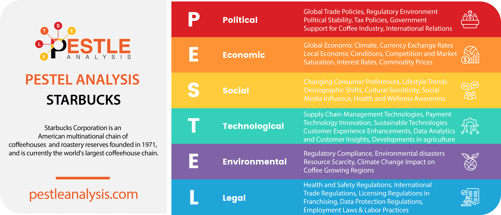

## Table of Contents

## What is the Starbucks Index?

The Starbucks Index is a fun way to compare how much things cost in different countries. It looks at the price of a tall latte at Starbucks in various places around the world. By comparing these prices, people can see how the cost of living changes from one country to another.

This index is not an official measure, but it helps give a simple idea of economic differences. For example, if a latte costs more in one country than another, it might mean that things are generally more expensive there. It's a bit like the Big Mac Index, which uses the price of a McDonald's burger to compare costs. The Starbucks Index makes it easy for anyone to understand these differences, even if they don't know much about economics.

## How does the Starbucks Index measure economic conditions?

The Starbucks Index measures economic conditions by looking at the price of a tall latte at Starbucks in different countries. If a latte costs more in one country, it might mean that things are generally more expensive there. This can show how the cost of living changes from one place to another. It's a simple way to understand if a country's economy makes things more or less expensive for people living there.

This index isn't an official way to measure economies, but it helps give a clear picture that anyone can understand. By comparing the price of something familiar like a latte, people can see economic differences without needing to know a lot about economics. It's similar to the Big Mac Index, which uses the price of a burger to compare costs around the world. The Starbucks Index makes it easy for everyone to see how economies affect everyday prices.

## What is the significance of using Starbucks coffee prices in the index?

Using Starbucks coffee prices in the index is important because Starbucks is a well-known brand all around the world. This means that people in many different countries are familiar with Starbucks and know what a tall latte is. By looking at the price of a tall latte, the index can easily compare costs across different places. Since Starbucks tries to keep its products and service the same everywhere, the price of a latte can show how much more or less expensive things are in one country compared to another.

The Starbucks Index helps people understand economic differences in a simple way. It's not a fancy or official measure, but it uses something that many people can relate to - the cost of a coffee. This makes it easier for everyone to see how the economy affects everyday prices. By comparing the price of a latte, people can get a quick idea of how the cost of living changes from one country to another, without needing to know a lot about economics.

## How is the Starbucks Index calculated?

The Starbucks Index is calculated by looking at the price of a tall latte at Starbucks in different countries. Someone goes to Starbucks stores around the world and writes down how much a tall latte costs in each place. They then compare these prices to see how they differ from one country to another. This helps show how the cost of living changes across different places.

This index isn't a fancy or official way to measure economies, but it uses something simple and familiar - the price of a coffee. By comparing the price of a tall latte, people can easily understand how much more or less expensive things are in one country compared to another. It's a fun and easy way for anyone to see economic differences without needing to know a lot about economics.

## Can you explain the methodology behind the Starbucks Index?

The Starbucks Index is all about looking at the price of a tall latte at Starbucks in different countries. Someone goes to Starbucks stores around the world and writes down how much a tall latte costs in each place. They then compare these prices to see how they differ from one country to another. This helps show how the cost of living changes across different places.

This index isn't a fancy or official way to measure economies, but it uses something simple and familiar - the price of a coffee. By comparing the price of a tall latte, people can easily understand how much more or less expensive things are in one country compared to another. It's a fun and easy way for anyone to see economic differences without needing to know a lot about economics.

## What are the main countries included in the Starbucks Index?

The Starbucks Index includes many countries where Starbucks has stores. Some of the main countries in the index are the United States, Canada, the United Kingdom, Japan, China, and Australia. These countries are chosen because Starbucks is popular there and people know what a tall latte is.

By looking at the price of a tall latte in these countries, the index shows how the cost of living changes from one place to another. For example, a latte might cost more in Japan than in the United States, which can mean things are generally more expensive in Japan. This helps people understand economic differences in a simple way.

## How does the Starbucks Index compare to other economic indicators like the Big Mac Index?

The Starbucks Index and the Big Mac Index are both fun ways to compare how much things cost in different countries. They both use something familiar - a tall latte for the Starbucks Index and a Big Mac for the Big Mac Index. By looking at the price of these items around the world, people can see how the cost of living changes from one place to another. Both indexes are not official ways to measure economies, but they help give a simple idea of economic differences that anyone can understand.

The main difference between the two indexes is what they use to compare costs. The Starbucks Index uses the price of a tall latte, which is a drink from Starbucks, a popular coffee shop around the world. The Big Mac Index, on the other hand, uses the price of a Big Mac, a burger from McDonald's, another well-known brand. Both items are easy to recognize, but they might not be available in every country or might be more popular in some places than others. This can affect how accurate the indexes are in showing economic differences.

## What are some real-world applications of the Starbucks Index?

The Starbucks Index helps people understand how much things cost in different countries by looking at the price of a tall latte at Starbucks. This can be useful for travelers who want to know if things will be more or less expensive in the places they are visiting. For example, if a latte costs more in Japan than in the United States, a traveler might expect to spend more money on other things in Japan too. It's a simple way to get a quick idea of the cost of living without needing to know a lot about economics.

Businesses can also use the Starbucks Index to help them decide where to open new stores or offices. If they see that a tall latte costs a lot in a certain country, it might mean that people there have more money to spend. This could make it a good place to start a business. The index gives businesses a simple way to compare costs and make decisions about where to grow.

## What criticisms have been leveled against the Starbucks Index?

Some people say the Starbucks Index isn't a good way to measure how much things cost in different countries. One reason is that Starbucks isn't everywhere. There are some places where you can't find a Starbucks, so the index can't tell you anything about those places. Also, the price of a tall latte might not be the same everywhere in a country. It could be more expensive in big cities than in smaller towns. This means the index might not show the whole picture of how much things cost.

Another criticism is that a tall latte is a luxury item, not something everyone buys. In some countries, people might not spend money on coffee from Starbucks because it's too expensive. This means the Starbucks Index might not show what everyday life costs for most people. It's more about how much money people who can afford Starbucks have to spend, not how much things cost for everyone.

## How does the Starbucks Index account for variations in local purchasing power?

The Starbucks Index tries to show how the cost of living changes from one country to another by looking at the price of a tall latte at Starbucks. It doesn't directly measure local purchasing power, but it can give a hint about it. If a tall latte costs a lot in a country, it might mean that things are generally more expensive there. This could mean that people in that country need more money to buy the same things as people in other places. So, even though the Starbucks Index doesn't measure purchasing power directly, it can help people guess how much money they might need to live comfortably in different countries.

However, the Starbucks Index has some problems when it comes to showing local purchasing power accurately. A tall latte is a luxury item, and not everyone in every country can afford to buy one. In some places, people might spend their money on other things that are more important to them, like food or rent. This means the price of a tall latte might not show what everyday life costs for most people in a country. Also, Starbucks isn't everywhere, so the index can't tell you about the cost of living in places where there are no Starbucks stores.

## What are the limitations of using the Starbucks Index as an economic indicator?

The Starbucks Index has some problems when it's used to understand how economies work. One big issue is that Starbucks isn't everywhere. There are places in the world where you can't find a Starbucks, so the index can't tell you anything about those places. Also, the price of a tall latte might be different in different parts of the same country. It could be more expensive in big cities than in small towns. This means the index might not show the whole picture of how much things cost.

Another problem is that a tall latte is a luxury item, not something everyone buys. In some countries, people might not spend money on coffee from Starbucks because it's too expensive. This means the Starbucks Index might not show what everyday life costs for most people. It's more about how much money people who can afford Starbucks have to spend, not how much things cost for everyone. So, while the Starbucks Index can give a quick idea of economic differences, it doesn't tell the full story.

## How has the Starbucks Index evolved since its inception?

The Starbucks Index started as a simple way to compare the cost of living in different countries by looking at the price of a tall latte at Starbucks. When it first began, it was mostly used by travelers and people interested in how much money they might need to live comfortably in different places. The idea was to use something familiar and easy to understand, like the price of a coffee, to show economic differences around the world.

Over time, the Starbucks Index has become more popular and is now used by businesses too. Companies look at the index to help them decide where to open new stores or offices. If a tall latte costs a lot in a certain country, it might mean that people there have more money to spend, making it a good place to start a business. However, the index has stayed simple and hasn't changed much in how it's calculated. It still uses the price of a tall latte, but now more people know about it and use it to understand economic differences.

## What is the Starbucks Index and how can it be understood?

The Starbucks Index is an innovative economic indicator that emerged as a tool to gauge purchasing power parity (PPP) by examining the cost of a tall latte in Starbucks outlets across various countries. Originating as a concept paralleling the well-known Big Mac Index, it provides insights into the value of currencies through commodity cost comparisons. The inherent simplicity of the Starbucks Index lies in its focus on a single consumer product, enabling straightforward cross-border price comparisons.

Purchasing Power Parity, a critical economic theory, posits that in an efficient market without transaction costs or trade barriers, identical goods should have the same price when expressed in a common currency. The Starbucks Index operationalizes this theory by using the price of a tall latte as a standardized good. By comparing the price of this beverage across countries, the index attempts to highlight discrepancies in currency valuations. If a tall latte is cheaper in one country compared to another, it suggests that the currency of the first country might be undervalued relative to the second.

For example, consider that the price of a tall latte in New York, USA is $3.50, whereas the same product costs £2.50 in London, UK. To evaluate these prices on a common scale, they need to be expressed in the same currency, say, USD. Assuming an exchange rate of 1 British Pound = 1.30 USD, the price of the latte in London can be converted to USD: 

$$
\text{Price in London} = 2.50 \times 1.30 = 3.25\, \text{USD}
$$

In this scenario, the Starbucks Index indicates that the latte is more expensive in New York, suggesting that the US dollar may be overvalued compared to the British pound.

Furthermore, the index helps infer currency valuations by examining price discrepancies. If a latte is considerably cheaper in one country than in another, it might signal room for currency appreciation or indicate potential economic imbalances. Conversely, a higher price could reflect either a stronger currency or higher local production costs, taxes, or tariffs, which might also need consideration for accurate economic analysis.

By focusing on a standardized consumer product widely available in diverse locales, the Starbucks Index simplifies complex global economic interactions into more relatable metrics. It thus provides a practical, albeit simplified, lens through which variations in currency value and purchasing power can be observed and analyzed.

## What is Purchasing Power Parity (PPP) and how is it explained?

Purchasing Power Parity (PPP) is a fundamental economic theory that helps compare the relative value of currencies against one another. It is based on the idea that in the absence of transaction costs and other barriers, the same basket of goods should have the same price when expressed in a common currency. This principle seeks to measure and compare economic productivity and standards of living across countries by eliminating currency value distortions.

The concept of PPP can be divided into two main categories: absolute PPP and relative PPP. Absolute Purchasing Power Parity suggests that the exchange rate between two currencies should equal the ratio of the price levels of a fixed basket of goods and services between two countries. This can be mathematically expressed as:

$$

E = \frac{P_1}{P_2} 
$$

where $E$ is the exchange rate, $P_1$ is the price of the basket of goods in country one, and $P_2$ is the price in country two. Absolute PPP assumes that the same goods are available in both countries and that there are no transportation costs or trade barriers.

Relative PPP, on the other hand, focuses on changes in price levels and their impact on exchange rates. It posits that the rate of change in the exchange rate between two countries’ currencies over time should be proportional to the difference in inflation rates between them. This can be represented by the formula:

$$

\frac{\Delta E}{E} = \frac{\Delta P_1}{P_1} - \frac{\Delta P_2}{P_2} 
$$

Relative PPP is often seen as a more practical application as it accounts for inflation and other dynamic economic variables, offering insights into how exchange rates adjust over time following economic shocks.

The significance of PPP extends beyond just currency valuation; it serves as a tool for comparing economic productivity and standards of living. By assessing the purchasing power of currencies, economists can make informed analyses about how different economies perform relative to one another. This comparison helps in understanding discrepancies in living costs, real income levels, and economic well-being across regions. For instance, if a nation's currency is undervalued, it might signal higher productivity or lower cost of living than its trading partners, providing opportunities or challenges in trade and investment.

PPP thus plays a critical role in macroeconomic analysis, offering a framework that helps nations, corporations, and analysts to navigate the complexities of international trade, investment, and living standards, facilitating a deeper understanding of global economic interrelations.

## References & Further Reading

[1]: Rogoff, K. (1996). ["The Purchasing Power Parity Puzzle."](https://scholar.harvard.edu/rogoff/publications/purchasing-power-parity-puzzle) Journal of Economic Literature, 34(2), 647-668.

[2]: Cady, R. D. (2019). ["The Big Mac Index and Real Exchange Rates."](https://econbrowser.com/archives/2019/07/of-big-macs-ppp-the-penn-effect-and-currency-misalignment) American Business Review, 37(1), 83-94.

[3]: ["Exchange Rate Economics: Theories and Evidence"](https://www.taylorfrancis.com/books/mono/10.4324/9780203380185/exchange-rate-economics-ronald-macdonald) by Ronald MacDonald and Ian W. Marsh

[4]: ["Algorithmic Trading: Winning Strategies and Their Rationale"](https://books.google.com/books/about/Algorithmic_Trading.html?id=WAlFDwAAQBAJ) by Ernest P. Chan

[5]: ["Purchasing Power Parity and Real Exchange Rates: Theory and Evidence"](https://www.cambridge.org/core/books/economics-of-exchange-rates/purchasing-power-parity-and-the-real-exchange-rate/9946771E1071901CF528D73B060F8B43) by Sarno, L. & Taylor, M. P. (2002)

[6]: ["The Little Book of Currency Trading: How to Make Big Profits in the World of Forex"](https://archive.org/details/littlebookofcurr0000lien) by Kathy Lien