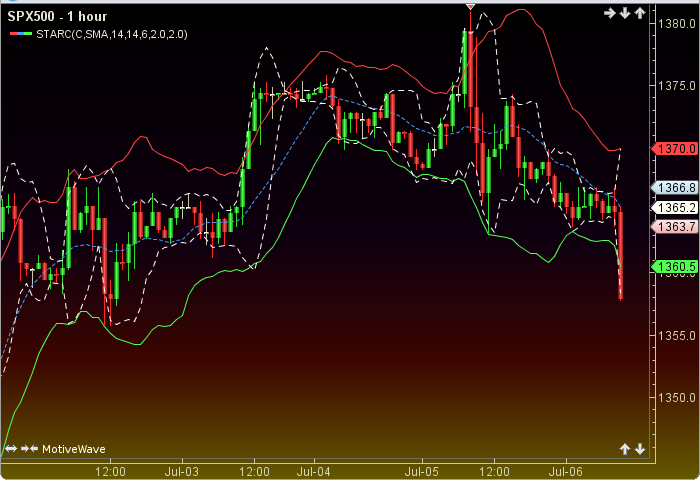

## Table of Contents

## What are STARC Bands?

STARC Bands, or Stoller Average Range Channels, are a technical analysis tool used by traders to help make decisions about buying and selling stocks. They were created by a man named Manning Stoller. The STARC Bands are made up of three lines on a stock chart. The middle line is a moving average, which is just the average price of the stock over a certain number of days. The top and bottom lines are set a certain distance away from the middle line, based on the stock's average price movement.

Traders use STARC Bands to see if a stock's price is moving unusually high or low. If the price goes above the top band, it might mean the stock is overbought and could soon go down. If the price goes below the bottom band, it might mean the stock is oversold and could soon go up. By watching how the price interacts with these bands, traders can make guesses about what the stock might do next and decide when to buy or sell.

## Who created the STARC Bands?

Manning Stoller created the STARC Bands. He wanted to help traders make better decisions about when to buy and sell stocks. The STARC Bands are a tool that shows three lines on a stock chart.

The middle line is a moving average, which is just the average price of the stock over a certain time. The top and bottom lines are set based on how much the stock's price usually moves. Traders use these bands to see if a stock's price is too high or too low, which can help them decide what to do next.

## What does STARC stand for?

STARC stands for Stoller Average Range Channels. It's a tool that traders use to help them decide when to buy or sell stocks. It was made by a man named Manning Stoller. The tool shows three lines on a stock chart. 

The middle line is a moving average, which is just the average price of the stock over a certain time. The top and bottom lines are set based on how much the stock's price usually moves. Traders use these lines to see if the stock's price is too high or too low. This can help them decide what to do next.

## How do STARC Bands differ from other technical indicators like Bollinger Bands?

STARC Bands and Bollinger Bands are both used by traders to help them decide when to buy or sell stocks, but they work a bit differently. STARC Bands were created by Manning Stoller and use a moving average for the middle line. The top and bottom lines are set based on the average price movement of the stock. This means they look at how much the stock's price usually changes and use that to set the bands. Traders use STARC Bands to see if a stock's price is moving unusually high or low compared to what's normal for that stock.

Bollinger Bands, on the other hand, were created by John Bollinger. They also have a middle line that's a moving average, but the top and bottom lines are set differently. Bollinger Bands use something called standard deviation to set the top and bottom lines. Standard deviation is a way to measure how spread out the prices are. This means Bollinger Bands can show if a stock's price is moving more or less than usual, but in a different way than STARC Bands. Both tools help traders see if a stock's price is too high or too low, but they do it using different methods.

## What is the basic formula for calculating STARC Bands?

The basic formula for calculating STARC Bands involves three main parts. The middle line of the STARC Bands is a simple moving average (SMA). This is calculated by adding up the closing prices of a stock over a certain number of days and then dividing by that number of days. For example, if you're using a 20-day moving average, you add up the last 20 days of closing prices and divide by 20.

The top and bottom lines of the STARC Bands are set based on the stock's average true range (ATR). The ATR measures how much the stock's price typically moves each day. To find the top band, you add a multiple of the ATR to the SMA. To find the bottom band, you subtract a multiple of the ATR from the SMA. The multiple is usually set to 1, but traders can adjust it to fit their needs. So, if the SMA is $50 and the ATR is $2, the top band would be $50 + $2 = $52, and the bottom band would be $50 - $2 = $48.

## What role does the Average True Range (ATR) play in STARC Bands?

The Average True Range (ATR) is really important for STARC Bands. It helps figure out how much the stock's price usually moves each day. This is called the stock's volatility. When you know the ATR, you can use it to set the top and bottom lines of the STARC Bands. The top line is the middle line plus the ATR, and the bottom line is the middle line minus the ATR. This way, the bands show what's normal for the stock's price movement.

Using the ATR in STARC Bands helps traders see if the stock's price is moving more or less than usual. If the price goes above the top band, it might mean the stock is moving more than normal and could be overbought. If the price goes below the bottom band, it might mean the stock is moving less than normal and could be oversold. By looking at where the price is compared to these bands, traders can make guesses about what the stock might do next and decide when to buy or sell.

## How do you set the parameters for STARC Bands?

Setting the parameters for STARC Bands involves choosing the time period for the moving average and deciding how much of the Average True Range (ATR) to use. The moving average is usually set to 5 or 6 periods, but you can change it to whatever works best for you. This moving average becomes the middle line of the STARC Bands. The ATR measures how much the stock's price typically moves each day, and you can set it to use the last 14 days, but again, you can adjust this to fit your needs.

Once you have these numbers, you use them to set the top and bottom lines of the STARC Bands. The top line is the moving average plus one times the ATR, and the bottom line is the moving average minus one times the ATR. But you can change the "one" to a different number if you want the bands to be wider or narrower. By playing around with these settings, you can make the STARC Bands work better for the stock you're looking at and help you decide when to buy or sell.

## Can you explain the significance of the upper and lower bands in STARC Bands?

The upper and lower bands in STARC Bands are really important because they help traders see if a stock's price is moving more or less than usual. The upper band is set by adding the Average True Range (ATR) to the moving average, and the lower band is set by subtracting the ATR from the moving average. This means the bands show what's normal for the stock's price movement. If the price goes above the upper band, it might mean the stock is moving more than normal and could be overbought. If the price goes below the lower band, it might mean the stock is moving less than normal and could be oversold.

By looking at where the price is compared to these bands, traders can make guesses about what the stock might do next. If the price is above the upper band, it might be a good time to sell because the price could go down soon. If the price is below the lower band, it might be a good time to buy because the price could go up soon. The upper and lower bands give traders a way to see if the stock's price is too high or too low, which helps them decide when to buy or sell.

## How can STARC Bands be used in trading strategies?

STARC Bands can be a helpful tool for traders when they're trying to decide when to buy or sell stocks. The bands show three lines on a stock chart. The middle line is the average price of the stock over a certain number of days. The top and bottom lines are set based on how much the stock's price usually moves. When the stock's price goes above the top line, it might mean the stock is overbought and could soon go down. This could be a good time to sell. When the price goes below the bottom line, it might mean the stock is oversold and could soon go up. This could be a good time to buy.

Traders can use STARC Bands to make their trading strategies better. For example, they might use the bands to find times when the stock's price is moving more or less than usual. If the price keeps hitting the top band and then going back down, a trader might decide to sell each time it hits the top. If the price keeps hitting the bottom band and then going back up, a trader might decide to buy each time it hits the bottom. By watching how the price interacts with the bands, traders can make guesses about what the stock might do next and plan their trades accordingly.

## What are the common pitfalls or misuses of STARC Bands?

One common pitfall when using STARC Bands is relying on them too much. Traders might think that just because the price touches the top or bottom band, it's a sure sign to buy or sell. But the stock market can be unpredictable, and STARC Bands are just one tool among many. If traders use STARC Bands without considering other things like news about the company or the overall market trends, they might make bad decisions. It's important to use STARC Bands along with other tools and information to get a fuller picture of what's going on.

Another misuse of STARC Bands is not adjusting the settings to fit the stock you're looking at. Different stocks can have different levels of volatility, which means how much their price moves can vary a lot. If you use the same settings for every stock, the bands might not be very helpful. For example, if you set the bands too wide for a stock that doesn't move much, they won't give you useful signals. If you set them too narrow for a stock that moves a lot, you might get too many false signals. It's a good idea to play around with the settings and find what works best for each stock you're trading.

## How can STARC Bands be combined with other indicators for better results?

STARC Bands can be used together with other tools to help traders make better decisions about when to buy or sell stocks. One common tool to use with STARC Bands is the Relative Strength Index (RSI). The RSI measures how fast and how much a stock's price is changing. If the RSI shows that a stock is overbought (which means its price might be too high) and the price is also touching the top of the STARC Bands, it might be a good time to sell. If the RSI shows that a stock is oversold (which means its price might be too low) and the price is touching the bottom of the STARC Bands, it might be a good time to buy. By looking at both the STARC Bands and the RSI, traders can get a better idea of what's happening with the stock's price.

Another tool that works well with STARC Bands is the Moving Average Convergence Divergence (MACD). The MACD helps traders see the direction of a stock's trend and whether it's getting stronger or weaker. If the MACD line crosses above the signal line and the stock's price is breaking through the top of the STARC Bands, it might be a strong sign that the price will keep going up. If the MACD line crosses below the signal line and the stock's price is breaking through the bottom of the STARC Bands, it might be a strong sign that the price will keep going down. By using the STARC Bands along with the MACD, traders can get more confident about their decisions to buy or sell.

## What are some advanced techniques for optimizing STARC Bands in different market conditions?

One advanced technique for optimizing STARC Bands in different market conditions is adjusting the time period of the moving average and the Average True Range (ATR). In a market that's moving a lot, you might want to use a shorter time period for the moving average, like 5 days, to make the bands react faster to changes in the stock's price. You might also want to use a shorter time period for the ATR, like 10 days, to make the bands wider and catch more of the big price movements. In a market that's not moving much, you might use a longer time period for the moving average, like 10 days, to make the bands smoother and less likely to give false signals. You might also use a longer time period for the ATR, like 20 days, to make the bands narrower and focus on smaller price movements.

Another technique is to use different multipliers for the ATR when setting the upper and lower bands. In a market that's moving a lot, you might use a higher multiplier, like 1.5 or 2, to make the bands wider and catch more of the big price swings. In a market that's not moving much, you might use a lower multiplier, like 0.5 or 1, to make the bands narrower and focus on smaller price movements. This way, the bands can be more sensitive to the specific conditions of the market you're trading in. By adjusting these settings, you can make the STARC Bands work better for the stock you're looking at and help you decide when to buy or sell in different market conditions.

## How do you calculate STARC Bands?

To calculate STARC (Stoller Average Range Channel) Bands, follow these steps:

1. **Select a Simple Moving Average (SMA) Length**: Choose the length for your simple moving average. A common range for this is between five to ten periods. The SMA is used as the central line around which the STARC Bands are plotted.

2. **Determine an Average True Range (ATR) Multiple**: Select a multiplier for the Average True Range, typically set at two. However, this multiplier can be adjusted to fit specific trading strategies, altering the sensitivity and width of the bands.

3. **Calculate the SMA and ATR**: 
   - For the SMA, sum the closing prices of the asset over the selected number of periods and divide by the number of periods.
   - For the ATR, which measures market volatility, calculate it over the same number of periods. The ATR is the average of the true ranges over a specific period. The true range is the largest of the following: 
     - Current high minus the current low
     - Absolute value of the current high minus the previous close
     - Absolute value of the current low minus the previous close

4. **Compute the Upper and Lower STARC Bands**:
   - **Upper STARC Band**: Add the product of the ATR and the multiplier to the SMA:
$$
     \text{Upper STARC Band} = \text{SMA} + (\text{Multiplier} \times \text{ATR})

$$
   - **Lower STARC Band**: Subtract the product of the ATR and the multiplier from the SMA:
$$
     \text{Lower STARC Band} = \text{SMA} - (\text{Multiplier} \times \text{ATR})

$$

5. **Adjust the Calculations with New Data**: As new price data becomes available, recalibrate the SMA and ATR to update the STARC Bands. This ensures that the bands remain relevant to the current market conditions.

These calculations can be efficiently performed using programming tools like Python. Here's a basic example in Python:

```python
import pandas as pd

def calculate_starc_bands(prices, sma_length=5, atr_multiplier=2):
    # Calculate SMA
    sma = prices.rolling(window=sma_length).mean()

    # Calculate True Range
    high_low = prices['High'] - prices['Low']
    high_close = abs(prices['High'] - prices['Close'].shift())
    low_close = abs(prices['Low'] - prices['Close'].shift())
    true_range = pd.DataFrame({'HL': high_low, 'HC': high_close, 'LC': low_close}).max(axis=1)

    # Calculate ATR
    atr = true_range.rolling(window=sma_length).mean()

    # Calculate Upper and Lower STARC Bands
    upper_starc_band = sma + (atr * atr_multiplier)
    lower_starc_band = sma - (atr * atr_multiplier)

    return upper_starc_band, lower_starc_band

# Assuming `data` is a DataFrame containing columns 'Close', 'High', 'Low'
# upper_band, lower_band = calculate_starc_bands(data)
```

This approach allows traders to integrate STARC Bands into their trading systems, providing critical insights into potential support and resistance levels.

## References & Further Reading

[1]: Aronson, D. R. (2007). ["Evidence-Based Technical Analysis: Applying the Scientific Method and Statistical Inference to Trading Signals."](https://onlinelibrary.wiley.com/doi/book/10.1002/9781118268315) Wiley.

[2]: Pring, M. J. (2002). ["Technical Analysis Explained: The Successful Investor's Guide to Spotting Investment Trends and Turning Points."](https://www.amazon.com/Technical-Analysis-Explained-Fifth-Successful/dp/0071825177) McGraw-Hill.

[3]: Murphy, J. J. (1999). ["Technical Analysis of the Financial Markets: A Comprehensive Guide to Trading Methods and Applications."](https://archive.org/details/technicalanalysi0000murp) New York Institute of Finance.

[4]: de Prado, M. L. (2018). ["Advances in Financial Machine Learning."](https://www.amazon.com/Advances-Financial-Machine-Learning-Marcos/dp/1119482089) Wiley.

[5]: Eldridge, S., & Gifford, D. (2014). ["Mastering Algorithmic Trading."](https://www.jstor.org/stable/43612951) Lincoln Bay.